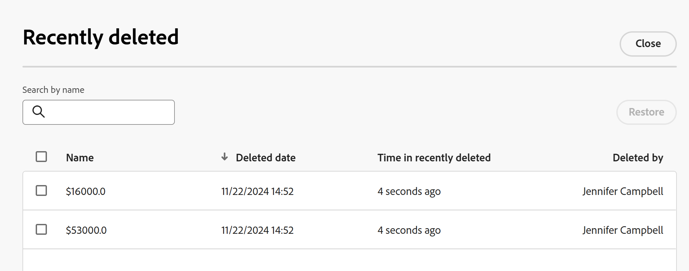

# Återställ borttagna poster

<!--The highlighted information on this page refers to functionality not yet generally available. It is available only in the Preview environment for all customers. After the monthly releases to Production, the same features are also available in the Production environment for customers who enabled fast releases.    

For information about fast releases, see [Enable or disable fast releases for your organization](/help/quicksilver/administration-and-setup/set-up-workfront/configure-system-defaults/enable-fast-release-process.md). -->

{{planning-important-intro}}

Du kan återställa borttagna poster från området Senast borttagna i Adobe Workfront Planning.

Mer information om hur du tar bort poster finns i [Ta bort poster](/help/quicksilver/planning/records/delete-records.md).

## Åtkomstkrav

+++ Expandera för att visa åtkomstkrav..

Du måste ha följande åtkomst för att kunna utföra stegen i den här artikeln:

<table style="table-layout:auto"> 
<col> 
</col> 
<col> 
</col> 
<tbody> 
    <tr> 
<tr> 
<td> 
   
 Produkter
 </td> 
   <td> 
   <ul><li>
 Adobe Workfront
</li> 
   <li>
 Adobe Workfront Planning
</li></ul></td> 
  </tr>   
<tr> 
   <td role="rowheader">
Adobe Workfront-plan*
</td> 
   <td> 

Något av följande Workfront-planer:
 
<ul><li>Välj</li> 
<li>Prime</li> 
<li>Ultimate</li></ul> 

Workfront Planning är inte tillgängligt för tidigare Workfront-planer
 
   </td> 
<tr> 
   <td role="rowheader">
Adobe Workfront Planning-paket*
</td> 
   <td> 

Alla 
 

Kontakta din kontoansvarige på Workfront om du vill ha mer information om vad som ingår i respektive Workfront Planning-plan. 
 
   </td> 
 <tr> 
   <td role="rowheader">
Adobe Workfront
</td> 
   <td> 

Din organisations instans av Workfront måste integreras med Adobe Unified Experience för att få tillgång till alla funktioner i Workfront Planning.
 

Mer information finns i <a href="/help/quicksilver/workfront-basics/navigate-workfront/workfront-navigation/adobe-unified-experience.md">Adobe Unified Experience for Workfront</a>. 
 
   </td> 
   </tr> 
  </tr> 
  <tr> 
   <td role="rowheader">
Adobe Workfront-licens*
</td> 
   <td>
 Standard

   
Workfront Planning är inte tillgängligt för tidigare Workfront-licenser
 
  </td> 
  </tr> 
  <tr> 
   <td role="rowheader">
Åtkomstnivåkonfiguration
</td> 
   <td> 
Det finns inga åtkomstnivåkontroller för Adobe Workfront Planning
   
</td> 
  </tr> 
<tr> 
   <td role="rowheader">
Objektbehörigheter
</td> 
   <td>   
Contribute eller högre behörighet till en arbetsyta <!--and record type--> </a> 
  
   
Systemadministratörer har behörighet till alla arbetsytor, inklusive de som de inte skapade
 </td> 
  </tr> 
<tr> 
   <td role="rowheader">
Layoutmall
</td> 
   <td> 
Alla användare, inklusive Workfront-administratörer, måste tilldelas en layoutmall som innehåller planeringsområdet på huvudmenyn. 
 </td> 
  </tr> 
</tbody> 
</table>

*Mer information om Workfront åtkomstkrav finns i [Åtkomstkrav i Workfront-dokumentation](/help/quicksilver/administration-and-setup/add-users/access-levels-and-object-permissions/access-level-requirements-in-documentation.md).

+++

## Att tänka på när du återställer borttagna poster

* Poster lagras i behållaren för nyligen borttagna poster i 30 dagar. Efter 30 dagar tas posterna bort permanent från Workfront Planning.
* Om de borttagna posterna är länkade till andra poster tas de länkade posterna inte bort, men informationen från den borttagna posten tas också bort. Om du återställer de borttagna posterna återställs informationen från de anslutna posterna.
* Du kan återställa flera poster samtidigt.
* När posterna tas bort lagras följande information i behållaren Senast borttagna:
   * **Namn**: Detta är informationen i postens primära fält. Mer information om primära postfält finns i [Översikt över primära fält](/help/quicksilver/planning/fields/primary-field-overview.md).
   * **Borttaget datum**: Tid och datum då posten togs bort.
   * **Tid i nyligen borttagna**: Tid sedan posten togs bort. Poster som har tagits bort mer än 30 dagar före det aktuella datumet visas inte i behållaren Senast borttagna.
   * **Borttagen av**: Namnet på den användare som tog bort posten.

## Återställ borttagna poster

1. Gå till posttypssidan där du har tagit bort poster.
1. Klicka på ikonen **Ångra**  i det övre högra hörnet av en sidvy för en posttyp och klicka sedan på **Senast borttagen**.

   Rutan **Nyligen borttagen** visas.

   

1. Markera de poster som du vill ta bort och klicka sedan på **Återställ** > **Återställ**. Du kan markera flera poster.

   Om återställningen lyckades får du ett meddelande om att åtgärden lyckades längst ned på skärmen.
1. Gå till tabellvyn och granska de återställda posterna.
