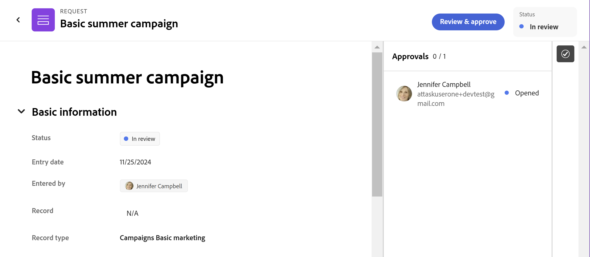

# Godkänn en begäran i Adobe Workfront Planning

<!--take Preview and Production references at Production time-->

<!-- do you need to add that only workspace owners can view the Submitted/ Planning tab?? - asking team in slack-->

<!--The highlighted information on this page refers to functionality not yet generally available. It is available only in the Preview environment for all customers. After the monthly releases to Production, the same features are also available in the Production environment for customers who enabled fast releases.    

For information about fast releases, see [Enable or disable fast releases for your organization](/help/quicksilver/administration-and-setup/set-up-workfront/configure-system-defaults/enable-fast-release-process.md). -->

{{planning-important-intro}}

När en användare skickar en begäran till ett begärandeformulär som är kopplat till ett godkännande i Adobe Workfront Planning får godkännarna ett meddelande och ett e-postmeddelande om det väntande godkännandet. De måste godkänna begäran innan Workfront Planning skapar ett objekt.

I den här artikeln beskrivs hur en arbetsytehanterare kan godkänna en begäran om att skapa en post i Workfront Planning.

Vi rekommenderar att du också ser följande artiklar:

* [Skapa och hantera ett begärandeformulär i Adobe Workfront Planning](/help/quicksilver/planning/requests/create-request-form.md)
* [Skicka Adobe Workfront Planning-begäranden för att skapa poster](/help/quicksilver/planning/requests/submit-requests.md)
* [Lägga till ett godkännande i ett begärandeformulär](/help/quicksilver/planning/requests/add-approval-to-request-form.md)

## Att tänka på när det gäller att godkänna begäranden

* Skickade begäranden visas i området Begäranden i Workfront med någon av följande status:

   * **Väntande granskning**: Den här statusen visas när ingen av godkännarna har öppnat begäranobjektet.
   * **Under granskning**: Statusen **Väntande granskning** ändras till **Under granskning** när minst en godkännare öppnar begäranobjektet. Status för begäran förblir **Under granskning** tills alla godkännare har godkänt begäran.
   * **Godkänd**: När en godkännare godkänner begäranobjektet blir deras individuella status **Godkänd**, men den övergripande statusen för begäranobjektet förblir **Under granskning** tills alla godkännare har fattat sina beslut. När alla godkännare godkänner en begäran blir förfrågansstatusen **Godkänd**.
   * **Slutförd**: Om alla godkännare godkänner begäranobjektet ändras dess status till **Slutförd** eller om begäran inte behövde något godkännande.
   * **Avvisad**: Om någon godkännare avvisar begärandeobjektet blir statusen **Avvisad**. Ingen post skapas och en ny begäran måste skickas för att posten ska kunna skapas.

* Du kan visa godkännandeinformation för en post som skapats genom att skicka ett begärandeformulär i fälten Godkänd av och Godkänd. Mer information finns i [Skapa fält](/help/quicksilver/planning/fields/create-fields.md).

## Åtkomstkrav

+++ Expandera om du vill visa åtkomstkrav för funktionerna i den här artikeln. 

<table style="table-layout:auto"> 
<col> 
</col> 
<col> 
</col> 
<tbody> 
<tr> 
   <td role="rowheader">
Adobe Workfront
</td> 
   <td> 

Alla Workfront-paket och alla Planning-paket

eller

Alla arbetsflödespaket och alla planeringsdokument

Mer information om vad som ingår i respektive Workfront Planning-paket får du av Workfront.

   </td> </tr>

</tr> 
  <tr> 
   <td role="rowheader">
Adobe Workfront-licens
</td> 
   <td>
Alla
 
  </td> 
  </tr> 
  <tr> 
   <td role="rowheader">
Objektbehörigheter
</td> 
   <td>   
Hantera behörigheter till en arbetsyta och posttyp </a> 
  
   
Systemadministratörer har behörighet till alla arbetsytor, inklusive de som de inte skapade
  </td> 
  </tr>  
</tbody> 
</table>

Mer information om Workfront åtkomstkrav finns i [Åtkomstkrav i Workfront-dokumentationen](/help/quicksilver/administration-and-setup/add-users/access-levels-and-object-permissions/access-level-requirements-in-documentation.md).

+++

## Godkänn en planeringsförfrågan för att skapa en post

När användare har lagt till begäranden i ett formulär för posttypbegäran som är kopplat till ett godkännande, skickas begäran till godkännarna.

Godkännare får följande meddelanden om en begäran som väntar på deras godkännande:

* Ett meddelande i appen
* Ett e-postmeddelande

Mer information om hur du godkänner begäranden från meddelanden finns i följande artiklar:

* [Hantera e-postmeddelanden om Adobe Workfront Planning](/help/quicksilver/planning/notifications/manage-planning-email-notifications.md)
* [Hantera meddelanden i appen för Adobe Workfront Planning](/help/quicksilver/planning/notifications/manage-planning-in-app-notifications.md)

>[!NOTE]
>
>Din organisations instans av Workfront måste vara registrerad på Adobe Unified Experience för att användare ska kunna ta emot e-post och meddelanden i appen.

Du kan godkänna begäranden om att skapa poster från själva begäran eller från widgeten Mina godkännanden i Hem.

### Godkänn en planeringsbegäran från ett meddelande eller från området Begäranden

1. Öppna begäran genom att göra något av följande:

   * Klicka på **Huvudmeny**  i det övre vänstra hörnet, klicka sedan på **Förfrågningar** > **Använd ny upplevelse** och klicka på begäran med statusen **Väntande granskning**.

     >[!TIP]
     >
     >* Om du inte har tillgång till Workfront Planning, eller om du inte har åtkomst till att visa några arbetsytor, kan du bara få åtkomst till en begäran om att godkänna den via e-post eller meddelanden i appen.
     >* Du kan inte komma åt planeringsbegäranden från den äldre upplevelsen av begäranden.

   * Klicka på ikonen för området **Meddelanden**  i skärmens övre högra hörn och klicka på meddelandet om en begäran som väntar på ditt godkännande för att öppna begäran.
   * Gå till e-postmeddelandet i ditt e-postmeddelande som meddelar dig om en begäran som väntar på ditt godkännande och klicka sedan på **Öppna begäran** för att öppna begäran.

   Förfrågningssidan öppnas i skrivskyddat läge.

   
1. (Valfritt) Klicka på ikonen **Godkännanden**  i det övre högra hörnet av begäran för att visa godkännarna.
1. Klicka på **Granska och godkänn** och välj sedan något av följande:

   * **Godkänn**: Detta godkänner begäran. En post skapas omedelbart för den posttyp som är associerad med begärandeformuläret efter att alla godkännare har godkänt begäran.
   * **Avvisa**: Detta avvisar begäran, även om du är den enda godkännaren som avvisar den. Ingen post skapas för den posttyp som är associerad med begärandeformuläret.

   Användaren som skickade begäran får ett e-postmeddelande och ett appmeddelande när deras begäran godkänns eller avvisas.

   Status för begäran ändras till följande, beroende på beslutet om godkännande:

   * **Slutförd**: Begäran har godkänts.
   * **Avvisad**: Begäran nekades.

   Begäran finns kvar i området **Begäranden** i Workfront.

### Godkänn en begäran från widgeten Mina godkännanden i Hem

{{step1-to-home}}

1. Gå till widgeten **Mina godkännanden** i **Hem**.

   
1. Leta reda på planeringsbegäran som du vill godkänna eller avvisa.

1. (Valfritt) Lägg till en kommentar genom att klicka på listrutepilen bredvid **Godkänn** eller **Avvisa**, skriva i anteckningen och klicka på **Lägg till**.

1. Klicka på något av följande:

   * **Godkänn**: Detta godkänner begäran. En post skapas omedelbart för den posttyp som är associerad med begärandeformuläret efter att alla godkännare har godkänt begäran.
   * **Avvisa**: Detta avvisar begäran, även om du är den enda godkännaren som avvisar den. Ingen post skapas för den posttyp som är associerad med begärandeformuläret.

   Användaren som skickade begäran får ett e-postmeddelande och ett appmeddelande när deras begäran godkänns eller avvisas.

   Status för begäran ändras till följande, beroende på beslutet om godkännande:

   * **Slutförd**: Begäran har godkänts.
   * **Avvisad**: Begäran nekades.

