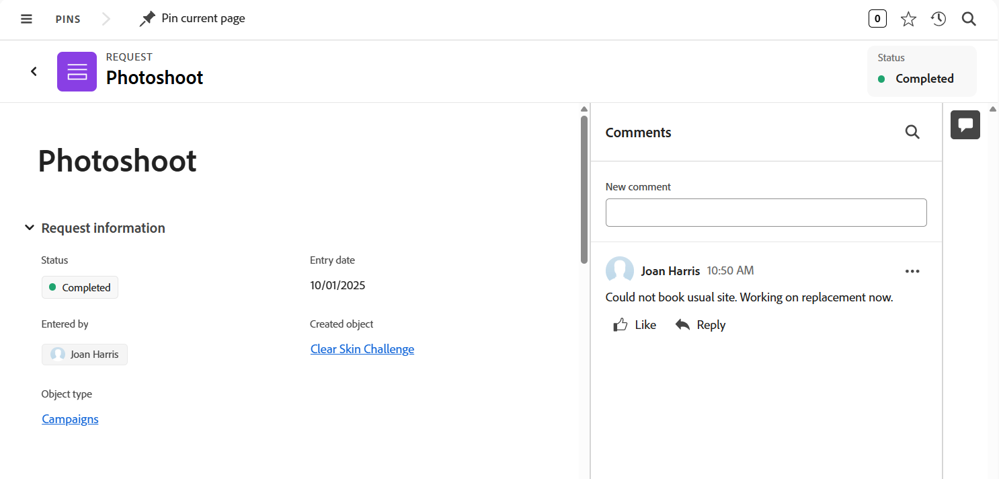

# Skicka Adobe Workfront Planning-begäranden för att skapa poster

<!--update title when there will be more functionality added to the Planning requests, besides creating records-->
<!--take Preview and Prod references out when releasing to Prod all-->

Den markerade informationen på den här sidan hänvisar till funktioner som ännu inte är allmänt tillgängliga. Det är bara tillgängligt i förhandsvisningsmiljön för alla kunder. Efter de månatliga releaserna i Production finns samma funktioner även i produktionsmiljön för kunder som aktiverat snabba releaser. 

Mer information om snabba releaser finns i [Aktivera eller inaktivera snabba releaser för din organisation](/help/quicksilver/administration-and-setup/set-up-workfront/configure-system-defaults/enable-fast-release-process.md). 

{{planning-important-intro}}

När en arbetsytehanterare har skapat ett begärandeformulär för en posttyp i Adobe Workfront Planning kan du använda formuläret för att skicka begäranden som skapar poster för den posttyp som är associerad med formuläret.

Du kan skicka in en begäran om Workfront Planning från följande områden:

* Under Begäranden i Workfront.
* Från en direktlänk till det begärandeformulär som delats.
* Från posttypssidan när du lägger till eller begär en ny post. Mer information finns i [Skapa poster](/help/quicksilver/planning/records/create-records.md).

I den här artikeln beskrivs hur du kan skicka en begäran om att lägga till nya poster till en posttyp från området Begäranden i Workfront, eller från en delad länk.

Workfront-användare och externa användare kan skicka begäranden till posttyper för planering. Förfrågningarna skapar poster för den posttyp som är associerad med förfrågningsformuläret. <!--double check on the external users-->

Mer information om hur en arbetsytehanterare kan skapa ett begärandeformulär och associera det med en posttyp finns i [Skapa och hantera ett begärandeformulär i Adobe Workfront Planning](/help/quicksilver/planning/requests/create-request-form.md).

## Åtkomstkrav

+++ Expandera om du vill visa åtkomstkrav för funktionerna i den här artikeln. 

<table style="table-layout:auto"> 
<col> 
</col> 
<col> 
</col> 
<tbody> 
<tr> 
   <td role="rowheader">
Adobe Workfront
</td> 
   <td> 

Alla Workfront-paket och alla Planning-paket

eller

Alla arbetsflödespaket och alla planeringsdokument

Mer information om vad som ingår i respektive Workfront Planning-paket får du av Workfront.

   </td> </tr>

</tr> 
  <tr> 
   <td role="rowheader">
Adobe Workfront-licens
</td> 
   <td>
Alla
 
  </td> 
  </tr> 
  <tr> 
   <td role="rowheader">
Objektbehörigheter
</td> 
   <td>   
Visa eller högre behörigheter för en arbetsyta och posttyp om du är en Workfront-användare
  </td> 
  </tr>  
</tbody> 
</table>

Mer information om Workfront åtkomstkrav finns i [Åtkomstkrav i Workfront-dokumentationen](/help/quicksilver/administration-and-setup/add-users/access-levels-and-object-permissions/access-level-requirements-in-documentation.md).

+++

## Förutsättningar

Följande måste finnas innan du kan skicka en begäran till ett Workfront Planning-formulär:

* Följande måste finnas i Workfront Planning:

   * En arbetsyta
   * En posttyp
   * Ett begärandeformulär som är associerat med en posttyp.

     Mer information finns i [Skapa ett begärandeformulär i Adobe Workfront Planning](/help/quicksilver/planning/requests/create-request-form.md).

* Ansökningsformuläret måste delas på ett sätt som du kan komma åt. Följande scenarier finns:

   * Internt måste formuläret delas med användare som har behörigheten Visa eller högre till arbetsytan.

     Workfront-användare kan antingen öppna formuläret via en länk eller hitta förfrågningsformuläret i området Begäranden i Workfront.

   * Externt genom att dela en länk till postformuläret med externa personer som inte har något Workfront-konto.

     Workfront-användare kan även komma åt länken som delas med externa personer.

* Om den delas med en länk får länken till formuläret inte upphöra att gälla.

## Att tänka på när du skickar begäranden till Workfront Planning

* Du kan inte redigera en begäran i Workfront efter att du har skickat den.
* Varje skickad begäran skapar en post för den posttyp som är kopplad till det formulär du använder, om formuläret inte är kopplat till ett godkännande, eller om godkännandet har beviljats av alla godkännare.
* Poster som skapas genom att skicka förfrågningsformulär är identiska med poster som läggs till med någon annan metod i Workfront Planning.

  Mer information finns i [Skapa poster](/help/quicksilver/planning/records/create-records.md).
* Poster som skapas när förfrågningsformulär skickas är kopplade till den ursprungliga begäran. Det går inte att ta bort den här anslutningen.
* Du kan visa både poster som skapats och förfrågningar som använts för att skapa dem i följande områden:
   * Området med förfrågningar i Workfront

  

   * Spela in typsidor i Workfront Planning
   * Området Detaljer i Workfront Planning

  

  >[!TIP]
  >
  >Du kan visa namnet på begäran i fältet Ämne i området Begäranden i Workfront eller i fältet Original request connection i Workfront Planning. 

* Skickade begäranden visas i området Begäranden i Workfront.
* Skickade planeringsbegäranden visas bara i den nya begärande upplevelsen. Du kan inte se Planering-begäranden i den äldre upplevelsen av begäranden.
Mer information finns i [Skapa och skicka begäranden](/help/quicksilver/manage-work/requests/create-requests/create-submit-requests.md).
* Det finns begränsningar i hur vissa fälttyper visas i ett begärandeformulär eller på sidan med information om förfrågan när ett formulär har skickats.

  Mer information finns i [Skapa och hantera ett begärandeformulär i Adobe Workfront Planning](/help/quicksilver/planning/requests/create-request-form.md).

<!--Not sure how to change the request status, but dev also said: Changing the names of the statuses might lead to some inconsistency between unified-approvals-service and intake-approvals-flow.-->

## Skicka en begäran till Workfront Planning under Begäranden i Workfront

{{step1-to-requests}}

1. Aktivera inställningen **Växla till en ny upplevelse** i skärmens övre högra hörn.
Om du aktiverar den här inställningen blir Workfront Planning-förfrågningsformulären tillgängliga i området **Förfrågningar** i Workfront.

   >[!TIP]
   >
   >Den här inställningen är bara tillgänglig när din Workfront-instans har anslutits till Adobe Unified Experience.
   >
   >För att kunna skicka in Workfront Planning-begäranden i det här området måste du uppfylla följande villkor:
   >
   >* Ditt företag har köpt en licens för Workfront Planning.
   >
   >* Du kan visa minst en arbetsyta.

1. Klicka i fältet **Vilken begäran vill du skicka** för att öppna en lista med förfrågningsformulär.
1. Välj ett begärandeformulär i listan eller skriv in namnet på det begärande formuläret och markera det när det visas i listan.

   Ett fönster öppnas med det efterfrågade formulärnamnet överst.
1. Uppdatera fälten som är tillgängliga i begärandeformuläret. Fält med en röd asterisk är obligatoriska.
1. (Villkorligt) Om din organisation tillåter formulärifyllning som drivs av AI kan du överföra dokument när du uppmanas till det. AI använder dessa dokument för att fylla i formuläret, och du kan acceptera eller avvisa AI-förslagen.

   Instruktioner finns i [Använd formulärfyllning från AI för att fylla i en begäran med hjälp av uppmaningar eller dokument](/help/quicksilver/manage-work/requests/create-requests/autofill-from-prompt-document.md).
1. Klicka på **Skicka**.

   Begärandeformuläret stängs och du återgår till området **Begäranden**.

   Ditt formulär skickas och följande saker händer:

   * Om begärandeformuläret inte var kopplat till ett godkännande läggs begäran till i listan över förfrågningar i området Workfront-förfrågningar och widgeten Mina förfrågningar i Hem, och en ny post läggs till i posttypen som är kopplad till formuläret.

     Följande fält visar information om begäran och registrering i området Förfrågningar och widgeten Mina förfrågningar i Hem:

      * **Ämne**: Namnet på den ursprungliga begäran som lagts till i området Begäranden. Du kan inte dölja eller ta bort fältet **Ämne** från listan över förfrågningar.
      * **Skapat objekt**: Namnet på posten som skapades från begäran så som den visas i Planning.
      * **Objekttyp**: Namnet på arbetsytan och posttypen där poster skapades från begäran i Planning.
      * **Status**: Status för begärandeobjektet.
      * **Formulär för begäran**: Namnet på det begärandeformulär som är associerat med posttypen i Planning.

   * Om begärandeformuläret associerades med ett godkännande läggs begäran till i listan över förfrågningar i området Workfront-förfrågningar och i widgeten Mina förfrågningar med statusen Väntande granskning. En ny post läggs bara till på posttypssidan efter att godkännarna har godkänt den.

     Mer information finns i [Lägga till ett godkännande i ett begärandeformulär](/help/quicksilver/planning/requests/add-approval-to-request-form.md).

   * Du kan lägga till anslutningsfältet Originalbegäran till en posttyp i Planning för att visa namnet på den ursprungliga begäran som skapade en post. Mer information finns i [Koppla posttyper](/help/quicksilver/planning/architecture/connect-record-types.md). 
   * Begäran är bara synlig för ägaren, godkännaren och de personer som har minst behörigheten Visa på arbetsytan. Workfront-administratörer kan visa alla begäranden som skickas till valfri arbetsyta i systemet.

   * Du får ett meddelande i appen och ett e-postmeddelande om att begäran antingen har skickats eller skickats för granskning.
   * Om begärandeformuläret associerades med ett godkännande får godkännarna ett meddelande i appen och ett e-postmeddelande för att granska och godkänna begäran.

     >[!NOTE]
     >
     >Meddelanden via e-post och appar visas bara när din organisations instans av Workfront är kopplad till Adobe Unified Experience.
     >
     >Det finns en länk till begäran i e-postbekräftelsen eller godkännandemeddelandet.

1. (Valfritt) Klicka på **Visa din begäran** i bekräftelsemeddelandet om du vill öppna begäran eller klicka på ikonen **X** om du vill stänga bekräftelsen.
1. (Valfritt) Gör något av följande i listan över förfrågningar:

   * Klicka på **Filter** och börja lägga till villkor för vilka begäranden som du vill visa i listan över förfrågningar.

     

     Du kan filtrera efter följande fält:

      * **Workspace**: Den arbetsyta som förfrågningsformuläret är associerat med.
      * **Posttyp**: Posttyp som begärandeformuläret är associerat med.
      * **Anmälningsdatum**: Datumet då begäran skickades.
      * **Formulär för begäran**: Namnet på det begärandeformulär som användes för att skicka begäran.
      * **Status**: Status för begäran.
      * **Anges av**: Namnet på den användare som lade till begäran. Om begäran har lagts till av någon utanför Workfront visas **Angivet av**-fältet `N/A`.
      * **Skapad objektstatus**: Status för den skapade posten.

     Du kan ha flera filter kopplade av antingen **And** eller **Or**.
Begärandelistan filtreras automatiskt när du lägger till filtervillkoren.

   * Klicka på **Kolumner** för att öppna rutan **Fältsynlighet och fältordning** och dölj, visa eller ordna om kolumnerna i listan med förfrågningar.

     >[!TIP]
     >
     >Du kan inte lägga till fler kolumner.

     
   * Klicka på ikonen **+** i det övre högra hörnet av listan över förfrågningar för att öppna **Kolumnhanteraren** och lägga till eller ta bort kolumner i listan över förfrågningar.

1. Klicka på namnet på en begäran i listan.

   Sidan med information om förfrågan öppnas.

   

1. (Valfritt) Ange en kommentar i området **Kommentarer**.
1. (Villkorligt) Om begärandeformuläret inte är kopplat till ett godkännande, eller om begäran har godkänts, klickar du på namnet på begäran och sedan på namnet på posten i fältet **Skapat objekt**.

   Postens sida öppnas i Workfront Planning.

   >[!TIP]
   >
   >* Om postens primära fält inte har uppdaterats i begärandeformuläret visas postens namn i postfältet i begäran som **Namnlöst**.
   >
   >* Om begärandeformuläret är kopplat till ett godkännande måste det godkännas innan du kan få åtkomst till posten från begärandesidan.

1. (Valfritt) Klicka på namnet på **posttypen**.

   Posttypssidan öppnas i Workfront Planning.

## Skicka en begäran till Workfront Planning från en delad länk till ett begärandeformulär

Informationen i det här avsnittet gäller endast för Workfront-användare som skickar en begäran från en delad länk. Externa användare har inte åtkomst till Workfront interna områden, som Förfrågningar eller Hem.

1. Gå till länken som delas med dig från en Workfront Planning-posttyp.

1. Uppdatera fälten som är tillgängliga i formuläret. Fält med asterisk är obligatoriska.

   >[!TIP]
   >
   >   Om fältet **Ämne** är tillgängligt visas det inte i Workfront Planning när begäran har skickats.
   >
   >Vi rekommenderar att du uppdaterar så många fält i din begäran som möjligt för att göra den nya posten identifierbar när den läggs till i posttypen i Workfront Planning.

1. Klicka på **Skicka**.

   Ditt formulär skickas och följande saker händer:

   * Om begärandeformuläret inte var kopplat till ett godkännande läggs begäran till i listan över förfrågningar i området Workfront-förfrågningar och widgeten Mina förfrågningar i Hem, och en ny post läggs till i posttypen som är kopplad till formuläret.

   * Om begärandeformuläret associerades med ett godkännande läggs begäran till i listan över förfrågningar i området Workfront-förfrågningar och i widgeten Mina förfrågningar. En ny post läggs bara till på posttypssidan när alla godkännare har godkänt den.

     Mer information finns i [Lägga till ett godkännande i ett begärandeformulär](/help/quicksilver/planning/requests/add-approval-to-request-form.md).

     >[!IMPORTANT]
     >
     >Du kan bara visa de förfrågningar som du eller någon annan har skickat till arbetsytorna som du har minst behörighet att visa. Workfront-administratörer kan visa alla begäranden som skickas till valfri arbetsyta i systemet. <!--ensure this is correct; asking team in slack-->

   * Du får ett meddelande i appen och ett e-postmeddelande om att begäran antingen har skickats eller skickats för granskning.
   * Om begärandeformuläret associerades med ett godkännande får godkännarna ett meddelande i appen och ett e-postmeddelande för att granska och godkänna begäran.

     >[!NOTE]
     >
     >Meddelanden via e-post och appar visas bara när din organisations instans av Workfront är kopplad till Adobe Unified Experience.

   <!--  After the request was approved and the record was created, the Approved by and Approved date fields display information about the approval on the record.-->

1. (Valfritt) Klicka på **Visa din begäran** för att öppna begäran i Workfront.

   <!--Or-->

   <!--Click [Submit another request](https://pulsar.devtest.workfront-dev.com/intake/6740a1ff44bf3a5600cf4481/request) to open the request form and add a new request.-->

1. (Valfritt) Klicka på **Huvudmeny** > **Förfrågningar** för att visa din förfrågan och klicka sedan på namnet på förfrågan.

   Sidan med information om förfrågan öppnas.

   

1. (Valfritt) Ange en kommentar i kommentarområdet.
1. (Villkorligt) Om begärandeformuläret inte är kopplat till ett godkännande, eller om begäran har godkänts, klickar du på namnet på begäran och sedan på namnet på posten i fältet **Skapat objekt**.

   Postens sida öppnas i Workfront Planning.

   >[!TIP]
   >
   >* Om postnamnet inte har lagts till i begärandeformuläret visas postens namn i fältet Post i begäran som **Namnlöst**.
   >
   >* Om begärandeformuläret är kopplat till ett godkännande måste det godkännas innan du kan få åtkomst till posten från begärandesidan.

1. (Valfritt) Klicka på namnet på **objekttypen**.

   Posttypssidan öppnas i Workfront Planning.

## Skapa en begäran genom att kopiera en befintlig begäran

Du kan kopiera en begäran i listan över förfrågningar i Workfront, redigera informationen och skicka den som en ny förfrågan.

Detta är endast tillgängligt i den nya upplevelsen av begärande.

Instruktioner finns i [Kopiera och skicka begäranden](/help/quicksilver/manage-work/requests/create-requests/copy-and-submit-requests.md).

## Skapa utkast och förfrågningar från befintliga utkast

Du kan skapa ett utkast av en begäran, sedan gå tillbaka till utkastet och skicka det som en begäran senare.

Detta är endast tillgängligt i den nya upplevelsen av begärande.

Instruktioner finns i [Skapa begäranden från utkast](/help/quicksilver/manage-work/requests/create-requests/create-requests-from-drafts.md).

