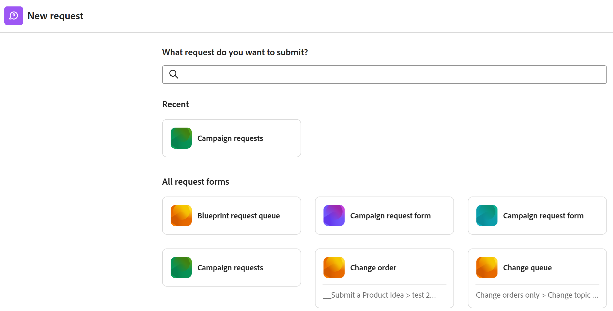

# Skicka Adobe Workfront Planning-förfrågningar för att skapa poster

<!--update title when there will be more functionality added to the Planning requests, besides creating records-->
<!--take Preview and Prod references out when releasing to Prod all-->

Den markerade informationen på den här sidan hänvisar till funktioner som ännu inte är allmänt tillgängliga. Den är endast tillgänglig i förhandsversionsmiljön för alla kunder. Efter de månatliga versionerna till produktion är samma funktioner också tillgängliga i produktionsmiljön för kunder som har aktiverat snabba versioner. 

Information om snabba versioner finns i [Aktivera eller inaktivera snabba versioner för din organisation](/help/quicksilver/administration-and-setup/set-up-workfront/configure-system-defaults/enable-fast-release-process.md). 

{{planning-important-intro}}

När en arbetsyteansvarig har skapat ett formulär för en posttyp i Adobe Workfront Planning kan du använda formuläret för att skicka begäranden som skapar poster för den posttyp som är kopplad till formuläret.

Du kan skicka en Workfront Planning-begäran från följande områden:

* Från området Förfrågningar i Workfront.
* Från en direktlänk till förfrågningsformuläret som delades.

  I den här artikeln beskrivs hur du kan skicka en begäran om att lägga till nya poster i en posttyp från området Begäranden i Workfront eller från en delad länk.
* Från sidan för posttyp när du lägger till eller begär en ny post. Mer information finns i [Skapa poster](/help/quicksilver/planning/records/create-records.md).

Workfront-användare och externa användare kan skicka förfrågningar till posttyper för planering och skapa poster. <!--double check on the external users-->

Mer information om hur en arbetsyteansvarig kan skapa ett förfrågningsformulär och koppla det till en posttyp finns [i Skapa och hantera ett förfrågningsformulär i Adobe Workfront Planning](/help/quicksilver/planning/requests/create-request-form.md).

## Krav för åtkomst

+++ Expandera för att visa åtkomstkrav.

<table style="table-layout:auto">
 <col>
 </col>
 <col>
 </col>
 <tbody>
    <tr>
<tr>
<td>
   
 Produkter
 </td>
   <td>
   <ul><li>
 Adobe Workfront
</li>
   <li>
 Planering av Adobe Workfront
</li></ul></td>
  </tr>  
 <tr>
   <td role="rowheader">
Adobe Workfront-plan*
</td>
   <td>

Någon av följande Workfront-planer:

<ul><li>Utvald</li>
<li>Primtal</li>
<li>Sist</li></ul>

Workfront Planning är inte tillgängligt för äldre Workfront-planer

   </td>
<tr>
   <td role="rowheader">
Adobe Workfront Planeringspaket*
</td>
   <td>

Någon 
  

Om du vill ha mer information om vad som ingår i varje Workfront Planning-plan kontaktar du din Workfront-kontoansvarige. </td>
<tr>
   <td role="rowheader">
Adobe Workfront-plattform
</td>
   <td>

Din organisations instans av Workfront måste vara registrerad i Adobe Unified Experience för att kunna komma åt Workfront Planning.

Mer information finns i <a href="/help/quicksilver/workfront-basics/navigate-workfront/workfront-navigation/adobe-unified-experience.md">Adobe Unified Experience för Workfront</a>. 

   </td>

</tr>
  </tr>
  <tr>
   <td role="rowheader">
Licens för Adobe Workfront*
</td>
   <td>
   
Extern licens, Contributor, Light eller Standard

   
Workfront Planning är inte tillgängligt för tidigare Workfront-licenser

  </td>
  </tr>
  <tr>
   <td role="rowheader">
Konfiguration av åtkomstnivå
</td>
   <td> 
Det finns inga åtkomstnivåkontroller för Adobe Workfront Planning
  
</td>
  </tr>
<tr>
   <td role="rowheader">
Behörigheter för objekt
</td>
   <td>
   
Visa eller högre behörigheter till en arbetsyta och posttyp, om du är en Workfront-användare
 
  </td>
  </tr>
 </tbody>
</table>

*Mer information om åtkomstkrav för Workfront finns [i Åtkomstkrav i Workfront-dokumentationen](/help/quicksilver/administration-and-setup/add-users/access-levels-and-object-permissions/access-level-requirements-in-documentation.md).

+++

## Förutsättningar

Följande måste finnas innan du kan skicka en begäran till ett Workfront Planning-formulär:

* Följande måste finnas i Workfront Planning:

   * En arbetsyta
   * En posttyp.
   * Ett förfrågningsformulär som är associerat med en posttyp.

     Mer information finns [i Skapa ett förfrågningsformulär i Adobe Workfront Planning](/help/quicksilver/planning/requests/create-request-form.md).

* Förfrågningsformuläret måste delas på ett sätt som du kan komma åt det. Följande scenarier finns:

   * Internt måste formuläret delas med användare som har visningsbehörighet eller högre behörighet till arbetsytan.

     Workfront-användare kan antingen öppna formuläret via en länk eller hitta förfrågningsformuläret i området Begäranden i Workfront.

   * Om du inte har något Workfront-konto har en länk till formuläret delats med externa personer.

     Workfront-användare kan även komma åt en länk som delas med externa personer.

* Länken till formuläret får inte upphöra att gälla.

## Att tänka på när du skickar begäranden till Workfront Planning

* Du kan inte redigera en begäran i Workfront när du har skickat den.
* Varje skickad begäran skapar en post för den posttyp som är kopplad till det formulär du använder, om formuläret inte är kopplat till ett godkännande eller om godkännandet har beviljats av alla godkännare.
* Poster som skapas genom att skicka förfrågningsformulär kan inte särskiljas från poster som läggs till med någon annan metod i Workfront Planning.

  Mer information finns i [Skapa poster](/help/quicksilver/planning/records/create-records.md).
* Skickade begäranden visas på fliken Planering i avsnittet Skickat i området Begäranden i Workfront.
* Det finns begränsningar i hur vissa fälttyper visas i ett begärandeformulär eller på sidan med information om förfrågan när ett formulär har skickats.

  Mer information finns [i Skapa och hantera ett förfrågningsformulär i Adobe Workfront Planning](/help/quicksilver/planning/requests/create-request-form.md).

<!--Not sure how to change the request status, but dev also said: Changing the names of the statuses might lead to some inconsistency between unified-approvals-service and intake-approvals-flow.-->

## Skicka en förfrågan till Workfront Planning i området Förfrågningar i Workfront

{{step1-to-requests}}

1. Aktivera inställningen Växla **till en ny upplevelse** i det övre högra hörnet av skärmen.
Om du aktiverar den här inställningen blir Workfront Planning request forms tillgängliga i **området Requests** i Workfront.

   >[!TIP]
   >
   >Den här inställningen är endast tillgänglig när följande är på plats:
   >
   >* Ditt företag har köpt ett Workfront Planning-paket.
   >* Din Workfront-instans är registrerad i Adobe Unified Experience.
   >* Du har tillgång till att visa minst en arbetsyta.
   >

1. Klicka på **Ny begäran**.

   

   Rutan Ny **begäran** öppnas med följande information:

   * De 6 senast använda Workfront-förfrågningsköerna och planeringsförfrågningsformulären visas i avsnittet Senaste.
   * 50 ytterligare Workfront-förfrågningsköer och Planeringsförfrågningsformulär visas i alfabetisk ordning i **avsnittet Alla förfrågningsformulär** . Du kan söka efter en begärankö som inte visas som standard.

1. Gör något av följande:

   * Klicka på kortet för ett av formulären för planeringsbegäran i avsnitten Senaste eller Alla formulär för begäran
   * Börja skriva namnet på ett formulär för planeringsbegäran i sökrutan och klicka sedan på kortet när det visas i listan.

   Formuläret för begäran öppnas.

1. Uppdatera de fält som är tillgängliga i formuläret för begäran. Fält med en röd asterisk är obligatoriska.
1. Klicka på **Skicka**.

   Förfrågningsformuläret stängs och du återgår till **området Förfrågningar** .

   Ditt formulär skickas och följande saker händer:

   * Om förfrågningsformuläret inte var kopplat till ett godkännande läggs begäran till på fliken Planning i avsnittet Submitted i området Workfront Requests och en ny post läggs till i den posttyp som är kopplad till formuläret.

   * Om begärandeformuläret var kopplat till ett godkännande läggs begäran till på fliken Planering i avsnittet Skickat i området Workfront Requests. En ny post läggs till på posttypssidan först när alla godkännare har godkänt den.

     Mer information finns i [Lägga till ett godkännande i ett begärandeformulär](/help/quicksilver/planning/requests/add-approval-to-request-form.md).

     

     >[!IMPORTANT]
     >
     >Alla användare som har tillgång till minst en arbetsyta kan visa fliken Planering i området Förfrågningar. Du kan bara visa de begäranden som skickats av dig eller någon annan till de arbetsytor som du har minst behörighet att visa. Workfront-administratörer kan visa alla förfrågningar som skickas till alla arbetsytor i systemet.

   * Begäran är endast synlig för ägaren, godkännaren och de personer som har minst visningsbehörighet till arbetsytan.

   * Du får ett meddelande i appen och ett e-postmeddelande om att begäran antingen har skickats eller har skickats för granskning.
   * Om begärandeformuläret var associerat med ett godkännande får godkännarna ett meddelande i appen och ett e-postmeddelande för att granska och godkänna begäran.

     >[!NOTE]
     >
     >E-postmeddelanden och meddelanden i appen visas bara när din organisations instans av Workfront är registrerad i Adobe Unified Experience.
     >
     >Det finns en länk till begäran i e-postbekräftelsen eller godkännandemeddelandet.

1. (Valfritt) Klicka på **Visa din begäran** i bekräftelsemeddelandet om du vill öppna begäran eller klicka på ikonen **X** om du vill stänga bekräftelsen.

1. (Valfritt) Klicka på fliken **Planering** i området **Förfrågningar** för att visa dina förfrågningar.
Alla begäranden som du har tillgång till för att visa som har skickats till ett planeringsbegärandeformulär visas i en lista.
1. (Valfritt) Gör något av följande:

   * Klicka på **Filter** och börja lägga till villkor för vilka ärenden du vill visa på fliken Planering.

     

     Du kan filtrera efter följande fält:

      * **Arbetsyta**: Arbetsytan som förfrågningsformuläret är associerat med.
      * **Posttyp**: Den posttyp som förfrågningsformuläret är associerat med.
      * **Inmatningsdatum**: Det datum då begäran skickades.
      * **Förfrågningsformulär**: Namnet på det förfrågningsformulär som användes för att skicka begäran.
      * **Status**: Status för begäran.
      * **Anges av**: Namnet på den användare som lade till begäran. Om begäran har lagts till av någon utanför Workfront **visas** fältet Angett av`N/A`.

        Du kan ha flera filter sammanfogade med antingen **And eller** Or ****.
Begärandelistan filtreras automatiskt när du lägger till filtervillkoren.

   * Klicka på **Kolumner** och dölj, visa eller ordna om kolumnerna i listan över begäranden.

     >[!TIP]
     >
     >Du kan inte lägga till fler kolumner.
     >
     >Du kan inte visa fältet **Ämne**.

     

1. Klicka på namnet på en begäran i listan.

   Sidan med information om förfrågan öppnas.

   

1. (Villkorligt) Om begärandeformuläret inte är kopplat till ett godkännande, eller om begäran har godkänts, klickar du på namnet på begäran och sedan på postens namn i fältet **Post**.

   Postens sida öppnas i Workfront Planning.

   >[!TIP]
   >
   >* Om postens primära fält inte uppdaterades i formuläret för begäran visas namnet på posten i fältet Post i begäran som **Namnlös**.
   >
   >* Om begärandeformuläret är associerat med ett godkännande måste godkännandet beviljas innan du kan komma åt posten från begärandesidan.

1. (Valfritt) Klicka på namnet på **posttypen**.

   Posttypssidan öppnas i Workfront Planning.

## Skicka en begäran till Workfront Planning från en delad länk till ett begärandeformulär

1. Gå till länken som delas med dig från posttypen Workfront Planning.

1. Uppdatera de fält som är tillgängliga i formuläret. Fält med en asterisk är obligatoriska.

   >[!TIP]
   >
   >   **Om fältet Ämne** är tillgängligt kommer det inte att visas i Workfront Planning när begäran har skickats.
   >
   >Vi rekommenderar att du uppdaterar så många fält i din begäran som möjligt för att göra den nya posten identifierbar när den läggs till i posttypen i Workfront Planning.

1. Klicka på **Skicka**.

   Ditt formulär skickas och följande saker händer:

   * Om förfrågningsformuläret inte var kopplat till ett godkännande läggs begäran till på fliken Planning i avsnittet Submitted i området Workfront Requests och en ny post läggs till i den posttyp som är kopplad till formuläret.

   * Om begärandeformuläret var kopplat till ett godkännande läggs begäran till på fliken Planering i avsnittet Skickat i området Workfront Requests. En ny post läggs till på posttypssidan först när alla godkännare har godkänt den.

     Mer information finns i [Lägga till ett godkännande i ett begärandeformulär](/help/quicksilver/planning/requests/add-approval-to-request-form.md).

     

     >[!IMPORTANT]
     >
     >Alla användare som har tillgång till minst en arbetsyta kan visa fliken Planering i området Förfrågningar. Du kan bara visa de begäranden som skickats av dig eller någon annan till de arbetsytor som du har minst behörighet att visa. Workfront-administratörer kan visa alla förfrågningar som skickas till alla arbetsytor i systemet. <!--ensure this is correct; asking team in slack-->

   * Du får ett meddelande i appen och ett e-postmeddelande om att begäran antingen har skickats eller har skickats för granskning.
   * Om begärandeformuläret var associerat med ett godkännande får godkännarna ett meddelande i appen och ett e-postmeddelande för att granska och godkänna begäran.

     >[!NOTE]
     >
     >E-postmeddelanden och meddelanden i appen visas bara när din organisations instans av Workfront är registrerad i Adobe Unified Experience.

   *  När begäran har godkänts och posten har skapats visas information om godkännandet i fälten Godkänd av och Godkänt datum.

1. (Valfritt) Klicka på **Visa din begäran** för att öppna begäran i Workfront.

   <!--Or-->

   <!--Click [Submit another request](https://pulsar.devtest.workfront-dev.com/intake/6740a1ff44bf3a5600cf4481/request) to open the request form and add a new request.-->

1. (Valfritt) Klicka på **Huvudmenyn** > **Förfrågningar** > fliken Planering **för** att visa din förfrågan och klicka sedan på namnet på begäran.

   Sidan med information om begäran öppnas.

   

1. (Villkorligt) Om formuläret för begäran inte är kopplat till ett godkännande, eller om begäran har godkänts, klickar du på namnet på begäran och sedan på namnet på posten i **fältet Post** .

   Postens sida öppnas i Workfront Planning.

   >[!TIP]
   >
   >* Om postens namn inte har lagts till i formuläret för begäran visas namnet på posten i fältet Post i begäran som **Namnlös**.
   >
   >* Om begärandeformuläret är associerat med ett godkännande måste godkännandet beviljas innan du kan komma åt posten från begärandesidan.

1. (Valfritt) Klicka på namnet på posttypen ****.

   Sidan för posttyp öppnas i Workfront Planning.

