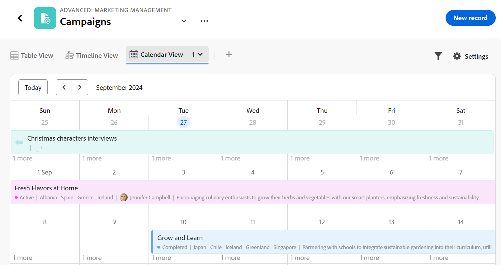
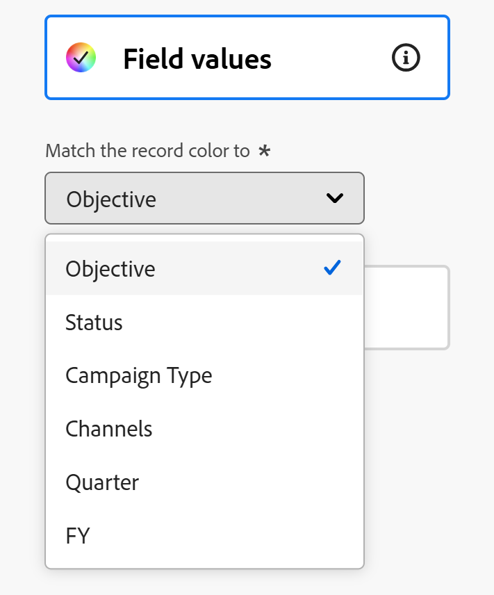

# Hantera kalendervyn

Den markerade informationen på den här sidan hänvisar till funktioner som ännu inte är allmänt tillgängliga. Det är bara tillgängligt i förhandsvisningsmiljön för alla kunder. Efter de månatliga releaserna i Production finns samma funktioner även i produktionsmiljön för kunder som aktiverat snabba releaser. 

Mer information om snabba releaser finns i [Aktivera eller inaktivera snabba releaser för din organisation](/help/quicksilver/administration-and-setup/set-up-workfront/configure-system-defaults/enable-fast-release-process.md). 

{{planning-important-intro}}

Du kan visa poster och deras fält i en kalendervy från posttypssidan.

Mer information om Adobe Workfront Planning-vyer och hur du hanterar dem finns i [Hantera postvyer](/help/quicksilver/planning/views/manage-record-views.md).

## Åtkomstkrav

+++ Expandera om du vill visa åtkomstkraven.

<table style="table-layout:auto"> 
<col> 
</col> 
<col> 
</col> 
<tbody> 
    <tr> 
<tr> 
<td> 
   
 Produkter
 </td> 
   <td> 
   <ul><li>
 Adobe Workfront
</li> 
   <li>
 Adobe Workfront Planning
</li></ul></td> 
  </tr>   
<tr> 
   <td role="rowheader">
Adobe Workfront-plan*
</td> 
   <td> 

Något av följande Workfront-planer:
 
<ul><li>Välj</li> 
<li>Prime</li> 
<li>Ultimate</li></ul> 

Workfront Planning är inte tillgängligt för tidigare Workfront-planer
 
   </td> 
<tr> 
   <td role="rowheader">
Adobe Workfront Planning-paket*
</td> 
   <td> 

Alla 
 

Kontakta din kontoansvarige på Workfront om du vill ha mer information om vad som ingår i respektive Workfront Planning-plan. 
 
   </td> 
 <tr> 
   <td role="rowheader">
Adobe Workfront
</td> 
   <td> 

Din organisations instans av Workfront måste vara registrerad på Adobe Unified Experience för att få tillgång till Workfront Planning.
 

Mer information finns i <a href="/help/quicksilver/workfront-basics/navigate-workfront/workfront-navigation/adobe-unified-experience.md">Adobe Unified Experience for Workfront</a>. 
 
   </td> 
   </tr> 
  </tr> 
    <td role="rowheader">
Adobe Workfront-licens*
</td> 
   <td>
 Standard för att skapa och ta bort vyer

   
Medarbetare eller högre för att uppdatera vyelement

   
Workfront Planning är inte tillgängligt för tidigare Workfront-licenser
 
  </td> 
  </tr> 
  <tr> 
   <td role="rowheader">
Åtkomstnivåkonfiguration
</td> 
   <td> 
Det finns inga åtkomstnivåkontroller för Adobe Workfront Planning
   
</td> 
  </tr> 
<tr> 
   <td role="rowheader">
Objektbehörigheter
</td> 
   <td>   
Hantera behörigheter till en vy
  
   
Visa behörigheter till en vy om du tillfälligt vill ändra visningsinställningarna eller duplicera den
 </td> 
  </tr> 
<tr>
   <td role="rowheader">
Layoutmall
</td>
   <td> Användare med en Light- eller Contributor-licens måste tilldelas en layoutmall som innehåller Planning.
   
Standardanvändare och systemadministratörer har planeringsområdena aktiverade som standard.

</li></ul>
</td>
  </tr>

</tbody> 
</table>

*Mer information om Workfront åtkomstkrav finns i [Åtkomstkrav i Workfront-dokumentation](/help/quicksilver/administration-and-setup/add-users/access-levels-and-object-permissions/access-level-requirements-in-documentation.md).

+++

## Hantera en kalendervy {#manage-a-calendar-view}

<!--insert screen shot of calendar view-->

Tänk på följande:

* Du kan bara skapa en kalendervy om du har minst två datumfält kopplade till en posttyp. När du har ett eller inga datumfält kopplade till en posttyp är alternativet Kalendervy nedtonat.

  Du kan välja från postdatumfält eller uppslagsdatumfält från anslutna post- eller objekttyper.
* Följande scenarier finns:

   * När både start- och slutdatum saknar värden visas inte posterna i kalendern
   * När start- eller slutdatumet saknar värde visas posten som en endagshändelse
   * När startdatumet är efter slutdatumet visas inte posten i kalendern.

Så här hanterar du en kalendervy:

1. Gå till den posttypssida som du vill visa kalendern för.
1. Skapa en kalendervy enligt beskrivningen i artikeln [Hantera postvyer](/help/quicksilver/planning/views/manage-record-views.md).

   

   Posterna som är associerade med den posttyp som du har valt visas som staplar i en kalender. Färgen på staplarna matchar färgen på postikonen som standard.

1. Navigera i kalendern genom att göra något av följande:

   * Klicka på ikonerna till vänster och höger i kalenderns övre vänstra hörn eller använd den vågräta rullningen för att flytta bakåt och framåt i kalendern.
   * Klicka på **Idag** i det övre högra hörnet om du vill centrera kalendern till dagens datum.
   * Välj något av följande alternativ på den nedrullningsbara menyn för tidsram för att uppdatera tidsstegen:

      * **Månad**: Posterna visas i en månadskalender.

      * **Vecka**: Posterna visas i följande områden:

         * Poster som sträcker sig över flera dagar visas högst upp i kalendern.
         * Poster som varar en dag eller mindre visas i den nedre halvan av kalendervyn. Om du valde att visa timmen för Start- och slutdatum visas posten vid lämplig tidpunkt under dagen då den inträffar.

1. (Valfritt) Klicka på ikonen **Helskärm**  om du vill öppna vyn i helskärmsläge och sedan på ikonen **Avsluta helskärm**  eller Esc om du vill avsluta helskärmsläget.  

1. Uppdatera följande vyelement enligt beskrivningen i underavsnitten nedan:
   * [Filter](#add-filters)
   * [Inställningar](#edit-the-calendar-view-settings)
     <!--* [Grouping](#add-grouping)-->
     <!--* [Sort](#add-sort) not sure if this is present in calendar views?!; also check the anchor and make sure it's correct-->

### Lägg till filter

Du kan minska mängden information som visas på skärmen genom att använda filter.

Tänk på följande när du arbetar med filter i kalendervyn:

<!-- this list is almost identical to the one for the table view - update both-->

* De filter du skapar för en kalendervy fungerar oberoende av filtren i andra vyer som används för samma posttyp.

* Filtren är unika för den vy du väljer. Två kalendervyer av samma posttyp kan ha olika filter.

* Två användare som tittar på samma kalendervy ser samma filter som används för närvarande.

* Du kan inte namnge filtren som du skapar för en kalendervy.

* När du tar bort filter tas de bort från alla som använder samma posttyp som du och som visar samma vy som du.

* Du kan filtrera efter anslutna postfält eller uppslagsfält.

* Du kan filtrera efter uppslagsfält som visar flera värden.

Så här lägger du till ett filter i en kalendervy:

1. Skapa en kalendervy för en posttypsida, enligt beskrivningen i artikeln [Hantera postvyer](/help/quicksilver/planning/views/manage-record-views.md).
1. Markera en kalendervy och klicka sedan på **Filter** i tabellens övre högra hörn.
1. Klicka på **Lägg till villkor** och lägg till följande information:

   * **Markera ett fält** som du vill filtrera efter <!-- the tip below might change-->

   * **Välj ett alternativ** (eller en filtermodifierare) för att definiera vilken typ av villkor fältet måste uppfylla

     Tabellen nedan visar tillgängliga modifierare för varje typ av fält.

     <table>
        <thead>
        <tr>
            <th><b>Fälttyp</b></th>
            <th><b>Modifierare</b></th>
        </tr>
        </thead>
        <tbody>
        <tr>
            <td>Enkelrad, Stycke, Formel </td>
            <td>
Innehåller

            
Innehåller inte

            
Är

            
Är inte

            
Är tom

            
Är inte tom
</td>
        </tr>
        <tr><td>Enkelval</td>
            <td>
Är

            
Är inte

            
Är något av

            
Är inget av

            
Är tom

            
Är inte tom
</td>
        </tr>
        <tr>
            <td>Flera val, personer</td>
            <td>
Har någon av

            
Har alla

            
Är exakt

            
Har ingen av

            
Är tom

            
Är inte tom
</td>
        </tr>
        <tr>
            <td>Antal, Procentandel, Valuta</td>
            <td>
=

            
≠

            
 &lt; 

            
&gt;

            
≤

            
≥

            
Är tom

            
Är inte tom
</td>
        </tr>
        <tr>
            <td>Datum</td>
            <td>
Är

            
Är inte

            
Är efter

            
Är före

            
Är mellan

Är inte mellan

            
Är tom

Är inte tom
</td>
        </tr>

     <tr>
            <td>Kryssruta</td>
            <td>
Är

        </tr>
        </tbody>
        </table>

   * Välj ett värde för det markerade fältet.

   

   Det finns ingen gräns för hur många filtreringsvillkor du kan lägga till.

1. (Valfritt) Klicka på **Lägg till villkor** om du vill lägga till ytterligare ett filtreringsalternativ och upprepa stegen ovan. Antalet filter som används visas till vänster om filterikonen.
1. Klicka på följande operatorer för att ange hur filtervillkoren ska kopplas och användas:

   * **AND**: Alla angivna villkor måste uppfyllas.
   * **OR**: Alla angivna villkor måste vara uppfyllda. Det här är standardalternativet.

   1. (Valfritt) Lägg till ytterligare **AND**- eller **OR**-operatorer mellan flera villkorsgrupperingar.

      

   Postlistan filtreras automatiskt.  <!--at this time, you can't name and save the filter - but will this change?!-->
   <!-- asked on the task for the simple filters whether there is a limitation for how many statements a filter can have?!-->

1. (Valfritt) Klicka på ikonen **x** för att ta bort ett filtervillkor.
1. (Valfritt) Klicka på **Filter** för att stänga filterrutan. <!--right now you cannot "clear all" for filters, but this might come later-->

### Redigera inställningar för kalendervyn

Uppdatera inställningarna för kalendervyn för att ange vad och hur information visas i vyn.

1. Skapa en kalendervy för en posttyp enligt beskrivningen i artikeln [Hantera postvyer](/help/quicksilver/planning/views/manage-record-views.md).
1. Klicka på **Inställningar**.
1. Klicka på **Datum och tid** i den vänstra panelen och välj sedan ett **Startdatum** och ett **slutdatum** som ska visas i kalendern. Du kan välja standarddatum för start och slut eller välja ett tillgängligt datumfält.

   De staplar som representerar posterna börjar på det datum som du anger som startdatum och slutar på det datum som motsvarar slutdatumet.

   >[!NOTE]
   >
   >* Poster som inte har några värden för start- eller slutdatum eller som har ett startdatum efter slutdatumet visas inte i kalendervyn.
   >
   >* Om du visar ytterligare poster med alternativet Uppdelning är start- och slutdatumen huvudpostens. Du kan inte välja start- och slutdatum för de anslutna posterna i det här området.

1. Klicka på **Stapelformat** i den vänstra panelen för att ange vilken information du vill visa i postfälten.

   Postens primära fält (eller rubrik), enligt postens tabellvy, är markerat som standard.
   <!--adjust this when the primary field is released??-->

1. (Valfritt och villkorligt) Om du har lagt till miniatyrbilder till poster markerar du alternativet **Miniatyrbild** för att visa den bild som är associerad med posterna i deras postfält.

   >[!NOTE]
   >
   >    Du måste lägga till miniatyrbilder i tabellvyn innan du kan visa dem i kalendervyn. Mer information finns i [Lägga till en miniatyrbild i en post](/help/quicksilver/planning/records/add-thumbnails-to-records.md).

1. Klicka på **Lägg till fält**, klicka i rutan **Sök fält** och klicka på det fält som du vill lägga till.

   >[!TIP]
   >
   >   * Du måste skapa fälten innan du kan lägga till dem i postfälten.
   > 
   >   * Du måste ha minst ett fält markerat. **Namn** är markerat som standard.
   >
   >   * Du kan lägga till upp till fem fält.

   En förhandsvisning av hur fälten kommer att se ut i kalendern visas till höger.

   

1. Klicka på **Färg** i den vänstra panelen om du vill anpassa färgerna för posterna i kalendern.

   

1. I avsnittet **Ange postfärg till** väljer du bland följande alternativ för att ange en färg för posterna:

   * **Posttyp**: Färgen på postfälten i kalendern matchar färgen på den posttyp du valde. Det här är standardalternativet.
   * **Fältvärden**: Färgen på posterna matchar färgen i ett fält som du anger.
   * **Ingen**: Posterna visas i ett vitt fält.

1. (Villkorligt) Om du valde **Fältvärden** för postfärgerna väljer du ett fält i listrutan **Matcha postfärgen till**.

   

   Endast fält med färgkodade alternativ visas i listrutan.

   Flervalsfält eller envalsfält kan t.ex. ha färgkodade alternativ.

   Om du inte har något fält med färgkodade alternativ för den valda posttypen är det här alternativet nedtonat.

1. Klicka på **Spara**.

   Posterna visas i kalendervyn med de specifikationer som du har valt.