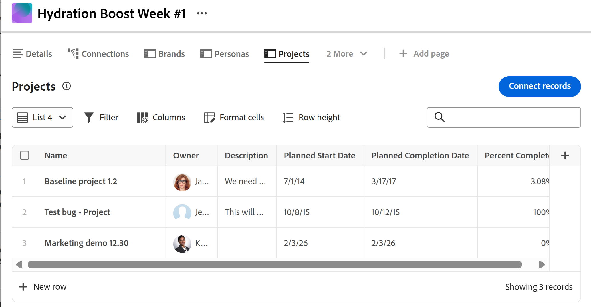

# Hantera listvyn i Adobe Workfront Planning

<!--
although list views in Planning are very similar to Workfront enhanced lists, keep this one separate with all the information, because of Planning standalone; some information here is also duplicated in this main Glist article: help/quicksilver/workfront-basics/navigate-workfront/use-lists/enhanced-lists.md
-->

Informationen som är markerad på den här sidan avser funktioner som ännu inte är allmänt tillgängliga. Det är bara tillgängligt i förhandsvisningsmiljön för alla kunder. Efter de månatliga releaserna i Production finns samma funktioner även i produktionsmiljön för kunder som aktiverat snabba releaser. 

Mer information om snabba releaser finns i [Aktivera eller inaktivera snabba releaser för din organisation](/help/quicksilver/administration-and-setup/set-up-workfront/configure-system-defaults/enable-fast-release-process.md). 

{{planning-important-intro}}

Du kan visa objekt i listvyn i följande områden i Workfront Planning:

* En sida med anslutna poster för projekt i en posts informationsområde

  

* En lista över begärandeformulär på posttypsnivå

  

I den här artikeln beskrivs hur du kan navigera, skapa och redigera en listvy i Workfront Planning.

## Åtkomstkrav

+++ Expandera om du vill visa åtkomstkraven för funktionerna i den här artikeln. 

<table style="table-layout:auto"> 
<col> 
</col> 
<col> 
</col> 
<tbody> 
    <tr> 
<tr> 
</tr>   
<tr> 
   <td role="rowheader">
Adobe Workfront package
</td> 
   <td> 

Alla Workfront- och Planning-paket

Alla arbetsflöden och alla planeringsdokument

Mer information om vad som ingår i respektive Workfront Planning-paket får du av Workfront. 
 
   </td> 
  <tr> 
   <td role="rowheader">
Adobe Workfront-licens
</td> 
   <td>
 Standard för att skapa och ta bort vyer

   
Medarbetare eller högre för att uppdatera vyelement

  </td> 
  </tr> 
  <tr> 
   <td role="rowheader">
Objektbehörigheter
</td> 
   <td>   
Hantera behörigheter till en vy
  
   
Visa behörigheter till en vy om du tillfälligt vill ändra visningsinställningarna eller duplicera den
 </td> 
  </tr> 
<tr>
   <td role="rowheader">
Layoutmall
</td>
   <td> Användare med en Light- eller Contributor-licens måste tilldelas en layoutmall som innehåller Planning.
   
Standardanvändare och systemadministratörer har planeringsområdena aktiverade som standard.

</li></ul>
</td>
  </tr> 
</tbody> 
</table>

Mer information om Workfront åtkomstkrav finns i [Åtkomstkrav i Workfront-dokumentationen](/help/quicksilver/administration-and-setup/add-users/access-levels-and-object-permissions/access-level-requirements-in-documentation.md).

+++ 

## Överväganden om listvyer

* Tänk på följande när du visar sidlistvyn för anslutna poster:

   * Du kan bara visa projekt i listvyn på den anslutna postens postsida. Listvyn är inte tillgänglig för andra objekt- eller posttyper på en ansluten postsida.

  Mer information om hur du skapar en ansluten postsida finns i [Lägga till en kopplad postsida till en post](/help/quicksilver/planning/records/add-a-connected-records-page-to-a-record.md).
   * Innan du kan visa en listvy på en postsida med anslutna poster måste du koppla Workfront-projekt till posttyperna Planering. Mer information finns i [Koppla posttyper](/help/quicksilver/planning/architecture/connect-record-types.md).
   * Du kan skapa flera listvyer för projekt på postens sida med kopplade poster.

* Tänk på följande för listvyn över förfrågningsformulär:

   * Du kan inte skapa eller redigera ytterligare listvyer för planeringsförfrågningsformulär. Workfront skapar en listvy för förfrågningsformulär. <!--this will change-->

     Mer information om förfrågningsformulär finns i [Skapa och hantera ett begärandeformulär i Adobe Workfront Planning](/help/quicksilver/planning/requests/create-request-form.md).
* Beroende på var den visas har inte alla element i listan som beskrivs i den här artikeln.

## Hantera en listvy {#manage-a-list-view}

Vyer med Workfront Planning-listor liknar dem som Workfront har förbättrat. De flesta element från förbättrade vyer finns också i listvyer i Workfront Planning.

Mer information finns i [Använd förbättrade listor](/help/quicksilver/workfront-basics/navigate-workfront/use-lists/enhanced-lists.md).

<!--
Removed - more direct steps below: 
{{step1-to-planning}}

1. (Conditional) To access a projects connected page, do the following: 

    1. Click a workspace card, then click a record type card. 
    1. From any view, click the name of a record to open the record's preview or details page. 
    1. Add a **Connected records page** for connected projects as described in the article [Add a Connected records page to a record](/help/quicksilver/planning/records/add-a-connected-records-page-to-a-record.md).

    The Connected records page displays projects connected to the record in the list view. 

    

1. (Conditional) To access a list of request forms, do the following: 

    1. {{step1-to-planning}}

    1. (Conditional) To access a projects connected page, do the following: 

    1. Click a workspace card, then click a record type card.
    1. Click the **More** menu  to the right of the record name in the header, then click **Manage request forms**.

        A list of request forms displays.

-->

1. Gå till en listvy i något av följande områden:

   * En sida med anslutna poster för projekt i en posts informationsområde
   * Sidan Begär formulär av en posttyp

1. (Villkorligt) Gör något av följande om du vill ändra listvyn:

   1. Expandera menyn för listvyer i det övre vänstra hörnet av listan om du vill välja en annan vy, eller klicka på **Ny vy** och skapa en annan.

      >[!TIP]
      >
      >Vyer delas i hela systemet. Om du skapar en projektvy för en posttyp kan du visa den på andra posttyper som visar anslutna projekt.

   1. Håll muspekaren över namnet på en befintlig vy och klicka på menyn **Mer**  och klicka sedan på något av följande:
      * **Byt namn** om du vill ge vyn ett nytt namn
      * **Dela** om du vill dela vyn med andra
      * **Ta bort** om du vill ta bort vyn.

      >[!NOTE]
      >
      >* Du måste ha behörigheten Hantera för en vy för att kunna redigera, dela eller ta bort den.
      >
      >* Du kan inte ändra systemvyer.
      >
      >* Du kan återställa en vy som har delats med dig och som du bara har behörighet att visa, efter att du har ändrat den för att återställa de ursprungliga inställningarna, eller så kan du kopiera den med dina ändringar och dela kopian. Mer information finns i [Använd förbättrade listor](/help/quicksilver/workfront-basics/navigate-workfront/use-lists/enhanced-lists.md). 

   1. Klicka på ikonen **Filter**  för att lägga till ett filter i vyn. Resultaten filtreras omedelbart i listan. Du kan inte spara och namnge filter. Filter sparas när du öppnar sidan i framtiden och de är en del av delade vyer.

      >[!TIP]
      >
      >Om du vill använda ett anpassat filter väljer du något av följande alternativ för ett fältvärde:
      >
      >

      >
      >* **Jag (inloggad användare)** för att hänvisa till den inloggade användaren i fält som refererar till användare.
      >
      >* **Mina team** eller **Mitt hemteam** för att hänvisa till dina team i fält som refererar till team.
      >
      >* **Mina grupper** eller **Min hemgrupp** för att referera till dina grupper i fält som refererar till grupper.
      >
      >* **Mitt företag** för att hänvisa till ditt företag i fält som refererar till företag.
      > 
      >* **Mina roller** eller **Min primära roll** som refererar till dina jobbroller i fält som refererar till roller.
      >
      >

   1. Klicka på ikonen **Kolumner**  för att välja vilka kolumner som ska visas eller döljas i vyn.
   1. Håll pekaren över namnet på en kolumn, klicka sedan på nedåtpilen till vänster om kolumnnamnet och klicka sedan på något av följande:
      * **Byt namn** om du vill lägga till en **anpassad etikett** för kolumnen. Namnet på det ursprungliga fältet i Workfront ändras inte.
      * **Sortera** om du vill sortera listan efter det markerade fältet. En sorteringsikon som anger sorteringsriktningen läggs till i kolumnrubriken.
   1. Klicka på ikonen **+** i det övre högra hörnet av listan för att lägga till eller ta bort kolumner i listan och klicka sedan på **Spara**.

      **Kolumnhanteraren** öppnas.

      Du kan bara lägga till befintliga fält i listvyn.
Du kan inte ta bort det primära fältet i listvyn som visas i den första kolumnen.

   1. Klicka på ikonen **Formatera celler**  . Rutan **Format** öppnas. <!--change the name of the box when they update it-->
      Gör följande: 

      1. Klicka på **Lägg till villkor**.
      1. Markera ett fält på raden **If**, välj ett fältvärde och lägg till en modifierare. Modifierare ändras beroende på vilken fälttyp du väljer. 

         >[!TIP]
         >
         >Endast synliga fält i listvyn är tillgängliga för villkorsstyrd formatering.

      1. (Valfritt) I stället för att lägga till ett fältvärde klickar du på ikonen **Jämför med ett annat fält**  och väljer ett fält vars värde du vill jämföra med värdet för det markerade fältet. Du kan till exempel jämföra fälten Projektägare och Projektsponsorer. 

         >[!TIP]
         >
         >Endast synliga fält i listvyn är tillgängliga för villkorsstyrd formatering. Fälten som du jämför måste vara av samma typ. 

      1. (Valfritt) Klicka på **Lägg till villkor** på raden **Om** om du vill lägga till fler villkor i samma regel.

         >[!TIP]
         >
         >Du kan lägga till upp till 10 villkor i en villkorsregel och du kan ha upp till 20 regler för ett fält.

      1. Klicka på **Eller**-kopplingen mellan villkor för att ändra till **And** och för att ange att flera villkor måste uppfyllas samtidigt. **Eller** är standardkoppling.
      1. På raden **Format** väljer du ett fält som anger vilken kolumn som ska formateras. <!--edit this area, if it changes names??-->
      1. (Valfritt) Klicka på ikonen **Färgcirkel**  bredvid det markerade fältet för att expandera det och välja en annan färg i området **Cellfyllning** för att ändra bakgrundsfärgen i en cell eller välj en färg i området **Textfärg** för att ändra textfärgen i en cell.
      1. Klicka på ikonen **Textformat**  och välj bland följande alternativ för att formatera texten i en cell:
         * Fet
         * Kursiv

      1. Aktivera inställningen **Använd på rad** om du vill använda formateringen på hela raden i fältet som uppfyller villkoren.
      1. (Valfritt) Klicka på **Lägg till villkor** i rutan **Format** om du vill lägga till en annan regel för ett annat fält och upprepa stegen ovan.
      1. (Valfritt) Klicka på **Rensa alla** om du vill ta bort all formatering.
      1. Klicka utanför rutan **Format** för att stänga den.

         Du kommer nu tillbaka till listvyn.
         Formateringen används omedelbart i listvyn.
         Det finns en blå punkt bredvid ikonen **Formatera celler** som anger att specialformatering används i vyn.

   1. (Valfritt) Klicka på ikonen **Gruppering**  &lt;!-har de uppdaterat detta till &quot;Gruppering&quot;?-> för att gruppera objekt i listan efter ett gemensamt fält. Välj ett av alternativen eller använd sökfältet för att hitta ett fält.

      Fältet måste vara en kolumn i listan innan du kan gruppera efter den. Alla fälttyper kan inte användas för grupperingar.

   1. Klicka på ikonen **Radhöjd**  om du vill uppdatera den lodräta längden på en rad. Välj bland följande alternativ: 

      

      * Kort
      * Standard. Det här är standardalternativet.
      * Medium
      * Hög

      

   <!--leave these here, although they duplicate for Enhanced lists in Workfront-->

1. (Valfritt) Lägg till ett nyckelord i sökrutan i det övre högra hörnet av listan för att söka efter ett objekt.

   Objekt som matchar söktermen markeras i listan.

1. (Valfritt och villkorligt) Gör något av följande på den anslutna sidan för projekten <!--change projects to items here when more items will display in the Glist--> om du vill lägga till fler objekt i listan och automatiskt ansluta dem till den valda posten:

   * Klicka på **Anslut poster** i det övre högra hörnet av listan om du vill lägga till befintliga objekt.
   * Klicka på **Ny rad** längst ned i listan om du vill lägga till nya objekt.
1. Klicka på namnet på ett anslutet objekt i listan för att öppna det på en annan webbläsarflik.
1. Dubbelklicka inuti en cell i listan för att redigera informationen i ett fält och tryck sedan på Retur för att spara ändringarna.

   Vissa fält är skrivskyddade. Procent färdigt i ett projekt är till exempel ett fält som beräknas av systemet och du kan inte redigera det manuellt.

1. Håll muspekaren över ett objektnamn i listan och klicka på menyn **Mer** [Mer](assets/more-menu.png) och klicka på **Visa** för att öppna projektet på en annan flik

   eller

   Markera ett eller flera objekt och lägg märke till åtgärdsfältet längst ned i listan. Klicka sedan på något av följande, om det är tillgängligt. Beroende på vilket område du öppnar listvyn från klickar du på något av följande alternativ:

   * **Ta bort** om du vill ta bort objektet. Om du tar bort ett projekt kopplas det från posten och flyttas till Workfront papperskorg. Workfront-administratörer kan återställa borttagna projekt upp till 30 dagar efter att de tagits bort. När du tar bort ett formulär tas inte de förfrågningar eller poster som skapades när formuläret skickades bort.
   * **Koppla från** om du vill koppla från projektet från posten. När du kopplar från ett projekt tas det bort och alla värden i sökfälten tas bort från den aktuella posten.

     <!--update screen shot at preview release-->

     

   * **Redigera formulär**: Öppnar ett planeringsbegärandeformulär så att du kan redigera det.
   * **Avpublicera**: Återger ett begärandeformulär. Detta tar bort formuläret från området Begäranden och användarna kan inte längre lägga till begäranden till den här posttypen.
   * **Dela**: Öppnar delningsrutan för ett begärandeformulär där du kan dela med andra.
   * **Kopiera länk**: Kopierar en länk till ett planeringsbegärandeformulär så att du kan dela den med andra användare. Om formuläret delas offentligt kan du dela länken med personer utanför Workfront Planning.

     

