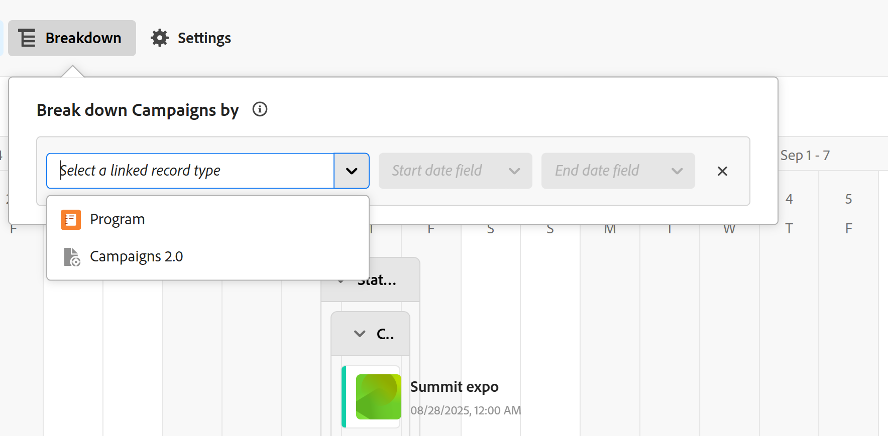

# Hantera tidslinjevyn

Den markerade informationen på den här sidan hänvisar till funktioner som ännu inte är allmänt tillgängliga. Det är bara tillgängligt i förhandsvisningsmiljön för alla kunder. Efter de månatliga releaserna i Production finns samma funktioner även i produktionsmiljön för kunder som aktiverat snabba releaser. 

Mer information om snabba releaser finns i [Aktivera eller inaktivera snabba releaser för din organisation](/help/quicksilver/administration-and-setup/set-up-workfront/configure-system-defaults/enable-fast-release-process.md). 

{{planning-important-intro}}

Du kan visa poster i en tidslinjevy när du öppnar posttypssidan i Adobe Workfront Planning.

Mer information om postvyer finns i [Hantera postvyer](/help/quicksilver/planning/views/manage-record-views.md).

## Åtkomstkrav

+++ Expandera om du vill visa åtkomstkraven för funktionerna i den här artikeln. 

<table style="table-layout:auto"> 
<col> 
</col> 
<col> 
</col> 
<tbody> 
    <tr> 
<tr> 
</tr>   
<tr> 
   <td role="rowheader">
Adobe Workfront package
</td> 
   <td> 

Alla Workfront- och Planning-paket

Alla arbetsflöden och alla planeringsdokument

Mer information om vad som ingår i respektive Workfront Planning-paket får du av Workfront. 
 
   </td> 
  <tr> 
   <td role="rowheader">
Adobe Workfront-licens
</td> 
   <td>
 Standard för att skapa och ta bort vyer

   
Medarbetare eller högre för att uppdatera vyelement

  </td> 
  </tr> 
  <tr> 
   <td role="rowheader">
Objektbehörigheter
</td> 
   <td>   
Hantera behörigheter till en vy
  
   
Visa behörigheter till en vy om du tillfälligt vill ändra visningsinställningarna eller duplicera den
 </td> 
  </tr> 
<tr>
   <td role="rowheader">
Layoutmall
</td>
   <td> Användare med en Light- eller Contributor-licens måste tilldelas en layoutmall som innehåller Planning.
   
Standardanvändare och systemadministratörer har planeringsområdena aktiverade som standard.

</li></ul>
</td>
  </tr> 
</tbody> 
</table>

Mer information om Workfront åtkomstkrav finns i [Åtkomstkrav i Workfront-dokumentationen](/help/quicksilver/administration-and-setup/add-users/access-levels-and-object-permissions/access-level-requirements-in-documentation.md).

+++ 

<!--Old:
<table style="table-layout:auto"> 
<col> 
</col> 
<col> 
</col> 
<tbody> 
    <tr> 
<tr> 
<td> 
   
 Products
 </td> 
   <td> 
   <ul><li>
 Adobe Workfront
</li> 
   <li>
 Adobe Workfront Planning
</li></ul></td> 
  </tr>   
<tr> 
   <td role="rowheader">
Adobe Workfront plan*
</td> 
   <td> 

Any of the following Workfront plans:
 
<ul><li>Select</li> 
<li>Prime</li> 
<li>Ultimate</li></ul> 

Workfront Planning is not available for legacy Workfront plans
 
   </td> 
<tr> 
   <td role="rowheader">
Adobe Workfront Planning package*
</td> 
   <td> 

Any 
 

For more information about what is included in each Workfront Planning plan, contact your Workfront account manager. 
 
   </td> 
 <tr> 
   <td role="rowheader">
Adobe Workfront platform
</td> 
   <td> 

Your organization's instance of Workfront must be onboarded to the Adobe Unified Experience to be able to access Workfront Planning.
 

For more information, see <a href="/help/quicksilver/workfront-basics/navigate-workfront/workfront-navigation/adobe-unified-experience.md">Adobe Unified Experience for Workfront</a>. 
 
   </td> 
   </tr> 
  </tr> 
    <td role="rowheader">
Adobe Workfront license*
</td> 
   <td>
 Standard to create and delete views

   
Contributor or higher to update view elements

   
Workfront Planning is not available for legacy Workfront licenses
 
  </td> 
  </tr> 
  <tr> 
   <td role="rowheader">
Access level configuration
</td> 
   <td> 
There are no access level controls for Adobe Workfront Planning
   
</td> 
  </tr> 
<tr> 
   <td role="rowheader">
Object permissions
</td> 
   <td>   
Manage permissions to a view
  
   
View permissions to a view to temporarily change the view settings or to duplicate it
 </td> 
  </tr> 
<tr>
   <td role="rowheader">
Layout template
</td>
   <td> Users with a Light or Contributor license must be assigned a layout template that includes Planning.
   
Standard users and System Administrators have the Planning areas enabled by default.

</li></ul>
</td>
  </tr>
</tbody> 
</table> -->

## Hantera en tidslinjevy {#manage-a-timeline-view}

När du skapar en tidslinjevy visas alla poster av den valda posttypen på en kronologisk tidslinje.

Tänk på följande:

* Du kan bara skapa en tidslinjevy om du har minst två datumfält associerade med en posttyp. När du har ett eller inga datumfält som är associerade med en posttyp är alternativet för tidslinjevy nedtonat.

  Du kan välja mellan följande datumfält när du skapar en tidslinjevy:

   * Registreringsdatum
   * Registrera systemgenererade fält: Skapat den, Senast ändrat den
   * Sök efter datum från anslutna post- eller objekttyper (endast när du lade till en aggregator för dem när du kopplade posten eller objekttyperna)
* Beroende på vilka datum som är associerade med posterna kanske vissa poster inte visas i tidslinjevyn i följande scenarier:

   * När start- och slutdatum inte har några värden
   * När start- eller slutdatumet inte har något värde
   * När startdatumet infaller efter slutdatumet

Så här hanterar du en tidslinjevy:

1. Gå till den posttypssida som du vill visa tidslinjen för.
1. Skapa en tidslinjevy enligt beskrivningen i artikeln [Hantera postvyer](/help/quicksilver/planning/views/manage-record-views.md).

   

   Posterna som är associerade med den posttyp du valde visas som staplar på en tidslinje och sorteras som standard i kronologisk ordning efter startdatum.

   >[!TIP]
   >
   >    Sorteringen av posterna på tidslinjen är inte synlig i den komprimerade vyn.

1. (Villkorligt) Om administratören har aktiverat anpassade kvartal och Workfront upptäcker problem med hur anpassade kvartal är konfigurerade, kan du få en varning när du öppnar tidslinjevyn.

   Följande scenarier finns:

   * Om luckor eller överlappningar har upptäckts mellan datumen i kvartalen kan du få ett meddelande om att anpassade kvartal nu kan konfigureras och behöver redigeras.

     

     >[!TIP]
     >
     >Det här meddelandet ska visas endast omedelbart efter att din organisation har aktiverat Planning och anpassade kvartal före köpet. Överlappningar och luckor mellan kvartalen är inte tillåtna när du har aktiverat Workfront Planning för din organisation.

   * Om kvartal delvis har ställts in och några månader under samma år saknas, kan du få ett meddelande när du rullar för att visa kvartal som saknas om att resten av året behöver ställas in med kvartal som saknas.

   

   Varningsmeddelandena om anpassade kvartal visas en gång per användare.

   >[!NOTE]
   >
   >Om du inte har sparat det anpassade kvartalet korrekt visas de klassiska kvartalen i tidslinjevyn.
   >När du har konfigurerat anpassade kvartal i inställningsområdet visas anpassade kvartal i tidslinjevyn i stället för klassiska kvartal.
   >Mer information finns i [Aktivera anpassade kvartal](/help/quicksilver/administration-and-setup/set-up-workfront/configure-system-defaults/enable-custom-quarters-projects.md).

1. (Villkorligt) Om du är Workfront-administratör klickar du på **Gå till installationsprogrammet** för att konfigurera dina kvartal. Om inte klickar du på **OK** och ber Workfront-administratören att konfigurera anpassade kvartal.

   >[!TIP]
   >
   >Knappen Gå till konfiguration visas endast för Workfront-administratören.

1. (Valfritt och villkorligt) När postnamnet trunkeras håller du pekaren över ett postfält för att visa postens fullständiga namn och ytterligare information. Mer information om hur du ställer in postfältets trunkering på tidslinjen finns i avsnittet [Redigera inställningarna för tidslinjevyn](#edit-the-timeline-view-settings) i den här artikeln.

1. Navigera genom tidslinjen på något av följande sätt:

   * Klicka på ikonerna till vänster och höger i det övre vänstra hörnet eller använd den vågräta rullningen för att flytta bakåt och framåt i tidslinjen. När du uppdaterar sidan bevaras den markerade tidsramen.
   * Klicka på **Idag** i det övre högra hörnet för att centrera tidslinjen till dagens datum.
   * Välj något av följande alternativ i listrutan för tidsbildrutor för att uppdatera tidsstegen och uppdatera vyn:

      * **År**: Visar kvartal och månader med årsangivelse.
      * **Kvartal**: Visar månader och veckor med kvartalsangivelse.
      * **Månad**: Visar veckor och dagar.
1. (Valfritt) Klicka på **Växla till komprimerad vy** om du vill visa de poster vars datum inte överlappar på samma rad. <!--check to see if they updated the name of the setting here-->
1. (Villkorligt) Om du har ändrat läge till **Kompakt** klickar du på **Växla till standardvyn** för att visa poster på separata rader. Alternativet **Standard** är standard.  <!--check to see if they updated the name of the setting here-->

1. Gör följande för att snabbt hitta poster som matchar ett nyckelord:

   1. Klicka på ikonen **Sök**  och börja skriva ett nyckelord som är associerat med ett fält i en post som visas på skärmen. Antalet korrekta matchningar visas bredvid sökobjektet och posten med rätt matchning markeras.

      

      Du kan använda vilket ord eller specialtecken som helst som visas på skärmen.

      Du kan inte använda nyckelord som är associerade med fält som inte visas i tidslinjevyn.

   1. Tryck på Retur på tangentbordet för att gå till nästa sökbara fält.
   1. (Valfritt) Om det finns mer än en matchning klickar du på upp- och nedpilarna till höger om söknyckelordet för att hitta alla matchningar i tabellen.
   1. Klicka på ikonen **x** i sökrutan för att ta bort söknyckelordet.

   1. (Valfritt) Klicka på ikonen **Helskärm**  om du vill öppna vyn i helskärmsläge och sedan på ikonen **Avsluta helskärm**  eller Esc på tangentbordet om du vill avsluta helskärmsläget.

1. (Valfritt) Klicka på **Uppdelning** om du vill visa anslutna poster på tidslinjen.

   Mer information finns i avsnittet [Använd fördelningsfunktionen för att visa anslutna poster i tidslinjevyn](#break-down-connected-records-in-the-timeline-view) i den här artikeln.
1. Gör något av följande om du vill skapa poster i tidslinjevyn eller redigera deras datum:

   * Dubbelklicka var som helst på tidslinjen för att skapa en post.

     Mer information finns i [Skapa poster](/help/quicksilver/planning/records/create-records.md).

   >[!TIP]
   >
   >Det går inte att dubbelklicka för att skapa poster på tidslinjen i en gruppering.

   * Klicka på den vänstra eller högra marginalen i ett postfält och dra och släpp det sedan på en ny plats. Om du ändrar storlek på posternas staplar uppdateras deras start- och slutdatum omedelbart.

   * Dra och släpp poster för att uppdatera deras position och datum på tidslinjen. Om du flyttar posternas staplar uppdateras start- och slutdatumen omedelbart.

     Mer information finns i [Redigera poster](/help/quicksilver/planning/records/edit-records.md).

   >[!TIP]
   >
   >Det går inte att ändra storlek på, dra och släppa poster i tidslinjen för objekttyperna Workfront och AEM Assets som visas i uppdelningar.

1. Uppdatera följande vyelement enligt beskrivningen i underavsnitten nedan:
   * [Filter](#add-filters)
   * [Gruppering](#add-grouping)
   * [Inställningar](#edit-the-timeline-view-settings)
     <!--* [Sort](#add-sort) not yet in timeline; also check the anchor and make sure it's correct-->

### Lägg till filter

Du kan minska mängden information som visas på skärmen genom att använda filter.

Tänk på följande när du arbetar med filter i tidslinjevyn:

<!-- this list is almost identical to the one for the table view - update both-->

* De filter som du skapar för en tidslinjevy fungerar oberoende av filtren i andra vyer som används för samma posttyp.

* Filtren är unika för den vy du väljer. Två tidslinjevyer av samma posttyp kan ha olika filter.

* Två användare som tittar på samma tidslinjevy ser samma filter som används för närvarande.

* Du kan inte namnge de filter som du skapar för en tidslinjevy.

* När du tar bort filter tas de bort från alla som använder samma posttyp som du och som visar samma vy som du.

* Du kan filtrera efter anslutna postfält eller uppslagsfält.
* Du kan filtrera efter uppslagsfält som visar flera värden.

Så här lägger du till ett filter i en tidslinjevy:

1. Skapa en tidslinjevy för en posttypsida, enligt beskrivningen i artikeln [Hantera postvyer](/help/quicksilver/planning/views/manage-record-views.md).
1. Markera en tidslinjevy och klicka sedan på **Filter** i tabellens övre högra hörn.
1. Klicka på **Lägg till villkor** och lägg till följande information:

   * **Välj ett fält** för att söka efter ett fält eller  klicka på den nedrullningsbara menyn för att visa en lista med fält och markera det i listan

   * **Välj ett alternativ** (eller en filtermodifierare) för att definiera vilken typ av villkor fältet måste uppfylla

     Tabellen nedan visar tillgängliga modifierare för varje typ av fält.

     <table>
        <thead>
        <tr>
            <th><b>Fälttyp</b></th>
            <th><b>Modifierare</b></th>
        </tr>
        </thead>
        <tbody>
        <tr>
            <td>Enkelrad, Stycke, Formel </td>
            <td>
Innehåller

            
Innehåller inte

            
Är

            
Är inte

            
Är tom

            
Är inte tom
</td>
        </tr>
        <tr><td>Enkelval</td>
            <td>
Är

            
Är inte

            
Är något av

            
Är inget av

            
Är tom

            
Är inte tom
</td>
        </tr>
        <tr>
            <td>Flera val, personer</td>
            <td>
Har någon av

            
Har alla

            
Är exakt

            
Har ingen av

            
Är tom

            
Är inte tom
</td>
        </tr>
        <tr>
            <td>Antal, Procentandel, Valuta</td>
            <td>
=

            
≠

            
 &lt; 

            
&gt;

            
≤

            
≥

            
Är tom

            
Är inte tom
</td>
        </tr>
        <tr>
            <td>Datum</td>
            <td>
Är

            
Är inte

            
Är efter

            
Är före

            
Är mellan

Är inte mellan

            
Är tom

Är inte tom
</td>
        </tr>

     <tr>
            <td>Kryssruta</td>
            <td>
Är

        </tr>
        </tbody>
        </table>

   * Välj ett värde för det markerade fältet.

   

   Det finns ingen gräns för hur många filtreringsvillkor du kan lägga till.

1. (Valfritt) Klicka på **Lägg till villkor** om du vill lägga till ytterligare ett filtreringsalternativ och upprepa stegen ovan. Antalet filter som används visas till vänster om ikonen **Filter** .
1. Klicka på följande operatorer till vänster för att ange hur filtervillkoren ska kopplas ihop och tillämpas:

   * **AND**: Alla angivna villkor måste uppfyllas.
   * **OR**: Alla angivna villkor måste vara uppfyllda.
Det här är standardalternativet.

   1. (Valfritt) Lägg till ytterligare filtergrupperingar och förena dem med operatorerna **AND** eller **OR** .

      

   Postlistan filtreras automatiskt baserat på filtervillkoren.  <!--at this time, you can't name and save the filter - but will this change?!-->
   <!-- asked on the task for the simple filters whether there is a limitation for how many statements a filter can have?!-->

1. (Valfritt) Klicka på ikonen **x** för att ta bort ett filtervillkor.
1. (Valfritt) Klicka på **Filter** eller någon annanstans på sidan för att stänga filterrutan. <!--right now you cannot "clear all" for filters, but this might come later-->

### Lägg till gruppering

<!-- groupings are almost identical between this view and table  but they display a little differently, so I kept the steps for both; update in both places if they make changes to groupings-->

Du kan gruppera poster efter liknande information när du tillämpar en gruppering på en vy.

Tänk på följande när du arbetar med grupperingar i tidslinjevyn:

* Du kan använda grupperingar både i tabell- och tidslinjevyerna. Grupperingarna i tabellvyn är oberoende av grupperingarna i tidslinjevyn av samma posttyp.
* Du kan använda tre nivåer av gruppering i en vy. Posterna grupperas i den ordning som du väljer grupperingar.
&lt;!—* Du kan använda upp till fyra nivåer av gruppering när du använder API:t. —check on this for now—>
* Grupperingarna är unika för den vy du väljer. Två tabellvyer av samma posttyp kan ha olika grupperingar. Två användare som tittar på samma tabellvy ser samma gruppering som används för närvarande.
* Du kan inte namnge grupperingarna som du skapar för en tabellvy.
* Om du tar bort grupperingar tas de bort från alla som har åtkomst till samma posttyp som du och som visar samma vy som du.
* Du kan redigera poster som listas under en gruppering.
* Du kan gruppera efter anslutna postfält eller sökfält.
* När du grupperar efter uppslagsfält med flera värden (som inte har summerats av en aggregator) grupperas posterna efter varje unik kombination av fältvärden.
* Du kan referera till ett fält som ligger upp till fyra nivåer från den aktuella posttypen. Om du till exempel skapar en gruppering för en aktivitetsposttyp, och aktiviteten är ansluten till produktposttypen som är kopplad till Campaign-posttypen som är kopplad till ett Workfront-projekt, kan du referera till projektets status i den gruppering du skapar för aktivitetsposttypen.
* Grupperingar visas i alfabetisk ordning efter deras värden.
<!--checking into this: * You can apply up to 4 levels of grouping when using the API. -->
<!-- checking also into this: * You cannot group by a Paragraph-type field.-->

Så här lägger du till en gruppering i tidslinjevyn:

1. Skapa en tidslinjevy för en posttyp enligt beskrivningen i artikeln [Hantera postvyer](/help/quicksilver/planning/views/manage-record-views.md).
1. Klicka på **Gruppering** i det övre högra hörnet av tidslinjevyn.

   

1. Klicka på ett av de föreslagna fälten eller klicka på **Välj ett annat fält** och sök efter ett annat fält. Klicka sedan på det när det visas i listan.

   Grupperingen används automatiskt på tidslinjen och posterna visas inuti grupperingsrutan.

1. (Valfritt) Upprepa stegen ovan om du vill lägga till upp till tre grupperingar.

   Antalet fält som har valts för grupperingen visas bredvid grupperingsikonen.

   

1. Dra och släpp grupperingarna i rätt ordning i rutan **Gruppera poster efter**.

1. (Valfritt) I rutan **Gruppera poster efter** klickar du på ikonen **x** till höger om ett fält som är markerat för grupperingen för att ta bort grupperingen

   eller

   Klicka på **Rensa alla** om du vill ta bort alla fält.

1. Klicka utanför rutan **Gruppera poster efter** för att stänga den.
1. (Valfritt) Klicka på **Inställningar** och sedan på **Färg** för att färgkoda grupperingar. Mer information finns i avsnittet [Redigera tidslinjevisningsinställningar](#edit-the-timeline-view-settings) i den här artikeln.

<!-- 

### Add sort

this is not possible right now; if this is the same functionality as the table view, document it there and link from here. 

-->

### Redigera inställningarna för tidslinjevyn {#edit-the-timeline-view-settings}

Uppdatera inställningarna för tidslinjevyn för att ange vad och hur informationen ska visas i tidslinjeavsnittet i vyn.

1. Skapa en tidslinjevy för en posttyp enligt beskrivningen i artikeln [Hantera postvyer](/help/quicksilver/planning/views/manage-record-views.md).
1. Klicka på **Inställningar**.
1. Klicka på **Datum och tid** på den vänstra panelen och välj sedan ett **Startdatum** och ett **slutdatum** som ska visas på tidslinjen. Du kan välja standarddatum för start och slut eller välja ett tillgängligt datumfält.

   De staplar som representerar posterna börjar på det datum som du anger som startdatum och slutar på det datum som motsvarar slutdatumet.

   >[!NOTE]
   >
   >* Poster som inte har några värden för start- eller slutdatum eller som har ett startdatum efter slutdatumet visas inte i tidslinjevyn.
   >
   >* Om du visar ytterligare poster med alternativet Uppdelning är start- och slutdatumen huvudpostens. Du kan inte välja start- och slutdatum för de anslutna posterna i det här området.

1. (Villkorligt och valfritt) Om du är Workfront-administratör klickar du på **Gå till Inställningar** i rutan **Använd anpassade kvartal** för att gå till inställningsområdet och ställa in anpassade kvartal. När du har konfigurerat anpassade kvartal kan du visa dem i tidslinjevyn i stället för i klassiska kvartal. Om du inte är Workfront-administratör kan du begära att anpassade kvartal aktiveras för din organisation av en administratör.

   Mer information finns i [Aktivera anpassade kvartal](/help/quicksilver/administration-and-setup/set-up-workfront/configure-system-defaults/enable-custom-quarters-projects.md).

   

   >[!TIP]
   >
   >Knappen Gå till konfiguration visas endast för Workfront-administratören.

1. Klicka på **Stapelformat** i den vänstra panelen för att ange vilken information du vill visa i postfälten.

   Du kan definiera stapelformatet för huvudposten samt för de kopplade posterna när du använder alternativet Uppdelning i standardvyn.

   Postens primära fält (eller rubrik), enligt postens tabellvy, är markerat som standard.
   <!--adjust this when the primary field is released??-->

1. (Valfritt och villkorligt) Om du har lagt till miniatyrbilder till poster markerar du alternativet **Miniatyrbild** för att visa den bild som är associerad med posterna i deras postfält.

   >[!NOTE]
   >
   >    Du måste först lägga till miniatyrbilder i tabellvyn innan du kan visa dem i tidslinjevyn. Mer information finns i [Lägga till en miniatyrbild i en post](/help/quicksilver/planning/records/add-thumbnails-to-records.md).

1. Klicka på **Lägg till fält**, klicka i rutan **Sök fält** och klicka på det fält som du vill lägga till.

   >[!TIP]
   >
   >   * Du måste skapa fälten innan du kan lägga till dem i postfälten.
   > 
   >   * Du måste ha minst ett fält markerat. **Namn** är markerat som standard.
   >
   >   * Du kan lägga till upp till fem fält.

   En förhandsvisning av hur staplarna kommer att se ut på tidslinjen visas till höger.

   

1. (Valfritt och villkorligt) Om du visar tidslinjen i standardläge väljer du inställningen **Trunkera fältdetaljer** . När det här alternativet är markerat trunkeras informationen på postfälten och visas bara helt när du håller pekaren över fälten. Den här inställningen är som standard avmarkerad och postinformationen visas helt i fälten.

   

   >[!TIP]
   >
   >Inställningen för detaljer i trunkeringsfältet är inte tillgänglig när du visar tidslinjevyn i läget Kompakt.
   >

1. Klicka på **Färg** i den vänstra panelen om du vill anpassa färgerna för posterna och grupperingarna i tidslinjen.

   

   Du kan definiera färgen på både huvudposten och de kopplade posterna när du använder alternativet Uppdelning i standardvyn.

1. (Villkorlig och valfri) Om du har lagt till en gruppering i tidslinjevyn väljer du bland följande alternativ för att ange en färg för grupperingen i avsnittet **Ange grupperingsfärg**:

   * **Standard (grått)**: Färgen på grupperingarna är inställd på grått. Det här är standardinställningen.
   * **Fältvärden**: Färgen på grupperingarna matchar färgen på fältet som du grupperar efter.

     >[!NOTE]
     >
     >    * Du kan bara matcha färgen mot fält med färgkodade alternativ. Du kan till exempel matcha färgen mot statusfälten eller fält med alternativ som är kopplade till färger.
     >    
     >    * Du kan inte matcha färgen mot uppslagsfält från länkade poster eller objekttyper.

   Flervalsfält eller envalsfält kan t.ex. ha färgkodade alternativ.

   Om du grupperar efter fält utan färgkodade alternativ förblir grupperingsfärgen grå.

   >[!TIP]
   >
   >Om du inte har lagt till grupperingar i tidslinjevyn visas inte det här avsnittet.

1. I avsnittet **Ange postfärg** väljer du bland följande alternativ för att ange en färg för posterna:

   * **Posttyp**: Färgen på posterna matchar färgen på den posttyp du valde. Det här är standardalternativet.
   * **Fältvärden**: Färgen på posterna matchar färgen i ett fält som du anger. Fortsätt med steg 10. <!--ensure this stays accurate-->
   * **Gruppering**: Färgen på posterna matchar färgen som du angav för grupperingarna. Det här alternativet är nedtonat när du inte har använt några grupperingar på tidslinjevyn.
   * **Ingen**: Posterna visas i ett vitt fält.

1. (Villkorligt) Om du valde **Fältvärden** för postfärgerna väljer du ett fält i listrutan **Matcha postfärgen till**.

   

   Endast fält med färgkodade alternativ visas i listrutan.

   Flervalsfält eller envalsfält kan t.ex. ha färgkodade alternativ.

   Om du inte har något fält med färgkodade alternativ för den valda posttypen är det här alternativet nedtonat.

1. (Valfritt) Om du använder alternativet **Brytning** upprepar du stegen som börjar med steg 4 för varje ansluten post som visas på tidslinjen.

1. Klicka på **Spara**.

   Posterna visas i tidslinjevyn med de specifikationer som du har valt.

### Dela upp kopplade poster i tidslinjevyn

Du kan visa anslutna poster i en posts tidslinjevy genom att använda funktionen Uppdelning. Genom att dela upp poster efter deras anslutningar kan du visa tidslinjerna för andra anslutna poster och förstå hur de kan påverka posternas prestanda och deadlines.

#### Att tänka på när du använder fördelningsfunktionen

* Du kan visa anslutna poster eller objekt under posterna för den valda posttypen i tidslinjevyn.
* Du kan bara visa anslutna poster i tidslinjevyn när du visar posterna i standardläge. Du kan inte använda alternativet Uppdelning i läget Kompakt i tidslinjevyn.
* Du kan visa följande i tidslinjevyn med hjälp av funktionen Uppdelning:
   * Workfront Planning-poster kopplade till den valda posttypen.
   * Workfront-objekttyper eller Experience Manager-resurser som är kopplade till den valda posttypen.
   * Workfront Planning-poster eller objekt från andra program som är anslutna till poster som är kopplade till den valda posttypen.

     Du kan till exempel koppla kampanjer till portföljer. Dessutom kan ni koppla samman en annan posttyp, produkter, projekt och kampanjer. När ni bygger kampanjens tidslinjevy kan ni dela upp kampanjerna efter portföljer, produkter och projekt.

* Du kan inte visa objekttyper som bara är anslutna till Workfront-objekt i Workfront, men som inte är kopplade till någon Workfront Planning-posttyp. Du kan bara visa objekt eller posttyper som är anslutna i Workfront Planning.

  Till exempel är uppgifter kopplade till projekt i Workfront. Med hjälp av fördelningsfunktionen kan du visa projekt som är kopplade till kampanjer i Planning, men inte aktiviteter som är kopplade till projekt i Workfront.

  Om du vill visa både portföljer och projekt i tidslinjevyn för en Workfront Planning-posttyp måste både portföljerna och projekten vara kopplade till Planning-posten eller till en post kopplad till Planning-posten vars tidslinjevy du hanterar.
* Du kan bara visa posttyper som är associerade med minst två datumfält.
* Datumfälten för de posttyper som du vill visa i tidslinjevyn måste vara synliga i tabellvyn för den valda posttypen, som uppslagsfält.
* Start- och slutdatumen för de posttyper som du vill visa i tidslinjevyn måste anges i kronologisk ordning. Om en post till exempel har startdatumet 31 januari och slutdatumet 1 januari visas den inte i tidslinjevyn. Mer information finns i avsnittet [Hantera en tidslinjevy](#manage-a-timeline-view) i den här artikeln.
* Det finns en gräns på 5 posttyper som du kan inkludera i en posts uppdelning.

#### Dela upp anslutna poster

1. Skapa en tidslinjevy för en posttyp enligt beskrivningen i artikeln [Hantera postvyer](/help/quicksilver/planning/views/manage-record-views.md).
1. Klicka på **Brytning** i det övre högra hörnet av tidslinjevyn i lägena **Standard** eller **Kompakt**.
1. Expandera rutan **Markera en länkad posttyp** och välj en ansluten posttyp. <!--add a new screen shot - submitted a bug to remove the "the"-->

   

   >[!TIP]
   >
   >    Om du inte har några anslutna poster, eller om de anslutna posterna inte har minst två datumfält, är rutan **Välj en länkad posttyp** inte tillgänglig.

1. Välj ett **startdatum** och ett **slutdatumfält**.

   >[!TIP]
   >
   >    Start- och slutdatum måste vara sekventiella. Om slutdatumet är före startdatumet visas inga poster på tidslinjen.

   En högerpil visas på den markerade postens fält på tidslinjen, om de är kopplade till andra poster.
1. Klicka på högerpilen för att expandera en posttyp och visa anslutningarna. <!--update screen shot at production-->

   

   >[!IMPORTANT]
   >
   >    När du visar flera sammankopplade poster i uppdelningen är de inte i hierarkisk ordning.
   >
   >Om du till exempel tittar på kampanjens tidslinje och lägger till Produkter och sedan Program i detaljerna behöver programmen inte vara kopplade till Produkterna först.
   >
   >Både Produkter och Program måste vara kopplade till kampanjerna för att kunna visas som alternativ för uppdelningsalternativet, och du kan lägga till dem i uppdelningen i valfri ordning.

1. (Villkorligt) Om du visar tidslinjen i kompakt läge klickar du på **Växla vy**. Nedbrytningen visas inte i läget **Kompakt**.

   >[!TIP]
   >
   >Välj **Visa inte det här igen** i **Växla till standardvyn?**-rutan innan du växlar vyn.
   >
   >Den här inställningen sparas bara för den aktuella webbläsaren. Om du ändrar webbläsare eller datorer måste du välja den här inställningen igen.
   >
   >Du kan inte återgå till läget Kompakt när du har växlat vyn till Standard och när du visar kopplade poster i vyn.
1. (Valfritt) Upprepa stegen ovan om du vill lägga till fler anslutna poster.

