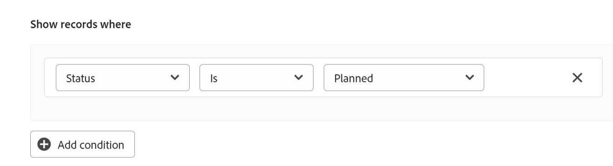

# Hantera tidslinjevyn

<!--The highlighted information on this page refers to functionality not yet generally available. It is available only in the Preview environment for all customers. After the monthly releases to Production, the same features are also available in the Production environment for customers who enabled fast releases.    

For information about fast releases, see [Enable or disable fast releases for your organization](/help/quicksilver/administration-and-setup/set-up-workfront/configure-system-defaults/enable-fast-release-process.md). -->

{{planning-important-intro}}

Du kan visa poster i en tidslinjevy när du öppnar sidan för posttyper i Adobe Workfront Planning.

Mer information om postvyer finns i [Hantera postvyer](/help/quicksilver/planning/views/manage-record-views.md).

## Krav för åtkomst

+++ Expandera för att visa åtkomstkrav.

<table style="table-layout:auto"> 
<col> 
</col> 
<col> 
</col> 
<tbody> 
    <tr> 
<tr> 
<td> 
   
 Produkter
 </td> 
   <td> 
   <ul><li>
 Adobe Workfront
</li> 
   <li>
 Planering av Adobe Workfront
</li></ul></td> 
  </tr>   
<tr> 
   <td role="rowheader">
Adobe Workfront-plan*
</td> 
   <td> 

Någon av följande Workfront-planer:
 
<ul><li>Utvald</li> 
<li>Primtal</li> 
<li>Sist</li></ul> 

Workfront Planning är inte tillgängligt för äldre Workfront-planer
 
   </td> 
<tr> 
   <td role="rowheader">
Adobe Workfront Planeringspaket*
</td> 
   <td> 

Någon 
 

Om du vill ha mer information om vad som ingår i varje Workfront Planning-plan kontaktar du din Workfront-kontoansvarige. 
 
   </td> 
 <tr> 
   <td role="rowheader">
Adobe Workfront-plattform
</td> 
   <td> 

Din organisations instans av Workfront måste vara registrerad i Adobe Unified Experience för att kunna komma åt Workfront Planning.
 

Mer information finns i <a href="/help/quicksilver/workfront-basics/navigate-workfront/workfront-navigation/adobe-unified-experience.md">Adobe Unified Experience för Workfront</a>. 
 
   </td> 
   </tr> 
  </tr> 
    <td role="rowheader">
Licens för Adobe Workfront*
</td> 
   <td>
 Standard för att skapa och ta bort vyer

   
Deltagare eller högre för att uppdatera vyelement

   
Workfront Planning är inte tillgängligt för äldre Workfront-licenser
 
  </td> 
  </tr> 
  <tr> 
   <td role="rowheader">
Konfiguration av åtkomstnivå
</td> 
   <td> 
Det finns inga åtkomstnivåkontroller för Adobe Workfront Planning
   
</td> 
  </tr> 
<tr> 
   <td role="rowheader">
Behörigheter för objekt
</td> 
   <td>   
Hantera behörigheter till en vy
  
   
Visa behörigheter till en vy för att tillfälligt ändra vyinställningarna eller duplicera den
 </td> 
  </tr> 
<tr>
   <td role="rowheader">
Mall för layout
</td>
   <td> Användare med en Light- eller Contributor-licens måste tilldelas en layoutmall som innehåller Planering.
   
Standardanvändare och systemadministratörer har planeringsområdena aktiverade som standard.

</li></ul>
</td>
  </tr>
</tbody> 
</table>

*Mer information om åtkomstkrav för Workfront finns [i Åtkomstkrav i Workfront-dokumentationen](/help/quicksilver/administration-and-setup/add-users/access-levels-and-object-permissions/access-level-requirements-in-documentation.md).

+++

## Hantera en tidslinjevy {#manage-a-timeline-view}

När du skapar en tidslinjevy visas alla poster av den valda posttypen i en kronologisk tidslinje.

Tänk på följande:

* Du kan bara skapa en tidslinjevy när du har minst två datumfält kopplade till en posttyp. När du har ett eller inga datumfält som är kopplade till en posttyp är alternativet Tidslinjevy nedtonat.

  Du kan välja bland följande datumfält när du skapar en tidslinjevy:

   * Avstämningsdagar
   * Registrera systemgenererade fält: Skapat datum, Datum för senaste ändring
   * Slå upp datum från anslutna post- eller objekttyper (endast när du lade till en aggregator för dem när du kopplade post- eller objekttyperna)
* Beroende på vilka datum som associeras med posterna kan det hända att vissa poster inte visas i tidslinjevyn i följande scenarier:

   * När start- och slutdatumen inte har några värden
   * När start- eller slutdatumen inte har något värde
   * När startdatumet infaller efter slutdatumet

Så här hanterar du en tidslinjevy:

1. Gå till den sida för posttyp som du vill visa tidslinjen för.
1. Skapa en tidslinjevy enligt beskrivningen i artikeln [Hantera postvyer](/help/quicksilver/planning/views/manage-record-views.md).

   

   De poster som är kopplade till den posttyp du har valt visas som staplar på en tidslinje och sorteras som standard i kronologisk ordning efter startdatum.

   >[!TIP]
   >
   >    Sorteringen av posterna på tidslinjen visas inte i kompaktvyn.

1. (Villkorligt) Om din administratör har aktiverat anpassade kvartal och Workfront upptäcker problem med hur de anpassade kvartalen är konfigurerade kan du få en varning när du öppnar tidslinjevyn.

   Följande scenarier finns:

   * Om luckor eller överlappningar har upptäckts mellan datumen för kvartalen kan du få ett meddelande om att anpassade kvartal nu kan ställas in och att de kan behöva redigeras.

     

     >[!TIP]
     >
     >Det här meddelandet bör endast visas omedelbart efter att din organisation har köpt planering och anpassade kvartal redan var aktiverade före köpet. Överlappningar och mellanrum mellan kvartalen är inte tillåtna efter att du har aktiverat Workfront Planning för din organisation.

   * Om kvartal har ställts in delvis, och vissa månader inom samma år saknas, kan du få ett meddelande när du bläddrar för att visa de saknade kvartalen om att resten av året måste ställas in med de saknade kvartalen.

   

   Varningsmeddelandena om de anpassade kvartalen visas en gång för varje användare.

   >[!NOTE]
   >
   >Utan att anpassat kvartal har sparats på rätt sätt visar tidslinjevyn de klassiska kvartalen.
   >När du har ställt in anpassade kvartal i området Inställningar visar tidslinjevyn de anpassade kvartalen i stället för de klassiska kvartalen.
   >Mer information finns i [Aktivera anpassade kvartal.](/help/quicksilver/administration-and-setup/set-up-workfront/configure-system-defaults/enable-custom-quarters-projects.md)

1. (Villkorligt) Om du är Workfront-administratör klickar du på **Gå till inställningar** för att ställa in dina kvartal. Om inte, klicka på **OK** och be Workfront-administratören att ställa in de anpassade kvartalen.

   >[!TIP]
   >
   >Knappen Gå till installation visas endast för Workfront-administratören.

1. (Valfritt och villkorligt) När postnamnet trunkeras håller du muspekaren över ett postfält för att visa postens fullständiga namn och ytterligare information. Mer information om hur du ställer in trunkering av postfält i tidslinjen finns i avsnittet [Redigera inställningarna](#edit-the-timeline-view-settings) för tidslinjevyn i den här artikeln.

1. Gör något av följande för att navigera genom tidslinjen:

   * Klicka på vänster och höger ikoner i det övre vänstra hörnet eller använd den vågräta rullningen för att flytta bakåt och framåt i tidslinjen. Om du uppdaterar sidan bevaras den valda tidsramen.
   * Klicka på **Idag** i det övre högra hörnet för att centrera tidslinjen till dagens datum.
   * Välj ett av följande alternativ i rullgardinsmenyn för tidsramar för att uppdatera tidsintervallen och uppdatera vyn:

      * **År**: Visar kvartal och månader med årsangivelse.
      * **Kvartal**: Visar månader och veckor med kvartalsindikering.
      * **Månad**: Visar veckor och dagar.
1. (Valfritt) Klicka på **Växla till komprimerad vy** om du vill visa de poster vars datum inte korsar varandra på samma rad. <!--check to see if they updated the name of the setting here-->
1. (Villkorligt) Om du har ändrat läget till **Kompakt klickar du på** Växla **till standardvy** för att visa poster på separata rader. Alternativet **Standard** är standard.  <!--check to see if they updated the name of the setting here-->

1. Gör så här för att snabbt hitta poster som matchar ett nyckelord:

   1. **Klicka på sökikonen** och börja skriva ett nyckelord som är associerat med ett fält i en post som visas på skärmen. Antalet korrekta matchningar visas bredvid sökobjektet och posten med rätt matchning markeras.

      

      Du kan använda vilket ord eller specialtecken som helst som är synligt på skärmen.

      Du kan inte använda nyckelord som är associerade med fält som inte visas i tidslinjevyn.

   1. Tryck på Retur på tangentbordet för att gå till nästa hittade fält.
   1. (Valfritt) Om det finns fler än en matchning klickar du på upp- och nedpilarna till höger om sökordet för att hitta alla matchningar i tabellen.
   1. **Klicka på x-ikonen** i sökrutan för att rensa sökordet.

1. Uppdatera följande vyelement enligt beskrivningen i underavsnitten nedan:
   * [Filter](#add-filters)
   * [Gruppering](#add-grouping)
   * [Inställningar](#edit-the-timeline-view-settings)
     <!--* [Sort](#add-sort) not yet in timeline; also check the anchor and make sure it's correct-->

1. (Valfritt) Klicka på **Översikt** för att visa anslutna poster på tidslinjen.

   Mer information finns i avsnittet [Använda uppdelningsfunktionen för att visa anslutna poster i tidslinjevyn](#break-down-connected-records-in-the-timeline-view) i den här artikeln.

### Lägga till filter

Du kan minska mängden information som visas på skärmen genom att använda filter.

Tänk på följande när du arbetar med filter i tidslinjevyn:

<!-- this list is almost identical to the one for the table view - update both-->

* De filter som du skapar för en tidslinjevy fungerar oberoende av filtren i andra vyer som tillämpas på samma posttyp.

* Filtren är unika för den vy som du väljer. Två tidslinjevyer av samma posttyp kan ha olika filter tillämpade på dem.

* Två användare som tittar på samma tidslinjevy ser samma filter som för närvarande används.

* Du kan inte namnge de filter som du skapar för en tidslinjevy.

* Om du tar bort filter tas de bort från alla som har åtkomst till samma posttyp som du och som visar samma vy som du.

* Du kan filtrera efter anslutna postfält eller uppslagsfält.
* Du kan filtrera efter uppslagsfält som visar flera värden.

Så här lägger du till ett filter i en tidslinjevy:

1. Skapa en tidslinjevy för en posttypssida, enligt beskrivningen i artikeln [Hantera postvyer](/help/quicksilver/planning/views/manage-record-views.md).
1. Välj en tidslinjevy och klicka sedan på **Filter** i det övre högra hörnet av tabellen.
1. Klicka på **Lägg till villkor** och lägg till följande information:

   * **Välj ett fält** som du vill filtrera efter <!-- the tip below might change-->

   * **Välj ett alternativ** (eller en filtermodifierare) för att definiera vilken typ av villkor fältet måste uppfylla

     I tabellen nedan visas tillgängliga modifierare för varje typ av fält.

     <table>
        <thead>
        <tr>
            <th><b>Typ av fält</b></th>
            <th><b>Modifierare</b></th>
        </tr>
        </thead>
        <tbody>
        <tr>
            <td>Enradig, Stycke, Formel </td>
            <td>
Innehåller

            
Innehåller inte

            
Vara

            
Är inte

            
Är tom

            
Är inte tom
</td>
        </tr>
        <tr><td>Välj en gång</td>
            <td>
Vara

            
Är inte

            
Är någon av följande

            
Är ingen av

            
Är tom

            
Är inte tom
</td>
        </tr>
        <tr>
            <td>Välj flera, personer</td>
            <td>
Har någon av följande

            
Har alla

            
Är exakt

            
Har ingen av

            
Är tom

            
Är inte tom
</td>
        </tr>
        <tr>
            <td>Tal, procent, valuta</td>
            <td>
=

            
≠

            
 &lt; 

            
&gt;

            
≤

            
≥

            
Är tom

            
Är inte tom
</td>
        </tr>
        <tr>
            <td>Datum</td>
            <td>
Vara

            
Är inte

            
Är efter

            
Är före

            
Är mellan

Är inte mellan

            
Är tom

Är inte tom
</td>
        </tr>

     <tr>
            <td>Kryssrutan</td>
            <td>
Vara

        </tr>
        </tbody>
        </table>

   * Välj ett värde för det valda fältet.

   

   Det finns ingen gräns för hur många filtreringsvillkor du kan lägga till.

1. (Valfritt) Klicka på **Lägg till villkor** för att lägga till ytterligare ett filtreringsalternativ och upprepa stegen ovan. Antalet filter som används visas till vänster om filterikonen ****.
1. Klicka på följande operatorer till vänster för att ange hur filtervillkoren är kopplade och ska tillämpas:

   * **OCH:** Alla angivna villkor måste uppfyllas.
   * **ELLER:** Något av de angivna villkoren måste uppfyllas.
Det här är standardalternativet.

   1. (Valfritt) Lägg till ytterligare filtergrupperingar och koppla dem med **operatorerna AND** eller **OR** .

      

   Listan med poster filtreras automatiskt baserat på dina filterkriterier.  <!--at this time, you can't name and save the filter - but will this change?!-->
   <!-- asked on the task for the simple filters whether there is a limitation for how many statements a filter can have?!-->

1. (Valfritt) Klicka på **x-ikonen** för att ta bort ett filtervillkor.
1. (Valfritt) Klicka på **Filter** eller någon annanstans på sidan för att stänga filterrutan. <!--right now you cannot "clear all" for filters, but this might come later-->

### Lägg till gruppering

<!-- groupings are almost identical between this view and table  but they display a little differently, so I kept the steps for both; update in both places if they make changes to groupings-->

Du kan gruppera poster efter liknande information när du använder en gruppering i en vy.

Tänk på följande när du arbetar med grupperingar i tidslinjevyn:

* Du kan använda grupperingar både i tabell- och tidslinjevyn. Grupperingarna i tabellvyn är oberoende av dem i tidslinjevyn av samma posttyp.
* Du kan använda 3 nivåer av gruppering i en vy. Posterna grupperas i den ordning du väljer.
&lt;!--* Du kan använda upp till 4 grupperingsnivåer när du använder API:et. --kollar på den här för nu-->
* Grupperingarna är unika för den vy som du väljer. Två tabellvyer av samma posttyp kan ha olika grupperingar tillämpade på dem. Två användare som tittar på samma tabellvy ser samma gruppering som för närvarande används.
* Du kan inte namnge de grupperingar som du skapar för en tabellvy.
* Om du tar bort grupperingar tas de bort från alla som har åtkomst till samma posttyp som du och som visar samma vy som du.
* Du kan redigera poster som listas under en gruppering.
* Du kan gruppera efter anslutna postfält eller uppslagsfält.
* När du grupperar efter uppslagsfält med flera värden (som inte har summerats av en aggregator) grupperas posterna efter varje unik kombination av fältvärden.
* Du kan referera till ett fält som är upp till 4 nivåer bort från den aktuella posttypen. Om du till exempel skapar en gruppering för en aktivitetsposttyp och aktiviteten är kopplad till produktposttypen som är kopplad till posttypen Kampanj som är kopplad till ett Workfront-projekt, kan du referera till projektets status i den gruppering som du skapar för posttypen Aktivitet.
<!--checking into this: * You can apply up to 4 levels of grouping when using the API. -->
<!-- checking also into this: * You cannot group by a Paragraph-type field.-->

Så här lägger du till en gruppering i tidslinjevyn:

1. Skapa en tidslinjevy för en posttyp enligt beskrivningen i artikeln [Hantera postvyer](/help/quicksilver/planning/views/manage-record-views.md).
1. Klicka på **Gruppering** i det övre högra hörnet av tidslinjevyn.

   

1. Klicka på ett av de föreslagna fälten eller klicka på **Välj ett annat fält**, sök efter ett annat fält och klicka sedan på det när det visas i listan.

   Grupperingen tillämpas automatiskt på tidslinjen och posterna visas i grupperingsrutan.

   <!-- add a step that you can rearrange the groupings here, when this will be possible-->

1. (Valfritt) Upprepa stegen ovan för att lägga till upp till 3 grupperingar.

   Antalet fält som valts för grupperingen visas bredvid ikonen Gruppering.

   <!-- update screen shot with view redesign-->

   

1. (Valfritt) I **rutan Gruppera poster efter** klickar du på **x-ikonen** till höger om ett fält som är markerat för grupperingen för att ta bort grupperingen

   Eller

   Klicka på **Rensa alla** om du vill ta bort alla fält.

1. Klicka utanför **rutan Gruppera poster efter** för att stänga den.
1. (Valfritt) Klicka på Inställningar **och sedan** på **Färglägg** till färgkodsgrupperingar. Mer information finns i avsnittet Redigera [inställningar](#edit-the-timeline-view-settings) för tidslinjevyn i den här artikeln.

<!-- 

### Add sort

this is not possible right now; if this is the same functionality as the table view, document it there and link from here. 

-->

### Redigera inställningarna för tidslinjevyn {#edit-the-timeline-view-settings}

Uppdatera inställningarna för tidslinjevyn för att ange vad och hur information visas i tidslinjeavsnittet i vyn.

1. Skapa en tidslinjevy för en posttyp enligt beskrivningen i artikeln [Hantera postvyer](/help/quicksilver/planning/views/manage-record-views.md).
1. Klicka på **Inställningar**.
1. Klicka på **Datum och tid** i den vänstra panelen och välj sedan ett **startdatum** och ett **slutdatum** som ska visas på tidslinjen. Du kan välja standarddatum för start och slut, eller så kan du välja vilket datumfält som helst.

   Staplarna som representerar posterna börjar på det datum som du anger för startdatumet och slutar på det datum som motsvarar slutdatumet.

   >[!NOTE]
   >
   >* Poster som inte har några värden för start- eller slutdatum eller som har ett startdatum som är senare än slutdatumet visas inte i tidslinjevyn.
   >
   >* Om du visar ytterligare poster med hjälp av alternativet Uppdelning är start- och slutdatumen de som gäller för huvudposten. Du kan inte välja start- och slutdatum för de anslutna posterna i det här området.

1. (Villkorligt och valfritt) Om du är Workfront-administratör klickar du på **Gå till inställningar** i **rutan Använd anpassade kvartal** för att gå till inställningsområdet och ställa in anpassade kvartal. När du har ställt in anpassade kvartal kan du visa dem i tidslinjevyn istället för de klassiska kvartalen. Om du inte är Workfront-administratör kan du begära att anpassade kvartal aktiveras för din organisation från en administratör.

   Mer information finns i [Aktivera anpassade kvartal.](/help/quicksilver/administration-and-setup/set-up-workfront/configure-system-defaults/enable-custom-quarters-projects.md)

   

   >[!TIP]
   >
   >Knappen Gå till installation visas endast för Workfront-administratören.

1. Klicka på **Stapelstil** i den vänstra panelen för att ange vilken information du vill visa på poststaplarna.

   Du kan definiera stapelformatet för huvudposten såväl som för de anslutna posterna när du använder alternativet Nedbrytning i standardvyn.

   Det primära fältet (eller titeln) för posten, som definieras i postens tabellvy, är markerat som standard.
   <!--adjust this when the primary field is released??-->

1. (Valfritt och villkorligt) Om du har lagt till miniatyrer till poster väljer du **alternativet Miniatyr** för att visa bilden som är kopplad till posterna i deras postfält.

   >[!NOTE]
   >
   >    Du måste först lägga till miniatyrer i tabellvyn innan du kan visa dem i tidslinjevyn. Mer information finns i [Lägga till en miniatyrbild i en post](/help/quicksilver/planning/records/add-thumbnails-to-records.md).

1. Klicka på **Lägg till fält**, klicka sedan i **rutan Sökfält** och klicka på det fält du vill lägga till.

   >[!TIP]
   >
   >   * Du måste skapa fälten innan du kan lägga till dem i poststaplarna.
   > 
   >   * Du måste ha minst ett fält markerat. **Namn** är valt som standard.
   >
   >   * Du kan lägga till upp till 5 fält.

   En förhandsgranskning av hur staplarna kommer att se ut på tidslinjen visas till höger.

   

1. (Valfritt och villkorligt) Om du visar tidslinjen i standardläge väljer **du inställningen Trunkera stapeldetaljer** . När du väljer det här alternativet trunkeras informationen på poststaplarna och visas bara i sin helhet när du håller muspekaren över staplarna. Den här inställningen är avmarkerad som standard och postinformationen visas i sin helhet i staplarna.

   

   >[!TIP]
   >
   >Detaljinställningen för stympningsfält är inte tillgänglig när du visar tidslinjevyn i kompakt läge.
   >

1. Klicka på **Färg** i den vänstra panelen för att anpassa färgerna på posterna och grupperingarna i tidslinjen.

   

   Du kan definiera färgen på huvudposten såväl som för de anslutna posterna när du använder alternativet Översikt i standardvyn.

1. (Villkorligt och valfritt) Om du har lagt till en gruppering i tidslinjevyn väljer du bland följande alternativ för att ställa in en färg för grupperingen i **avsnittet Ange grupperingsfärg** :

   * **Standard (grå):** Färgen på grupperingarna är inställd på grå. Detta är standardinställningen.
   * **Fältvärden**: Färgen på grupperingarna matchar färgen på det fält som du grupperar efter.

     >[!NOTE]
     >
     >    * Du kan bara matcha färgen med fält med färgkodade alternativ. Du kan till exempel matcha färgen med statusfält eller fält med alternativ som är associerade med färger.
     >    
     >    * Du kan inte matcha färgen med uppslagsfält från länkade post- eller objekttyper.

   Flervals- eller enkelvalsfält kan till exempel ha färgkodade alternativ.

   Om du grupperar efter fält utan färgkodade alternativ förblir grupperingsfärgen grå.

   >[!TIP]
   >
   >Om du inte har lagt till grupperingar i tidslinjevyn visas inte det här avsnittet.

1. **I avsnittet Ange postfärg** väljer du bland följande alternativ för att ställa in en färg för posterna:

   * **Posttyp**: Färgen på posterna matchar färgen på den posttyp du har valt. Det här är standardalternativet.
   * **Fältvärden**: Färgen på posterna matchar färgen på ett fält som du anger. Fortsätt med steg 10. <!--ensure this stays accurate-->
   * **Gruppering**: Färgen på posterna matchar den färg som du angav för grupperingarna. Det här alternativet är nedtonat när du inte har tillämpat några grupperingar på tidslinjevyn.
   * **Ingen**: Poster visas i ett vitt fält.

1. (Villkorligt) Om du har valt **Fältvärden** för postfärgerna väljer du ett fält i **listrutan Matcha postfärgen med** .

   

   Endast fält med färgkodade alternativ visas i den nedrullningsbara menyn.

   Flervals- eller enkelvalsfält kan till exempel ha färgkodade alternativ.

   Om du inte har ett fält med färgkodade alternativ för den valda posttypen är det här alternativet nedtonat.

1. (Valfritt) Om du använder alternativet **Översikt** upprepar du stegen som börjar med steg 4 för varje ansluten post som visas i tidslinjen.

1. Klicka på **Spara**.

   Posterna visas i tidslinjevyn med de specifikationer som du har valt.

### Dela upp anslutna poster i tidslinjevyn

Du kan visa anslutna poster i en posts tidslinjevy med hjälp av funktionen Uppdelning. Genom att dela upp poster efter deras anslutningar kan du visa tidslinjerna för andra anslutna poster och förstå hur de kan påverka prestanda och deadlines för dina poster.

#### Att tänka på när du använder uppdelningsfunktionen

* Du kan visa anslutna poster eller objekt under posterna för den valda posttypen i tidslinjevyn.
* Du kan bara visa anslutna poster i tidslinjevyn när du visar posterna i standardläge. Du kan inte använda alternativet Översikt i läget Kompakt i tidslinjevyn.
* Du kan visa följande i tidslinjevyn med hjälp av funktionen Uppdelning:
   * Workfront Planeringsposter som är anslutna till den valda posttypen.
   * Workfront-objekttyper eller Experience Manager-resurser som är anslutna till den valda posttypen.
   * Workfront Planering av poster eller objekt från ett annat program som är anslutna till poster som är kopplade till den valda posttypen.

     Du kan till exempel koppla kampanjer till portföljer. Dessutom kan du koppla en annan posttyp, produkter, med projekt och med kampanjer. När du skapar kampanjens tidslinjevy kan du dela upp kampanjerna efter portföljer, produkter och projekt.

* Du kan inte visa objekttyper som bara är anslutna till Workfront-objekt i Workfront, men som inte är anslutna till en Workfront Planning-posttyp. Du kan bara visa objekt- eller posttyper som är anslutna i Workfront Planning.

  Uppgifter är till exempel kopplade till projekt i Workfront. Med hjälp av funktionen Breakdown kan du visa projekt som är kopplade till kampanjer i Planning, men inte uppgifter som är kopplade till projekt i Workfront.

  Om du vill visa både portföljer och projekt i tidslinjevyn för en Workfront Planning-posttyp måste både portföljerna och projekten vara kopplade till planeringsposten eller till en post som är kopplad till planeringsposten vars tidslinjevy du hanterar.
* Du kan bara visa posttyper som är associerade med minst två datumfält.
* Datumfälten för de posttyper som du vill visa i tidslinjevyn måste vara synliga i tabellvyn för den valda posttypen, som uppslagsfält.
* Start- och slutdatum för de posttyper som du vill visa i tidslinjevyn måste vara i kronologisk ordning. Om en post till exempel har startdatumet den 31 januari och slutdatumet den 1 januari visas den inte i tidslinjevyn. Mer information finns i avsnittet [Hantera en tidslinjevy](#manage-a-timeline-view) i den här artikeln.
* Det finns en gräns på 5 posttyper som du kan inkludera i uppdelningen av en post.

#### Bryt ner anslutna poster

1. Skapa en tidslinjevy för en posttyp enligt beskrivningen i artikeln [Hantera postvyer](/help/quicksilver/planning/views/manage-record-views.md).
1. I lägena **Standard** eller **Kompakt** klickar du på **Översikt** i det övre högra hörnet av tidslinjevyn.
1. Expandera rutan **Välj en länkad posttyp** och välj en ansluten posttyp. <!--add a new screen shot - submitted a bug to remove the "the"-->

   

   >[!TIP]
   >
   >    Om du inte har några kopplade poster, eller om de kopplade posterna inte har minst två datumfält, är rutan Välj **en länkad posttyp** inte tillgänglig.

1. Välj fälten **Startdatum** och Slutdatum ****.

   >[!TIP]
   >
   >    Start- och slutdatum måste vara sekventiella. Om slutdatumet infaller före startdatumet visas inga poster på tidslinjen.

   En högerpil visas i den markerade postens stapel i tidslinjen, om de är kopplade till andra poster.
1. Klicka på högerpilen för att expandera en posttyp och visa dess anslutningar.

   

   >[!IMPORTANT]
   >
   >    När du visar flera anslutna poster i nedbrytningen är de inte i hierarkisk ordning.
   >
   >Om du till exempel visar kampanjernas tidslinje och lägger till Produkter och sedan Program i uppdelningen, är Program inte nödvändigtvis kopplade till Produkterna först.
   >
   >Både produkter och program måste vara kopplade till kampanjerna för att visas som val för uppdelningsalternativet, och du kan lägga till dem i översikten i valfri ordning.

1. (Villkorligt) Om du visar tidslinjen i kompakt läge klickar du på **Byt vy**. Uppdelningen är inte synlig i **kompakt** läge.

   >[!TIP]
   >
   >Välj **Visa inte detta igen** i **Växla till standardvyn?** innan du byter vy.
   >
   >Den här inställningen sparas bara för den aktuella webbläsaren. Om du byter webbläsare eller dator måste du välja den här inställningen igen.
   >
   >Du kan inte återgå till kompaktläget efter att du har växlat vyn till Standard och du visar anslutna poster i vyn.
1. (Valfritt) Upprepa stegen ovan för att lägga till fler anslutna poster.

