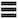

# Skapa en KPI-rapport på en Canvas Dashboard

>[!IMPORTANT]
>
>Funktionen Canvas Dashboards är för närvarande bara tillgänglig för användare som deltar i betatestet. Delar av funktionen kanske inte är fullständiga eller fungerar som de ska i det här skedet. Skicka feedback om din upplevelse genom att följa instruktionerna i avsnittet [Ge feedback](/help/quicksilver/product-announcements/betas/canvas-dashboards-beta/canvas-dashboards-beta-information.md#provide-feedback) i översiktsartikeln i Canvas Dashboards. 
>&#x200B;>Om du har synpunkter på ett eventuellt fel eller tekniska problem ber vi dig skicka ett supportärende till Workfront Support. Mer information finns i [Kontakta kundsupport](/help/quicksilver/workfront-basics/tips-tricks-and-troubleshooting/contact-customer-support.md). 
>&#x200B;>Observera att betaversionen inte är tillgänglig för följande molnleverantörer:
>
>* Använd din egen nyckel för Amazon Web Services
>* Azure
>* Google Cloud Platform

Du kan skapa och lägga till en KPI-rapport på en Canvas Dashboard som visuellt representerar nyckelresultatindikatordata som ett tal, som du sedan kan använda för att se hur projekt och team fungerar.

## Åtkomstkrav

+++ Expandera om du vill visa åtkomstkraven. 

<table style="table-layout:auto"> 
<col> 
</col> 
<col> 
</col> 
<tbody> 
<tr> 
   <td role="rowheader">
Adobe Workfront
</td> 
   <td> 

Alla 
 
   </td> 
<tr> 
 <tr> 
   <td role="rowheader">
Adobe Workfront-licens
</td> 
   <td> 

Aktuell: Planera 
 

Nytt: Standard
 
   </td> 
   </tr> 
  </tr> 
  <tr> 
   <td role="rowheader">
Konfigurationer på åtkomstnivå
</td> 
   <td>
Redigera åtkomst till rapporter, instrumentpaneler och kalendrar

  </td> 
  </tr>  
</tbody> 
</table>

Mer information om informationen i den här tabellen finns i [Åtkomstkrav i Workfront-dokumentationen](/help/quicksilver/administration-and-setup/add-users/access-levels-and-object-permissions/access-level-requirements-in-documentation.md).
+++

## Förutsättningar

Du måste skapa en kontrollpanel innan du kan skapa en KPI-rapport.

## Skapa en KPI-rapport på en Canvas Dashboard

Det finns många konfigurationsalternativ för att skapa en KPI-rapport. I det här avsnittet går vi igenom den allmänna processen att skapa en.

{{step1-to-dashboards}}

1. Klicka på **Arbetsytans kontrollpaneler** i den vänstra panelen.

1. Klicka på **Ny instrumentpanel** i det övre högra hörnet.

1. I rutan **Skapa instrumentpanel** anger du instrumentpanelens **namn** och **beskrivning**.

1. Klicka på **Skapa**.

1. Välj **Skapa rapport** i rutan **Lägg till rapport**.

1. Välj **KPI** till vänster.

1. Klicka på **Skapa rapport** i det övre högra hörnet.

1. Följ stegen nedan för att konfigurera avsnittet **Information**:

   1. Ange en rapport **Namn**.
   1. Ange en rapport **Beskrivning**.

      >[!NOTE]
      >
      >Beskrivningen används som en beskrivning under KPI-värdet. Om du inte anger någon beskrivning genereras en beskrivning baserat på den aggregator- och aggregeringstyp som du väljer i följande steg.

1. Följ stegen nedan för att konfigurera avsnittet **Build KPI**:

   1. Klicka på ikonen **Skapa KPI**  i den vänstra panelen.

   1. Klicka på **Markera fält** och ange sedan det fält som du vill lägga till i rapporten.

   1. I listrutan **Aggregationstyp** väljer du hur data sammanställs för att skapa KPI-utdata. Alternativen i det här fältet varierar beroende på vilken typ av fält som valdes i föregående steg.

1. Följ stegen nedan för att konfigurera avsnittet **Filter**:

   1. Klicka på ikonen **Filter**  i den vänstra panelen.

   1. Välj **Redigera filter**.

   1. Klicka på **Lägg till villkor** och ange sedan fältet som du vill filtrera efter och modifieraren som definierar vilken typ av villkor som fältet måste uppfylla.

   1. (Valfritt) Klicka på **Lägg till filtergrupp** om du vill lägga till ytterligare en uppsättning filtervillkor. Standardoperatorn mellan uppsättningarna är AND. Klicka på operatorn för att ändra den till ELLER.

      Mer information om filter finns i [Redigera rapportfilter på en arbetsytekontrollpanel](/help/quicksilver/reports-and-dashboards/canvas-dashboards/manage-reports/edit-report-filters.md).

1. Följ stegen nedan för att konfigurera avsnittet **Inställningar för nedåtriktad kolumn**:

   1. I den vänstra panelen klickar du på ikonen **Detaljerade kolumner**  . Fälten i diagrammet visas automatiskt som kolumner i förhandsvisningsavsnittet till höger.

   1. (Valfritt) Om du vill uppdatera någon av de befintliga kolumnkonfigurationerna markerar du den kolumn som du vill uppdatera i avsnittet **Aktuella kolumner** och uppdaterar sedan informationen (t.ex. etikett, länkad status och formateringsregler).

   1. Klicka på **Lägg till kolumn** och markera sedan det fält som du vill visa som en kolumn i tabellen. Upprepa den här processen för varje kolumn som du vill lägga till.

1. Följ stegen nedan för att konfigurera avsnittet **Inställningar för grupper med nedladdning**:

   1. Klicka på ikonen **Gruppinställningar**  i den vänstra panelen.

   1. Klicka på knappen **Lägg till gruppering** och markera sedan det fält som du vill skapa som en gruppering.

1. Klicka på **Spara** för att skapa rapporten och lägga till den på kontrollpanelen.

## Skapa ett KPI-rapportexempel

I det här avsnittet går vi igenom stegen för att skapa en KPI-rapport som visar väntande dokumentgodkännanden.

Mer information om KPI-rapportexempel finns i [Skapa en rapportinstrumentpanel för granskning och godkännande](/help/quicksilver/review-and-approve-work/document-reviews-and-approvals/create-review-and-approval-dashboard.md).

{{step1-to-dashboards}}

1. Klicka på **Arbetsytans kontrollpaneler** i den vänstra panelen.

1. Klicka på **Ny instrumentpanel** i det övre högra hörnet.

1. I rutan **Skapa instrumentpanel** anger du instrumentpanelens **namn** och **beskrivning**.

1. Klicka på **Skapa**.

1. Välj **Skapa rapport** i rutan **Lägg till rapport**.

1. Välj **KPI** till vänster.

1. Klicka på **Skapa rapport** i det övre högra hörnet.

1. Följ stegen nedan för att konfigurera avsnittet **Information**:

   1. Skriv *Väntande* i fältet **Namn**.
   1. Skriv *Väntande godkännanden* i fältet **Beskrivning**. Detta visas som en bildtext under KPI-värdet.

1. Följ stegen nedan för att konfigurera avsnittet **Build KPI**:

   1. Klicka på ikonen **Skapa KPI**  i den vänstra panelen.

   1. Klicka på **Markera fält**.

   1. Leta reda på och välj mappen **Dokumentgodkännande**.

   1. Välj **Status**.

   1. Välj **Antal** i listrutan **Aggregationstyp**.

1. Följ stegen nedan för att konfigurera avsnittet **Filter**:

   1. Klicka på ikonen **Filter**  i den vänstra panelen.

   1. Välj **Redigera filter**.

   1. Klicka på **Lägg till villkor**.

   1. Klicka på det tomma villkorsfiltret, klicka på **Välj ett fält** och välj sedan **Status**.
   1. Låt operatorn vara **lika med** och skriv sedan _väntande granskning_ i textrutan.
      
1. Klicka på **Spara** i skärmens övre högra hörn.

## Att tänka på när du skapar en KPI-rapport

### Använda fältväljaren

Listrutan **Avsnitt** i avsnittet **Build KPI** är utformad för att begränsa valen i en fältväljare så att ett objekt blir lättare att hitta när en tabellrapport skapas. Börja med att välja ett basenhetsobjekt.

* **Alla avsnitt**: Alla objekttyper i Workfront Workflow och Workfront Planning.
* **Workfront-objekt**: Inbyggda Workfront Workflow-objekt.
* **Planering av posttyper**: Anpassade posttyper har definierats i Workfront Planning.

När basentitetsobjektet har valts uppdateras listrutan **Avsnitt** med tillämpliga fälttypsalternativ att välja bland.

* **Alla avsnitt**: Inbyggda fält, anpassade fält och relaterade objekt.
* **Alla fält**: Både interna och anpassade fält (exkluderar relationer).
* **Anpassade fält**: Kunddefinierade fält antingen i ett anpassat formulär eller i en planeringspost.
* **Workfront-fält**: Endast inbyggda fält.
* **Relationer**: Anslutna poster.

### Referera underordnade objekt

Tillgängliga relationer för ytterligare kolumner, filteralternativ och grupperingsattribut är i allmänhet begränsade till objekt som är högre upp i Workfront objekthierarki eller har på annat sätt en markering på rapportens basenhetsobjekt. Det finns några undantag i detta, bland annat följande:

* Projekt > Åtgärder
* Dokumentgodkännande > Dokumentgodkännandesteg
* Dokumentgodkännandesteg > Deltagare i dokumentgodkännandefasen

När du använder någon av de överordnade-till-underordnade-relationer som anges ovan visas en rad i tabellen för varje underordnad post som är kopplad till det överordnade objektet.

