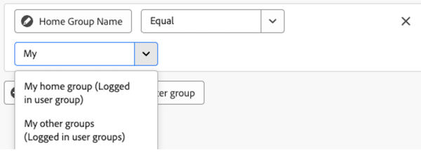

# Redigera rapportfilter på en arbetsytans kontrollpanel

>[!IMPORTANT]
>
>Funktionen Canvas Dashboards är för närvarande bara tillgänglig för användare som deltar i betatestet. Delar av funktionen kanske inte är fullständiga eller fungerar som de ska i det här skedet. Skicka feedback om din upplevelse genom att följa instruktionerna i avsnittet [Ge feedback](/help/quicksilver/product-announcements/betas/canvas-dashboards-beta/canvas-dashboards-beta-information.md#provide-feedback) i översiktsartikeln i Canvas Dashboards. 
>&#x200B;>Observera att betaversionen inte är tillgänglig för följande molnleverantörer:
>
>* Använd din egen nyckel för Amazon Web Services
>* Azure
>* Google Cloud Platform

Du kan redigera rapportfilter när du har använt dem på en Canvas Dashboard för att uppdatera de data som visas när ett projekt fortskrider.

## Åtkomstkrav

+++ Expandera om du vill visa åtkomstkraven. 

<table style="table-layout:auto"> 
<col> 
</col> 
<col> 
</col> 
<tbody> 
<tr> 
   <td role="rowheader">
Adobe Workfront
</td> 
   <td> 

Alla 
 
   </td> 
<tr> 
 <tr> 
   <td role="rowheader">
Adobe Workfront-licens
</td> 
   <td> 

Aktuell: Planera 
 

Nytt: Standard
 
   </td> 
   </tr> 
  </tr> 
  <tr> 
   <td role="rowheader">
Konfigurationer på åtkomstnivå
</td> 
   <td>
Redigera åtkomst till rapporter, instrumentpaneler och kalendrar

  </td> 
  </tr>  
        <tr> 
   <td role="rowheader">
Objektbehörigheter
</td> 
   <td>
Hantera behörigheter för kontrollpanelen

  </td> 
  </tr>
</tbody> 
</table>

Mer information om informationen i den här tabellen finns i [Åtkomstkrav i Workfront-dokumentationen](/help/quicksilver/administration-and-setup/add-users/access-levels-and-object-permissions/access-level-requirements-in-documentation.md).
+++

## Förutsättningar

Du måste lägga till ett filter i en rapport innan den kan redigeras.

## Redigera ett rapportfilter

>[!NOTE]
>
>Det finns många tillgängliga konfigurationsverktyg för att skapa och redigera ett rapportfilter. Mer information om de här verktygen finns i följande avsnitt i den här artikeln: [Att tänka på när du redigerar ett rapportfilter](#considerations-when-editing-a-report-filter).

{{step1-to-dashboards}}

1. Klicka på **Arbetsytans kontrollpaneler** i den vänstra panelen.

1. På sidan **Kontrollpaneler på arbetsytan** klickar du på ikonen **Mer**  i det övre högra hörnet av rapporten som innehåller det filter som du vill redigera och väljer sedan **Redigera** .

   

1. Till vänster i dialogrutan **Konfigurera** väljer du panelen **Filter**.

1. Klicka på **Redigera filter**.

1. Markera det fält eller den modifierare som du vill redigera och justera sedan de aktuella markeringarna efter behov.

   

1. (Valfritt) Klicka på **Lägg till filtergrupp** om du vill lägga till ytterligare en uppsättning filtervillkor. Standardoperatorn mellan uppsättningarna är AND. Klicka på operatorn för att ändra den till ELLER.

1. Klicka på **Spara**.

## Att tänka på när du redigerar ett rapportfilter

### Datumbaserade jokertecken, filtervariabler

Alternativen för datumbaserade jokertecken kan användas i kombination med alla datumfilterattribut. Mer information om hur du lägger till ett datumbaserat jokertecken i en rapport finns i artikeln [Använd datumbaserade jokertecken för att generera rapporter](../../../reports-and-dashboards/reports/reporting-elements/use-date-based-wildcards-generalize-reports.md).

>[!NOTE]
>
>Om du skapar en datum- och tidsberäkning som inte innehåller någon tidsdel, eller som använder datumjokertecknen $$TODAY eller $$NOW, används datumet enligt UTC-zonen (Coordinated Universal Time), inte enligt din lokala tidszon. Detta kan orsaka ett oväntat datumresultat.

Du kan välja mellan följande datumbaserade jokertecken:

<table style="table-layout:auto"> 
 <col> 
 <col> 
 <tbody> 
  <tr valign="top"> 
   <td width="100" role="rowheader"> 
<strong>$$IDAG</strong> 
 </td> 
   <td> 
Vi rekommenderar att du skapar datumkänsliga filter med detta jokertecken så att du slipper skapa filtret igen i morgon, nästa vecka eller nästa månad.
 
Om du till exempel vill visa alla aktiviteter som förfaller idag kan du använda följande regel i ett aktivitetsfilter: <em>Planerat startdatum mindre än $$TODAY</em>.
 
$$TODAY är alltid lika med midnatt för den aktuella dagen.
 </td> 
  </tr> 
  <tr valign="top"> 
   <td width="100" role="rowheader"> 
<strong>$$NU</strong> 
 </td> 
   <td> 
Detta liknar jokertecknet $$TODAY, men innehåller aktuellt datum och aktuell tid. $$NOW är lika med aktuellt datum och aktuell tid.
 
Om du till exempel vill visa alla timposter som har tillhandahållits fram till den aktuella tiden kan du göra detta genom att använda följande regel i ett timfilter: <em>Planerat startdatum mindre än $$NOW</em>.
 
Obs! Detta jokertecken stöds inte i resursplaneraren.
 </td> 
  </tr> 
 </tbody> 
</table>

Om du vill ange olika tidsperioder och olika tidpunkter (framtida eller tidigare) kan du kombinera jokertecknen ovan med följande:

| Attribut |   |
|---|---|
| **q** | kalenderkvartal |
| **h** | timme |
| **d** | dag |
| **w** | vecka |
| **m** | månad |
| **y** | år |

{style="table-layout:auto"}

| **Kvalificerare** | |
|---|---|
| **b** | början av perioden (utan ett angivet attribut blir veckans början som standard: söndag) |
| **e** | slutet av perioden (utan ett angivet attribut är standardvärdet till slutet av veckan: lördag) |

{style="table-layout:auto"}

| **Operatorer** | |
|---|---|
| **+** | lägg till värde i jokerteckenvärde |
| **-** | subtrahera värde från jokertecken |

{style="table-layout:auto"}

Jokertecknet `$$TODAYb+2w` refererar till exempel till&quot;2 veckor från början av den här veckan&quot;. Jokertecknet *`$$NOW+2h` refererar till&quot;2 timmar från och med nu&quot;.

### Variabler för jokerteckenfilter för inloggad användare

* När du filtrerar attributet `name` för användaren visas alternativet **Jag (inloggad användare)**.

  

* När du filtrerar ett gruppattribut `name` visas alternativen **Min hemgrupp (inloggad användargrupp)** och **Mina andra grupper (inloggad användargrupp)** som du kan använda i ett filtervillkor.

  

* När du filtrerar ett team-attribut `name` visas alternativen **Mitt standardteam (inloggat användarteam)** och **Mina andra team (inloggade användarteam)** som du kan välja mellan i filtervillkoren.

  

### Referera underordnade objekt

Tillgängliga relationer för ytterligare kolumner, filteralternativ och grupperingsattribut är i allmänhet begränsade till objekt som är högre upp i Workfront objekthierarki eller har på annat sätt en markering på rapportens basenhetsobjekt. Det finns några undantag i detta, bland annat följande:

* Projekt > Åtgärder
* Dokumentgodkännande > Dokumentgodkännandesteg
* Dokumentgodkännandesteg > Deltagare i dokumentgodkännandefasen

När du använder någon av de överordnade-till-underordnade-relationer som anges ovan visas en rad i tabellen för varje underordnad post som är kopplad till det överordnade objektet.

### Fältoperatorer per fälttyp

+++ Expandera om du vill visa en lista med fältoperatorer efter fälttyp. 

<table>
    <tr>
        <td><b>Fälttyp</b></td>
        <td><b>Exempel</b></td>
       <td><b>Operatorer</b></td>
        <td><b>Jokertecken</b></td>
    </tr>
    <tr>
        <td>Objekt/referensnamn</td>
        <td>Alla inbyggda namnattribut eller anpassade sökningar</td>
              <td><ul>
        <li>Jämn</li>
        <li>Inte lika med</li>
        <li>Innehåller</li>
          <li>Innehåller inte</li>
            <li>Är null</li>
              <li>Är inte null</li>
        </ul></td>
        <td>Användare: Namn
        <ul>
        <li>Jag (inloggad användare)</li>
        </ul>
        Grupp: Namn
        <ul>
          <li>Min hemgrupp (inloggad användargrupp)</li>
            <li>Mina andra grupper (inloggade användargrupper)</li>
          </ul>
          Team: Namn
                  <ul>
          <li>Mitt standardteam (inloggat användarteam)</li>
            <li>Mina andra team (inloggade användarteam)</li>
          </ul>
        </td>
    </tr>
    <tr>
        <td>Sträng / Textindata </td>
                <td>Projekt: Beskrivning</td>
                      <td><ul>
             <li>Jämn</li>
        <li>Inte lika med</li>
        <li>Innehåller</li>
          <li>Innehåller inte</li>
            <li>Är null</li>
              <li>Är inte null</li>
        </ul></td>
        <td></td>
    </tr>
    <tr>
        <td>Heltal / Dubbelt</td>
             <td>Projekt: Planerade timmar
         Aktivitet: Procent färdigt</td>
              <td><ul>
        <li>Jämn</li>
        <li>Inte lika med</li>
        <li>Större än</li>
          <li>Större än eller lika med</li>
          <li>Mindre än</li>
          <li>Mindre än eller lika med</li>
            <li>Är null</li>
              <li>Är inte null</li>
        </ul></td>
        <td></td>
    </tr>
       <tr>
        <td> Datum/Datum/tid </td>
                    <td>Projekt: Planerat startdatum
         Timme: Ingångsdatum</td>
              <td><ul>
        <li>Jämn</li>
        <li>Inte lika med</li>
        </ul></td>
        <td>Genom att växla med alternativet <b>Ange relativt datum</b> kan du använda jokertecken för relativa datum för att göra rapporten mer dynamisk och göra den självjusterad baserat på vanliga datumperioder. 
         <ul><li>$$IDAG</li>
         <li>$$NU</li>
         </ul>
        </td>
    </tr>
       <tr>
        <td>Boolean </td>
                  <td>Projekt: Har dokument
         Aktivitet: Är kritisk
          Användare: Är aktiv</td>
        <td><ul>
        <li>Jämn</li>
        <li>Inte lika med</li>
        </ul></td>
        <td> </td>
    </tr>
   </table>

+++
