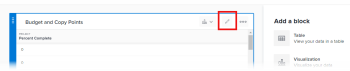

# Lägga till eller redigera ett tabellblock i rapportarbetsytan

En tabell visar fältinformation i kolumner som kan filtreras, grupperas och sorteras.

## Förutsättningar

Innan du börjar måste du registrera dig för betaversionen av Reporting Canvas. Mer information finns i [Betaversion av arbetsyta för rapportering: översikt](/help/quicksilver/product-announcements/betas/canvas-dashboards-beta/reporting-canvas-beta-overview.md).

## Lägga till eller redigera ett tabellblock

1. Klicka på ikonen **Huvudmeny**  i det övre högra hörnet av Adobe Workfront och klicka sedan på **Rapportering**.
1. Klicka på **Ny rapport**.

   eller

   Gå till en befintlig rapport, klicka på ikonen **Mer**  i rapportrubriken och klicka sedan på **Redigera**.

1. Till höger på skärmen under **Lägg till ett block**, antingen:

   Dra ikonen **Tabell**  till arbetsytan direkt till önskad plats.

   eller

   Dubbelklicka på ikonen **Tabell**  för att lägga till en tabell högst upp på arbetsytan.

   >[!TIP]
   >
   >Du kan ändra storleken på blocket efter att det har placerats genom att dra i hörnhandtagen.

1. Klicka på **Namnlös tabell** i tabellrubriken och skriv en rubrik för tabellen.

   

1. Klicka på **Redigera** i mitten av tabellblocket för att konfigurera tabellen.

   >[!NOTE]
   >
   >Om tabellen redan var en del av arbetsytan (till exempel när du redigerar en befintlig rapport) visas inte knappen **Redigera** i mitten av blocket. Om du vill redigera tabellen klickar du i stället på ikonen **Redigera**  i tabellhuvudet.
   >

1. I panelen **Fält** till höger letar du reda på ett fält som du vill lägga till som en kolumn i tabellen och drar det sedan till tabellen där du vill ha det, eller dubbelklickar på det för att lägga till det som den sista kolumnen i tabellen.

   Du kan skriva text i rutan **Sök** för att hitta ett specifikt fält efter namn. Du kan också använda de två listrutemenyerna under den här rutan för att begränsa listan med visade fält till ett eller båda av följande:

   * Objekttypen som är associerad med fältet som du vill använda, till exempel Projekt eller Aktivitet
   * Den fälttyp du vill använda, till exempel Datum eller Valuta

   Upprepa det här steget för varje fält som du vill lägga till som en kolumn.

   >[!TIP]
   >
   >Du kan ändra kolumnordningen i en tabell genom att dra en markerad kolumn till en ny plats.

1. Gör något av följande för att konfigurera tabellen ytterligare:

   * **Lägg till ett formelfält**: Klicka på **Nytt +** överst i listan **Fält**. Mer information om hur du skapar ett formelfält finns i [Skapa ett formelfält i Rapporteringsarbetsyta](../../../reports-and-dashboards/reporting-canvas/table-blocks/create-formula-field.md).
   * **Lägg till ett filter**: Dra fältet som du vill att tabellen ska filtreras av till avsnittet **Filter** ovanför tabellen. Mer information om hur du ställer in filterregler finns i [Filtrera en tabell i Rapporteringsarbetsyta](../../../reports-and-dashboards/reporting-canvas/table-blocks/configure-filter-rules-for-table.md).
   * **Gruppera rader efter specifika attribut**: Dra fältet som du vill att tabellen ska grupperas efter till avsnittet **Grupp** ovanför tabellen. Mer information om hur du skapar radgrupper finns i [Gruppera tabellrader i rapportarbetsytan](../../../reports-and-dashboards/reporting-canvas/table-blocks/group-rows-in-table.md).
