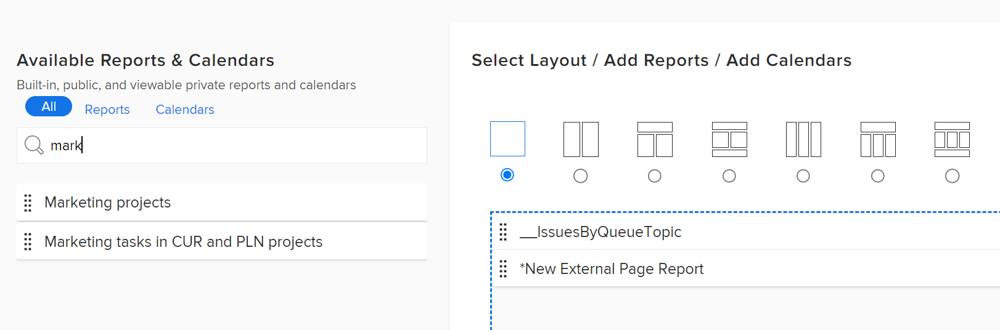

# Skapa en instrumentpanel

Du kan skapa kontrollpaneler för att snabbt komma åt information i rapporter, kalendrar och externa sidor.

Mer information om kontrollpaneler finns i [Kom igång med instrumentpaneler](../../../reports-and-dashboards/dashboards/understanding-dashboards/get-started-dashboards.md).

## Åtkomstkrav

Du måste ha följande:

<table style="table-layout:auto">
 <col> 
 </col> 
 <col> 
 </col> 
 <tbody> 
  <tr> 
   <td> 
<strong>Adobe Workfront-plan*</strong>
 </td> 
   <td>Alla</td> 
  </tr> 
  <tr> 
   <td> 
<strong>Adobe Workfront-licens*</strong>
 </td> 
   <td> 
Plan 
 </td> 
  </tr> 
  <tr> 
   <td><strong>Konfigurationer på åtkomstnivå*</strong> </td> 
   <td> 
Redigera åtkomst till rapporter, instrumentpaneler och kalendrar
 
Obs! Om du fortfarande inte har åtkomst frågar du Workfront-administratören om de anger ytterligare begränsningar för din åtkomstnivå. Information om hur en Workfront-administratör kan ändra åtkomstnivån finns i <a href="../../../administration-and-setup/add-users/configure-and-grant-access/create-modify-access-levels.md" class="MCXref xref">Skapa eller ändra anpassade åtkomstnivåer</a>.
 </td> 
  </tr> 
  <tr> 
   <td> 
<strong>Objektbehörigheter</strong> 
 </td> 
   <td> 
Du får behörigheten Hantera till den nya instrumentpanelen
 
Mer information om hur du begär ytterligare åtkomst finns i <a href="../../../workfront-basics/grant-and-request-access-to-objects/request-access.md" class="MCXref xref">Begär åtkomst till objekt </a>. Mer information om behörigheter för kontrollpaneler finns i <a href="../../../workfront-basics/grant-and-request-access-to-objects/permissions-reports-dashboards-calendars.md" class="MCXref xref">Dela rapporter, kontrollpaneler och kalendrar </a>.
 </td> 
  </tr> 
 </tbody> 
</table>

&#42;Kontakta Workfront-administratören om du vill veta vilken plan, licenstyp eller åtkomst du har.

## Förutsättningar

Du måste skapa något av följande objekt innan du kan lägga till dem på en kontrollpanel:

* **Rapporter**: Information om hur du skapar rapporter finns i [Skapa en anpassad rapport](../../../reports-and-dashboards/reports/creating-and-managing-reports/create-custom-report.md).

* **Kalendrar**: Mer information om hur du skapar kalendrar finns i [Översikt över kalenderrapporter](../../../reports-and-dashboards/reports/calendars/calendar-reports-overview.md).

* **Externa sidor**: Mer information om hur du skapar externa sidor finns i [Bädda in en extern webbsida i en instrumentpanel](../../../reports-and-dashboards/dashboards/creating-and-managing-dashboards/embed-external-web-page-dashboard.md).

## Skapa en instrumentpanel

1. Klicka på ikonen Huvudmeny och sedan klicka **Instrumentpaneler.**
1. Klicka **Ny instrumentpanel**.\
   Dialogrutan Ny instrumentpanel visas.

1. Ange följande:

   <table style="table-layout:auto">
    <col>
    <col>
    <tbody>
     <tr>
      <td role="rowheader"><strong>Namn</strong></td>
      <td>
Det här är namnet på instrumentpanelen.

Om du inte anger något namn blir namnet på den första rapporten på kontrollpanelen som standard kontrollpanelens namn.
</td>
     </tr>
     <tr>
      <td role="rowheader"><strong>Beskrivning (valfritt)</strong></td>
      <td>Det här är en beskrivning av instrumentpanelen.</td>
     </tr>
    </tbody>
   </table>

1. Välj en layout genom att klicka på alternativknappen för den.

   Layouten med en kolumn är standard.

   Mer information om rapportlayout på kontrollpaneler finns i [Förstå hur rapporter visas på en kontrollpanel](../../../reports-and-dashboards/dashboards/understanding-dashboards/understand-how-reports-display-dashboard.md).

   <!--
   <MadCap:conditionalText data-mc-conditions="QuicksilverOrClassic.Draft mode">
   (NOTE: Consider adding the information from this article here, at some point, instead of linking to it.)
   </MadCap:conditionalText>
   -->

1. Lägg till befintliga rapporter, kalendrar eller externa sidor genom att söka efter dem i **Sök efter namn eller typ..** och sedan dra dem till layoutfönstret när de visas i listan.

   >[!NOTE]
   >
   >När du söker efter ett objekt returnerar sökningen någon av de 2 000 senast skapade rapporterna. Rapportnamn som innehåller Unicode-tecken returneras inte i sökresultaten. Det är en god vana att undvika att ta med Unicode-tecken när du namnger objekt i Workfront genom att skriva namn i stället för att kopiera och klistra in namn från en annan källa.

   

1. (Valfritt) Klicka på **Lägg till extern sida** om du vill lägga till en extern sida på kontrollpanelen.\
   Mer information om hur du skapar externa sidor och bäddar in dem i kontrollpaneler finns i [Bädda in en extern webbsida i en instrumentpanel](../../../reports-and-dashboards/dashboards/creating-and-managing-dashboards/embed-external-web-page-dashboard.md).

1. Klicka **Spara + Stäng**.\
   En tidsstämpel visas i det övre högra hörnet av instrumentpanelen. Tidsstämpeln innehåller datum, tid och tidszon när instrumentpanelen senast uppdaterades.
