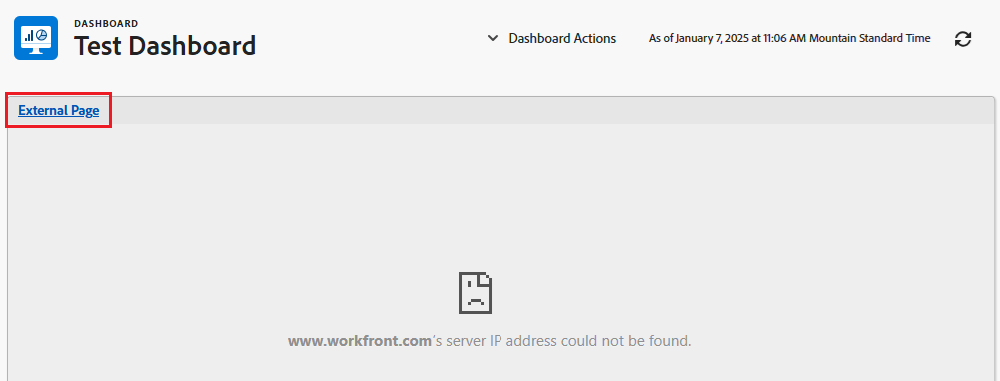
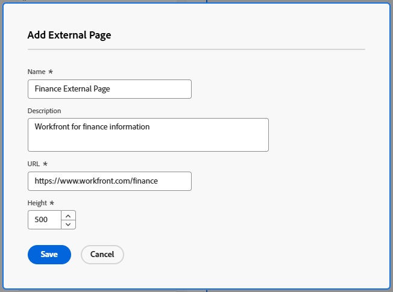
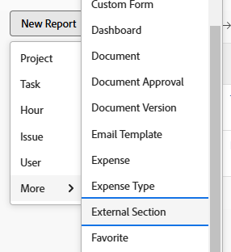

# Bädda in en extern webbsida i en instrumentpanel

<!--Audited: 01/2025-->

Du kan bädda in en extern webbsida i en instrumentpanel för att ge åtkomst till relaterad information från andra system eller från Adobe Workfront.

Om din organisation till exempel har en webbaserad dokumentdatabas, wiki eller något annat innehållshanteringssystem som innehåller projektinformation som du regelbundet får åtkomst till via en URL, kan du visa den informationen i Workfront genom att skapa en extern sida på en kontrollpanel.

>[!IMPORTANT]
>
>* Av säkerhetsskäl kan du på vissa webbplatser inte bädda in webbsidor som en iframe. Om den webbsida som du vill bädda in i en instrumentpanel inte tillåter detta visas inte sidan i instrumentpanelen. Du kan dock fortfarande komma åt den externa sidan genom att klicka på instrumentpanelens namn.\
>\
>Om du vill tillåta inbäddning för en webbplats som du äger kan du tillsammans med webbadministratören justera inställningen **X-Frame-Options** . Mer information finns i [X-Frame-Options](https://developer.mozilla.org/en-US/docs/Web/HTTP/Headers/X-Frame-Options).
>
>
>* Instrumentpanelssidor stöds inte längre som inbäddade externa sidor i Dashboards. Befintliga kontrollpaneler ändras inte automatiskt för att ta bort dessa externa sidor, men ändringar av en kontrollpanel som innehåller en sådan referens kan inte sparas förrän referensen tas bort eller ändras.
> Följande Workfront.com-underdomäner stöds inte längre:
>
>     * /dashboards &#x200B;
>     * /dashboard/ID-&#x200B;
>     * /portfolio/:ID/content-dashboard__:dashboardID &#x200B;
>     * /program/ID/content-dashboard__:dashboardID &#x200B;
>     * /project/:ID/content-dashboard__:dashboardID &#x200B;
>     * /task/:ID/content-dashboard__:dashboardID &#x200B;
>     * /template/:ID/content-dashboard__:dashboardID &#x200B;
>     * /templateTask/:ID/content-dashboard__:dashboardID &#x200B;
>     * /resourceManagement/:ID/
>     * content-dashboard__:dashboardID &#x200B;
>     * /team/ID/content-dashboard__:dashboardID &#x200B;
>     * /iteration/:ID/content-dashboard__:dashboardID &#x200B;
>     * /requests/:ID/content-dashboard__:dashboardID &#x200B;
>     * /group/:ID/content-dashboard__:dashboardID &#x200B;
>     * /billingrecord/:ID/content-dashboard__:dashboardID
>
>Som en alternativ lösning kan du överväga att ta med en listrapport på instrumentpanelen enligt beskrivningen i [Lägg till en rapport på en instrumentpanel](/help/quicksilver/reports-and-dashboards/dashboards/creating-and-managing-dashboards/add-report-dashboard.md)

## Åtkomstkrav

+++ Expandera om du vill visa åtkomstkrav för funktionerna i den här artikeln.

Du måste ha följande:

<table style="table-layout:auto"> 
 <col> 
 <col> 
 <tbody> 
  <tr> 
   <td role="rowheader"><strong>Adobe Workfront</strong></td> 
   <td> 
Alla
 </td> 
  </tr> 
  <tr> 
   <td role="rowheader"><strong>Adobe Workfront-licens</strong></td> 
   <td> 
      
Nytt:

         <ul>
         <li>
Standard
</li>
         </ul>
      
Aktuell:

         <ul>
         <li>
Plan
</li>
         </ul>
   </td>
  </tr> 
  <tr> 
   <td role="rowheader"><strong>Konfigurationer på åtkomstnivå</strong></td> 
   <td> 
Redigera åtkomst till rapporter, instrumentpaneler och kalendrar
 </td> 
  </tr> 
  <tr> 
   <td role="rowheader"><strong>Objektbehörigheter</strong></td> 
   <td> 
Redigera åtkomst till kontrollpanelen
 </td> 
  </tr> 
 </tbody> 
</table>

Mer information finns i [Åtkomstkrav i Workfront-dokumentationen](/help/quicksilver/administration-and-setup/add-users/access-levels-and-object-permissions/access-level-requirements-in-documentation.md).

+++

## Förutsättningar

Du måste skapa en kontrollpanel innan du kan bädda in en extern sida i den.

Mer information om hur du skapar instrumentpaneler finns i [Skapa en instrumentpanel](../../../reports-and-dashboards/dashboards/creating-and-managing-dashboards/create-dashboard.md).

## Bädda in en extern sida i en kontrollpanel

>[!IMPORTANT]
>
>Du kan ta bort en extern sida från en kontrollpanel om den inte längre behövs. Du kan dock inte ta bort en extern sida efter att den har skapats i Workfront. Du kan bara ta bort en extern sida med API:t. Mer information finns i [Ta bort en extern sida från en instrumentpanel](../../../reports-and-dashboards/dashboards/creating-and-managing-dashboards/remove-external-page-from-dashboard.md).

1. Leta reda på webbadressen till den sida som ska visas i Workfront och kopiera webbadressen som finns i adressfältet.

   >[!NOTE]
   >
   >Om du delar URL:er till Workfront-objekt bör du komma ihåg att vissa URL:er upphör att gälla över tid. Dokument-URL:er förfaller till exempel efter att de har öppnats. Detta är konfigurerat som en säkerhetsåtgärd, och enligt design betraktas de som icke-statiska URL:er och bör inte delas.

{{step1-to-dashboards}}

1. Om du vill redigera en befintlig instrumentpanel väljer du den instrumentpanel som du vill bädda in webbplatssidan i och klickar sedan på **Instrumentpanelsåtgärder** och sedan på **Redigera**
eller\
   Om du vill skapa en ny instrumentpanel klickar du på **Ny instrumentpanel**.\
   Mer information om hur du skapar en kontrollpanel finns i [Skapa en kontrollpanel](../../../reports-and-dashboards/dashboards/creating-and-managing-dashboards/create-dashboard.md).

1. Klicka på **Lägg till extern sida** under området **Välj layout/Lägg till rapporter/Lägg till kalendrar**.

   

   Rutan **Lägg till extern sida** visas.

1. Ange följande information om den externa sidan:

   * **Namn**: Lägg till ett namn för instrumentpanelen.
   * **Beskrivning**: Lägg till mer information om instrumentpanelen för att identifiera den information den innehåller. Beskrivningen visas på kontrollpanelen för alla som har tillgång till den när du har sparat den.
   * **URL**: Klistra in den URL som du kopierade tidigare i det här fältet.

     Du kan ange följande typer av URL-adresser:

      * En https (krypterad) URL till en webbsida.\
        Endast https-sidor (krypterade) läses in med URL-adressen.\
        

      * En mall-URL som innehåller sessionsinformation för en specifik webbplats.\
        Till exempel: *https://localhost/?session={!$$SESSION}*
Du måste vara inloggad på den angivna webbplatsen för att kunna visa den externa sidan.\
        Mer information om hur du hämtar ett SessionID från Workfront finns i [API-grunder](../../../wf-api/general/api-basics.md).\
        Din Workfront-administratör kan konfigurera dina systeminställningar på ett sätt som av säkerhetsskäl inte tillåter användning av sessionsinformation på externa sidor. I det här fallet läses den externa sidan inte in på instrumentpanelen.\
        Mer information om systemsäkerhetsinställningar finns i [Konfigurera systemsäkerhetsinställningar](../../../administration-and-setup/manage-workfront/security/configure-security-preferences.md).\
        

     >[!WARNING]
     >
     >Användning av SessionID är osäkert och rekommenderas inte.
     >

   * **Höjd**: Ange ett tal som är större än 0 för att definiera det utrymme som den externa sidan upptar på instrumentpanelen. Standardhöjden är 500.

1. Klicka på **Spara**.

   Sidan läggs automatiskt till på kontrollpanelen.

   Om du skapar ytterligare instrumentpaneler kan du hitta den här externa sidan och lägga till den i andra instrumentpaneler. Du kan hitta alla befintliga externa sidor i listan Tillgängliga rapporter och kalendrar när du skapar eller redigerar en kontrollpanel.

   <!--
    *** This is linked to: Creating Dashboards, and Editing Dashboards.
   -->

## Uppdatera en extern sida på en kontrollpanel

Så här uppdaterar du informationen för en extern sida som används i en kontrollpanel:

{{step1-to-dashboards}}

1. Klicka på namnet på den instrumentpanel som du vill uppdatera för att öppna den, och klicka på **Instrumentpanelsåtgärder** och sedan på **Redigera**.

   Rutan **Information om instrumentpanelen** öppnas.

1. I området **Välj layout/Lägg till rapporter** i rutan **Information om kontrollpanelen** letar du reda på den externa sida som du vill uppdatera, håller pekaren över den och klickar på ikonen **Redigera** .\
   

1. Uppdatera fälten som du vill ändra i rutan **Redigera extern sida** och klicka sedan på **Spara**.
1. (Valfritt) Klicka på ikonen **Ta bort**  om du vill ta bort den externa sidan från instrumentpanelen. Mer information finns i [Ta bort en extern sida från en instrumentpanel](../../../reports-and-dashboards/dashboards/creating-and-managing-dashboards/remove-external-page-from-dashboard.md).
1. Klicka på **Spara + Stäng**.

## Visa externa sidor i en rapport

Du kan visa alla externa sidor i Workfront i en extern sidrapport.

{{step1-to-reports}}

1. Klicka på **Ny rapport** > välj **Externt avsnitt**.

   

1. (Valfritt) Uppdatera rapportens flikar Visa, Filter eller Grupperingar.

   Mer information finns i [Skapa en anpassad rapport](../../../reports-and-dashboards/reports/creating-and-managing-reports/create-custom-report.md).

1. Klicka på **Spara + Stäng**.

   I den nya rapporten kan du visa namnet och URL:en som är kopplade till externa sidor i systemet.

