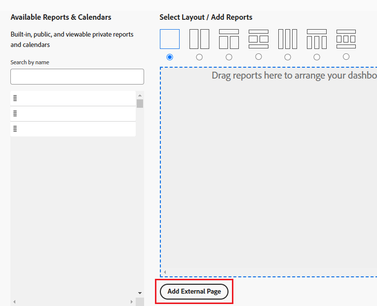

# Bädda in en begärandekö i en kontrollpanel

Du kan bädda in en ny begärandekö i en instrumentpanel för att ge dina användare direktåtkomst till begärandekön, utan att behöva gå till området Begäranden. 

Om du till exempel har en begärandekö som är öppen för hela organisationen, som en helpdesk-kö eller en PTO-begärandekö som alla måste ha tillgång till regelbundet, kan det vara praktiskt att infoga begärandekön direkt i någon av deras instrumentpaneler för snabb och enkel åtkomst. Du konfigurerar detta på ungefär samma sätt som när du skapar en extern sida på en kontrollpanel.

Först måste du hämta en URL till begärandekön. För det andra kan du bädda in URL-adressen i en kontrollpanel genom att lägga till en extern sida.

## Åtkomstkrav

Du måste ha följande åtkomst för att kunna utföra stegen i den här artikeln:

<table style="table-layout:auto"> 
 <col> 
 <col> 
 <tbody> 
  <tr> 
   <td role="rowheader"><strong>Adobe Workfront-plan*</strong></td> 
   <td> 
Alla
 </td> 
  </tr> 
  <tr> 
   <td role="rowheader"><strong>Adobe Workfront-licens*</strong></td> 
   <td> 
Plan 
 </td> 
  </tr> 
  <tr> 
   <td role="rowheader"><strong>Konfigurationer på åtkomstnivå*</strong></td> 
   <td> 
Redigera åtkomst till rapporter, instrumentpaneler och kalendrar
 
Obs! Om du fortfarande inte har åtkomst frågar du Workfront-administratören om de anger ytterligare begränsningar för din åtkomstnivå. Mer information om hur en Workfront-administratör kan ändra åtkomstnivån finns i <a href="../../../administration-and-setup/add-users/configure-and-grant-access/create-modify-access-levels.md" class="MCXref xref">Skapa eller ändra anpassade åtkomstnivåer</a>.
 </td> 
  </tr> 
  <tr> 
   <td role="rowheader"><strong>Objektbehörigheter</strong></td> 
   <td> 
Hantera behörigheter på kontrollpanelen
 
Mer information om hur du begär ytterligare åtkomst finns i <a href="../../../workfront-basics/grant-and-request-access-to-objects/request-access.md" class="MCXref xref">Begär åtkomst till objekt </a>.
 </td> 
  </tr> 
 </tbody> 
</table>

&#42;Kontakta Workfront-administratören om du vill veta vilken plan, licenstyp eller åtkomst du har.

## Förutsättningar

Båda följande måste skapas innan du kan bädda in en begärandekö i en kontrollpanel:

* **Kontrollpanelen**: Mer information om hur du skapar instrumentpaneler finns i [Skapa en instrumentpanel](../../../reports-and-dashboards/dashboards/creating-and-managing-dashboards/create-dashboard.md).
* **Begärandekön**: Mer information om hur du skapar begärandeköer finns i [Skapa en begärandekö](../../../manage-work/requests/create-and-manage-request-queues/create-request-queue.md)

## Hämta URL:en för begärandekön {#obtain-the-url-of-the-request-queue}

Du kan hämta URL:en för en begärandekö på flera sätt, beroende på vilken del av begärandekön som du vill visa för användarna när de öppnar den från en kontrollpanel.

* [Hämta en länk till ett specifikt köämne med möjlighet att ändra begärandetypen](#obtain-a-link-to-a-specific-queue-topic-with-ability-to-change-the-request-type)
* [Hämta en länk till en begärandekö och möjlighet att ändra begärandetypen](#obtain-a-link-to-a-request-queue-and-ability-to-change-the-request-type)
* [Hämta en länk till en begärandekö utan möjlighet att ändra begärandetypen](#obtain-a-link-to-a-request-queue-with-no-ability-to-change-the-request-type)

### Hämta en länk till ett specifikt köämne med möjlighet att ändra begärandetypen {#obtain-a-link-to-a-specific-queue-topic-with-ability-to-change-the-request-type}

När du delar en länk till ett visst ämne i kön med andra användare, öppnas förfrågningsformuläret i just det kötema som de behöver för att skicka begäran. Detta är praktiskt när användarna kanske inte vet vilket ämne de ska välja i kön när de loggar begäranden för en viss begärandekö.

Användarna kan ändra typ av begäran eller välja ett annat ämne om de behöver det. Navigeringen i området Begäranden visas också.

1. Klicka på **Huvudmenyn** > **Förfrågningar** > **Ny begäran**.
1. Om du vill dela en viss kö fortsätter du välja ämnesgrupper och köämnen tills du når kön som du vill dela på instrumentpanelen. Mer information om hur du skickar begäranden finns i [Skapa och skicka Adobe Workfront-begäranden](../../../manage-work/requests/create-requests/create-submit-requests.md).

   >[!TIP]
   >
   >Det är valfritt att välja ämnesgrupper och köämnen.

1. Klicka på **Dela bana** i det övre högra hörnet av området Ny begäran.

   Då kopieras länken till begärandekön eller köämnet när du visar den på skärmen. Användare kan uppdatera frågetypen eller någon av de ämnesgrupper och köämnen som är tillgängliga.

   

### Hämta en länk till en begärandekö och möjlighet att ändra begärandetypen {#obtain-a-link-to-a-request-queue-and-ability-to-change-the-request-type}

När du delar en länk till en frågetyp väljs begärandetypen för användaren. Detta är praktiskt när användare behöver välja mellan flera ämnesgrupper eller köämnen för samma typ av begäran. Användarna kan ändra typen av begäran och välja en annan. Navigeringen i området Begäranden visas också.

1. Gå till ett projekt som har angetts som en begärandekö.

   Mer information om hur du skapar en begärandekö från ett projekt finns i [Skapa en begärandekö](../../../manage-work/requests/create-and-manage-request-queues/create-request-queue.md).

1. Gå till **Köinformation**.
1. Kopiera koden som du hittar i fältet **Direct Access URL**.

   Koden ska se ut ungefär så här:

   `https://<yourdomain>.my.workfront.com/requests/new?activeTab=tab-new-helpRequest&projectID=50062d6f000849c95ab3513c0e84a51e&path=`

   Det här är länken till begärandekön som är associerad med det valda projektet. Begärantypen är förvald.

   Användarna kan välja vilken ämnesgrupp eller kö de vill ha eller välja en annan typ av begäran.

   

### Hämta en länk till en begärandekö utan möjlighet att ändra begärandetypen {#obtain-a-link-to-a-request-queue-with-no-ability-to-change-the-request-type}

När du delar en länk till en förvald frågetyp väljs begärandetypen för användaren och kan inte ändras (den är nedtonad). Användarna kan välja vilka ämnesgrupper eller köämnen de behöver. Detta är praktiskt när du inte vill att användarna ska kunna visa och välja andra typer av förfrågningar. Navigeringen för området Begäranden visas inte.

1. Gå till ett projekt som har angetts som en begärandekö.

   Mer information om hur du skapar en begärandekö från ett projekt finns i [Skapa en begärandekö](../../../manage-work/requests/create-and-manage-request-queues/create-request-queue.md).

1. Gå till **Köinformation**.
1. Kopiera koden som du hittar i fältet **Inbäddad kod**.

   Koden ska se ut ungefär så här:

   `<iframe src="https://<yourdomain>my.workfront.com/requests/newRequestEmbedded?projectID=612518c7000404462d3bc9a0bc09fa71" frameborder="0" width="500" height="600"></iframe>`

1. Redigera koden så att endast informationen nedan bevaras:

   `https://<yourdomain>.my.workfront.com/requests/newRequestEmbedded?projectID=612518c7000404462d3bc9a0bc09fa71`

   >[!TIP]
   >
   >Du kan lägga till en `<samp>iframe </samp>`-tagg när du bäddar in koden i ett annat program än Workfront.

   Det här är länken till begärandekön som är associerad med det valda projektet. Begärantypen är förmarkerad och kan inte ändras.

   Användarna kan välja vilken ämnesgrupp eller vilket ämne i kön de vill för den valda begärandetypen. Användare kan inte välja en annan typ av begäran.

   

## Bädda in en begärandekö i en kontrollpanel

Du kan bädda in en länk till begärandekön eller till ett köämne som kapslats under en begärandekö i en kontrollpanel för att ge användarna direkt åtkomst till inskrivna begäranden.

1. Hämta en URL för begärandekön med någon av metoderna som beskrivs i avsnittet [Hämta URL:en för begärandekön](#obtain-the-url-of-the-request-queue) i den här artikeln.
1. Klicka på **Huvudmenyn** > **Kontrollpaneler** > **Ny kontrollpanel**.
1. Ange ett **namn** för instrumentpanelen. Detta är ett obligatoriskt fält.
1. Klicka på **Lägg till extern sida**.

   

1. Redigera följande fält i rutan **Lägg till extern sida**:

   * **Namn**: Ange namnet på begärandekön så som du vill att den ska visas på instrumentpanelen. Detta är ett obligatoriskt fält.

   * **Beskrivning**: Ange en beskrivning av att den här externa sidan visas. Detta är inte ett obligatoriskt fält och det är endast viktigt för rapportering. Den visas inte på kontrollpanelen.
   * **URL**: klistra in den URL som du fick med någon av metoderna som beskrivs i steg 1.

     <!--   
     <MadCap:conditionalText data-mc-conditions="QuicksilverOrClassic.Draft mode">   
     <MadCap:conditionalText data-mc-conditions="">   
     (NOTE: ensure this stays accurate)   
     </MadCap:conditionalText>   
     </MadCap:conditionalText>   
     -->

   * **Höjd**: Ange den externa sidans höjd. Detta anger hur mycket utrymme den externa sidan som innehåller begärandekön upptar på instrumentpanelen. Detta är ett obligatoriskt fält och standardvärdet är 500.

1. Klicka på **Spara**.
1. Klicka på **Spara + Stäng**. 

   Begärandekön visas som en separat kontrollpanelskomponent på kontrollpanelen.

   

1. (Valfritt) Klicka på **Instrumentpanelsåtgärder** och **Redigera** om du vill lägga till rapporter, kalendrar eller ytterligare externa sidor på samma instrumentpanel.\
   Mer information om hur du lägger till komponenter på en kontrollpanel finns i [Skapa en kontrollpanel](../../../reports-and-dashboards/dashboards/creating-and-managing-dashboards/create-dashboard.md).

 

 

<!--

(NOTE: drafted - old information)

-->

<!--
<ol data-mc-conditions="QuicksilverOrClassic.Draft mode">
<li value="1"> 
Click the <strong>Main Menu</strong> > Requests >&nbsp;<strong>New Request</strong>. 
 </li>
<li class="preview" value="2" data-mc-conditions="QuicksilverOrClassic.Quicksilver"> 
Continue entering the request.&nbsp;For information about submitting requests, see <a href="../../../manage-work/requests/create-requests/create-submit-requests.md" class="MCXref xref">Create and submit Adobe Workfront requests</a>. 
 </li>
<li value="3"> 
Select the <strong>Request Type</strong> for the queue you would like added to the dashboard.
 </li>
<li value="4"> 
(Optional) Select a Queue Topic and a Topic Group. Depending on how the project manager set up the request queue, the names of these fields are different in each Workfront instance.
 </li>
<li class="preview" value="5" data-mc-conditions="QuicksilverOrClassic.Quicksilver"> 
Click <strong>Share path</strong> to obtain a shared link from the request queue you want to embed on a dashboard.
 
For information about sharing a request queue, see <a href="../../../manage-work/requests/create-requests/share-link-to-request-queue.md" class="MCXref xref">Share a link to a request queue</a>
 </li>
<li value="6"> 
For example, enter a URL similar to one of the following: 
 </li>
</ol>
-->
