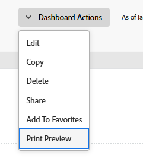

# Exportera en kontrollpanel

<!-- Audited: 1/2025 -->

Du kan exportera en kontrollpanel till en PDF-fil med de utskriftsalternativ som är tillgängliga i webbläsaren.

>[!NOTE]
>
>När du skriver ut innehåll från en webbsida kan formateringen av innehållet påverkas.\
>Sidhuvudet i en rapport i en kontrollpanel kan till exempel tas bort från raderna i en rapportlista.

## Åtkomstkrav

+++ Expandera om du vill visa åtkomstkrav för funktionerna i den här artikeln.

Du måste ha följande:

<table style="table-layout:auto"> 
 <col> 
 <col> 
 <tbody> 
  <tr> 
   <td role="rowheader"><strong>Adobe Workfront</strong></td> 
   <td> 
Alla
 </td> 
  </tr> 
  <tr> 
   <td role="rowheader"><strong>Adobe Workfront-licens</strong></td> 
    <td> 
      
Nytt:

         <ul>
         <li>
Standard
</li>
         </ul>
      
Aktuell:

         <ul>
         <li>
Arbeta eller högre
</li>
         </ul>
   </td>
  </tr> 
  <tr> 
   <td role="rowheader"><strong>Konfigurationer på åtkomstnivå</strong></td> 
   <td> 
Visa åtkomst till rapporter, instrumentpaneler och kalendrar
 </td> 
  </tr> 
  <tr> 
   <td role="rowheader"><strong>Objektbehörigheter</strong></td> 
   <td> 
Visa behörigheter på kontrollpanelen
 </td> 
  </tr> 
 </tbody> 
</table>

Mer information finns i [Åtkomstkrav i Workfront-dokumentationen](/help/quicksilver/administration-and-setup/add-users/access-levels-and-object-permissions/access-level-requirements-in-documentation.md).

+++

## Förutsättningar

Kontrollpanelen måste skapas innan du kan exportera den.

Mer information om hur du skapar instrumentpaneler finns i [Skapa en instrumentpanel](../../../reports-and-dashboards/dashboards/creating-and-managing-dashboards/create-dashboard.md).

## Exportera en kontrollpanel till en pdf-fil:

1. Gå till den kontrollpanel som du vill exportera.
1. Klicka på **Instrumentpanelsåtgärder** och välj sedan **Förhandsgranska utskrift**.

   

   Fönstret Förhandsgranska utskrift öppnas.

1. Klicka på **Skriv ut** och välj sedan lämpliga utskriftsalternativ baserade på webbläsaren för att slutföra PDF-filen. filexport:

   <table style="table-layout:auto"> 
    <col> 
    <col> 
    <thead> 
     <tr> 
      <th>Webbläsare</th> 
      <th>Val i utskriftsdialogrutor</th> 
     </tr> 
    </thead> 
    <tbody> 
     <tr> 
      <td>Google Chrome</td> 
      <td> 
       <ol> 
        <li value="1">I fältet <strong>Mål</strong> väljer du <strong>Spara som PDF</strong> och ändrar sedan eventuella andra utskriftsalternativ som du vill ändra.</li> 
        <li value="2">Klicka på <strong>Spara</strong>.</li> 
        <li value="3">(Valfritt) Redigera <strong>filnamnet</strong> och välj sedan ett nytt mappmål för filen.</li> 
        <li value="4">Klicka på <strong>Spara</strong> för att spara pdf-filen på hårddisken.  </li> 
       </ol> </td> 
     </tr> 
     <tr> 
      <td>Internet Explorer, Microsoft Edge och Mozilla Firefox</td> 
      <td> 
Obs! Om du använder Internet Explorer version 11 kanske du inte kan använda funktionen Skriv ut till PDF utan att installera ett plugin-program från en annan leverantör.
 
       <ol> 
        <li value="1">I fältet <strong>Skrivare</strong> eller <strong>Välj skrivare</strong> väljer du <strong>Microsoft Skriv ut till PDF</strong> och ändrar sedan eventuella andra utskriftsalternativ som du vill ändra.</li> 
        <li value="2">Klicka på <strong>Skriv ut</strong>.</li> 
        <li value="3">Ange ett <strong>filnamn</strong></li> 
        <li value="4">(Valfritt) Välj ett nytt mappmål för filen.</li> 
        <li value="5">Klicka på <strong>Spara</strong>.</li> 
       </ol> </td> 
     </tr> 
     <tr> 
      <td>Safari</td> 
      <td> 
       <ol> 
        <li value="1">Klicka på den nedrullningsbara pilen längst ned till vänster och välj sedan <strong>Spara som PDF</strong>.</li> 
        <li value="2">Ange ett <strong>filnamn</strong>.</li> 
        <li value="3">(Valfritt) Ändra andra utskriftsalternativ som du vill ändra, inklusive att välja ett nytt mappmål för filen.</li> 
        <li value="4">Klicka på <strong>Spara</strong>.</li> 
       </ol> </td> 
     </tr> 
    </tbody> 
   </table>
