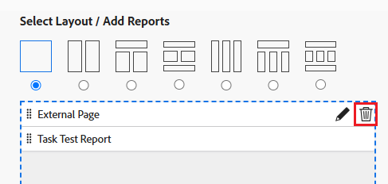

# Ta bort en extern sida från en kontrollpanel

Du kan ta bort en extern sida från en kontrollpanel om den inte längre behövs.

Du kan dock inte ta bort en extern sida efter att den har skapats i Adobe Workfront. Du kan bara ta bort en extern sida med API:t. Mer information om Workfront API finns i [Grunderna i API](../../../wf-api/general/api-basics.md). Mer information om hur du skapar externa sidor finns i [Bädda in en extern webbsida i en instrumentpanel](../../../reports-and-dashboards/dashboards/creating-and-managing-dashboards/embed-external-web-page-dashboard.md).

## Åtkomstkrav

Du måste ha följande åtkomst för att kunna utföra stegen i den här artikeln:

<table style="table-layout:auto"> 
 <col> 
 <col> 
 <tbody> 
  <tr> 
   <td role="rowheader"><strong>Adobe Workfront-plan*</strong></td> 
   <td> 
Alla
 </td> 
  </tr> 
  <tr> 
   <td role="rowheader"><strong>Adobe Workfront-licens*</strong></td> 
   <td> 
Plan 
 </td> 
  </tr> 
  <tr> 
   <td role="rowheader"><strong>Konfigurationer på åtkomstnivå*</strong></td> 
   <td> 
Redigera åtkomst till rapporter, instrumentpaneler och kalendrar
 
Obs! Om du fortfarande inte har åtkomst frågar du Workfront-administratören om de anger ytterligare begränsningar för din åtkomstnivå. Information om hur en Workfront-administratör kan ändra åtkomstnivån finns i <a href="../../../administration-and-setup/add-users/configure-and-grant-access/create-modify-access-levels.md" class="MCXref xref">Skapa eller ändra anpassade åtkomstnivåer</a>.
 </td> 
  </tr> 
  <tr> 
   <td role="rowheader"><strong>Objektbehörigheter</strong></td> 
   <td> 
Hantera behörigheter på kontrollpanelen
 
Mer information om hur du begär ytterligare åtkomst finns i <a href="../../../workfront-basics/grant-and-request-access-to-objects/request-access.md" class="MCXref xref">Begär åtkomst till objekt </a>.
 </td> 
  </tr> 
 </tbody> 
</table>

&#42;Kontakta Workfront-administratören om du vill veta vilken plan, licenstyp eller åtkomst du har.

## Ta bort en extern sida från en instrumentpanel

1. Klicka på **Huvudmeny** icon och sedan klicka **Kontrollpaneler**.
1. Markera den kontrollpanel som du vill ta bort den externa sidan från och klicka sedan på **Redigera** .

   

1. På skärmens högra sida letar du reda på den externa sida som du vill ta bort och klickar på **Ta bort** icon .

   

1. Klicka **Spara + Stäng** i det nedre vänstra hörnet.

   Detta tar bort den externa sidan från den valda kontrollpanelen. Den externa sidan ligger kvar i Workfront och kan nås via en rapport. Mer information finns i avsnittet&quot;Visa externa sidor i en rapport&quot; i artikeln [Bädda in en extern webbsida i en instrumentpanel](../../../reports-and-dashboards/dashboards/creating-and-managing-dashboards/embed-external-web-page-dashboard.md).
