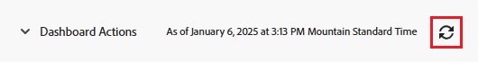

# Kom igång med instrumentpaneler

<!-- Audited: 1/2024 -->

Syftet med en kontrollpanel är att ge snabb åtkomst till information som kommer från flera rapporter. Först kan du samla information i rapporter och sedan montera flera rapporter på kontrollpaneler för att göra informationen enklare att komma åt.

## Åtkomstkrav

+++ Expandera om du vill visa åtkomstkrav för funktionerna i den här artikeln.

Du måste ha följande:

<table style="table-layout:auto">
 <col> 
 </col> 
 <col> 
 </col> 
 <tbody> 
  <tr> 
   <td> 
<strong>Adobe Workfront</strong>
 </td> 
   <td>Alla</td> 
  </tr> 
  <tr> 
   <td> 
<strong>Adobe Workfront-licens</strong>
 </td> 
   <td> 
Nytt: Medarbetare eller högre

eller

Aktuell: Granska eller senare
 </td> 
  </tr> 
  <tr> 
   <td><strong>Åtkomstnivå</strong> </td> 
   <td> 
Visa eller öka åtkomst till rapporter, instrumentpaneler och kalendrar
 </td> 
  </tr> 
  <tr> 
   <td> 
<strong>Objektbehörigheter</strong> 
 </td> 
   <td> 
Visa behörigheter på kontrollpanelen
  </td> 
  </tr> 
 </tbody> 
</table>

Mer information om tabellen finns i [Åtkomstkrav i Workfront-dokumentation](/help/quicksilver/administration-and-setup/add-users/access-levels-and-object-permissions/access-level-requirements-in-documentation.md).

+++

## Objekt som du kan lägga till på en kontrollpanel

Du kan fylla en kontrollpanel med följande objekt i Adobe Workfront:

* Rapporter\
  Mer information om hur du skapar rapporter finns i [Skapa en anpassad rapport](../../../reports-and-dashboards/reports/creating-and-managing-reports/create-custom-report.md).

* Kalendrar\
  Mer information om hur du skapar kalendrar finns i [Översikt över kalenderrapporter](../../../reports-and-dashboards/reports/calendars/calendar-reports-overview.md).

* Externa sidor\
  Mer information om hur du skapar externa sidor finns i [Bädda in en extern webbsida i en instrumentpanel](../../../reports-and-dashboards/dashboards/creating-and-managing-dashboards/embed-external-web-page-dashboard.md).

Mer information om hur du skapar en kontrollpanel finns i [Skapa en instrumentpanel](../../../reports-and-dashboards/dashboards/creating-and-managing-dashboards/create-dashboard.md).

## Dela instrumentpaneler

Du kan dela en kontrollpanel med användarna på följande sätt:

* Enskild delning.\
  Mer information om att dela instrumentpaneler finns i [Dela rapporter, kontrollpaneler och kalendrar](../../../workfront-basics/grant-and-request-access-to-objects/permissions-reports-dashboards-calendars.md) och [Dela en kontrollpanel](../../../reports-and-dashboards/dashboards/creating-and-managing-dashboards/share-dashboard.md).

* Lägg till en kontrollpanel i ett område eller objekt i Workfront med ett anpassat avsnitt.\
  Mer information om hur du skapar anpassade avsnitt finns i [Vänster navigering i Adobe Workfront](../../../workfront-basics/the-new-workfront-experience/simplified-left-navigation.md).

* Placera kontrollpanelerna på layoutmallar, som du kan dela med användarna.\
  Mer information om att dela instrumentpaneler via layoutmallar finns i [Anpassa den vänstra panelen med en layoutmall](../../../administration-and-setup/customize-workfront/use-layout-templates/customize-left-panel.md).

* Skriv ut en papperskopia av dem som du vill dela med användarna.\
  Mer information om hur du skriver ut kontrollpaneler finns i [Skriva ut en instrumentpanel](../../../reports-and-dashboards/dashboards/creating-and-managing-dashboards/print-dashboard.md).

* Exportera dem som en PDF-fil så att du kan skicka dem till användare via e-post.\
  Mer information om hur du exporterar en kontrollpanel till en PDF-fil finns i [Exportera en kontrollpanel](../../../reports-and-dashboards/dashboards/creating-and-managing-dashboards/export-dashboard.md).

När du delar en kontrollpanel med användare delas även alla rapporter, kalendrar och externa sidor som finns på kontrollpanelen med samma användare som standard.

>[!IMPORTANT]
>
>Om en användare tas bort är de instrumentpaneler som de har skapat inte längre tillgängliga. Mer information finns på [Ta bort användare](../../../administration-and-setup/add-users/create-and-manage-users/delete-a-user.md).

## Visa instrumentpaneler

Du kan visa en kontrollpanel på följande sätt:

* Gå till det anpassade avsnittet där kontrollpanelen är placerad.\
  Mer information om hur du placerar kontrollpaneler i anpassade avsnitt finns i [Navigering till vänster i Adobe Workfront](../../../workfront-basics/the-new-workfront-experience/simplified-left-navigation.md).

* Sök efter och få tillgång till kontrollpanelen manuellt.

## Åtkomst till en kontrollpanel

1. Klicka på **[!UICONTROL Main Menu]** icon  i det övre högra hörnet av Adobe Workfront, eller (om tillgängligt), klicka på **[!UICONTROL Main Menu]** icon  i det övre vänstra hörnet och klicka sedan på **Kontrollpaneler**.
1. Håll pekaren över den vänstra sidlisten och välj sedan något av följande:

   * **Mina instrumentpaneler**: De instrumentpaneler du har skapat visas här.

     >[!TIP]
     >
     >Om du inte har Redigera-åtkomst till rapporter, instrumentpaneler och kalendrar på åtkomstnivån kan du inte skapa instrumentpaneler. I det här fallet är listan Mina instrumentpaneler tom.

   * **Delade instrumentpaneler**: Kontrollpaneler som har skapats av andra användare och delats med dig visas här.
   * **Alla instrumentpaneler**: Här visas både dina instrumentpaneler och instrumentpaneler som andra användare har delat med dig.

   

1. Klicka på namnet på en kontrollpanel för att visa den.\
   Kontrollpanelen visar informationen som finns i rapporter, kalendrar eller externa sidor som fyller i den.
1. (Valfritt och villkorligt) Klicka på **Läs in igen** ikonen i det övre högra hörnet av kontrollpanelen för att uppdatera informationen på kontrollpanelen.\
   Informationen på kontrollpanelen synkroniseras i realtid när du öppnar den för första gången. Om du har visat kontrollpanelen en stund i webbläsaren kan informationen i rapporterna på kontrollpanelen bli inaktuell. Datum och tid när kontrollpanelen senast uppdaterades visas till vänster om den här ikonen.\
   

## Ta bort instrumentpaneler

Om du vill ta bort en kontrollpanel från Workfront kan du ta bort den.

Mer information finns på [Ta bort en instrumentpanel](../../../reports-and-dashboards/dashboards/creating-and-managing-dashboards/delete-dashboard.md).
