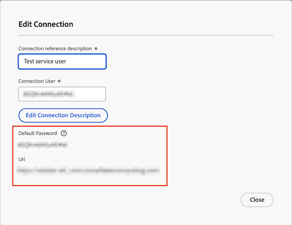

# Power BI-verktyget kan inte ansluta till det angivna lösenordet

## Problem

När du försöker logga in på Data Connect från ditt Power BI-verktyg visas följande fel:

`Cannot connect from BI tool with provided password`

## Orsak

När du skapar JDBC-anslutningen anger Workfront ett tillfälligt lösenord för Data Connect.

Innan du får åtkomst till Data Connect via Power BI måste du först logga in med den angivna anslutningsinformationen, uppdatera det tillfälliga lösenordet och sedan fortsätta med inloggningen.

## Lösning

Återställ lösenordet för anslutningen i Workfront och skapa sedan ett nytt lösenord med länken i dialogrutan Redigera anslutning.

### Återställ lösenordet i Workfront

1. Gå till Workfront > Inställningar > System > Dataanslutning.
1. Sök efter och öppna anslutningen från listan.
1. Under **Återställ lösenord för anslutning** markerar du kryssrutan för att bekräfta att du vill återställa lösenordet.
1. Klicka på **Återställ lösenord för anslutning**.
   
1. Fortsätt till avsnittet nedan.

### Skapa ett nytt lösenord för anslutningen

1. Kopiera URL-adressen och klistra in den på en ny flik i webbläsaren.
1. I Workfront kopierar och klistrar du in användarnamnet för anslutningen och standardlösenordet på den nya webbläsarfliken.
   
1. Klicka på **Logga in**.
1. Ange ett nytt lösenord och klicka sedan på **Skicka**.
1. Gå till ditt Power BI-verktyg och logga in med det nya lösenordet.

