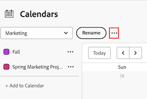

# Ta bort en kalenderrapport

Den markerade informationen på den här sidan hänvisar till funktioner som ännu inte är allmänt tillgängliga. Den är bara tillgänglig i sandlådemiljön för förhandsgranskning.

Du kan ta bort en kalender som du äger eller som andra delar med dig. När kalendern har tagits bort blir den inte tillgänglig för användare som du har delat den med.

Du kan inte ta bort din standardkalender om du inte har en befintlig alternativ kalender. Om du försöker ta bort alla dina kalendrar skapas automatiskt en standardkalender.

## Åtkomstkrav

+++ Expandera om du vill visa åtkomstkrav för funktionerna i den här artikeln.

Du måste ha följande åtkomst för att kunna utföra stegen i den här artikeln:

<table style="table-layout:auto"> 
 <col> 
 </col> 
 <col> 
 </col> 
 <tbody> 
  <tr> 
   <td role="rowheader">[!DNL Adobe Workfront plan]</td> 
   <td> 
Alla
 </td> 
  </tr> 
  <tr> 
   <td role="rowheader">[!DNL Adobe Workfront] licens</td> 
   <td>
Nytt: Standard

       
eller

       
Aktuell: Planera
</td> 
  </tr> 
  <tr> 
   <td role="rowheader">Konfigurationer på åtkomstnivå</td> 
   <td> 
[!UICONTROL Edit] åtkomst till [!UICONTROL Reports], [!UICONTROL Dashboards] och [!UICONTROL Calendars]
</td> 
  </tr> 
  <tr> 
   <td role="rowheader">Objektbehörigheter</td> 
   <td>[!UICONTROL Manage] åtkomst till kalenderrapporten, med tillgång till borttagningen</td> 
  </tr> 
 </tbody> 
</table>

Mer information om informationen i den här tabellen finns i [Åtkomstkrav i Workfront-dokumentationen](/help/quicksilver/administration-and-setup/add-users/access-levels-and-object-permissions/access-level-requirements-in-documentation.md).

+++

## Ta bort en kalenderrapport i produktionen

1. Gå till kalendern som du vill ta bort.
1. Klicka på **[!UICONTROL Calendar Actions]** i verktygsfältet **[!UICONTROL Calendar]** och välj sedan **[!UICONTROL Delete]** i listrutan.
1. Klicka på **[!UICONTROL Yes, Delete It]**.

## Ta bort en kalenderrapport i förhandsgranskningen

1. Gå till kalendern som du vill ta bort.
1. Klicka på menyn **Mer** bredvid listrutan Kalender.
   

1. Välj **[!UICONTROL Delete]** i listrutan.
1. Klicka på **[!UICONTROL Delete]**.

