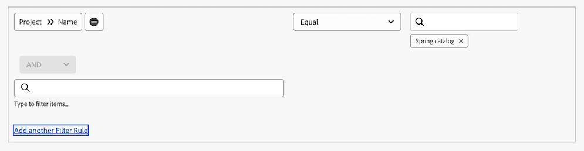
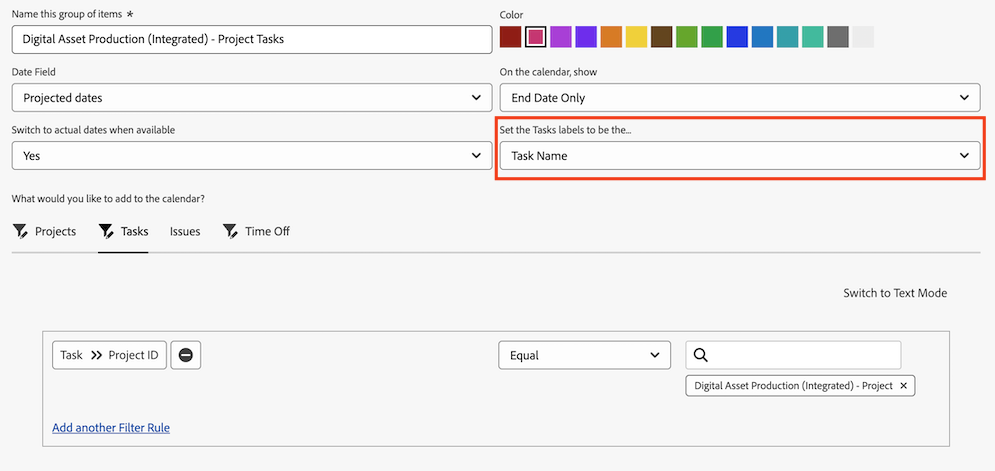

# Använd anpassade datumfält i en kalenderrapport

En [!UICONTROL calendar]-rapport är en dynamisk rapport som ger en visuell representation av ditt arbete. Du kan använda anpassade datumfält i en kalenderrapport för följande objekt:

* Uppgifter
* Problem
* Projekt

## Åtkomstkrav

+++ Expandera om du vill visa åtkomstkrav för funktionerna i den här artikeln.

<table style="table-layout:auto"> 
 <col> 
 </col> 
 <col> 
 </col> 
 <tbody> 
  <tr> 
   <td role="rowheader">Adobe Workfront package</td> 
   <td> 
Alla
 </td> 
  </tr> 
  <tr> 
   <td role="rowheader">Adobe Workfront-licens</td> 
   <td>
Standard

       
Plan
</td> 
  </tr> 
  <tr> 
   <td role="rowheader">Konfigurationer på åtkomstnivå</td> 
   <td> 
Redigera åtkomst till rapporter, instrumentpaneler och kalendrar
</td> 
  </tr> 
  <tr> 
   <td role="rowheader">Objektbehörigheter</td> 
   <td>Hantera åtkomst till kalenderrapporten</td> 
  </tr> 
 </tbody> 
</table>

Mer information om informationen i den här tabellen finns i [Åtkomstkrav i Workfront-dokumentationen](/help/quicksilver/administration-and-setup/add-users/access-levels-and-object-permissions/access-level-requirements-in-documentation.md).

+++

## Förutsättningar

1. Du måste ha anpassade datumfält och ett värde i fältet som är tillgängligt i din [!DNL Workfront]-instans. Om du inte har skapat något anpassat formulär med anpassade datum följer du instruktionerna i [Skapa ett anpassat formulär](/help/quicksilver/administration-and-setup/customize-workfront/create-manage-custom-forms/form-designer/design-a-form/design-a-form.md).
1. Bifoga det anpassade formuläret till ett projekt, en uppgift eller ett ärende som du tänker lägga till i kalendern och ange ett datum. Mer information finns i [Lägga till ett anpassat formulär i ett objekt](../../../workfront-basics/work-with-custom-forms/add-a-custom-form-to-an-object.md).

## Ställ in artikelgruppen

Du kan välja hur du vill att gruppen med objekt ska visas i din kalender.

{{step1-to-calendars}}

1. Välj den kalender som du vill lägga till en ny grupp med objekt, klicka på menyn Mer och sedan **Redigera**.
eller
Klicka på **[!UICONTROL + New Calendar]**, ange projektnamnet och klicka sedan på **[!UICONTROL Add advanced items]**.

   >[!NOTE]
   >
   >Du måste ha [!UICONTROL Edit] åtkomst till [!UICONTROL Reports], [!UICONTROL Dashboards] och [!UICONTROL Calendars] på din åtkomstnivå för att skapa en kalenderrapport.

1. Ange följande:

   <table style="table-layout:auto">
    <col>
    <col>
    <tbody>
     <tr>
      <td role="rowheader"><strong>[!UICONTROL Name this group of items]</strong></td>
      <td>Ange ett namn för gruppen med objekt.</td>
     </tr>
     <tr>
      <td role="rowheader"><strong>[!UICONTROL Color]</strong></td>
      <td>Välj en färg för gruppen med objekt. Alla objekt visas i den valda färgen i kalenderrapporten.</td>
     </tr>
     <tr>
      <td role="rowheader"><strong>[!UICONTROL Date Field]</strong></td>
      <td>Välj <strong>[!UICONTROL Custom dates]</strong>. </td>
     </tr>
     <tr>
      <td role="rowheader"><strong>[!UICONTROL On the calendar, show]</strong></td>
      <td>
Välj hur du vill att datumen ska visas:

       <ul>
        <li><strong>[!UICONTROL Single Date]</strong>: I kalendern visas objektet på ett enda datum.</li>
        <li><strong>[!UICONTROL Duration] (från början till slut)</strong>: I kalendern visas objektet över ett antal dagar. 
Obs! Om du väljer <strong>[!UICONTROL Duration]</strong> måste slutdatumet som anges vara efter startdatumet, annars visas inte objektet i kalendern.
</li>
       </ul></td>
     </tr>
     <tr data-mc-conditions="">
      <td role="rowheader"><strong>[!UICONTROL Custom Dates]</strong></td>
      <td>
Ange det anpassade datumnamnet som är kopplat till objektet som du vill spåra.

<strong>Obs!</strong> Sökningen efter det anpassade datumnamnet är begränsad till 50 resultat för att undvika prestandaproblem.</td>
     </tr>
    </tbody>
   </table>

1. Fortsätt till följande avsnitt.

### Lägga till objekt i objektgruppen

När du har ställt in hur du vill att objekten ska visas måste du lägga till de objekt som du vill se i kalendern i grupperingen.

1. I avsnittet **[!UICONTROL What would you like to add to the calendar?]** väljer du

   * **[!UICONTROL Tasks]**
   * **[!UICONTROL Projects]**
   * **[!UICONTROL Issues]**

1. Klicka på **[!UICONTROL Add Tasks]**, **[!UICONTROL Add Projects]**, **[!UICONTROL Add Issues]** eller **Tid av** beroende på vilken objekttyp du lägger till i kalendern.

1. I listrutan börjar du skriva fältnamnet och väljer sedan fältkällan för objektet som du vill visa i kalendern (till exempel **[!UICONTROL Late Tasks]**).
1. Ange en villkorssats för kalendergrupperingen.

   Mer information om hur du ställer in villkor finns i [Filter- och villkorsmodifierare](../../../reports-and-dashboards/reports/reporting-elements/filter-condition-modifiers.md).

   

1. (Valfritt) Ange ytterligare objekt för kalendergrupperingen genom att upprepa steg 1-4.
1. I fältet **[!UICONTROL Set the Tasks/Projects/Issues labels to be the...]** väljer du hur objekten i den här kalendergruppen ska märkas i kalendern.

   >[!NOTE]
   >
   >Om standardetikettalternativen inte är tillgängliga för ett visst objekt visas objektnamnet i stället. Om etiketten [!UICONTROL Parent Task] till exempel är markerad och det inte finns någon överordnad aktivitet kopplad till objektet, visar [!DNL Adobe Workfront] objektnamnet som du visar i kalendern.

   
1. Klicka på **[!UICONTROL Save]**.

