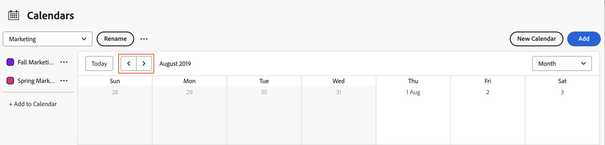
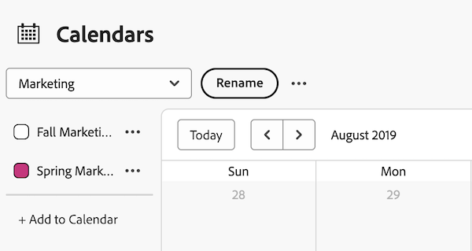

# Visa kalenderrapporter och händelseinformation

Du kan visa kalenderrapporter och händelseinformation som du har skapat eller som delats med dig i Adobe Workfront.

## Åtkomstkrav

+++ Expandera om du vill visa åtkomstkrav för funktionerna i den här artikeln.

Du måste ha följande åtkomst för att kunna utföra stegen i den här artikeln:

<table style="table-layout:auto"> 
 <col> 
 </col> 
 <col> 
 </col> 
 <tbody> 
  <tr> 
   <td role="rowheader">[!DNL Adobe Workfront plan]</td> 
   <td> 
Alla
 </td> 
  </tr> 
  <tr> 
   <td role="rowheader">[!DNL Adobe Workfront] licens</td> 
   <td>
Nytt: Medarbetare

       
eller

       
Aktuell: Begäran
</td> 
  </tr> 
  <tr> 
   <td role="rowheader">Konfigurationer på åtkomstnivå</td> 
   <td> 
[!UICONTROL View] eller senare åtkomst till [!UICONTROL Reports], [!UICONTROL Dashboards] och [!UICONTROL Calendars]
</td> 
  </tr> 
  <tr> 
   <td role="rowheader">Objektbehörigheter</td> 
   <td>[!UICONTROL View] eller högre behörighet till kalenderrapporten</td> 
  </tr> 
 </tbody> 
</table>

Mer information om informationen i den här tabellen finns i [Åtkomstkrav i Workfront-dokumentationen](/help/quicksilver/administration-and-setup/add-users/access-levels-and-object-permissions/access-level-requirements-in-documentation.md).

+++

## Visa en kalenderrapport

<!--{{step1-to-calendars}}-->

1. Klicka på ikonen **[!UICONTROL Main Menu]**  i det övre högra hörnet av Adobe Workfront, eller (om den är tillgänglig) klicka på **[!UICONTROL Main Menu]** -ikonen  i det övre vänstra hörnet och klicka sedan på **[!UICONTROL Calendars]**.

   Beroende på din åtkomstnivå kan följande kalendrar visas:

   * Din [!DNL Adobe Workfront]-standardkalender

     Workfront skapar en kalender för dig baserat på de projekt, uppgifter och utgåvor som har tilldelats dig eller som har tilldelats team, grupper eller roller som du har tilldelats.

   * Kalendrar som du har skapat

     Mer information om hur du skapar kalendrar finns i [Översikt över kalenderrapporter](../../../reports-and-dashboards/reports/calendars/calendar-reports-overview.md).

   * Kalendrar som andra användare har delat med dig

     Mer information om att dela kalendrar finns i [[!UICONTROL Share a calendar]-rapporten](../../../reports-and-dashboards/reports/calendars/share-a-calendar-report.md).

1. (Villkorligt) Klicka på listrutan **[!UICONTROL View]** och välj sedan den kalendervaraktighet som du vill visa.
   
Du kan välja bland följande kalenderrapportvyer:

   * **[!UICONTROL Month]**: Visar fyra veckor i kalendern
   * **[!UICONTROL Week]**: Visar en vecka i kalendern
   * **[!UICONTROL Gantt]**: Visar en kontinuerlig vy av kalendern

     Du kan se fler händelser i en [!UICONTROL Gantt]-vy genom att rulla nedåt eller åt sidan. En inläsningssymbol visas när data fylls i för vyn.

   >[!NOTE]
   >
   >I vyerna [!UICONTROL Month] och [!UICONTROL Week] har händelser som är aktuella eller framtida (inklusive händelser som sträcker sig över flera dagar, så länge de innehåller idag eller en framtida dag) skuggning som motsvarar färgen i projekt- eller kalendergrupperingen. Tidigare händelser har ljusare skuggning för att ange att de inte längre är aktuella, men du kan ändå markera och visa dessa händelser.

1. (Valfritt) Om du visar kalendern i vyerna [!UICONTROL Month] eller [!UICONTROL Week] kan du ändra kalendervyn med följande alternativ:

   * Så här inkluderar eller exkluderar du helger:

      1. Klicka på **[!UICONTROL Calendar Actions]** i verktygsfältet **[!UICONTROL Calendar]** och välj sedan **[!UICONTROL Show Weekend]** eller **[!UICONTROL Hide Weekend]** i listrutan.

   * Så här ändrar du snabbt de visade datumen:

      1. Klicka på vänsterpilen i datumindikatorn i verktygsfältet **[!UICONTROL Calendar]** för att gå tillbaka i kalendern eller högerpilen för att gå framåt.

         \
         De visade datumen justeras med ett intervall baserat på den aktuella kalendervyn. Om du till exempel visar kalendern i vyn [!UICONTROL Week] visas kalendern antingen en vecka framåt eller en vecka bakåt, beroende på vilken pil du väljer.

      1. (Valfritt) Om du vill återgå till den aktuella dagen klickar du på [!UICONTROL **I dag**].

1. (Valfritt) Om du vill visa en kalender i helskärmsläge klickar du på helskärmspilarna till höger i verktygsfältet **[!UICONTROL Calendar]**.
   \
   Tryck på Esc för att återgå till den normala vyn av kalendern.

1. (Valfritt) Om du vill dölja händelserna för ett projekt eller en kalendergrupp som är länkad till kalendern, avmarkerar du projektet eller kalendergruppen i projektlistan.
   
Du kan göra händelserna synliga igen genom att välja [!UICONTROL project] - eller kalendergrupperingen i projektlistan.

## Visa händelseinformation för kalenderrapport

Du kan se information om en händelse i en kalender, både för aktuella och tidigare händelser.

1. Gå till händelsen som du vill veta informationen om och klicka sedan på händelsen. Detaljerna öppnas i en panel till höger.
1. (Valfritt) Om du vill öppna det associerade projektet, aktiviteten eller utgåvan klickar du på objektets titel.
