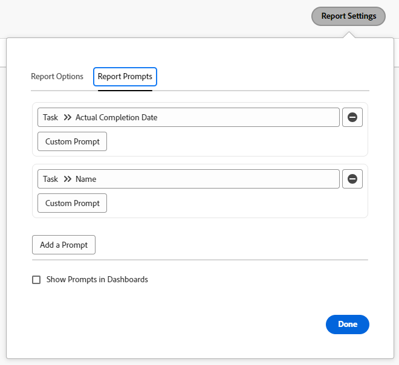

# Lägga till en fråga i en rapport

<!-- Audited: 11/2024 -->

## Skillnaden mellan uppmaningar och filter

Filter och uppmaningar liknar varandra i den bemärkelsen att de båda begränsar den mängd information som du visar i en rapport.

Du skapar ett filter när du vill att den information som visas i rapporten ska filtreras med samma villkor varje gång du kör rapporten. Filter skapas en gång och de är hårdkodade i rapporten. Mer information om hur du skapar filter finns i artikeln [Översikt över filter](../../../reports-and-dashboards/reports/reporting-elements/filters-overview.md).

Frågar är öppna filter som kan anpassas och tillämpas på olika sätt varje gång du kör en rapport.

När du lägger till uppmaningar i rapporten kan du anpassa filtreringsinformationen genom att redigera frågevillkoren varje gång du kör rapporten. Rapporten körs med olika filter varje gång, beroende på vilka modifieringar du väljer, i stället för att hårdkoda modifieringarna en gång i rapportfiltret.

Frågar fungerar som ett anpassningsbart filter på rapporter som kan uppdateras precis innan du kör rapporten. Du kan skapa generiska rapporter och sedan begränsa resultaten baserat på den information du vill se för den dagen eller på den information som är relevant för en uppsättning kriterier som är individuella för dig. Om du till exempel har en timrapport och vill ändra informationen i rapporten baserat på följande kriterier:

* Datumen när timmarna loggades
* Användarna som angav timmarna
* Det angivna timbeloppet

Du skapar tre prompter där villkoren är de kriterier som krävs och rapporten ser annorlunda ut varje gång du kör den, beroende på vilken information du väljer för dina uppmaningar.

Ett filter kan instruera Adobe Workfront att endast visa de timmar som anges mellan juni och augusti i år. Med en uppmaning kan du emellertid använda olika tidsramar varje gång du kör rapporten (till exempel mellan januari och februari eller oktober och december).

## Åtkomstkrav

+++ Expandera om du vill visa åtkomstkrav för funktionerna i den här artikeln.

Du måste ha följande åtkomst för att kunna utföra stegen i den här artikeln:

<table style="table-layout:auto"> 
 <col> 
 <col> 
 <tbody> 
  <tr> 
   <td role="rowheader">Adobe Workfront-plan*</td> 
   <td> <p>Alla</p> </td> 
  </tr> 
  <tr> 
   <td role="rowheader">Adobe Workfront-licens*</td> 
    <td> 
      <p>Nytt:</p>
         <ul>
         <li><p>Standard</p></li>
         </ul>
      <p>Aktuell:</p>
         <ul>
         <li><p>Plan</p></li>
         </ul>
   </td>
  </tr> 
  <tr> 
   <td role="rowheader">Konfigurationer på åtkomstnivå*</td> 
   <td> <p>Redigera åtkomst till rapporter, instrumentpaneler och kalendrar</p> <p>Redigera åtkomst till filter, vyer, grupperingar</p></td> 
  </tr> 
  <tr> 
   <td role="rowheader">Objektbehörigheter*</td> 
   <td> <p>Hantera behörigheter i en rapport</p></td> 
  </tr> 
 </tbody> 
</table>

*Mer information finns i [Åtkomstkrav i Workfront-dokumentation](/help/quicksilver/administration-and-setup/add-users/access-levels-and-object-permissions/access-level-requirements-in-documentation.md).

+++

## Förutsättningar

Du måste skapa en rapport innan du kan lägga till en fråga.

Instruktioner om hur du skapar en rapport finns i [Skapa en rapport](../../../reports-and-dashboards/reports/creating-and-managing-reports/create-report.md)

## Skapa en fråga

1. Gå till rapporten där du vill lägga till en fråga.
1. Expandera **Rapportåtgärder** och klicka sedan på **Redigera**.

1. Klicka på knappen **Rapportinställningar**.
1. Klicka på fliken **Rapportfrågor** och sedan på **Lägg till en fråga**.\
   

1. (Villkorligt) Markera det fält som du vill att uppmaningen ska baseras på. Börja skriva namnet på fältet och klicka sedan för att markera det när det visas i listan.\
   Vilka alternativ som är tillgängliga för användare som kör rapporten varierar beroende på vilket fält du väljer.\
   Om du t.ex. väljer ett datumfält som Faktiskt slutförandedatum i en aktivitetsrapport, är &quot;Faktiskt slutförandedatum&quot; namnet på uppmaningen. När du redigerar den här uppmaningen när du kör den här rapporten kan du välja bland en uppsättning modifierare för att skapa din filtersats. Den här processen är identisk med att skapa ett filter. Mer information om modifierare finns i [Filter och villkorsmodifierare](../../../reports-and-dashboards/reports/reporting-elements/filter-condition-modifiers.md).

1. (Villkorligt) Klicka på **Egen fråga** om du vill skapa en anpassad fråga.

   En anpassad fråga är en fördefinierad fråga där du hårdkodar filtervillkoren innan du kör rapporten. I det här fallet finns en anpassad fråga närmare ett filter än en fråga.

   Kommandot är dock lika flexibelt som en vanlig prompt eftersom du kan välja mellan flera fördefinierade satser, till skillnad från att bara ha ett hårdkodat filter i rapporten.

   Ange följande information för den anpassade prompten: Villkoret för en anpassad prompt kan bara redigeras i textläge. Detta gör att flera villkor kan användas i ett enda fält.

   * **Fältnamn:** Detta är namnet på uppmaningen, som du ser den innan du kör rapporten.
   * **Etikett för nedrullningsbart objekt:** Det här är namnet på ett av alternativen i uppmaningen när du ser det innan du kör rapporten.
   * **Villkor:** Ange ett villkor som definierar uppmaningen.
   * **Standard:** Du kan välja att ett objekt ska vara standardalternativ för den här uppmaningen.

   Använd samma syntax som du använder när du anger ett textlägesfilter och koppla programsatser till &quot;&amp;&quot;. Mer information om hur du redigerar ett filter i textläge finns i [Redigera ett filter i textläge](../../../reports-and-dashboards/reports/text-mode/edit-text-mode-in-filter.md).

   Fältet **Villkor** i den anpassade uppmaningen för följande scenarier kan till exempel se ut så här:

   * alla uppgifter i framtida projekt där projektstatusen är Idea, Begärd, Planerad och Aktuell:

     ```
     project:plannedStartDate=$$TODAY&project:plannedStartDate_Mod=gte&project:status=IDA,REQ,PLN,CUR&project:status_Mod=in
     ```

   * alla uppgifter i slutförda (tidigare) projekt där projektstatusen är Slutförd eller Död:

     ```
     project:actualCompletionDate=$$TODAY&project:actualCompletionDate_Mod=lte&project:status=CPL,DED&project:status_Mod=in
     ```

   Mer information om modifierare i textläge finns i [Filter- och villkorsmodifierare](../../../reports-and-dashboards/reports/reporting-elements/filter-condition-modifiers.md).

   >[!NOTE]
   >
   >Du kan inte ändra villkoren för en anpassad fråga när du kör rapporten, som du skulle göra med en standardfråga. Du kan ha så många fördefinierade villkor för en anpassad fråga som du behöver.

1. (Valfritt) Upprepa steg 4 eller steg 5 för att skapa så många uppmaningar som behövs.
1. Klicka på **Klar** och sedan på **Spara+stäng** för att spara rapporten.

## Använda en uppmaning i en rapport

När du har lagt till en fråga i en rapport är standardfliken för rapporten alltid fliken Fråga.

Så här kör du en rapport med en fråga:

1. Gå till rapporten med uppmaningen.

   

1. Välj ett villkor för en eller alla uppmaningar som visas på fliken **Fråga**.\
   (Valfritt) Du kan lämna uppmaningarna tomma och inte filtrera rapporten efter uppmaningsvillkoren.

1. Klicka på **Kör rapport**.\
   (Villkorligt) Om du fyllde i uppmaningarna filtreras rapporten efter de villkor som du har valt för dina uppmaningar.\
   (Villkorligt) Om du lämnade uppmaningarna tomma filtreras inte rapporten efter uppmaningsvillkoren. Rapporten visas som om den inte filtrerats.

   >[!NOTE]
   >
   >En rapport som innehåller ett filter förutom en prompt filtrerar resultaten enligt både villkoren som definierats i filtret och prompten kombinerat.

## Begränsningar för delning av obligatoriska rapporter

>[!CAUTION]
>
>När du delar en rekommenderad rapport kan både inloggade och ej inloggade användare som visar rapporten med hjälp av länken för offentlig delning inte köra rapporten med hjälp av dess anvisningar. I det här fallet visas rapportens resultat utan att några uppmaningar tillämpas, och den information som visas baseras i stället på användarens åtkomstnivå och behörigheter eller rapportens Kör som-användaråtkomstnivå och behörigheter, om en sådan har angetts.

Följande är begränsningar när det gäller att dela rapporter från Workfront:

* När du delar en rapport offentligt kan användare inte köra rapporten med tillämpade uppmaningar, såvida de inte har Workfront-inloggningsuppgifter, logga in först och navigera till rapporten direkt i Workfront (inte via länken för offentlig delning).

  Mer information om att dela rapporter finns i artikeln [Dela en rapport i Adobe Workfront](../../../reports-and-dashboards/reports/creating-and-managing-reports/share-report.md).

* När du schemalägger en begärd rapport för leverans innehåller rapporten i e-postbilagan rapportens data som inte har efterfrågats. När användaren klickar på länken i e-postmeddelandet för att få åtkomst till rapporten måste han/hon logga in först för att kunna visa rapporten och köra uppmaningen själv.

  Mer information om att schemalägga en levererad rapport finns i [Schemalägg en automatisk rapportleverans](../../../reports-and-dashboards/reports/creating-and-managing-reports/set-up-automatic-report-delivery.md).
