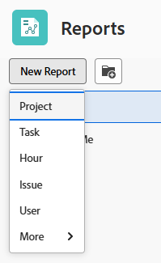
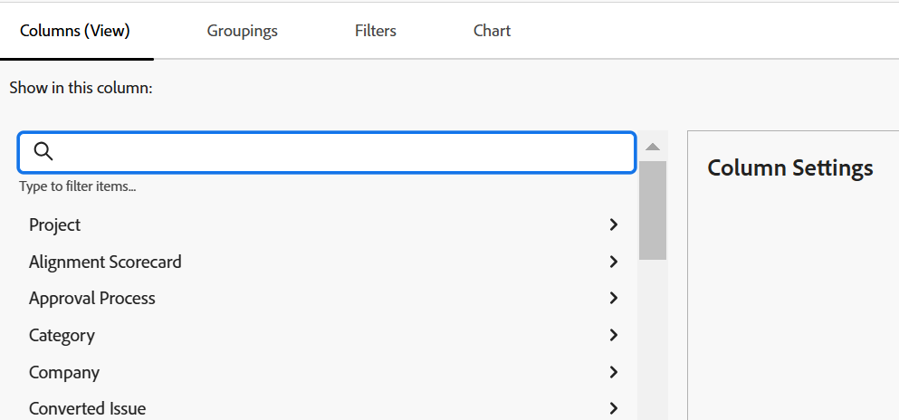
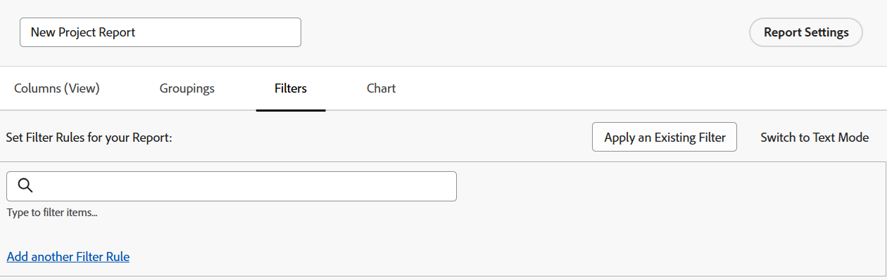

# Skapa en anpassad rapport

<!--Audited: 12/2023-->

Du kan ge åtkomst till den information din organisation behöver i Adobe Workfront genom att skapa rapporter. Du kan använda någon av de inbyggda rapporterna i Workfront eller skapa anpassade rapporter från grunden.

Mer information om inbyggda rapporter finns i [Använd inbyggda rapporter från Adobe Workfront](../../../reports-and-dashboards/reports/using-built-in-reports/use-workfront-built-in-reports.md).

Mer information om hur du skapar en rapport genom att kopiera den finns i [Skapa en kopia av en rapport](../../../reports-and-dashboards/reports/creating-and-managing-reports/create-copy-report.md).

Mer information om hur du skapar och hanterar rapporter, inklusive klasser, videoklipp och självstudiekurser, finns i avsnittet Lär dig på Adobe Experience League webbplats.

## Åtkomstkrav

Du måste ha följande åtkomst för att kunna utföra stegen i den här artikeln:

<table style="table-layout:auto"> 
 <col> 
 <col> 
 <tbody> 
  <tr> 
   <td role="rowheader">Adobe Workfront-plan*</td> 
   <td> 
Alla
 </td> 
  </tr> 
  <tr> 
   <td role="rowheader">Adobe Workfront-licens*</td> 
   <td> 
Nytt: Standard 

   eller
   
Aktuell: Planera 
 </td> 
  </tr> 
  <tr> 
   <td role="rowheader">Konfigurationer på åtkomstnivå*</td> 
   <td> 
Redigera åtkomst till rapporter, instrumentpaneler och kalendrar
 
Redigera åtkomst till filter, vyer, grupperingar
 
<b>ANMÄRKNING</b>

   
 Om du fortfarande inte har åtkomst frågar du Workfront-administratören om de anger ytterligare begränsningar för din åtkomstnivå. Information om hur en Workfront-administratör kan ändra åtkomstnivån finns i <a href="../../../administration-and-setup/add-users/configure-and-grant-access/create-modify-access-levels.md" class="MCXref xref">Skapa eller ändra anpassade åtkomstnivåer</a>.
 </td> 
  </tr> 
  <tr> 
   <td role="rowheader">Objektbehörigheter</td> 
   <td> 
Du får behörigheten Hantera för de rapporter du skapar.
 
Mer information om hur du begär ytterligare åtkomst finns i <a href="../../../workfront-basics/grant-and-request-access-to-objects/request-access.md" class="MCXref xref">Begär åtkomst till objekt </a>.
 </td> 
  </tr> 
 </tbody> 
</table>

&#42;Kontakta Workfront-administratören om du vill veta vilken plan, licenstyp eller åtkomst du har.

## Skapa en rapport {#create-a-report}

{{step1-to-reports}}

1. Klicka **Ny rapport** väljer du sedan den objekttyp som du vill använda för rapporten.

   Report builder läses in.

   Mer information om tillgängliga objektrapporter finns i avsnittet [Rapport om objekt](../../../workfront-basics/navigate-workfront/workfront-navigation/understand-objects.md#reporting-on-objects) i artikeln [Förstå objekt i Adobe Workfront](../../../workfront-basics/navigate-workfront/workfront-navigation/understand-objects.md).

   

   >[!TIP]
   >
   >Du kan också skapa en rapport genom att skapa en kopia av en befintlig rapport. Mer information finns i [Skapa en kopia av en rapport](../../../reports-and-dashboards/reports/creating-and-managing-reports/create-copy-report.md).

1. Lägg till följande i rapporten i Report Builder:

   <table style="table-layout:auto"> 
    <col> 
    <col> 
    <thead> 
     <tr> 
      <th>Funktion</th> 
      <th>Beskrivning</th> 
     </tr> 
    </thead> 
    <tbody> 
     <tr> 
      <td>Kolumner (vy)</td> 
      <td> 
Om du lägger till kolumner i rapporten avgör du vilken information rapporten innehåller.
 
Mer information om hur du lägger till en kolumn finns i <a href="#add-columns-view-to-a-report" class="MCXref xref">Lägga till kolumner (vy) i en rapport</a>. 
 </td> 
     </tr> 
     <tr> 
      <td>Grupperingar</td> 
      <td> 
Om du lägger till grupperingar i rapporten avgör du hur rapporten är organiserad.
 
Mer information om hur du lägger till en gruppering finns i <a href="#add-groupings-to-a-report" class="MCXref xref">Lägga till grupperingar i en rapport</a>.
 </td> 
     </tr> 
     <tr> 
      <td>Filter</td> 
      <td> 
Om du lägger till filterregler i rapporten avgör du vilken information som visas i rapporten.
 
Mer information om hur du lägger till ett filter finns i <a href="#add-filters-to-a-report" class="MCXref xref">Lägga till filter i en rapport</a>.
 </td> 
     </tr> 
     <tr> 
      <td>Diagram</td> 
      <td> 
Om du lägger till ett diagram i rapporten avgör du hur informationen i rapporten presenteras visuellt.
 
Mer information om hur du lägger till ett diagram finns i <a href="#add-a-chart-to-a-report" class="MCXref xref">Lägga till ett diagram i en rapport</a>.
 </td> 
     </tr> 
    </tbody> 
   </table>

1. Klicka när som helst under rapportskapandeprocessen **Använd** för att spara ändringarna.
1. När du är klar klickar du **Spara + Stäng**.

### Lägga till kolumner (vy) i en rapport {#add-columns-view-to-a-report}

1. Börja skapa en rapport enligt beskrivningen i [Skapa en rapport](#create-a-report) i den här artikeln.
1. I Report builder väljer du **Kolumner (vy)** för att identifiera de kolumner som ska visas i rapporten.
1. (Valfritt) Klicka på **Använd en befintlig vy** och klicka på namnet på en vy i listrutan om du vill använda en befintlig vy.

   Mer information om hur du skapar en vy finns i [Översikt över vyer i Adobe Workfront](../../../reports-and-dashboards/reports/reporting-elements/views-overview.md).

1. (Valfritt) Om du vill ta bort en befintlig kolumn klickar du på kolumnen som du vill ta bort och klickar sedan på knappen **x** bredvid det aktuella namnet i kolumnrubriken.

1. Om du vill lägga till en ny kolumn klickar du **Lägg till kolumn**.

   eller

   Om du vill ändra en befintlig kolumn klickar du på kolumnen och klickar på **Ta bort** icon  till vänster om det aktuella fältet i **Visa i det här kolumnfältet** i det övre vänstra hörnet av rapportverktyget, och börja skriva ett nytt fält och klicka sedan på det när det visas i listan.

   Mer information om fälten som visas i kolumnerna finns i [Ordlista för Adobe Workfront-terminologi](../../../workfront-basics/navigate-workfront/workfront-navigation/workfront-terminology-glossary.md).

   

1. (Valfritt) I dialogrutan **Kolumninställningar** område, markera **Sortera efter den här kolumnen** Om du vill sortera värdena i kolumnen i stigande ordning efter fallande alfabetisk ordning, anger du om den här kolumnen ska användas som första sortering i listan.

   Du kan ha flera sorteringsnivåer i en rapportvy om du vill sortera efter värdet i en kolumn först, värdet i en andra kolumn, osv.

   Om flera resultat är identiska enligt det första sorteringsvillkoret sorteras de i ordningen för det andra sorteringsvillkoret. Om flera resultat är identiska enligt det första och det andra sorteringsvillkoret, sorteras de efter den tredje sorteringen osv.

   >[!NOTE]
   >
   >Om du lägger till ett fält som refererar till ett objekt som är för långt bort från det objekt som du rapporterar om, kanske du inte kan sortera efter det här fältet.\
   >En problemrapport kan till exempel inte sorteras efter fältet Projektägare eftersom den refererar till ytterligare tre objekt: Projekt, Ägare och Namn. Du kan dock fortfarande lägga till det här fältet i en problemrapport och se informationen för det.

   <!--outdated: To learn more about cross-object references in reports, see the section "Advanced Reporting Part 1 of 3" in the [Reports and Dashboards Learning Path](https://one.workfront.com/s/learningpath2/workfront-reporting-MC7MZT2BOL2ZC2LMJ4MA3EMHOCNY?tabset-dc70e=2).-->

1. (Valfritt) Om du använder grupperingar och vill sammanfatta (sammanfoga) informationen i en kolumn klickar du på **Sammanfatta den här kolumnen med** nedrullningsbar lista i **Kolumninställningar** markerar du det alternativ som du vill använda för att sammanställa informationen i kolumnen.

   Den aggregerade informationen visas i kolumnen i grupperingsraderna.

   

   Mer information om att sammanfatta data i en kolumn finns i [Översikt över vyer i Adobe Workfront](../../../reports-and-dashboards/reports/reporting-elements/views-overview.md).

   >[!NOTE]
   >
   >Följande undantag gäller för överordnade objekt (till exempel överordnade uppgifter) när du samlar värden för följande fält i grupperingar:
   >
   >* Alla sifferfält och valutafält utom Faktiska timmar (t.ex. Planerad eller Faktisk arbetskostnad, Planerad eller Faktisk kostnad, Planerad eller Faktisk kostnad, Planerad timmar) samlar endast värdena för de underordnade aktiviteterna och fristående aktiviteter. De sammanställer inte värdena för de överordnade uppgifterna eller de överordnade överordnade uppgifterna.
   >* Faktiska timmar sammanställer värdena för de huvudsakliga överordnade och de fristående aktiviteterna. De sammanställer inte siffrorna för de överordnade aktiviteternas överordnade eller underordnade aktiviteternas överordnade uppgifter.
   >* Anpassade datafält för tal- och valutavärden samlar alla uppgifter: överordnade, underordnade, överordnade och fristående uppgifter.

   Mer information om hur du använder grupperingar i en rapport finns i [Översikt över grupperingar i Adobe Workfront](../../../reports-and-dashboards/reports/reporting-elements/groupings-overview.md).

1. (Valfritt) Klicka på **Avancerade alternativ** om du vill ange följande information för kolumnen:

   <table style="table-layout:auto"> 
    <col> 
    <col> 
    <tbody> 
     <tr> 
      <td role="rowheader">Etikett för anpassad kolumn</td> 
      <td> 
Ange en anpassad etikett för kolumnen. Den här etiketten ersätter standardetiketten.
 </td> 
     </tr> 
     <tr> 
      <td role="rowheader">Fältformat</td> 
      <td> 
Välj i vilket format du vill att värdena ska visas för fälten i kolumnen.
 </td> 
     </tr> 
     <tr> 
      <td role="rowheader">Visa den här kolumnen när du arbetar på en instrumentpanel</td> 
      <td> 
Välj det här alternativet om du vill visa den här kolumnen på en kontrollpanel när rapporten visas sida vid sida med en annan rapport. När det här alternativet är avmarkerat visas inte den här kolumnen när du visar rapporten på en kontrollpanel där rapporter visas sida vid sida.
 </td> 
     </tr> 
     <tr> 
      <td role="rowheader">Kolumnregler</td> 
      <td> 
Klicka <strong>Lägg till en regel för den här kolumnen</strong> om du vill lägga till villkorsstyrd formatering i kolumnen. När du har lagt till en regel kan du definiera fält- och textformat för hur fält som matchar den regeln visas. Klicka <strong>Lägg till regel</strong> efter att du har definierat regeln. Mer information om villkorsstyrd formatering i en vy finns i <a href="../../../reports-and-dashboards/reports/reporting-elements/use-conditional-formatting-views.md" class="MCXref xref">Använd villkorsstyrd formatering i vyer</a>.
 </td> 
     </tr> 
    </tbody> 
   </table>

1. Klicka **Använd** om du vill tillämpa ändringarna hittills och fortsätta redigera rapporten med följande alternativ.

   Klicka **Spara + Stäng** om du är klar med redigeringen av kolumnerna i rapporten och vill spara rapporten.

### Lägga till grupperingar i en rapport {#add-groupings-to-a-report}

1. Börja skapa en rapport enligt beskrivningen i [Skapa en rapport](#create-a-report) i den här artikeln.
1. I Report builder väljer du **Grupperingar** för att identifiera hur du vill gruppera objekt i rapporten.
1. Klicka **Lägg till gruppering** om du vill lägga till en ny gruppering.

   eller

   Välj **Tillämpa en befintlig gruppering** om du vill välja en befintlig gruppering när den visas i listan.

   

1. Börja skriva det fält som du vill lägga till som en gruppering. Om fältet är tillgängligt fylls det i för varje objekt där det kan kopplas. Klicka på fältets namn för att lägga till det i den grupperingen.
1. (Valfritt) Du kan välja att skapa en gruppering i textläge genom att klicka på **Växla till textläge**. Mer information om hur du använder textläge finns i [Översikt över textläge](../../../reports-and-dashboards/reports/text-mode/understand-text-mode.md).

   Mer information om hur du skapar nya grupperingar finns i [Översikt över grupperingar i Adobe Workfront](../../../reports-and-dashboards/reports/reporting-elements/groupings-overview.md).

1. (Valfritt) Välj **Komprimera den här grupperingen som standard** om du vill att resultaten i den här grupperingen ska visas komprimerade i stället för expanderade.

   Den här inställningen är inaktiverad som standard och resultatet av grupperingen visas alltid i en utökad lista.

   >[!TIP]
   >
   >* När du justerar grupperingar manuellt när du visar en lista kommer Workfront ihåg dina manuella inställningar tills du loggar ut. När du loggar in igen visas listan enligt den här inställningen.
   >* Resultatet av en gruppering visas alltid expanderat när du har öppnat dem från ett diagramelement.

1. (Valfritt) Klicka på **Växla till matrisgruppering**, för att skapa en matrisgruppering och visa resultatet i ett rutnätsformat.

   Mer information om hur du skapar en matrisrapport finns i [Skapa en matrisrapport](../../../reports-and-dashboards/reports/creating-and-managing-reports/create-matrix-report.md).

1. Klicka **Använd** om du vill tillämpa ändringarna hittills och fortsätta redigera rapporten med följande alternativ.

   Klicka **Spara + Stäng** om du är klar med redigeringen av grupperingarna i rapporten och du vill spara rapporten.

### Lägga till filter i en rapport {#add-filters-to-a-report}

1. Börja skapa en rapport enligt beskrivningen i [Skapa en rapport](#create-a-report) i den här artikeln.
1. I Report builder väljer du **Filter** för att identifiera den mängd information som du vill att rapporten ska innehålla.
1. Klicka **Lägg till en filterregel** om du vill lägga till ett eget filter.\
   eller\
   Välj **Använd ett befintligt filter** om du vill använda ett befintligt filter.

   

1. Om du klickade **Lägg till en filterregel** börjar du skriva det fält som du vill lägga till som ett filter. Om fältet är tillgängligt fylls det i för varje objekt där det kan kopplas. Klicka på namnet på fältet för att lägga till det i det filtret.\
   Använd filtermodifierare för att skapa filtret. Mer information om filtermodifierare finns i [Filter- och villkorsmodifierare](../../../reports-and-dashboards/reports/reporting-elements/filter-condition-modifiers.md).

   Mer information om hur du skapar nya filter finns i [Översikt över filter](../../../reports-and-dashboards/reports/reporting-elements/filters-overview.md).

1. (Valfritt) Du kan välja att skapa ett filter i textläge genom att klicka på **Växla till textläge**.

   Mer information om hur du använder textläge finns i [Översikt över textläge](../../../reports-and-dashboards/reports/text-mode/understand-text-mode.md).

1. Klicka **Använd** när du är klar med redigeringen av filtren i rapporten för att tillämpa ändringarna hittills och fortsätta redigera rapporten med följande alternativ.

   Klicka **Spara + Stäng** om rapporten och du vill spara den.

### Lägga till ett diagram i en rapport {#add-a-chart-to-a-report}

1. Börja skapa en rapport enligt beskrivningen i [Skapa en rapport](#create-a-report) i den här artikeln.
1. I Report builder väljer du **Diagram** och sedan den typ av diagram som du vill lägga till.

   

   Mer information om hur du skapar ett diagram i en rapport finns i [Lägga till ett diagram i en rapport](../../../reports-and-dashboards/reports/creating-and-managing-reports/add-chart-report.md).

1. Klicka **Använd** om du vill tillämpa ändringarna hittills och fortsätta redigera rapporten med följande alternativ.

   Klicka **Spara + Stäng** om du är klar med redigeringen av rapporten och vill spara rapporten.
