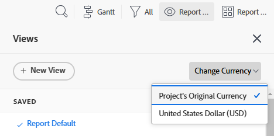
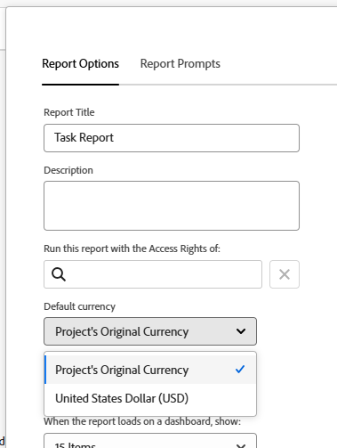

# Skapa rapporter om finansiella data med unika valutakurser

<!-- Audited: 11/2024 -->

Om flera valutakurser har konfigurerats i Adobe Workfront kan du ange ekonomiska värden i rapporter och listor som ska visas i en annan valuta än standardvalutan.

>[!IMPORTANT]
>
>Om du väljer en annan valuta än standardvalutan i en vy visas inte längre länkarna **Lägg till fler uppgifter** och **Lägg till fler problem** längst ned i projektlistan.

Mer information om hur du ändrar standardvalutan för ett visst projekt finns i [Ändra projektvalutan](../../../manage-work/projects/project-finances/change-project-currency.md).

Om det finns projekt med en enda valuta i rapporten visas summorna i grupperingar också i systemets standardvaluta.

## Åtkomstkrav

+++ Expandera om du vill visa åtkomstkrav för funktionerna i den här artikeln.

Du måste ha följande åtkomst för att kunna utföra stegen i den här artikeln:

<table style="table-layout:auto"> 
 <col> 
 <col> 
 <tbody> 
  <tr> 
   <td role="rowheader">Adobe Workfront-plan*</td> 
   <td> 
Alla
 </td> 
  </tr> 
  <tr> 
   <td role="rowheader">Adobe Workfront-licens*</td> 
   <td> 
      
Nytt:

         <ul>
         <li>
Standard
</li>
         </ul>
      
Aktuell:

         <ul>
         <li>
Plan
</li>
         </ul>
   </td>
  </tr> 
  <tr> 
   <td role="rowheader">Konfigurationer på åtkomstnivå*</td> 
   <td> 
Redigera åtkomst till rapporter, instrumentpaneler och kalendrar
 
Redigera åtkomst till filter, vyer, grupperingar
</td> 
  </tr> 
  <tr> 
   <td role="rowheader">Objektbehörigheter*</td> 
   <td> 
Hantera behörigheter i en rapport
</td> 
  </tr> 
 </tbody> 
</table>

*Mer information finns i [Åtkomstkrav i Workfront-dokumentation](/help/quicksilver/administration-and-setup/add-users/access-levels-and-object-permissions/access-level-requirements-in-documentation.md).

+++

## Förutsättningar

Innan du kan visa alternativa valutor enligt beskrivningen i det här avsnittet måste Workfront-administratören först aktivera och konfigurera flera valutor under Konfigurera i Workfront. Mer information finns i [Konfigurera valutakurser](../../../administration-and-setup/manage-workfront/exchange-rates/set-up-exchange-rates.md).

## Tillämpa ekonomiska värden på en rapport {#apply-financial-values-to-a-report}

Så här konverterar du ekonomiska värden mellan valutor när du arbetar med rapporter:

1. Gå till rapporten där du vill konvertera ekonomiska värden till en annan valuta.
1. Klicka på listrutan **Visa**, klicka på **Ändra valuta** och välj sedan en av följande valutor som du vill visa ekonomiska värden i:

   * Projektets ursprungliga valuta
   * Valfri annan valuta

     >[!TIP]
     >
     >Du kan bara välja valutor som tidigare har valts i Inställningar.

   Med det här alternativet kan du snabbt konvertera ekonomiska värden i en rapport mellan olika tariffvärden.

   

   <!--
   
(NOTE: drafted this tip because I think this is confusing; this is in the step above.)

   -->

   <!--
   <note type="tip">
   You can also select the Change Currency option to convert financial values in other lists.
    
   
    
    
   </note>
   -->

## Visa standardvalutan i flera projekt med olika valutor

När du anpassar valutan på projektnivå och vill visa information från alla projekt i samma rapport finns följande scenarier:

* Om du skapar en rapport som samlar in ekonomisk information från två eller flera projekt som har olika valutor, återspeglar grupperingssammanfattningen som standard systemets standardvaluta som valts av Workfront-administratören.
* Om du skapar en rapport för två eller flera projekt som har samma valuta, men som skiljer sig från systemets standardvaluta, visas summorna i grupperingarna med systemets standardvaluta.
* Om du skapar en rapport för två eller flera projekt som har jobbrolltilldelningar associerade med en valutaåsidosättning, konverterar Workfront den ekonomiska informationen från jobbrollens åsidosatta valutakurser till antingen projektets valuta (när du väljer projektets ursprungliga valuta i vyn) eller till en annan valuta som du väljer när du visar rapporten. Mer information om hur du åsidosätter valutan för en jobbroll finns i [Skapa och hantera jobbroller](../../../administration-and-setup/set-up-workfront/organizational-setup/create-manage-job-roles.md).

Så här visar du två projekt med anpassade valutor i en rapport:

1. Skapa två projekt med olika valutor.

   

1. Logga timmar i båda projekten.

   Mer information om loggningstid finns i [Loggtid](../../../timesheets/create-and-manage-timesheets/log-time.md).

1. Klicka på ikonen **Huvudmeny**  och klicka sedan på **Rapportering**.
1. Klicka på **Ny rapport** och sedan på **Projektrapport**.
1. Lägg till en **faktisk kostnad**-kolumn på fliken **Kolumner (Visa)** och sammanfatta den med **Summa**.

   Mer information om hur du skapar en kolumn finns i [Vyöversikt i Adobe Workfront](../../../reports-and-dashboards/reports/reporting-elements/views-overview.md).

1. Använd en **planerad slutförandegruppering** på fliken **Grupperingar**.

   Mer information om hur du skapar en gruppering finns i [Översikt över grupperingar i Adobe Workfront](../../../reports-and-dashboards/reports/reporting-elements/groupings-overview.md).

1. Lägg till ett filter för **Projektnamn** på fliken **Filter** och markera de två projekten med olika valutor.

   Mer information om hur du skapar ett filter finns i [Översikt över filter](../../../reports-and-dashboards/reports/reporting-elements/filters-overview.md).

1. Klicka på **Spara + Stäng**.

   Summan av den **faktiska kostnaden** visas i grupperingen med systemets standardvaluta, oavsett vilken valuta projekten i rapporten har.

   Om de två projekten har olika valutor, visas systemets standardvaluta även i rapportens gruppering.

## Visa projektvalutan i en rapport på projektnivå

Om en gruppering används för en uppgift eller timlista i ett projekt visas summorna i grupperingen i projektets valuta.

1. Skapa ett projekt med en annan anpassad valuta än systemets standardvaluta.
1. Gå till projektet och kontrollera att det innehåller timmar som har loggats för uppgifter.

   Mer information om loggningstid finns i [Loggtid](../../../timesheets/create-and-manage-timesheets/log-time.md).

   >[!NOTE]
   >
   >Uppgifterna ska tilldelas användare eller jobbroller med priset per timkostnad.

1. Klicka på **Åtgärder**.
1. Expandera den nedrullningsbara menyn **Visa** och välj **Ny vy**.
1. Lägg till **faktisk kostnad** i den nya vyn som en ny kolumn och sammanfatta den med **Summa**.
1. Klicka på **Klar** och sedan på **Spara vy**.
1. Expandera listrutan **Gruppering** och välj **Ny gruppering**.
1. Lägg till **Faktiskt slutförandedatum** i den nya grupperingen som ett nytt fält och klicka sedan på **Spara gruppering**.

   Kolumnen **Verklig kostnad** sammanfattar i den nya grupperingen och visar summan i projektets valuta.

## Redigera rapporter med unika valutor

De ekonomiska fälten i en rapport kan inte redigeras förrän du ändrar rapportinställningen så att den ursprungliga valutan för projekt visas.

Så här redigerar du ett ekonomiskt fält i en rapport:

1. Navigera till en rapport.

   >[!NOTE]
   >
   >Om standardvalutan inte visas för en lista i något annat område kan du redigera vyn så att standardvalutan visas.\
   >Mer information om hur du ändrar valutan i en vy finns i avsnittet i den här artikeln [Använda ekonomiska värden i en rapport](#apply-financial-values-to-a-report).

1. Klicka på **Rapportera åtgärder** och välj sedan **Redigera**.
1. Klicka på **Rapportinställningar**.
1. Klicka på listrutan **Standardvaluta** och välj sedan **Projektets ursprungliga valuta**.

   

1. Klicka på **Klar**.
