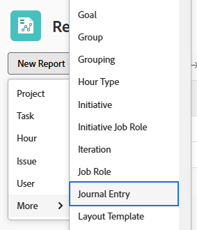
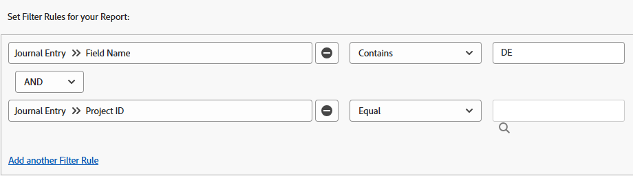
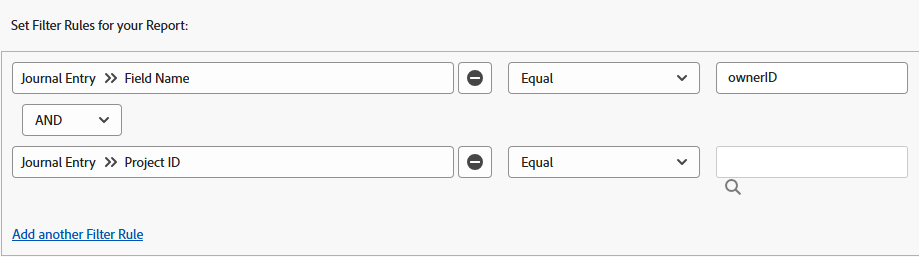

# Rapport om uppdateringsområdet

<!-- Audited: 11/2024 -->

Journalanmälningsrapporten innehåller systemuppdateringar från uppdateringsområdet för projekt, uppgifter, utgåvor och andra objekt som tidigare bara var tillgängliga via Adobe Workfront API. Även om det här är en avancerad rapport som är avsedd för specifika användningsområden, är det lättare för dig att rapportera om projektaktiviteter och systemuppdateringar i Workfront.

>[!TIP]
>
>Journalpostrapporten innehåller endast systemuppdateringar från objektens uppdateringsområde. Om du vill rapportera återstående kommentarer i uppdateringsområdet måste du använda anteckningsrapporten.\
>Mer information om anteckningsrapporten finns i [Visa alla uppdateringar i en anteckningsrapport](../../../workfront-basics/updating-work-items-and-viewing-updates/view-all-updates-in-a-report.md). ‍

Journalanmälningsrapporten kan visa:

* Hur många statusändringar som har gjorts
* När en uppgift eller ett problem har tagits bort
* Hur värden i viktiga anpassade fält ändrades under ett projekts livscykel
* Vilka viktiga datum som har ändrats under ett projekts livscykel
* Om ägaren till ett projekt har ändrats

## Åtkomstkrav

+++ Expandera om du vill visa åtkomstkrav för funktionerna i den här artikeln.

Du måste ha följande åtkomst för att kunna utföra stegen i den här artikeln:

<table style="table-layout:auto"> 
 <col> 
 <col> 
 <tbody> 
  <tr> 
   <td role="rowheader">Adobe Workfront</td> 
   <td> 
Alla
 </td> 
  </tr> 
  <tr> 
   <td role="rowheader">Adobe Workfront-licens</td> 
      <td> 
      
Nytt:

         <ul>
         <li>
Standard
</li>
         </ul>
      
Aktuell:

         <ul>
         <li>
Plan
</li>
         </ul>
   </td> 
  </tr> 
  <tr> 
   <td role="rowheader">Konfigurationer på åtkomstnivå</td> 
   <td> 
Redigera åtkomst till rapporter, instrumentpaneler och kalendrar
 
Redigera åtkomst till filter, vyer, grupperingar
 </td> 
  </tr> 
  <tr> 
   <td role="rowheader">Objektbehörigheter</td> 
   <td> 
Visa behörigheter för de objekt som innehåller journalposterna som du visar i rapporten
 
När du har skapat rapporten får du behörigheten Hantera
 </td> 
  </tr> 
 </tbody> 
</table>

*Mer information finns i [Åtkomstkrav i Workfront-dokumentation](/help/quicksilver/administration-and-setup/add-users/access-levels-and-object-permissions/access-level-requirements-in-documentation.md).

+++

## Förutsättningar

Innan du kan utföra de åtgärder som beskrivs i den här artikeln måste du kontrollera följande:

* Alla fält (inklusive anpassade fält) som du vill rapportera om spåras i Workfront. Du kan bara rapportera data från uppdateringsområdet som spåras.

  Mer information om hur du lägger till fält som du vill att Workfront ska spåra finns i [Konfigurera systemuppdateringar](../../../administration-and-setup/set-up-workfront/system-tracked-update-feeds/configure-system-updates.md).

## Översikt över journaltrans.

Eftersom rapporten Journal Entry frågar efter systemuppdateringar kan den returnera ett stort antal resultat. Därför rekommenderar vi att du filtrerar efter specifika objekt - som projekt, program, portföljer, grupper och så vidare - när du skapar rapporten.

Mer information om de olika objekttyperna i Workfront finns i [Förstå objekt i Adobe Workfront](../../../workfront-basics/navigate-workfront/workfront-navigation/understand-objects.md).

>[!NOTE]
>
>Eftersom journalpostrapporten returnerar så mycket data stöds inte export och schemalagd rapportleverans.

Standardvyn för den här rapporten innehåller följande kolumner:

<table style="table-layout:auto"> 
 <col> 
 <col> 
 <thead> 
  <tr> 
   <th>Fält</th> 
   <th>Förklaring</th> 
  </tr> 
 </thead> 
 <tbody> 
  <tr> 
   <td><strong>Fältnamn</strong> </td> 
   <td> 
Namnet på det påverkade fältet. Beroende på hur du har konfigurerat rapporten kan den här kolumnen innehålla fält för status, ägar-ID, aktivitetsnamn, planerat slutförandedatum eller annat. 
 
När  <strong>DE</strong>: visas i den här kolumnen indikerar det att fältet som visas är ett anpassat fält.
 </td> 
  </tr> 
  <tr> 
   <td><strong>Ändra typ</strong> </td> 
   <td> 
Den typ av ändring som har gjorts i det påverkade fältet. Beroende på vilka filterregler du har konfigurerat och vilka åtgärder som har vidtagits av användarna kan följande visas i det här fältet:
 
    <ul> 
     <li> 
Lägg till
 </li> 
     <li> 
Granskning
 </li> 
     <li> 
Ta bort
 </li> 
     <li> 
Digest
 </li> 
     <li> 
Redigera
 </li> 
     <li> 
Återställ
 </li> 
    </ul> </td> 
  </tr> 
  <tr> 
   <td><strong>Övre objektkod</strong> </td> 
   <td> 
Det högsta överordnade objektet i hierarkin.
 </td> 
  </tr> 
  <tr> 
   <td><strong>Omfång</strong> </td> 
   <td> 
Den typ av objekt som ändrades.
 </td> 
  </tr> 
  <tr> 
   <td><strong>Anmälningsdatum</strong> </td> 
   <td> 
Datumet då fältet ändrades.
 </td> 
  </tr> 
  <tr> 
   <td><strong>Redigerad av namn</strong> </td> 
   <td> 
Användaren som ändrade fältet.
 </td> 
  </tr> 
 </tbody> 
</table>

Om du vill ordna informationen i den här rapporten kan du använda den inbyggda grupperingen Projekt. Projektgrupperingen ger dig en primär gruppering av projektnamn och en sekundär gruppering av anmälningsdatum. Du kan använda den här befintliga grupperingen när du skapar en rapport eller använda den när du visar rapporten.

Mer information om hur du ställer in vyer, filter och grupperingar för rapporten finns i relevanta avsnitt:

<!--

(NOTE: from&nbsp;Luke: Take this for what it's worth, but part of me wonders if all of these subsections should be separate articles.

The biggest reason for breaking these up would be searchability, in my mind. For example, as a user, I might want to know how to see if the owner of a project changed. If I search the help site for that, I would be a lot more likely to find a separate article called "See if the owner of a project changed" vs an article titled "Create a Journal Entry report" because "Journal Entry" might mean nothing to me.) 

-->

* [Se vilka statusändringar som har gjorts](#see-what-status-changes-occurred)
* [Se när en uppgift eller ett problem togs bort](#see-when-a-task-or-issue-was-deleted)
* [Se hur anpassade fält ändrades under ett projekts livscykel](#see-how-custom-fields-changed-over-the-course-of-a-project-s-life-cycle)
* [Se hur det planerade slutförandedatumet ändrades under ett projekts livscykel](#see-how-the-planned-completion-date-changed-over-the-course-of-a-project-s-life-cycle)
* [Se om ägaren till ett projekt har ändrats](#see-if-the-owner-of-a-project-changed)

## Se vilka statusändringar som har gjorts {#see-what-status-changes-occurred}

Du kan ställa in journalpostrapporten så att den visar:

* Hur många statusändringar som gjorts för ett projekt, en uppgift eller ett ärende

* Tidigare status var före ändringen
* Vem har ändrat status
* När statusändringen ägde rum

Om du vill se ett projekts hälsotillstånd kan du även konfigurera rapporten så att samma information visas med hjälp av projektfältet **Villkor**.

Den här informationen kan användas för att hjälpa till med revision och för att illustrera hur väl du och din organisation planerar.

<!--

(NOTE:&nbsp;for tip below: When analytics adds the status option, update this note to say "these entries (status or condition changes)")

-->

>[!TIP]
>
>Om du vill jämföra skillnaden i dagar mellan villkorsändringar kan du använda Förbättrad analys.\
>Mer information om förbättrade analyser finns i [Översikt över förbättrade analyser](../../../enhanced-analytics/enhanced-analytics-overview.md).

1. Klicka på ikonen **[!UICONTROL Main Menu]**  i det övre högra hörnet av Adobe Workfront, eller (om den är tillgänglig) klicka på ikonen **[!UICONTROL Main Menu]**  i det övre vänstra hörnet och klicka sedan på **Rapporter**.
1. Klicka på **Ny rapport** och välj sedan **Journalpost**.

   

   Report builder läses in.

1. Lägg till följande kolumner på fliken **Kolumner (Visa)**:

   <table style="table-layout:auto"> 
    <col> 
    <col> 
    <thead> 
     <tr> 
      <th>Kolumn</th> 
      <th>Förklaring</th> 
     </tr> 
    </thead> 
    <tbody> 
     <tr> 
      <td> 
Fältnamn
 </td> 
      <td> 
Namnet på det påverkade fältet. I det här fallet bör <strong>status</strong> visas i den här kolumnen.
 </td> 
     </tr> 
     <tr> 
      <td> 
Ändra typ
 </td> 
      <td> 
Den typ av ändring som har gjorts i det påverkade fältet, till exempel <strong>Lägg till</strong>, <strong>Ta bort</strong> eller <strong>Redigera</strong>.
 </td> 
     </tr> 
     <tr> 
      <td> 
Redigerat efter namn
 </td> 
      <td> 
Namnet på den användare som uppdaterade statusen.
 </td> 
     </tr> 
     <tr> 
      <td> 
Anmälningsdatum
 </td> 
      <td> 
Datumet då statusen ändrades.
 </td> 
     </tr> 
     <tr> 
      <td> 
Gammalt textvärde
 </td> 
      <td> 
Nyckeln för föregående status. Här följer statusnycklarna för standardprojektstatusarna:
 
       <ul> 
        <li> 
 <strong>CUR</strong>: Aktuell
 </li> 
        <li> 
<strong>DÖD</strong>: Död
 </li> 
        <li> 
<strong>ONH</strong>: Väntande
 </li> 
        <li> 
<strong>PLN</strong>: Planering
 </li> 
        <li> 
<strong>CPL</strong>: Slutförd
 </li> 
        <li> 
<strong>REQ</strong>: Begärd
 </li> 
        <li> 
<strong>APR</strong>: Godkänd
 </li> 
        <li> 
<strong>REJ</strong>: Avvisad
 </li> 
        <li> 
<strong>IDA</strong>: Idea
 </li> 
       </ul> 
Om din organisation har konfigurerat anpassade statusvärden kan andra statusnycklar visas i den här kolumnen. Om du vill veta vilken anpassad status som är relaterad till en statusnyckel kontaktar du Workfront-administratören eller gruppadministratören.
 </td> 
     </tr> 
     <tr> 
      <td> 
Nytt textvärde
 </td> 
      <td> 
Nyckeln för den uppdaterade statusen.
 </td> 
     </tr> 
     <tr> 
      <td> 
Övre objektkod
 </td> 
      <td> 
Det högsta överordnade objektet för fältet som hade statusändringen.
 </td> 
     </tr> 
     <tr> 
      <td> 
Omfång
 </td> 
      <td> 
Den typ av objekt som fick statusändringen.
 </td> 
     </tr> 
     <tr> 
      <td> 
Ärendenamn   (valfritt)
 </td> 
      <td> 
Namnet på utgåvan som hade en statusändring.
 </td> 
     </tr> 
     <tr> 
      <td> 
Uppgiftsnamn  (valfritt)
 </td> 
      <td> 
Namnet på den uppgift som hade en statusändring.
 </td> 
     </tr> 
    </tbody> 
   </table>

   Mer information om hur du lägger till kolumner finns i [Vyöversikt i Adobe Workfront](../../../reports-and-dashboards/reports/reporting-elements/views-overview.md).

1. Klicka på **Lägg till en filterregel** på fliken **Filter** och lägg sedan till filterregeln **Fältnamn** > **Lika med** > **status**.

   

   >[!TIP]
   >
   >Om du vill rapportera om villkorsändringar kan du i stället lägga till filterregeln **Fältnamn** > **Lika med** > **Villkor**.

   Mer information om hur du lägger till filter finns i [Översikt över filter](../../../reports-and-dashboards/reports/reporting-elements/filters-overview.md).

1. (Valfritt) Lägg till en fråga om du vill begränsa rapportens fokus och minska inläsningstiderna.

   eller

   Skapa ytterligare filterregler för att inkludera specifika projekt, uppgifter eller problem.

   >[!IMPORTANT]
   >
   >Om du skapar en filterregel som använder modifieraren **Innehåller** kan inläsningstiden faktiskt öka. Därför rekommenderar vi att du använder en annan modifierare som **Lika** när det är möjligt för att filtrera efter ett visst projekt eller ett objekt-ID på högre nivå.

   Mer information om hur du lägger till en fråga finns i [Lägga till en fråga i en rapport](../../../reports-and-dashboards/reports/creating-and-managing-reports/add-prompt-report.md).

1. Klicka på **Använd en befintlig gruppering** på fliken **Grupperingar** och välj sedan **Projekt**.

   Mer information om hur du lägger till grupperingar finns i [Översikt över grupperingar i Adobe Workfront](../../../reports-and-dashboards/reports/reporting-elements/groupings-overview.md).

1. Klicka på **Spara + Stäng**.

   Din nya rapport läses in.

## Se när en uppgift eller ett problem har tagits bort {#see-when-a-task-or-issue-was-deleted}

Du kan ställa in journalpostrapporten så att den visar:

* Vilka uppgifter eller problem som har tagits bort
* Vem tog bort en uppgift eller ett problem

Så här ser du när en uppgift eller ett problem togs bort:

1. Klicka på ikonen **[!UICONTROL Main Menu]**  i det övre högra hörnet av Adobe Workfront, eller (om den är tillgänglig) klicka på ikonen **[!UICONTROL Main Menu]**  i det övre vänstra hörnet och klicka sedan på **Rapporter**.
1. Klicka på **Ny rapport** och välj sedan **Journalpost**.

   

   Report builder läses in.

1. Lägg till följande kolumner på fliken **Kolumner (Visa)**:

   <table style="table-layout:auto"> 
    <col> 
    <col> 
    <thead> 
     <tr> 
      <th>Kolumn</th> 
      <th>Förklaring</th> 
     </tr> 
    </thead> 
    <tbody> 
     <tr> 
      <td> 
Omfång
 </td> 
      <td> 
Den typ av objekt som togs bort.
 </td> 
     </tr> 
     <tr> 
      <td> 
Ändra typ
 </td> 
      <td> 
Den typ av ändring som inträffade. Ändringen <strong>Ta bort</strong> visas i den här kolumnen.
 </td> 
     </tr> 
     <tr> 
      <td> 
Anmälningsdatum
 </td> 
      <td> 
Datumet då uppgiften eller utgåvan togs bort.
 </td> 
     </tr> 
     <tr> 
      <td> 
Redigerat efter namn
 </td> 
      <td> 
Namnet på den användare som tog bort uppgiften eller utgåvan.
 </td> 
     </tr> 
     <tr> 
      <td> 
Projektnamn
 </td> 
      <td> 
Namnet på det projekt där uppgifter eller utgåvor togs bort.
 </td> 
     </tr> 
    </tbody> 
   </table>

   Mer information om hur du lägger till kolumner finns i [Vyöversikt i Adobe Workfront](../../../reports-and-dashboards/reports/reporting-elements/views-overview.md).

1. Klicka på **Lägg till filterregel** på fliken **Filter** och lägg sedan till följande filter:

   * **Ändra typ** > **Lika med** > **Ta bort**
   * **Projekt-ID** > **Lika med** > **&lt; projektnamn >**

     <!--WRITER check link; this png file has spaces
     -->

   Mer information om hur du lägger till filter finns i [Översikt över filter](../../../reports-and-dashboards/reports/reporting-elements/filters-overview.md).

1. (Valfritt) Lägg till en fråga om du vill begränsa rapportens fokus och minska inläsningstiderna.

   eller

   Skapa ytterligare filterregler för att inkludera specifika projekt, uppgifter eller problem.

   >[!IMPORTANT]
   >
   >Om du skapar en filterregel som använder modifieraren **Innehåller** kan inläsningstiden faktiskt öka. Därför rekommenderar vi att du använder en annan modifierare som **Lika** när det är möjligt för att filtrera efter ett visst projekt eller ett objekt-ID på högre nivå.

   Mer information om hur du lägger till en fråga finns i [Lägga till en fråga i en rapport](../../../reports-and-dashboards/reports/creating-and-managing-reports/add-prompt-report.md).

1. (Valfritt) Klicka på **Använd en befintlig gruppering** på fliken **Grupperingar** och välj sedan **Projekt**.

   Mer information om hur du lägger till grupperingar finns i [Översikt över grupperingar i Adobe Workfront](../../../reports-and-dashboards/reports/reporting-elements/groupings-overview.md).

1. Klicka på **Spara + Stäng**.

   Din nya rapport läses in.

## Se hur anpassade fält ändrades under ett projekts livscykel {#see-how-custom-fields-changed-over-the-course-of-a-project-s-life-cycle}

Du kan spåra viktiga fältändringar under projektets gång. Du kan ställa in journalposten så att den spårar:

* Om vissa anpassade fält lades till, uppdaterades eller redigerades
* När dessa ändringar gjordes
* Vem gjorde ändringarna

Så här ser du hur anpassade fält har ändrats under ett projekts livscykel:

1. Klicka på ikonen **[!UICONTROL Main Menu]**  i det övre högra hörnet av Adobe Workfront, eller (om den är tillgänglig) klicka på ikonen **[!UICONTROL Main Menu]**  i det övre vänstra hörnet och klicka sedan på **Rapporter**.
1. Klicka på **Ny rapport** och välj sedan **Journalpost**.

   

   Report builder läses in.

1. Se till att du har gjort det på fliken **Kolumner (Visa)** eller klicka på **Lägg till kolumn** för att lägga till följande kolumner:

   <table style="table-layout:auto"> 
    <col> 
    <col> 
    <thead> 
     <tr> 
      <th>Kolumn</th> 
      <th>Förklaring</th> 
     </tr> 
    </thead> 
    <tbody> 
     <tr> 
      <td> 
Fältnamn
 </td> 
      <td> 
Namnet på det anpassade fältet som påverkas.
 
När  <strong>DE</strong>: visas i den här kolumnen indikerar det att fältet som visas är ett anpassat fält.
 </td> 
     </tr> 
     <tr> 
      <td> 
Ändra typ
 </td> 
      <td> 
Den typ av ändring som har gjorts i det påverkade fältet, till exempel <strong>Lägg till</strong>, <strong>Ta bort</strong> eller <strong>Redigera</strong>.
 </td> 
     </tr> 
     <tr> 
      <td> 
Redigerat efter namn
 </td> 
      <td> 
Namnet på den användare som uppdaterade det anpassade fältet.
 </td> 
     </tr> 
     <tr> 
      <td> 
Anmälningsdatum
 </td> 
      <td> 
Det datum då värdet i det anpassade fältet ändrades.
 
Du bör sortera efter det här fältet i fallande ordning.
 </td> 
     </tr> 
     <tr> 
      <td> 
Gammalt nummervärde
 </td> 
      <td> 
Det föregående talvärdet i det anpassade fältet.
 </td> 
     </tr> 
     <tr> 
      <td> 
Nytt nummervärde
 </td> 
      <td> 
Det aktuella nummervärdet i det anpassade fältet.
 </td> 
     </tr> 
     <tr> 
      <td> 
Tidigare datumvärde
 </td> 
      <td> 
Föregående datumvärde i det anpassade fältet.
 </td> 
     </tr> 
     <tr> 
      <td> 
Nytt datumvärde
 </td> 
      <td> 
Det aktuella datumvärdet i det anpassade fältet.
 </td> 
     </tr> 
     <tr> 
      <td> 
Gammalt textvärde
 </td> 
      <td> 
Det tidigare textvärdet i det anpassade fältet.
 </td> 
     </tr> 
     <tr> 
      <td> 
Nytt textvärde
 </td> 
      <td> 
Det aktuella textvärdet i det anpassade fältet.
 
Om det anpassade fältet är ett typsnittsfält visas objekt-ID:t i kolumnen <strong>Nytt textvärde</strong> .
 </td> 
     </tr> 
    </tbody> 
   </table>

   Mer information om hur du lägger till kolumner finns i [Vyöversikt i Adobe Workfront](../../../reports-and-dashboards/reports/reporting-elements/views-overview.md).

1. Klicka på **Lägg till en filterregel** på fliken **Filter** och lägg sedan till följande filter:

   * **Fältnamn för journalpost** > **Innehåller** > **DE**

     >[!TIP]
     >
     >Om du vill begränsa den här rapporten till specifika anpassade fält lägger du till filterregeln **Fältnamn för journalpost** > **Lika med** > **&lt; namn på anpassat fält>**.

   * **Projekt-ID** > **Lika med** > **&lt; projekt >**.

   

   Mer information om hur du lägger till filter finns i [Översikt över filter](../../../reports-and-dashboards/reports/reporting-elements/filters-overview.md).

1. (Valfritt) Lägg till en fråga om du vill begränsa rapportens fokus och minska inläsningstiderna.

   eller

   Skapa ytterligare filterregler för att inkludera specifika projekt, uppgifter eller problem.

   >[!IMPORTANT]
   >
   >Om du skapar en filterregel som använder modifieraren **Innehåller** kan inläsningstiden faktiskt öka. Därför rekommenderar vi att du använder en annan modifierare som **Lika** när det är möjligt för att filtrera efter ett visst projekt eller ett objekt-ID på högre nivå.

   Mer information om hur du lägger till en fråga finns i [Lägga till en fråga i en rapport](../../../reports-and-dashboards/reports/creating-and-managing-reports/add-prompt-report.md).

1. Klicka på **Använd en befintlig gruppering** på fliken **Grupperingar** och välj sedan **Projekt**.

   Mer information om hur du lägger till grupperingar finns i [Översikt över grupperingar i Adobe Workfront](../../../reports-and-dashboards/reports/reporting-elements/groupings-overview.md).

1. Klicka på **Spara + Stäng**.

   Din nya rapport läses in.

## Se hur det planerade slutförandedatumet ändrades under ett projekts livscykel {#see-how-the-planned-completion-date-changed-over-the-course-of-a-project-s-life-cycle}

Du kan ställa in journalanmälningsrapporten för att visa hur ofta det planerade slutförandedatumet ändras under ett projekts livstid.

1. Klicka på ikonen **[!UICONTROL Main Menu]**  i det övre högra hörnet av Adobe Workfront, eller (om den är tillgänglig) klicka på ikonen **[!UICONTROL Main Menu]**  i det övre vänstra hörnet och klicka sedan på **Rapporter**.
1. Klicka på **Ny rapport** och välj sedan **Journalpost**.

   

   Report builder läses in.

1. Lägg till följande kolumner på fliken **Kolumner (Visa)**:

   <table style="table-layout:auto"> 
    <col> 
    <col> 
    <thead> 
     <tr> 
      <th>Kolumn</th> 
      <th>Förklaring</th> 
     </tr> 
    </thead> 
    <tbody> 
     <tr> 
      <td> 
Fältnamn
 </td> 
      <td> 
Namnet på det påverkade fältet.
 
När  <strong>DE</strong>: visas i den här kolumnen indikerar det att fältet som visas är ett anpassat fält.
 </td> 
     </tr> 
     <tr> 
      <td> 
Ändra typ
 </td> 
      <td>Den typ av ändring som inträffade, till exempel <strong>Lägg till</strong>, <strong>Ta bort</strong> eller <strong>Redigera</strong>.</td> 
     </tr> 
     <tr> 
      <td> 
Redigerat efter namn
 </td> 
      <td> 
Namnet på den användare som uppdaterade projektets planerade slutförandedatum.
 </td> 
     </tr> 
     <tr> 
      <td> 
Anmälningsdatum
 </td> 
      <td> 
Datumet då projektets planerade slutförandedatum ändrades.
 
Du bör sortera efter det här fältet i fallande ordning.
 </td> 
     </tr> 
     <tr> 
      <td> 
Övre objektkod
 </td> 
      <td> 
Det högsta överordnade objektet för det fält som hade ändrat planerat slutförandedatum.
 </td> 
     </tr> 
     <tr> 
      <td> 
Omfång
 </td> 
      <td> 
Det objekt som hade det planerade slutförandedatumet ändrat.
 </td> 
     </tr> 
     <tr> 
      <td> 
Tidigare datumvärde
 </td> 
      <td> 
Föregående värde för planerat slutförandedatum.
 </td> 
     </tr> 
     <tr> 
      <td> 
Nytt datumvärde
 </td> 
      <td> 
Det aktuella värdet för planerat slutförandedatum.
 </td> 
     </tr> 
     <tr> 
      <td> 
Projektnamn
 
(Valfritt)
 </td> 
      <td> 
Namnet på det projekt där det planerade slutförandedatumet ändrades.
 </td> 
     </tr> 
     <tr> 
      <td> 
Aktivitetsnamn
 
(Valfritt)
 </td> 
      <td> 
Namnet på aktiviteterna i projektet som hade det planerade slutförandedatumet ändrat.
 </td> 
     </tr> 
     <tr> 
      <td> 
Ärendenamn
 
(Valfritt)
 </td> 
      <td>Namnet på de utgåvor i projektet som har den planerade ändringen av slutförandedatum.</td> 
     </tr> 
    </tbody> 
   </table>

   Mer information om hur du lägger till kolumner finns i [Vyöversikt i Adobe Workfront](../../../reports-and-dashboards/reports/reporting-elements/views-overview.md).

1. Klicka på **Lägg till en filterregel** på fliken **Filter** och lägg sedan till följande:

   * **Fältnamn** > **Lika med** > **Datum**
   * **Projekt-ID** > **Lika med** > **&lt; projektnamn >**.

   

   Mer information om hur du lägger till filter finns i [Översikt över filter](../../../reports-and-dashboards/reports/reporting-elements/filters-overview.md).

1. (Valfritt) Lägg till en fråga om du vill begränsa rapportens fokus och minska inläsningstiderna.

   eller

   Skapa ytterligare filterregler för att inkludera specifika projekt, uppgifter eller problem.

   >[!IMPORTANT]
   >
   >Om du skapar en filterregel som använder modifieraren **Innehåller** kan inläsningstiden faktiskt öka. Därför rekommenderar vi att du använder en annan modifierare som **Lika** när det är möjligt för att filtrera efter ett visst projekt eller ett objekt-ID på högre nivå.

   Mer information om hur du lägger till en fråga finns i [Lägga till en fråga i en rapport](../../../reports-and-dashboards/reports/creating-and-managing-reports/add-prompt-report.md).

1. Klicka på **Använd en befintlig gruppering** på fliken **Grupperingar** och välj sedan **Projekt**.

   Mer information om hur du lägger till grupperingar finns i [Översikt över grupperingar i Adobe Workfront](../../../reports-and-dashboards/reports/reporting-elements/groupings-overview.md).

1. Klicka på **Spara + Stäng**.

   Din nya rapport läses in.

## Se om ägaren till ett projekt har ändrats {#see-if-the-owner-of-a-project-changed}

Du kan ställa in journalanmälningsrapporten för att visa hur många gånger projektägaren, eller projektledaren, ändras under ett projekts livslängd.

1. Klicka på ikonen **[!UICONTROL Main Menu]**  i det övre högra hörnet av Adobe Workfront, eller (om den är tillgänglig) klicka på ikonen **[!UICONTROL Main Menu]**  i det övre vänstra hörnet och klicka sedan på **Rapporter**.
1. Klicka på **Ny rapport** och välj sedan **Journalpost**.

   

   Report builder läses in.

1. Lägg till följande kolumner på fliken **Kolumner (Visa)**:

   <table style="table-layout:auto"> 
    <col> 
    <col> 
    <thead> 
     <tr> 
      <th>Kolumn</th> 
      <th>Förklaring</th> 
     </tr> 
    </thead> 
    <tbody> 
     <tr> 
      <td> 
Fältnamn
 </td> 
      <td>Namnet på det påverkade fältet. <strong>ownerID</strong> visas i den här kolumnen.</td> 
     </tr> 
     <tr> 
      <td> 
Ändra typ
 </td> 
      <td> 
Den typ av ändring som inträffade, till exempel <strong>Lägg till</strong>, <strong>Ta bort</strong> eller <strong>Redigera</strong>.
 </td> 
     </tr> 
     <tr> 
      <td> 
Övre objektkod
 </td> 
      <td> 
Det högsta överordnade objektet för det projekt som projektägaren uppdaterades för.
 </td> 
     </tr> 
     <tr> 
      <td> 
Anmälningsdatum
 </td> 
      <td>Datumet då projektägaren ändrades. Du bör sortera efter det här fältet i fallande ordning.</td> 
     </tr> 
     <tr> 
      <td> 
Redigerat efter namn
 </td> 
      <td> 
Namnet på den användare som uppdaterade projektägaren.
 </td> 
     </tr> 
     <tr> 
      <td> 
Ytterligare information 1
 </td> 
      <td> 
Projektets nuvarande ägare.
 </td> 
     </tr> 
     <tr> 
      <td> 
Ytterligare info 2
 </td> 
      <td> 
Den tidigare projektägaren för projektet.
 </td> 
     </tr> 
     <tr> 
      <td> 
Projektnamn
 </td> 
      <td> 
Projektet där fältet Projektägare uppdaterades.
 </td> 
     </tr> 
    </tbody> 
   </table>

   Mer information om hur du lägger till kolumner finns i [Vyöversikt i Adobe Workfront](../../../reports-and-dashboards/reports/reporting-elements/views-overview.md).

1. Klicka på **Lägg till filterregel** på fliken **Filter** och lägg sedan till följande:

   * **Fältnamn** > **Lika med** > **ownerID**
   * **Projekt-ID** > **Lika med** > **&lt; projektnamn >**.

   

   Mer information om hur du lägger till filter finns i [Översikt över filter](../../../reports-and-dashboards/reports/reporting-elements/filters-overview.md).

1. (Valfritt) Lägg till en fråga om du vill begränsa rapportens fokus och minska inläsningstiderna.

   eller

   Skapa ytterligare filterregler för att inkludera specifika projekt, uppgifter eller problem.

   >[!IMPORTANT]
   >
   >Om du skapar en filterregel som använder modifieraren **Innehåller** kan inläsningstiden faktiskt öka. Därför rekommenderar vi att du använder en annan modifierare som **Lika** när det är möjligt för att filtrera efter ett visst projekt eller ett objekt-ID på högre nivå.

   Mer information om hur du lägger till en fråga finns i [Lägga till en fråga i en rapport](../../../reports-and-dashboards/reports/creating-and-managing-reports/add-prompt-report.md).

1. (Valfritt) Klicka på **Använd en befintlig gruppering** på fliken **Grupperingar** och välj sedan **Projekt**.

   Mer information om hur du lägger till grupperingar finns i [Översikt över grupperingar i Adobe Workfront](../../../reports-and-dashboards/reports/reporting-elements/groupings-overview.md).

1. Klicka på **Spara + Stäng**.

   Den nya journalpostrapporten visas.
