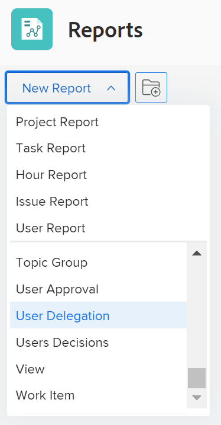

# Skapa en delegeringsrapport för användare

<!--Audited: 10/2024-->

<!--

(NOTE: consider moving this to the Custom&nbsp;View, Filter, Grouping Samples section as an example of a report)

-->

I Adobe Workfront kan användare delegera projekt, uppgifter och utfärda godkännanden till andra användare för att se till att deras godkännanden hanteras när de inte är på kontoret. Användare med en planlicens kan skapa en delegeringsrapport för användare för att se:

* Vem har delegerat sina uppgifter, utgåvor och projektgodkännanden till en annan användare
* Vilka användare som har delegerat uppgifter, utgåvor och projektgodkännanden som tilldelats dem

* Datum då delegationerna börjar och slutar

Mer information om hur du delegerar godkännanden finns i [Delegera godkännandebegäran](../../../review-and-approve-work/manage-approvals/delegate-approval-requests.md).

<!--

DRAFTED: To learn more about delegating work, see <a href="../../../workfront-basics/manage-your-account-and-profile/manage-time-off/personal-time-off.md" class="MCXref xref">Log personal time off and delegate your work</a>.

-->

<!--

DRAFTED: To learn how to manage delegated work in Home, see [future link here].

-->

## Åtkomstkrav

+++ Expandera om du vill visa åtkomstkrav för funktionerna i den här artikeln.

Du måste ha följande åtkomst för att kunna utföra stegen i den här artikeln:

<table style="table-layout:auto"> 
 <col> 
 <col> 
 <tbody> 
  <tr> 
   <td role="rowheader">Adobe Workfront</td> 
   <td> 
Alla
 </td> 
  </tr> 
  <tr> 
   <td role="rowheader">Adobe Workfront-licens*</td> 
   <td> 
Nytt: Standard 

   
Aktuell: Planera 
 </td> 
  </tr> 
  <tr> 
   <td role="rowheader">Konfigurationer på åtkomstnivå*</td> 
   <td> 
Redigera åtkomst till rapporter, instrumentpaneler och kalendrar
 
Redigera åtkomst till filter, vyer, grupperingar
 
Obs! Om du fortfarande inte har åtkomst frågar du Workfront-administratören om de anger ytterligare begränsningar för din åtkomstnivå. Mer information om hur en Workfront-administratör kan ändra åtkomstnivån finns i <a href="../../../administration-and-setup/add-users/configure-and-grant-access/create-modify-access-levels.md" class="MCXref xref">Skapa eller ändra anpassade åtkomstnivåer</a>.
 </td> 
  </tr> 
  <tr> 
   <td role="rowheader">Objektbehörigheter</td> 
   <td> 
Visa behörigheter för de objekt vars godkännanden har delegerats och för de användare som deltar i delegeringen
 
Mer information om hur du begär ytterligare åtkomst finns i <a href="../../../workfront-basics/grant-and-request-access-to-objects/request-access.md" class="MCXref xref">Begär åtkomst till objekt </a>.
 </td> 
  </tr> 
 </tbody> 
</table>

*Kontakta Workfront-administratören om du vill veta vilken plan, licenstyp eller åtkomst du har.
+++

## Skapa en delegeringsrapport för användare

1. Klicka på ikonen **Huvudmeny**  i det övre högra hörnet av Adobe Workfront och klicka sedan på **Rapporter**.

1. Klicka på **Ny rapport** och välj sedan **Användardelegering**.\
   

   Följande fält visas som standard i den här rapporten:

   | Fält | Beskrivning |
   |---|---|
   | **Från användare** | Det här är användaren som delegerar uppgifter, utgåvor och projektgodkännanden till en annan användare. |
   | **Till användare** | Det här är den användare som har delegerat uppgifter, utgåvor och projektgodkännanden till sig. |
   | **Startdatum** | Detta är början på frånvarotiden för användaren som har gjort delegeringarna. |
   | **Slutdatum** | Detta är slutet på frånvarotiden för användaren som har gjort delegeringarna. |

   {style="table-layout:auto"}

1. (Valfritt) Ändra följande i Report Builder:

   * Kolumner (vy)
   * Grupperingar
   * Filter
   * Diagram

   Mer information om de här funktionerna finns i [Skapa en anpassad rapport](../../../reports-and-dashboards/reports/creating-and-managing-reports/create-custom-report.md).

1. När du är klar med att skapa rapporten klickar du på **Spara + stäng**.

   Rapporten visas.
