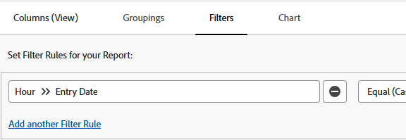

# Filtrera rapporter efter tidsramar

<!-- Audited: 4/2025 -->

Du kan filtrera en rapport efter tidsramen för ett datum som finns i ett objekt. Du kan t.ex. filtrera en timrapport för en viss tidsram när timmarna angavs.

## Åtkomstkrav

+++ Expandera om du vill visa åtkomstkrav för funktionerna i den här artikeln.

Du måste ha följande åtkomst för att kunna utföra stegen i den här artikeln:

<table style="table-layout:auto"> 
 <col> 
 <col> 
 <tbody> 
  <tr> 
   <td role="rowheader">Adobe Workfront</td> 
   <td> 
Alla
 </td> 
  </tr> 
  <tr> 
   <td role="rowheader">Adobe Workfront-licens</td> 
      <td> 
      
Nytt: Standard

       
 eller

      
Aktuell: Planera

   </td>

</tr> 
  <tr> 
   <td role="rowheader">Konfigurationer på åtkomstnivå</td> 
   <td> 
Redigera åtkomst till rapporter, instrumentpaneler och kalendrar
 
Redigera åtkomst till filter, vyer, grupperingar
</td> 
  </tr> 
  <tr> 
   <td role="rowheader">Objektbehörigheter</td> 
   <td> 
Hantera behörigheter i en rapport
</td> 
  </tr> 
 </tbody> 
</table>

Mer information om informationen i den här tabellen finns i [Åtkomstkrav i Workfront-dokumentationen](/help/quicksilver/administration-and-setup/add-users/access-levels-and-object-permissions/access-level-requirements-in-documentation.md).

+++

## Förutsättningar

Rapporten måste skapas innan du kan filtrera resultaten.

Mer information om hur du skapar rapporter finns i [Skapa en rapport](../../../reports-and-dashboards/reports/creating-and-managing-reports/create-report.md).

## Filtrera en rapport efter tidsramen för ett datum {#filter-a-report-by-the-timeframe-of-a-date}

{{step1-to-reports}}

1. Klicka på **Ny rapport** i det övre vänstra hörnet och välj sedan den typ av rapport som du vill skapa.

1. Välj fliken **Filter** på sidan **Ny rapport**.

1. Klicka på **Lägg till en filterregel** och **Välj ett fält**.

1. I dialogrutan **Välj ett fält** väljer du **Timme** och sedan **Postdatum**.
   

1. Välj något av följande alternativ i listrutan som visas:

   <table style="table-layout:auto"> 
    <col> 
    <col> 
    <tbody> 
     <tr> 
      <td role="rowheader">Likvärdigt (skiftlägeskänsligt)</td> 
      <td>När du har valt den här modifieraren anger du datumet då timmarna angavs.</td> 
     </tr>

   <tr> 
      <td role="rowheader">Inte lika med (skiftlägeskänslig)</td> 
      <td>När du har valt den här modifieraren anger du datumet när timmarna angavs för att utesluta det här datumet från rapporten. Rapporten visar timmar som loggats in på alla datum, förväntat för det datum du angav.</td> 
     </tr>

   <tr> 
      <td role="rowheader">Mindre än</td> 
      <td>När du har valt den här modifieraren anger du ett datum före vilket timmarna angavs. Rapporten visar timmar som angetts före det angivna datumet, exklusive det angivna datumet.</td> 
     </tr>

   <tr> 
      <td role="rowheader">Mindre än lika med</td> 
      <td>När du har valt den här modifieraren anger du ett datum före vilket timmarna angavs. Rapporten visar timmar som angetts före det angivna datumet, inklusive det angivna datumet.</td> 
     </tr>

   <tr> 
      <td role="rowheader">Större än</td> 
      <td>När du har valt den här modifieraren anger du ett datum efter vilket timmarna angavs. Rapporten visar timmar som angetts efter det angivna datumet, exklusive det angivna datumet.</td> 
     </tr>

   <tr> 
      <td role="rowheader">Större än lika</td> 
      <td> När du har valt den här modifieraren anger du ett datum efter vilket timmarna angavs. Rapporten visar timmar som angetts efter det angivna datumet, inklusive det angivna datumet. </td> 
     </tr>

   <tr> 
      <td role="rowheader">Mellan</td> 
      <td>När du har valt den här modifieraren anger du ett datumintervall när timmarna angavs. Rapporten visar antal timmar som angetts mellan de angivna datumen.</td> 
     </tr>

   <tr> 
      <td role="rowheader">Null</td> 
      <td>Välj den här modifieraren om du bara vill visa timmar där transaktionsdatumet saknas.</td> 
     </tr>

   <tr> 
      <td role="rowheader">Inte null</td> 
      <td>Välj den här modifieraren om du bara vill visa timmar där bokföringsdatumet har ett värde.</td> 
     </tr>

   </tbody> 
   </table>

1. Klicka på **Spara + Stäng**.

## Inbyggda tidsramsmodifierare {#built-in-timeframe-modifiers}

Adobe Workfront har inbyggda tidsramsmodifierare som du kan använda utan att definiera ett visst datum. Dessa modifierare är tillgängliga för alla datumfält i ett filter eller en uppmaning i en rapport.

Om du till exempel skapar en timrapport och vill visa timmar som angetts under en viss tidsram kan du välja bland följande inbyggda alternativ för tidsramsfilter:

<table style="table-layout:auto"> 
 <col> 
 <col> 
 <tbody> 
  <tr> 
   <td role="rowheader">Idag</td> 
   <td>Visar timmar där anmälningsdatumet är idag.</td> 
  </tr> 
  <tr> 
   <td role="rowheader">Den här veckan</td> 
   <td>Visar timmar där anmälningsdatumet är ett datum i den aktuella veckan, där veckan börjar på en söndag och slutar på en lördag.</td> 
  </tr> 
  <tr> 
   <td role="rowheader">Nästa vecka</td> 
   <td>Visar timmar där anmälningsdatumet är ett datum i veckan efter den aktuella veckan, där veckan börjar på en söndag och slutar på en lördag. </td> 
  </tr> 
  <tr> 
   <td role="rowheader">Förra veckan</td> 
   <td>Visar timmar där anmälningsdatumet är ett datum i veckan före den aktuella veckan, där veckan börjar på en söndag och slutar på en lördag. </td> 
  </tr> 
  <tr> 
   <td role="rowheader">Den här månaden</td> 
   <td>Visar timmar där anmälningsdatumet är ett datum i den aktuella månaden.</td> 
  </tr> 
  <tr> 
   <td role="rowheader">Nästa månad</td> 
   <td>Visar timmar där anmälningsdatumet är ett datum i månaden efter den aktuella månaden.</td> 
  </tr> 
  <tr> 
   <td role="rowheader">Förra månaden</td> 
   <td>Visar timmar där anmälningsdatumet är ett datum i månaden före den aktuella månaden</td> 
  </tr> 
  <tr> 
   <td role="rowheader">Detta kvartal</td> 
   <td> 
Visar timmar där anmälningsdatumet är ett datum i det aktuella kvartalet, där kvartal definieras som:
 
    <ul> 
     <li>Första kvartalet: 1 januari - 30 mars</li> 
     <li>Andra kvartalet: 1 april - 30 juni</li> 
     <li>Tredje kvartalet: 1 juli - 30 september</li> 
     <li>Fjärde kvartalet: 1 oktober - 31 december</li> 
    </ul> </td> 
  </tr> 
  <tr> 
   <td role="rowheader">Nästa kvartal</td> 
   <td>Visar timmar där transaktionsdatumet är ett datum i kvartalet efter det aktuella kvartalet, där kvartal definieras ovan.</td> 
  </tr> 
  <tr> 
   <td role="rowheader">Sista kvartalet</td> 
   <td> 
Visar timmar där anmälningsdatumet är ett datum under det kvartal som föregår det aktuella kvartalet, där kvartal definieras ovan.
 
Obs! Om din Workfront-administratör har aktiverat och definierat anpassade kvartal för ditt system, ersätts de inbyggda filtren för kvartal med din anpassade kvartalsinformation. Mer information om att aktivera anpassade kvartal finns i <a href="../../../administration-and-setup/set-up-workfront/configure-system-defaults/enable-custom-quarters-projects.md" class="MCXref xref">Aktivera anpassade kvartal för projekt</a>.
 </td> 
  </tr> 
  <tr> 
   <td role="rowheader">Detta år</td> 
   <td>Visar timmar där anmälningsdatumet är ett datum i det aktuella året, där det aktuella året börjar den 1 januari och slutar den 31 december.</td> 
  </tr> 
  <tr> 
   <td role="rowheader">Senaste året</td> 
   <td>Visar timmar där transaktionsdatumet är ett datum under det föregående året, där det föregående året börjar 12 månader före det aktuella datumet.</td> 
  </tr> 
  <tr> 
   <td role="rowheader">Förra året</td> 
   <td> 
Visar timmar där anmälningsdatumet är ett datum i det sista året, där det sista året börjar den 1 januari och slutar den 31 december året före det aktuella året.
 
Obs! Det finns ingen inbyggd tidsperiod för räkenskapsåret. Du kan skapa en rapport och filtrera informationen efter datum med en anpassad modifierare för räkenskapsårets datumintervall, så som det definieras i din organisation. Om du vill välja en tidsram för ett räkenskapsår på plats bör du använda en uppmaning i stället för ett filter. 
 </td> 
  </tr> 
 </tbody> 
</table>
