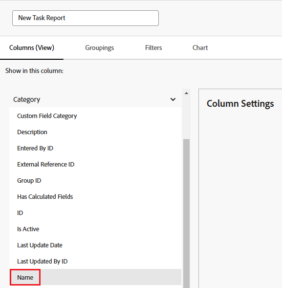
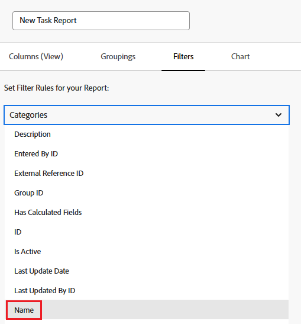
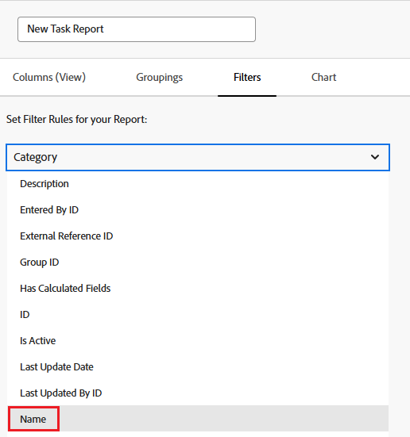

# Referera till ett anpassat formulär i en rapport

Du kan referera till de anpassade formerna för ett objekt i rapporten Vyer, Filter och grupperingar för det objektet.

Du kan referera till innehållet i anpassade formulär som ska inkluderas i en rapport, eller så kan du referera till information om de anpassade formulären som ska inkluderas i en rapport.

## Åtkomstkrav

Du måste ha följande åtkomst för att kunna utföra stegen i den här artikeln:

<table style="table-layout:auto"> 
 <col> 
 <col> 
 <tbody> 
  <tr> 
   <td role="rowheader">Adobe Workfront-plan*</td> 
   <td> 
Alla
 </td> 
  </tr> 
  <tr> 
   <td role="rowheader">Adobe Workfront-licens*</td> 
   <td> 
Plan 
 </td> 
  </tr> 
  <tr> 
   <td role="rowheader">Konfigurationer på åtkomstnivå*</td> 
   <td> 
Redigera åtkomst till rapporter, instrumentpaneler och kalendrar
 
Redigera åtkomst till filter, vyer, grupperingar
 
Obs! Om du fortfarande inte har åtkomst frågar du Workfront-administratören om de anger ytterligare begränsningar för din åtkomstnivå. Information om hur en Workfront-administratör kan ändra åtkomstnivån finns i <a href="../../../administration-and-setup/add-users/configure-and-grant-access/create-modify-access-levels.md" class="MCXref xref">Skapa eller ändra anpassade åtkomstnivåer</a>.
 </td> 
  </tr> 
  <tr> 
   <td role="rowheader">Objektbehörigheter</td> 
   <td> 
Hantera behörigheter i en rapport
 
Mer information om hur du begär ytterligare åtkomst finns i <a href="../../../workfront-basics/grant-and-request-access-to-objects/request-access.md" class="MCXref xref">Begär åtkomst till objekt </a>.
 </td> 
  </tr> 
 </tbody> 
</table>

&#42;Kontakta Workfront-administratören om du vill veta vilken plan, licenstyp eller åtkomst du har.

## Förutsättningar

Det anpassade formuläret måste finnas innan du kan referera till det i en rapport.

Mer information om hur du skapar anpassade formulär finns i [Skapa eller redigera ett anpassat formulär](../../../administration-and-setup/customize-workfront/create-manage-custom-forms/create-or-edit-a-custom-form.md).

## Referera innehållet i anpassade formulär

Du kan referera till fält i anpassade formulär. När ett anpassat formulär har tillämpats på ett objekt är alla fält som är kopplade till det anpassade formuläret tillgängliga för referens i en rapport, precis som andra fält på objektet.

>[!NOTE]
>
>För fält som har flera alternativ är alla alternativ tillgängliga i rapportens filter och uppmaningar, inklusive de som är dolda.\
>Mer information om hur du döljer alternativ för ett anpassat fält med flera alternativ finns i artikeln [Skapa eller redigera ett anpassat formulär](../../../administration-and-setup/customize-workfront/create-manage-custom-forms/create-or-edit-a-custom-form.md).

När du skapar rapporten använder du bara formulärets objekttyp som fältkälla och använder namnet på det anpassade fältet som fältnamn.

Du kan till exempel ha ett anpassat formulär tillämpat på alla projekt som innehåller det anpassade fältet **Konsult**. Använd **Projekt** objekttyp som fältkälla och använd **Konsult** som fältnamn. Ange filterkvalificeraren till **Jämn**, skriver du Olivia Kim.

Mer information om hur du skapar en rapport finns i artikeln [Skapa en anpassad rapport](../../../reports-and-dashboards/reports/creating-and-managing-reports/create-custom-report.md).

## Referensinformation om anpassade formulär

Du kan referera till information om anpassade formulär, t.ex. namnet på anpassade formulär som är kopplade till ett objekt.

&#x200B; Beroende på elementet (Visa, Filter eller Gruppering) kan du antingen referera till:

* Det primära anpassade formuläret som används på ett objekt:

   Det här är det formulär som visas först på objektets detaljsida.

* Alla anpassade formulär (om mer än ett anpassat formulär används på ett objekt)

Du kan referera till anpassade formulär i vyer, filter och grupperingar:

* [Referera anpassade formulär i en rapportvy (kolumn)](#reference-custom-forms-in-a-report-view-column)
* [Referera anpassade formulär i ett rapportfilter](#reference-custom-forms-in-a-report-filter)
* [Referera till anpassade formulär i en rapportgruppering](#reference-custom-forms-in-a-report-grouping)

### Referera anpassade formulär i en rapportvy (kolumn) {#reference-custom-forms-in-a-report-view-column}

Så här visar du alla anpassade formulär som är kopplade till ett objekt:

1. Börja skapa en rapport enligt beskrivningen i artikeln [Skapa en anpassad rapport](../../../reports-and-dashboards/reports/creating-and-managing-reports/create-custom-report.md).
1. På **Kolumner** utökar du objekttypen som det anpassade formulär som du vill referera till används på och klickar sedan på **Kategorinamn**.\
   Om du till exempel vill visa alla anpassade formulär som är kopplade till en uppgift expanderar du **Uppgift** fältkälla, klicka sedan på **Kategorinamn** fältnamn.\
   

Så här visar du endast det primära anpassade formuläret som är associerat med objektet:

1. Börja skapa en rapport enligt beskrivningen i artikeln [Skapa en anpassad rapport](../../../reports-and-dashboards/reports/creating-and-managing-reports/create-custom-report.md).
1. På **Kolumner** -fliken, expandera **Kategori** fältkälla, klicka sedan på **Namn** fältnamn.\
   

### Referera anpassade formulär i ett rapportfilter {#reference-custom-forms-in-a-report-filter}

Så här filtrerar du alla anpassade formulär som är associerade med objekttypen:

1. Börja skapa en rapport enligt beskrivningen i artikeln [Skapa en anpassad rapport](../../../reports-and-dashboards/reports/creating-and-managing-reports/create-custom-report.md).
1. På **Filter** flik, expandera **Kategorier** och sedan klicka **Namn**.\
   

1. Välj den villkorskvalificerare som du vill använda:

   * Är tom
   * Är inte tom
   * Innehåller
   * Innehåller inte
   * Jämn
   * Inte lika med

   Mer information om respektive kvalificerare finns i artikeln [Filter- och villkorsmodifierare](../../../reports-and-dashboards/reports/reporting-elements/filter-condition-modifiers.md).

   >[!NOTE]
   >
   >Om fältet som du filtrerar efter har flera alternativ och du använder **Inte lika med** eller **Innehåller inte** -kvalificerare, filtrerar bort resultat som bara innehåller det val du anger. Om fältet innehåller ytterligare alternativ, inklusive det angivna, filtreras inte dessa resultat från rapporten. Detta inkluderar filtrering för flera anpassade Forms om de är kopplade till samma objekt.

1. Börja skriva namnet på det anpassade formulär som du vill filtrera på och klicka sedan på namnet när det visas i listrutan.
1. (Valfritt) Klicka på **Lägg till en annan filterregel** och sedan upprepa steg 2-4 för att skapa ytterligare filterregler.
1. Klicka **Spara+stäng**.

Om du bara vill filtrera det primära anpassade formuläret som är associerat med objekttypen:

1. Börja skapa en rapport enligt beskrivningen i artikeln [Skapa en anpassad rapport](../../../reports-and-dashboards/reports/creating-and-managing-reports/create-custom-report.md).
1. På **Filter** -fliken, expandera **Kategori** fältkälla, klicka sedan på **Namn** fältnamn.\
   

1. Välj den villkorskvalificerare som du vill använda:

   * Är tom
   * Är inte tom
   * Innehåller
   * Innehåller inte
   * Jämn
   * Inte lika med

   Mer information om respektive kvalificerare finns i artikeln [Filter- och villkorsmodifierare](../../../reports-and-dashboards/reports/reporting-elements/filter-condition-modifiers.md).

1. Börja skriva namnet på det anpassade formulär som du vill filtrera på och klicka sedan på namnet när det visas i listrutan.
1. (Valfritt) Klicka på **Lägg till en annan filterregel** och sedan upprepa steg 2-4 för att skapa ytterligare filterregler.
1. Klicka **Spara+stäng**.

### Referera till anpassade formulär i en rapportgruppering {#reference-custom-forms-in-a-report-grouping}

>[!NOTE]
>
>Du kan bara gruppera objekt efter det primära anpassade formulär som är associerat med objektet; Du kan inte gruppera objekt efter alla formulär som är kopplade till objektet.

1. Börja skapa en rapport enligt beskrivningen i artikeln [Skapa en anpassad rapport](../../../reports-and-dashboards/reports/creating-and-managing-reports/create-custom-report.md).
1. På **Grupperingar** flik, expandera **Kategori** och sedan klicka **Namn**.\
   
