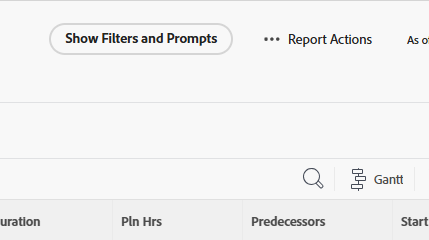

# Köra en rapport

Du kan köra alla rapporter som du har åtkomst till Visa.

<!-- Audited: 11/2024 -->

<!--
NOTE: ***Linked to Getting Started with Reporting.***This information is obsolete, because asynchronous timeline is not enabled for all customers (used to be included in the "Viewing a Cached Report" section): Some reports in Workfront can take a significant time to load. If your report takes longer than 30 seconds to load, your report is cached after it is finished loading, and a message is displayed in the upper-right corner of the page indicating that the report being viewed is a saved report from a specific time.

After a report is cached, it is available for the next 12 hours. Any user who runs the report (as described in "Running a Report") sees the cached report.)
-->

## Åtkomstkrav

+++ Expandera om du vill visa åtkomstkrav för funktionerna i den här artikeln.

Du måste ha följande åtkomst för att kunna utföra stegen i den här artikeln:

<table style="table-layout:auto"> 
 <col> 
 </col> 
 <col> 
 </col> 
 <tbody> 
  <tr> 
   <td role="rowheader">Adobe Workfront-plan*</td> 
   <td> 
Alla
 </td> 
  </tr> 
  <tr> 
   <td role="rowheader">Adobe Workfront-licens*</td> 
      <td> 
      
Nytt:

         <ul>
         <li>
Standard
</li>
         </ul>
      
Aktuell:

         <ul>
         <li>
Plan
</li>
         </ul>
   </td>
  </tr> 
  <tr> 
   <td role="rowheader">Konfigurationer på åtkomstnivå*</td> 
   <td> 
Visa åtkomst till rapporter, instrumentpaneler och kalendrar
</td> 
  </tr> 
  <tr> 
   <td role="rowheader">Objektbehörigheter</td> 
   <td> 
Visa behörigheter till en rapport
</td> 
  </tr> 
 </tbody> 
</table>

*Mer information finns i [Åtkomstkrav i Workfront-dokumentation](/help/quicksilver/administration-and-setup/add-users/access-levels-and-object-permissions/access-level-requirements-in-documentation.md).

+++

## Köra en rapport

1. Klicka på ikonen **[!UICONTROL Main Menu]**  i det övre högra hörnet av Adobe Workfront, eller (om den är tillgänglig) klicka på **[!UICONTROL Main Menu]** -ikonen  i det övre vänstra hörnet och klicka sedan på **[!UICONTROL Reports]**.

1. Välj bland följande alternativ:

   * **Mina rapporter:** Rapporter som du har skapat.
   * **Delad med mig:** Rapporter som andra användare har delat med dig.
   * **Alla rapporter:** Alla rapporter i systemet som du har åtkomst till.

1. Klicka på namnet på rapporten som du vill köra.\
   eller\
   Om rapporten skapades med hjälp av uppmaningar väljer du lämplig information i listrutorna och klickar sedan på **Kör rapport**.\
   Mer information om uppmaningar finns i [Lägga till en uppmaning i en rapport](../../../reports-and-dashboards/reports/creating-and-managing-reports/add-prompt-report.md).\
   Innehållet i rapporten visas med en tidsstämpel i rapportens övre högra hörn som innehåller datum, tid och tidszon när rapporten kördes från den användare som körde rapporten.

1. (Valfritt) Klicka på ikonen **Läs in igen**  för att uppdatera resultatet i en rapport om rapporten har visats i webbläsaren ett tag.

1. (Villkorligt) Om rapporten innehåller filter eller uppmaningar klickar du på **Visa filter och uppmaningar** för att visa en lista med filter och uppmaningar som används i den rapport som du visar. Om rapporten bara innehåller filter eller endast uppmaningar visas **Visa filter** eller **Visa frågor** i stället.

   

   Informationen visas under rapportnamnet till vänster på sidan. För uppmaningar är detta information om de uppmaningsval som gjordes när rapporten kördes, enligt beskrivningen i steg 3.

1. Om du använder anpassade uppmaningar visas de inte. Endast systemuppmaningarna visas. Egna filter visas alltid.

## Visa en cachelagrad rapport

Din rapport kan cachelagras om den har visats i webbläsaren ett tag. Du kan tvinga en cachelagrad rapport att läsas in igen när du utför någon av följande åtgärder:

* Redigera rapportinställningarna och spara rapporten.
* Ändra vy, grupp eller filter.
* Klicka på ikonen **Läs in igen** 
Det här alternativet är tillgängligt i det övre högra hörnet på sidan i meddelanderutan som anger när rapporten sparades, eller så är det tillgängligt i det övre högra hörnet av instrumentpanelen som rapporten placeras på. Mer information om hur du läser in instrumentpaneler igen finns i avsnittet Visa instrumentpaneler i artikeln [Kom igång med instrumentpaneler](../../../reports-and-dashboards/dashboards/understanding-dashboards/get-started-dashboards.md).

* Gå till flikarna Sammanfattning, Matris eller Diagram för att få åtkomst till alla sidor i rapporten efter den första sidan.
