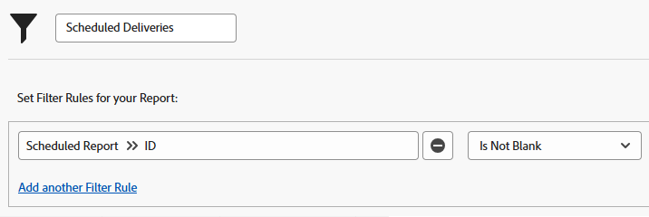

# Översikt över rapportleverans

<!-- Audited: 11/2024 -->

<!--

(NOTE: This is linked to the UI in the Send Report box inside the Preview sandbox. If you change title, log bug for Dev to fix the link) 

-->

Du kan schemalägga rapporter som ska levereras automatiskt till användarna enligt ett angivet schema, eller så kan du skicka rapporter manuellt en gång. När du skickar en rapport från Adobe Workfront får användaren ett e-postmeddelande med Workfront-rapporten i en separat bifogad fil.

Mer information om hur du konfigurerar en rapport för leverans finns i artikeln [Boka en automatisk rapportleverans](../../../reports-and-dashboards/reports/creating-and-managing-reports/set-up-automatic-report-delivery.md).

Du kan inte schemalägga rapporter för leverans eller leverera dem manuellt i sandlådemiljön för förhandsgranskning. Mer information om förhandsvisningssandlådan finns i artikeln [The Adobe Workfront Preview Sandbox Environment](../../../administration-and-setup/set-up-workfront/workfront-testing-environments/wf-preview-sandbox-environment.md).\
Mer information om hur du levererar rapporter i sandlådemiljön för förhandsgranskning finns i artikeln [Skicka en rapport i sandlådemiljön för förhandsgranskning](../../../reports-and-dashboards/reports/creating-and-managing-reports/send-report-preview-sandbox-environment.md).

## Rapportleveransbegränsningar

<!--

(NOTE: [! This information is shared between "Exporting Data" and "Setting Up Report Deliveries."])

-->

Tänk på följande när du planerar leveransrapporter:

* Du kan schemalägga upp till 10 upprepade rapportleveranser för en viss rapport.
* Du kan schemalägga att en rapport ska levereras endast om du har skapat rapporten. Om du behöver skicka en rapport som du inte har skapat kan du skicka den manuellt.

## Exportbegränsningar

Det finns flera storleksbegränsningar som påverkar hur rapporter visas i Workfront och hur de exporteras via manuell export, en levererad rapport eller via API:t:

* **10 MB filstorlek:** Filstorleksgräns för exporterade rapporter som schemalagts för leverans. Om en exporterad fil som bifogas till ett e-postmeddelande är större än 5 MB, skickas en länk dit filen kan hämtas via e-post i stället för den bifogade exporterade rapporten.

  >[!NOTE]
  >
  >Excel.xlsx-filer som är större än 10 MB genererar inget e-postmeddelande. Du kan exportera rapporten manuellt till det här formatet. Mer information om att exportera rapporter finns i [Exportera data](../../../reports-and-dashboards/reports/creating-and-managing-reports/export-data.md).

* **50 000 rader:** Antalet rader med data som tillåts i en rapportexport för pdf- och tabbavgränsade filer.

  För Excel .xls-filer är gränsen **65 000 rader**.

  För Excel .xlsx-filer är den här gränsen **100 000 rader**.

  Dessa begränsningar utesluter kolumnrubriker samt rader för grupperingar i rapporten. Om du t.ex. har 6 grupperingar i en rapport och 50 000 rader data, kommer den exporterade filen att ha 50 000 rader.

  Om rapporten innehåller fler objekt än dessa gränser visas ett felmeddelande om att exporten och leveransen av rapporten inte lyckas. Minska antalet objekt som visas på skärmen till ett tal som är mindre än eller lika med dessa gränser för att kunna leverera resultatet. Om du vill exportera alla data rekommenderar vi att du använder filter för att få mindre mängder data och sedan utföra flera exporter. Mer information finns i [Översikt över filter](../../../reports-and-dashboards/reports/reporting-elements/filters-overview.md).

  Dessa begränsningar gäller för

   * Manuell export av en rapport.
   * En schemalagd rapport.
   * En export via en API-integrering.
   * Data som exporteras med en snabbstart.

     Mer information om hur du exporterar data via snabbstart finns i artikeln [Exportera data från Adobe Workfront via snabbstart](../../../administration-and-setup/manage-workfront/using-kick-starts/export-data-from-wf-via-kick-starts.md).

     >[!NOTE]
     >
     >Du kan exportera 50 000 rader i en snabbstartfil, men bara till en Excel-formatfil.

   * Exporterar användningsinformation för ett projekt.

     Mer information om hur du exporterar användningsinformation för ett projekt finns i [Översikt över resursanvändningsrapporten](../../../reports-and-dashboards/reports/using-built-in-reports/resource-utilization-report.md).

* **65,530 hyperlänkar:** Det här är en gräns som Excel har angett för dokument som innehåller fler än 65 530 hyperlänkar. Dessa dokument kan inte öppnas när de exporteras manuellt eller skickas i en levererad rapport. Observera att ett Excel-dokument kanske bara innehåller 200 rader med data, men att dokumentet inte öppnas om det finns fler än 65 530 länkar i dokumentet. Den här gränsen gäller endast för Excel-filer, inte för andra format som stöds.
* **256 kolumner**: Det här är en gräns som Excel har angett för dokument som innehåller fler än 256 kolumner. Dessa dokument kan inte exporteras manuellt eller skickas i en levererad rapport. Den här gränsen gäller endast för Excel-filer, inte för andra format som stöds.

Om du försöker exportera data utanför gränsen kanske du inte får alla förväntade data i exporten. En ändrad rapport skapas i stället inom gränsen.

Dessutom kommer rapporter som tar längre tid än 60 minuter att köras att stoppas.

Om du har frågor eller funderingar kring din begränsning kan du kontakta Workfront tekniska support.

## Förstå tidsstämplar för levererade rapporter

<!--

(NOTE: Note about if this is delivered at a time based on the user's time zone settings?)

-->

När du tar emot en rapport i ett e-postmeddelande kanske rapportens tidsstämpel och tidsformat inte stämmer överens med dem i Workfront, om du skulle visa rapporten i Workfront samtidigt som den levererades.

Tänk på följande:

* När du visar en rapport i webbläsaren matchar rapportens tidsstämpel och format språkområdet och tidszonen i webbläsaren, enligt inställningarna i webbläsaren.
* När rapporten levereras i ett e-postmeddelande, levereras den med den tidsstämpel och det format som matchar användarens språkområde och tidszon så som de anges i din Workfront-profil.\
  Mer information om användarspråk och tidszon i Workfront finns i artikeln [Redigera en användares profil](../../../administration-and-setup/add-users/create-and-manage-users/edit-a-users-profile.md).

## Rapporter med en särskild vy {#reports-with-a-special-view}

När du använder en särskild vy för en rapport visas den speciella vyn i på fliken Detaljer i rapporten i Workfront.

När du schemalägger leveransen av en rapport som har en särskild vy visas fliken Detaljer i den bifogade filen i det skickade e-postmeddelandet, i stället för i den speciella vyn.

Nedan följer några särskilda synpunkter:

* Vyn Milstolpe i en projektrapport
* Gantt-vy för ett projekt eller en aktivitetsrapport
* Rapporterar med ett diagram som standardflik

>[!NOTE]
>
>Om det också finns en matrisflik i rapporten, förutom standardfliken med en specialvy, levereras rapporten som den visas på fliken Matris.

Mer information om hur du använder en specialvy för en rapport finns i artikeln [Skapa en anpassad rapport](../../../reports-and-dashboards/reports/creating-and-managing-reports/create-custom-report.md).

## Använd den levererade filen

När du skickar en rapport från Workfront får användaren ett e-postmeddelande med rapporten i en separat bifogad fil.

* [Ämnesrad, bilagenamn och rapportrubrik](#subject-line-attachment-name-and-report-title)
* [Tidsstämplar](#timestamps)
* [Varumärke](#branding)
* [Formatering](#formatting)
* [Länkar](#links)

### Ämnesrad, bilagenamn och rapportrubrik {#subject-line-attachment-name-and-report-title}

Mer information om ämnesraden i det levererade rapportmeddelandet finns i [Boka en automatisk rapportleverans](../../../reports-and-dashboards/reports/creating-and-managing-reports/set-up-automatic-report-delivery.md).

Den bifogade rapportens namn är: *The_Name_Of_The_Report* följt av det exporterade filformatet.

Om du har schemalagt att den levererade rapporten ska formateras som en PDF- eller HTML-fil kommer rapportens titel att vara:

*Rapportens namn.*

Rapporter som schemalagts för leverans i Excel-, Excel- (.xlsx) eller TSV-format har ingen rubrik.

>[!NOTE]
>
>Om rapporten innehåller en beskrivning inkluderas den i den exporterade filen, om filen är formaterad som en PDF- eller HTML-fil.

### Tidsstämplar {#timestamps}

En tidsstämpel visas bara i den bifogade filen om filens format är en PDF-fil. Tidsstämpeln finns i den bifogade filens sidfot.

Tidsstämpeln innehåller:

* Datum
* Tid
* Tidszon när rapporten skickades

### Varumärke {#branding}

Om din Workfront-administratör har lagt till anpassad varumärkesprofilering i din Workfront-instans innehåller rapporterna som skickas i .pdf-format även din anpassade logotyp.

Rapporter som skickas i alla andra format kan inte anpassas med din logotyp.

Mer information om hur du varumärkar din Workfront-instans finns i artikeln [Varumärk din Adobe Workfront-instans](../../../administration-and-setup/customize-workfront/brand-workfront/brand-your-workfront-instance.md).

### Formatering {#formatting}

Du får alltid fliken Detaljer i en rapport när en rapport skickas eller schemaläggs för en leverans, såvida inte rapporten har en särskild vy.

Om rapporten har särskild formatering i webbprogrammet bör den levereras med den speciella formateringen när flikarna Detaljer och Matris visas endast för PDF- och Excel-filer.

Rapportens filter, vy eller gruppering ingår inte i den levererade filen. Rapportbeskrivningen inkluderas bara när du skickar rapporten som en PDF-fil.

Mer information om hur du tar emot rapporter med en specialvy finns i artikeln [Rapporter med en specialvy](#reports-with-a-special-view).\
Mer information om hur du väljer standardfliken för en rapport och om specialformatering finns i [Skapa en anpassad rapport](../../../reports-and-dashboards/reports/creating-and-managing-reports/create-custom-report.md).

### Länkar {#links}

När du skickar en rapport från Workfront till PDF- eller Excel-format förblir alla arbetslänkar som finns i originaldokumentet aktiva i den skickade filen. Länkarna kan peka på alla objekt i Workfront som stöder länkning.

Namnet på rapporten i e-postmeddelandet är också en länk.

## Rapport om schemalagda rapporter

Du kan se om en rapport har konfigurerats för leverans genom att skapa följande:

* **En vy** för rapportobjektet i en lista eller en rapport för rapporter: Skapa en vy i en lista med rapporter eller i en rapport för rapporter, och lägg till följande kolumn i vyn:\
  *Namn på schemalagd rapport.\
  *Namnen på alla leveranser som schemalagts för den rapporten listas i kolumnen i en punktlista.\
  

* **Ett filter** för rapportobjektet: Skapa ett filter i en lista med rapporter eller i en rapport om rapporter med följande uttryck: *ID för schemalagd rapport är inte tomt*.\
  Detta visar endast rapporter som har schemalagts i listan eller rapporten.\
  \
  Mer information om hur du skapar rapporter finns i [Skapa en anpassad rapport](../../../reports-and-dashboards/reports/creating-and-managing-reports/create-custom-report.md). Mer information om hur du skapar en rapport om rapporter finns i [Skapa en rapport om rapportaktiviteter](../../../reports-and-dashboards/reports/report-usage/create-report-reporting-activities.md).

<!--
<h2 data-mc-conditions="QuicksilverOrClassic.Draft mode">Scheduling a Repeating Report Delivery</h2>
-->

<!--

You can schedule up to 10 repeating report deliveries for any given report.

-->

<!--

You can schedule a report to be delivered only if you are the creator of the report. If you need to send a report that you did not create, you can send it on a manual basis.

-->

<!--

To schedule a report for automatic delivery or to edit an existing report delivery: ​

-->

<!--
   <li value="1" data-mc-conditions="QuicksilverOrClassic.Draft mode">Navigate to and click the name of the report for which you want to schedule delivery. </li>
   -->

<!--
   <li value="2" data-mc-conditions="QuicksilverOrClassic.Draft mode">Click <strong>Report Actions</strong>, then <strong>Send Report</strong>.  The <strong>Send Report</strong> dialog box is displayed.</li>
   -->

<!--
   <li value="3" data-mc-conditions="QuicksilverOrClassic.Draft mode">Select the <strong>Repeating Deliveries</strong> tab. </li>
   -->

<!--
   <li value="4" data-mc-conditions="QuicksilverOrClassic.Draft mode">(Conditional) To modify an existing repeating report delivery, select the report delivery in the <strong>Repeating Deliveries</strong> section.</li>
   -->

<!--
   <li value="5" data-mc-conditions="QuicksilverOrClassic.Draft mode">Specify the following information:
   <ul>
   <li data-mc-conditions="QuicksilverOrClassic.Draft mode"><strong>Send to:</strong> Begin typing the name of the user, group, team, or role who you want to send the report to, then click the name when it appears in the drop-down list. Or Specify the email address of a person external to the Workfront system who you want to have access to the report.  Repeat this process to send the report to multiple users, groups, teams, or roles.</li>
   <li data-mc-conditions="QuicksilverOrClassic.Draft mode"><strong>Email Subject:</strong> Specify a subject for the email notification.  By default, the email subject is: <em>Workfront Report: <Name of the report> Date of the Export</em>.<strong></strong></li>
   <li data-mc-conditions="QuicksilverOrClassic.Draft mode"><strong>Email Message:</strong> Specify a message to include in the email. By default, the email message is: <em>Attached is the <report frequency> report <Name of the report> generated by Workfront on <Date>.</em> 
   <note type="note">
   For reports delivered as an Excel file only, the following message is also added to the email: "Please be aware that with MS Excel (XLS) file types, there is a limit (65,530) on the number of hyperlinks these file types support. If you exceed those limits, your file will not open and it is recommended to resend without the hyperlinks. Please go back to the report scheduler to remove hyperlinks and resend the report." The "please go back to the report scheduler" phrase is a link back to the report. 
   </note>
   </li>
   <li data-mc-conditions="QuicksilverOrClassic.Draft mode"><strong>Deliver this report with the Access Rights of:</strong> Begin typing the name of a user who has access to the report, then click the name when it appears in the drop-down list. Users who receive the report will be granted the same level of access to the report as the user that you specify here.  For more information, see <a href="../../../reports-and-dashboards/reports/creating-and-managing-reports/run-deliver-report-access-rights-another-user.md" class="MCXref xref">Run and deliver a report with the access rights of another user</a>
   <note type="note">
   This field does not support wildcards. For example, using the wildcard $$User.ID does not run the report with the access rights of the user who is receiving the report.
   </note>
   </li>
   <li data-mc-conditions="QuicksilverOrClassic.Draft mode"><strong>Format:</strong> Select in which of the following formats you want the report to be delivered:
   <ul>
   <li data-mc-conditions="QuicksilverOrClassic.Draft mode"> HTML</li>
   <li data-mc-conditions="QuicksilverOrClassic.Draft mode">PDF</li>
   <li data-mc-conditions="QuicksilverOrClassic.Draft mode">MS Excel</li>
   <li data-mc-conditions="QuicksilverOrClassic.Draft mode">MS Excel (.xlsx)</li>
   <li data-mc-conditions="QuicksilverOrClassic.Draft mode">TSV  </li>
   </ul></li>
   <li data-mc-conditions="QuicksilverOrClassic.Draft mode"><strong>Include Links:</strong> This option is available only when <strong>MS Excel</strong> is selected in the <strong>Format</strong> drop-down menu. When this option is enabled, any hyperlinks are included in the exported Excel document.  Documents that contain more than 65,530 links cannot be opened. If the exported document will contain more than 65,530 links, deselect this option. This option is enabled by default. </li>
   <li data-mc-conditions="QuicksilverOrClassic.Draft mode"><strong>Summary:</strong> Displays a summary of when the delivery repeats.</li>
   <li data-mc-conditions="QuicksilverOrClassic.Draft mode"><strong>Repeats:</strong> Select whether the report should be delivered daily, weekly, monthly, or yearly.</li>
   <li data-mc-conditions="QuicksilverOrClassic.Draft mode"><strong>Repeats Every:</strong> Select the frequency with which you want the delivery to repeat. The value you select for this option is based on the option that is selected in the <strong>Repeats</strong> drop-down list.</li>
   <li data-mc-conditions="QuicksilverOrClassic.Draft mode"><strong>Time:</strong> Select the time of day for the delivery to be sent.</li>
   
<strong>Repeats On:</strong> This option is available when the <strong>Repeats</strong> option is set to either <strong>Weekly</strong> or <strong>Monthly</strong>.

   <li data-mc-conditions="QuicksilverOrClassic.Draft mode">When the <strong>Repeats</strong> option is set to <strong>Weekly</strong>: Select the days of the week that the delivery is sent.</li>
   <li data-mc-conditions="QuicksilverOrClassic.Draft mode">When the <strong>Repeats</strong> option is set to <strong>Monthly</strong>: Select whether the delivery is sent on the day of the month, day of the week, or last day of the month (these options leverage the date that you select in the <strong>Starts On</strong> field).</li>
   <li data-mc-conditions="QuicksilverOrClassic.Draft mode"><strong>Starts On:</strong> Select the date for the scheduled delivery to begin.</li>
   <li data-mc-conditions="QuicksilverOrClassic.Draft mode"><strong>Ends On:</strong> Select a date for the scheduled delivery to end.  Or</li>
   <li data-mc-conditions="QuicksilverOrClassic.Draft mode">Select <strong>Never</strong> if you want the scheduled delivery to last indefinitely.</li>
   -->

<!--
   <li value="6" data-mc-conditions="QuicksilverOrClassic.Draft mode">Click <strong>Save</strong> to save the report delivery.  The report is saved in the <strong>Repeating Deliveries</strong> section (in the <strong>Send Report</strong> dialog box).  The report will be sent at the schedule time Or To manually send the report, click <strong>Send Now</strong>. For more information about sending the report instantly or manually, see .</li>
   -->

<!--
<h2 data-mc-conditions="QuicksilverOrClassic.Draft mode">Deleting a Scheduled Report Delivery</h2>
-->

<!--
   <li value="1" data-mc-conditions="QuicksilverOrClassic.Draft mode">Go to the report with the delivery you want to delete.</li>
   -->

<!--
   <li value="2" data-mc-conditions="QuicksilverOrClassic.Draft mode">Click <strong>Report Actions</strong>, then <strong>Send Report</strong>. </li>
   -->

<!--
   <li value="3" data-mc-conditions="QuicksilverOrClassic.Draft mode">Click <strong>Repeating Deliveries</strong>. </li>
   -->

<!--
   <li value="4" data-mc-conditions="QuicksilverOrClassic.Draft mode">Click the name of the scheduled delivery you want to delete, then click <strong>Delete</strong>. The report is no longer set up for the scheduled delivery. </li>
   -->

<!--
<h2 data-mc-conditions="QuicksilverOrClassic.Draft mode">Sending a Report Manually, on a One-Time Basis</h2>
-->

<!--

You can manually send a report that has been previously scheduled, or you can create a single-use report delivery.​

-->

<!--
  <li data-mc-conditions="QuicksilverOrClassic.Draft mode"><a title="Setting Up Report Deliveries" href="#sending-a-scheduled-report-now" class="MCXref xref">Sending a Scheduled Report Now</a> </li>
  -->

<!--
  <li data-mc-conditions="QuicksilverOrClassic.Draft mode"><a title="Setting Up Report Deliveries" href="#sending-a-report-one-time-only" class="MCXref xref">Sending a Report (One Time Only)</a> </li>
  -->

<!--
<h3 data-mc-conditions="QuicksilverOrClassic.Draft mode" id="sending-a-scheduled-report-now">Sending a Scheduled Report Now</h3>
-->

<!--

After a scheduled report has been set up, you can manually send the report rather than waiting until the scheduled time.

-->

<!--
   <li value="1" data-mc-conditions="QuicksilverOrClassic.Draft mode">Navigate to and click the name of the report that you want to send now.</li>
   -->

<!--
   <li value="2" data-mc-conditions="QuicksilverOrClassic.Draft mode">Click <strong>Report Actions</strong>, then <strong>Send Report</strong>.  The Send Report dialog box is displayed.</li>
   -->

<!--
   <li value="3" data-mc-conditions="QuicksilverOrClassic.Draft mode">Click the <strong>Repeating Deliveries</strong> tab.</li>
   -->

<!--
   <li value="4" data-mc-conditions="QuicksilverOrClassic.Draft mode">In the <strong>Repeating Deliveries</strong> section, select the report delivery that was previously created. </li>
   -->

<!--
   <li value="5" data-mc-conditions="QuicksilverOrClassic.Draft mode">Click <strong>Send Now</strong>.  The report is sent to all users identified in the scheduled delivery.</li>
   -->

<!--
<h3 data-mc-conditions="QuicksilverOrClassic.Draft mode" id="sending-a-report-one-time-only">Sending a Report (One Time Only)</h3>
-->

<!--

You can manually send a report at any time. When you send a report in this way, delivery information (such as the users you are sending to and the email subject) are not saved. If you want to create a report delivery that you can save for later use, create a repeating scheduled report. 

-->

<!--

To send a report to users (one time only):

-->

<!--
   <li value="1" data-mc-conditions="QuicksilverOrClassic.Draft mode">Navigate to and click the name of the report that you want to send now.</li>
   -->

<!--
   <li value="2" data-mc-conditions="QuicksilverOrClassic.Draft mode">Click <strong>Report Actions</strong>, then <strong>Send Report</strong>.  The <strong>Send Report</strong> dialog box is displayed. </li>
   -->

<!--
   <li value="3" data-mc-conditions="QuicksilverOrClassic.Draft mode">On the <strong>Send Now</strong> tab, specify the following information:
   <ul>
   <li data-mc-conditions="QuicksilverOrClassic.Draft mode"><strong>Send to:</strong> Begin typing the name of the user, group, team, or role who you want to send the report to, then click the name when it appears in the drop-down list. Or, specify the email address of a person external to the Workfront system who you want to have access to the report.  Repeat this process to send the report to multiple users, groups, teams, or roles.</li>
   <li data-mc-conditions="QuicksilverOrClassic.Draft mode"><strong>Email Subject:</strong> Specify a subject for the email notification.  By default, the email subject is: <em>Workfront Report: <Name of the report> Date of the Export</em>.</li>
   <li data-mc-conditions="QuicksilverOrClassic.Draft mode"><strong>Email Message:</strong> Specify a message to include in the email. By default, the email message is: <em>Attached is the <report frequency> report <Name of the report> generated by Workfront on <Date>.</em> 
   <note type="note">
   For reports delivered as an Excel file only, the following message is also added to the email: "Please be aware that with MS Excel (XLS) file types, there is a limit (65,530) on the number of hyperlinks these file types support. If you exceed those limits, your file will not open and it is recommended to resend without the hyperlinks. Please go back to the report scheduler to remove hyperlinks and resend the report." The "please go back to the report scheduler" phrase is a link back to the report. 
   </note>
   </li>
   <li data-mc-conditions="QuicksilverOrClassic.Draft mode"><strong>Deliver this report with the Access Rights of:</strong> Begin typing the name of a user who has access to the report, then click the name when it appears in the drop-down list. Users who receive the report will be granted the same level of access to the report as the user that you specify here.  For more information, see <a href="../../../reports-and-dashboards/reports/creating-and-managing-reports/run-deliver-report-access-rights-another-user.md" class="MCXref xref">Run and deliver a report with the access rights of another user</a>.
   <note type="note">
   This field does not support wildcards. For example, using the wildcard $$User.ID does not run the report with the access rights of the user who is receiving the report.
   </note>
   </li>
   <li data-mc-conditions="QuicksilverOrClassic.Draft mode"><strong>Format:</strong> Select in which of the following formats you want the report to be delivered:
   <ul>
   <li data-mc-conditions="QuicksilverOrClassic.Draft mode"> HTML</li>
   <li data-mc-conditions="QuicksilverOrClassic.Draft mode">PDF</li>
   <li data-mc-conditions="QuicksilverOrClassic.Draft mode">MS Excel</li>
   <li data-mc-conditions="QuicksilverOrClassic.Draft mode">MS Excel (.xlsx)</li>
   <li data-mc-conditions="QuicksilverOrClassic.Draft mode">TSV</li>
   </ul></li>
   <li data-mc-conditions="QuicksilverOrClassic.Draft mode"><strong>Include Links:</strong> This option is available only when <strong>MS Excel</strong> is selected in the <strong>Format</strong> drop-down menu. When this option is enabled, any hyperlinks are included in the exported Excel document.  Documents that contain more than 65,000 links cannot be opened. If the exported document will contain more than 65,000 links, deselect this option. This option is enabled by default.</li>
   </ul></li>
   -->

<!--
   <li value="4" data-mc-conditions="QuicksilverOrClassic.Draft mode">Click <strong>Send Now</strong>.  The report is sent to all users that you identified.  Or  Click <strong>Make Repeating Delivery</strong> if you want to set up a scheduled delivery with this same information, then complete the additional information regarding the frequency of when the report is sent.</li>
   -->
