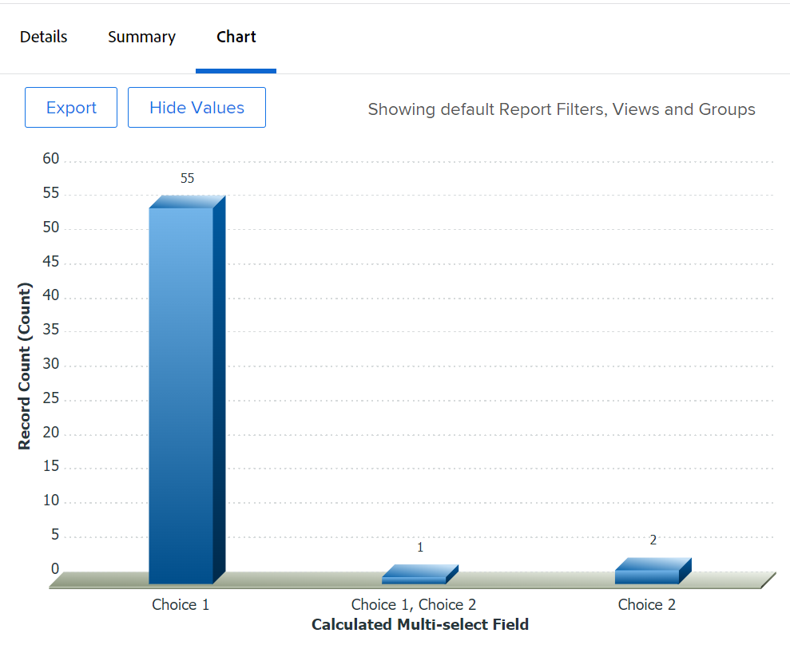

# Diagrama en rapport med ett anpassat fält som har flera val

<!--The highlighted information on this page refers to functionality not yet generally available. It is available for all customers in the Preview environment and for a select group of customers in the Production environment.-->

I stället för att skapa ett diagram med ett anpassat fält som består av flera markeringar rekommenderar vi att du skapar separata fält för varje alternativ i ett anpassat fält som består av flera markeringar.

Exempel på anpassade fält med flera val är:

* Kryssrutor
* Flervalsmenyer

Mer information om hur du använder textläge finns i artikeln [Översikt över textläge](../../../reports-and-dashboards/reports/text-mode/understand-text-mode.md).

Men om det inte går att ha separata fält för varje alternativ i ett flervalsfält kan du schemalägga en rapport med ett anpassat flervalsfält genom att använda beräknade anpassade fält för att gruppera valen från flervalsfältet först. Efter det kan du diagram rapporten efter beräkningsfälten.

>[!NOTE]
>
>Artiklar som har något av alternativen markerat räknas bara en gång.
>
>Om du till exempel har ett anpassat kryssrutefält med alternativen Val 1 och Val 2 som och bifogar formuläret till uppgifter, visas de uppgifter som har både Val 1 och Alternativ 2 i ett separat diagramelement än de uppgifter som bara har Val 1 eller Val 2 markerade.
>
>Aktiviteter som har alternativet 1 markerat visas inte i samma diagramelement som de uppgifter som har alternativet 1 och Alternativ 2 markerat.

## Åtkomstkrav

Du måste ha följande åtkomst för att kunna utföra stegen i den här artikeln:

<table style="table-layout:auto"> 
 <col> 
 <col> 
 <tbody> 
  <tr> 
   <td role="rowheader">Adobe Workfront-plan*</td> 
   <td> 
Alla
 </td> 
  </tr> 
  <tr> 
   <td role="rowheader">Adobe Workfront-licens*</td> 
   <td> 
Plan 
 </td> 
  </tr> 
  <tr> 
   <td role="rowheader">Konfigurationer på åtkomstnivå*</td> 
   <td> 
Redigera åtkomst till rapporter, instrumentpaneler och kalendrar
 
Redigera åtkomst till filter, vyer, grupperingar
 
Obs! Om du fortfarande inte har åtkomst frågar du Workfront-administratören om de anger ytterligare begränsningar för din åtkomstnivå. Information om hur en Workfront-administratör kan ändra åtkomstnivån finns i <a href="../../../administration-and-setup/add-users/configure-and-grant-access/create-modify-access-levels.md" class="MCXref xref">Skapa eller ändra anpassade åtkomstnivåer</a>.
 </td> 
  </tr> 
  <tr> 
   <td role="rowheader">Objektbehörigheter</td> 
   <td> 
Hantera behörigheter i en rapport
 
Mer information om hur du begär ytterligare åtkomst finns i <a href="../../../workfront-basics/grant-and-request-access-to-objects/request-access.md" class="MCXref xref">Begär åtkomst till objekt </a>.
 </td> 
  </tr> 
 </tbody> 
</table>

&#42;Kontakta Workfront-administratören om du vill veta vilken plan, licenstyp eller åtkomst du har.

## Förutsättningar

Innan du börjar måste du skapa ett beräknat anpassat fält som visar de värden som har valts i det anpassade fältet för flera val. Mer information finns i [Skapa ett beräknat anpassat fält som refererar till ett anpassat fält som består av flera val](#build-a-calculated-custom-field-that-references-a-multi-select-custom-field) i den här artikeln.

## Skapa en rapport med hjälp av anpassade fält som har valts flera gånger

<!--

(NOTE: this moved to its own article, linked in the Note above!)

-->

Du kan inte skapa ett diagram i en rapport genom att referera till ett anpassat fält med flera val. I stället kan du skapa ett beräkningsfält som registrerar värdena för det anpassade fältet med flera val för ett visst objekt och en viss grupp med hjälp av beräkningsfältet. 

* [Skapa ett beräknat anpassat fält som refererar till ett anpassat fält som består av flera val](#build-a-calculated-custom-field-that-references-a-multi-select-custom-field)
* [Skapa ett diagram som refererar till ett beräknat anpassat fält](#build-a-chart-that-references-a-calculated-custom-field)

### Skapa ett beräknat anpassat fält som refererar till ett anpassat fält som består av flera val {#build-a-calculated-custom-field-that-references-a-multi-select-custom-field}

Om du vill skapa ett beräknat fält som refererar till ett anpassat fält med flera val måste du ha följande krav:

* Ett anpassat flervalsfält i ett anpassat formulär.\
  Mer information om hur du skapar anpassade formulär och lägger till anpassade fält finns i artikeln [Skapa eller redigera ett anpassat formulär](../../../administration-and-setup/customize-workfront/create-manage-custom-forms/create-or-edit-a-custom-form.md).

* Ett anpassat formulär med det anpassade fältet för flera markeringar kopplat till objekt.
* Värden för det anpassade fältet för flera markeringar för varje objekt.

Så här skapar du det beräknade anpassade fältet som refererar till det anpassade fältet för flera val:

1. Skapa ett eget formulär eller redigera ett befintligt.

   Mer information om hur du skapar anpassade formulär finns i [Skapa eller redigera ett anpassat formulär](../../../administration-and-setup/customize-workfront/create-manage-custom-forms/create-or-edit-a-custom-form.md).

1. Markera objektet eller objekten som du vill använda med det anpassade formuläret.
1. Klicka **Lägg till ett fält** sedan **Beräknat** om du vill lägga till det anpassade fältet med flera markeringar i formuläret.

1. I **Etikett** ger du det nya beräknade fältet ett namn som anger att det refererar till det anpassade fältet för flera val.

   Exempel: &quot;Beräknat flervalsfält.&quot;

1. I **Beräkning** anger du följande kod:

   `{DE:Multi-select Custom Field}`

   Detta lägger till de val som är markerade i det anpassade fältet med flera val till det beräknade anpassade fältet. Om formuläret t.ex. är kopplat till uppgifter och du väljer Alternativ 1 i det anpassade fältet för flera val, visas värdet &quot;Alternativ 1&quot; i det beräknade anpassade fältet. Om du väljer Alternativ 1 och Alternativ 2 för en annan uppgift visar det beräknade anpassade fältet värdet &quot;Val 1, Val 2&quot;.

1. Ersätt&quot;Flervalsfält&quot; med det faktiska namnet på det anpassade fältet med flera val, så som det visas i Workfront.

   

1. (Valfritt) Om det anpassade fältet för flera val redan finns i det här formuläret och om formuläret redan är kopplat till objekt, aktiverar du **Uppdatera tidigare beräkningar (i bakgrunden)** alternativ.

   Detta garanterar att det nya beräknade fältet automatiskt fylls i med värdet från det anpassade fältet som består av flera val när det läggs till i de formulär som redan är kopplade till objekten.

1. Klicka **Klar**.
1. Klicka **Spara + Stäng**.

   Det beräknade anpassade fältet läggs till i det anpassade formuläret och om formuläret är kopplat till objekt fylls fältet i med information från det anpassade fältet som består av flera val.

### Skapa ett diagram som refererar till ett beräknat anpassat fält {#build-a-chart-that-references-a-calculated-custom-field}

1. (Valfritt) Om du vill vara säker på att alla beräknade fält som du vill rita efter är ifyllda med värden, går du till fliken Detaljer i rapporten och markerar alla objekt som innehåller det anpassade formuläret med både det anpassade fältet för flera val och det beräknade anpassade fältet. Klicka sedan på **Redigera**.
1. (Valfritt och villkorligt) Välj **Beräkna om anpassade uttryck** fält och klicka sedan på **Spara ändringar**.\
   

   >[!NOTE]
   >
   >Det här alternativet har tagits bort från gruppredigering.  Du kan fortfarande beräkna om uttryck för projekt i grupp genom att klicka på **Mer** icon  högst upp i en projektlista, och sedan **Beräkna om uttryck**.

1. Gå till rapporten där du vill lägga till diagrammet för det beräknade fältet som refererar till det anpassade fältet för flera val.
1. Klicka **Rapportåtgärder** sedan **Redigera**.

1. Välj <strong>Grupperingar</strong> tabbtangenten och klicka sedan på <strong>Lägg till gruppering</strong>.
1. Lägg till <strong>Beräknat flervalsfält</strong> som du har skapat som gruppering.
1. Välj <strong>Diagram</strong> och lägga till ett diagram i rapporten.

   Välj till exempel en **Kolumn** diagram.
    Mer information om hur du lägger till ett diagram i en rapport finns i avsnittet <a href="../../../reports-and-dashboards/reports/creating-and-managing-reports/create-custom-report.md#add-a-chart" class="MCXref xref">Lägga till ett diagram i en rapport</a> i artikeln <a href="../../../reports-and-dashboards/reports/creating-and-managing-reports/create-custom-report.md" class="MCXref xref">Skapa en anpassad rapport</a>.
1. I **Nedre (X) axel** fält, välj <strong>Beräknat flervalsfält</strong> som ska visas i diagrammet.
1. Klicka <strong>Spara + Stäng</strong>.

   Rapporten visar resultaten grupperade efter det beräknade flervalsfältet i ett diagram.

   