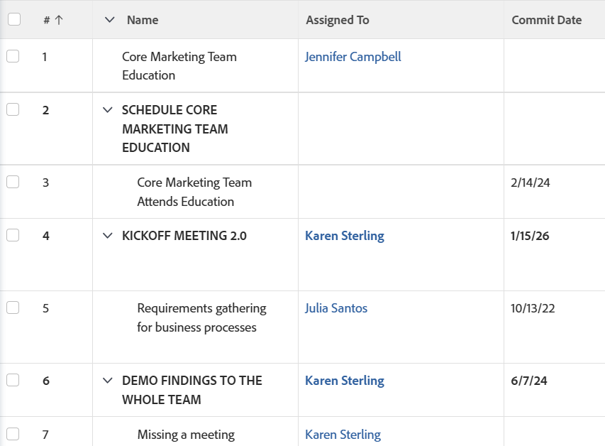

# Visa: namn på överordnade uppgifter som versaler

<!--Audited: 10/2024-->

Du kan lägga till den här kolumnen i en uppgiftsvy om du vill visa namnet på den överordnade uppgiften med versaler.



## Åtkomstkrav

+++ Expandera om du vill visa åtkomstkrav för funktionerna i den här artikeln. 

<table style="table-layout:auto"> 
 <col> 
 <col> 
 <tbody> 
  <tr> 
   <td role="rowheader">Adobe Workfront package</td> 
   <td> <p>Alla</p> </td> 
  </tr> 
  <tr> 
   <td role="rowheader">Adobe Workfront-licens</td> 
   <td> 
   <p>Medarbetare eller begäran om att ändra ett filter </p>
   <p>Standard eller Plan för att ändra en rapport</p>
  </tr> 
  <tr> 
   <td role="rowheader">Konfigurationer på åtkomstnivå</td> 
   <td> <p>Redigera åtkomst till rapporter, instrumentpaneler och kalendrar för att ändra en rapport</p> <p>Redigera åtkomst till filter, vyer och grupperingar för att ändra ett filter</p> </td> 
  </tr> 
  <tr> 
   <td role="rowheader">Objektbehörigheter</td> 
   <td> <p>Hantera behörigheter i en rapport</p>  </td> 
  </tr> 
 </tbody> 
</table>

Mer information om informationen i den här tabellen finns i [Åtkomstkrav i Workfront-dokumentationen](/help/quicksilver/administration-and-setup/add-users/access-levels-and-object-permissions/access-level-requirements-in-documentation.md).

+++

## Visa namnet på den överordnade aktiviteten som versaler

Så här skapar du den här kolumnen i en uppgiftsvy:

1. Gå till en lista med uppgifter.
1. Välj en vy i listrutan **Visa** och klicka sedan på ikonen **Redigera**  .
eller\
   Välj **Ny vy** i listrutan **Visa**.

1. Klicka på rubriken för kolumnen som visar aktivitetsnamnet i listan i området **Förhandsvisa kolumn**.
1. Klicka på **Växla till textläge** och sedan på **Redigera textläge**.
1. Ta bort texten som du söker i rutan **Textläge** och ersätt den med följande kod:

   ```
   linkedname=direct
   namekey=name
   querysort=name
   styledef.case.0.comparison.icon=false
   styledef.case.0.comparison.leftmethod=numberOfChildren
   styledef.case.0.comparison.lefttext=numberOfChildren
   styledef.case.0.comparison.operator=gt
   styledef.case.0.comparison.operatortype=int
   styledef.case.0.comparison.righttext=0
   styledef.case.0.comparison.trueproperty.0.name=fontstyle
   styledef.case.0.comparison.trueproperty.0.value=bold
   valueexpression=IF({numberOfChildren}>"0",UPPER({name}),{name})
   valueformat=HTML
   ```

1. Klicka på **Klar** och sedan på **Spara vy**.
