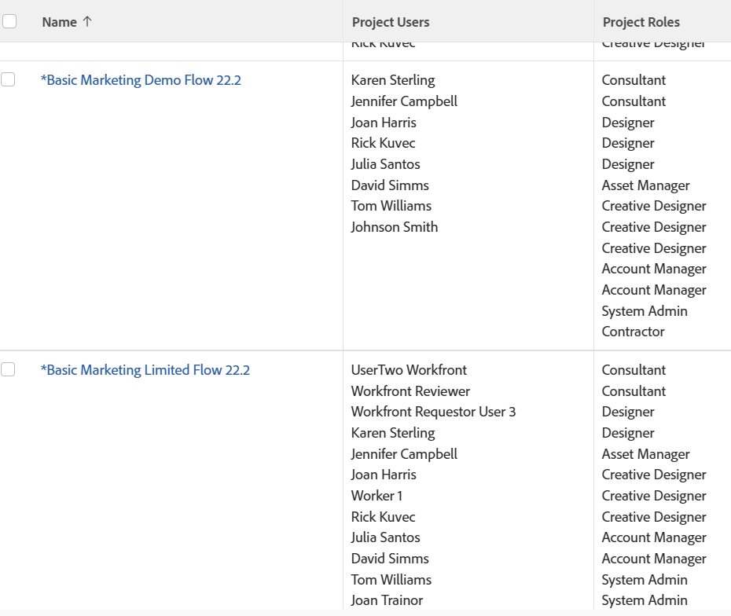

# Rapporter eller listor: visa användare som är kopplade till ett objekt

Du kan visa användare, jobbroller och team som är kopplade till objekt i rapporter eller listor samt referera till dem i filter. Du kan inte gruppera efter användare, jobbroller eller team som är kopplade till objekt.

Du kan visa eller filtrera efter användare, jobbroller eller team som är kopplade till följande objekt:

<table style="table-layout:auto"> 
 <col> 
 <col> 
 <tbody> 
  <tr> 
   <td role="rowheader">Objekt</td> 
   <td>Associerade användare eller jobbroller</td> 
  </tr> 
  <tr> 
   <td role="rowheader">Projekt</td> 
   <td> 
Du kan visa alla användare och de jobbroller de har i projektet i en projektrapport. Du kan inte filtrera efter användare eller deras associerade jobbroller i en projektrapport. 
 </td> 
  </tr> 
  <tr> 
   <td role="rowheader">Uppgifter</td> 
   <td>Du kan visa och filtrera efter alla användare, jobbroller och team som tilldelats en uppgift i en uppgiftsrapport.</td> 
  </tr> 
  <tr> 
   <td role="rowheader">Problem</td> 
   <td>Du kan visa och filtrera efter alla användare, jobbroller och team som har tilldelats ett problem i en problemrapport.</td> 
  </tr> 
  <tr> 
   <td role="rowheader">Portföljer</td> 
   <td>Du kan visa alla användare och de jobbroller de har i projektet i en projektrapport och gruppera rapporten från Portfolio. Du kan inte filtrera efter användare eller deras associerade jobbroller i en projektrapport.</td> 
  </tr> 
  <tr> 
   <td role="rowheader">Program</td> 
   <td>Du kan visa alla användare och de jobbroller de har i projektet i en projektrapport och gruppera rapporten efter program. Du kan inte filtrera efter användare eller deras associerade jobbroller i en projektrapport.</td> 
  </tr> 
 </tbody> 
</table>

## Visa alla användare och jobbroller som är kopplade till ett projekt

Du kan visa alla användare som är kopplade till projektet i vyn för en projektlista eller rapport. Detta inkluderar alla användare som listas i avsnittet Personer i projektet. I en projektrapport kan du även visa de roller som de är associerade med när de tilldelas aktiviteter eller ärenden i projektet.

Mer information om hur du skapar en projektrapport för att visa alla användare och deras roller i projektet finns i [Visa: lista över projektanvändare med jobbroller](../../../reports-and-dashboards/reports/custom-view-filter-grouping-samples/view-project-user-list.md).

Du kan inte filtrera efter användare eller jobbroller som är kopplade till projekt i ett projektfilter.

## Visa alla användare, jobbroller eller team som tilldelats en uppgift

Du kan visa alla användare, roller eller team som tilldelats en uppgift i vyn för en uppgiftslista eller rapport genom att lägga till fältet Uppdrag i vyn.

Du kan filtrera efter användare, jobbroller eller team som tilldelats uppgifter genom att referera till följande fält i ett uppgiftsfilter:

* Tilldelningsanvändare
* Tilldelningsroller
* Team

## Visa alla användare, jobbroller eller team som har tilldelats ett ärende

Du kan visa alla användare, roller eller team som har tilldelats ett ärende i en problemlista eller rapport genom att lägga till fältet Uppdrag i vyn.

Du kan filtrera efter användare, jobbroller eller team som har tilldelats ärenden genom att referera till följande fält i ett utgåvfilter:

* Tilldelningsanvändare
* Tilldelningsroller
* Team

## Visa alla användare och jobbroller som är kopplade till en portfölj

Du kan visa alla användare och roller som är kopplade till en portfölj genom att visa dem i en projektrapport och sedan gruppera rapporten i Portfolio.

Mer information om hur du skapar en projektrapport för att visa alla användare och deras roller i projektet finns i [Visa: lista över projektanvändare med jobbroller](../../../reports-and-dashboards/reports/custom-view-filter-grouping-samples/view-project-user-list.md).

Du kan inte filtrera efter användare eller jobbroller som är kopplade till projekt i ett portfölj- eller projektfilter.

## Visa alla användare och jobbroller som är associerade med ett program

Du kan visa alla användare och roller som är kopplade till ett program genom att visa dem i en projektrapport och sedan gruppera rapporten efter program.

Mer information om hur du skapar en projektrapport för att visa alla användare och deras roller i projektet finns i [Visa: lista över projektanvändare med jobbroller](../../../reports-and-dashboards/reports/custom-view-filter-grouping-samples/view-project-user-list.md).

Du kan inte filtrera efter användare eller jobbroller som är kopplade till projekt i ett program- eller projektfilter.
