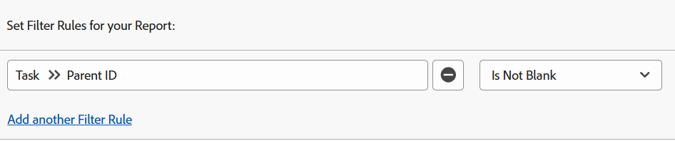

# Filter: visa överordnade uppgifter

<!--Audited: 10/2024-->

Du kan använda uppgiftsfiltren nedan för att visa arbetsuppgifter. Arbetsuppgifter är uppgifter som kan bearbetas oberoende av varandra och inte är överordnade uppgifter till andra uppgifter. I ett exempel identifierar ett filter underordnade uppgifter som kan vara överordnade. I det här fallet fungerar de inte.

>[!TIP]
>
>* Om du funderar på att lägga till mer än ett filter i en rapport rekommenderar vi att du lägger till alla filter med rapportbyggargränssnittet och klickar på Växla till textläge när alla andra filterregler har lagts till. Sedan kan du lägga till koden för det överordnade aktivitetsfiltret enligt vad som anges ovan. 
>* Vi rekommenderar även att du lägger till en gruppering som projektnamn för att göra rapporten lättare att läsa. Mer information om hur du lägger till grupperingar i rapporter finns i artikeln [Översikt över grupperingar i Adobe Workfront](../../../reports-and-dashboards/reports/reporting-elements/groupings-overview.md).
>

## Åtkomstkrav

+++ Expandera om du vill visa åtkomstkrav för funktionerna i den här artikeln. 

<table style="table-layout:auto"> 
 <col> 
 <col> 
 <tbody> 
  <tr> 
   <td role="rowheader">Adobe Workfront package</td> 
   <td> <p>Alla</p> </td> 
  </tr> 
  <tr> 
   <td role="rowheader">Adobe Workfront-licens</td> 
   <td> 
   <p>Medarbetare eller begäran om att ändra ett filter </p>
   <p>Standard eller Plan för att ändra en rapport</p>
  </tr> 
  <tr> 
   <td role="rowheader">Konfigurationer på åtkomstnivå</td> 
   <td> <p>Redigera åtkomst till rapporter, instrumentpaneler och kalendrar för att ändra en rapport</p> <p>Redigera åtkomst till filter, vyer och grupperingar för att ändra ett filter</p> </td> 
  </tr> 
  <tr> 
   <td role="rowheader">Objektbehörigheter</td> 
   <td> <p>Hantera behörigheter i en rapport</p>  </td> 
  </tr> 
 </tbody> 
</table>

Mer information om informationen i den här tabellen finns i [Åtkomstkrav i Workfront-dokumentationen](/help/quicksilver/administration-and-setup/add-users/access-levels-and-object-permissions/access-level-requirements-in-documentation.md).

+++

## Visa aktiviteter utan underordnade (de kan ha en överordnad)

Du kan använda följande filter på en uppgiftsrapport om du vill visa uppgifter utan underordnade. De kan ha egna föräldrar och barn till andra uppgifter.

1. Klicka på **Rapporter** i det övre högra hörnet av  **Huvudmeny-ikonen** eller på  **Huvudmenyrader** i det övre vänstra hörnet, om sådana finns.Rapporter.

1. Klicka på **Ny rapport**.
1. Välj en **aktivitetsrapport**.
1. Klicka på **Filter**.
1. Klicka på **Lägg till en filterregel**.
1. I raden **Börja skriva fältnamn ...** börjar du skriva **Antal underordnade** och klickar sedan på **Aktivitet > Antal underordnade** när den visas i listan.

1. Välj **Lika (skiftlägeskänslig)** som modifierare och ange sedan **0** som antal underordnade.\
   

   eller

   Klicka på **Växla till textläge** och kopiera och klistra in följande text i textredigeringsfönstret

   ```
   numberOfChildren=0
   numberOfChildren_Mod=eq
   ```


1. Klicka på **Spara + Stäng**.

   Då hämtas en rapport för alla uppgifter som arbetar i systemet. Vissa av dessa uppgifter kan ha en överordnad, men de är inte i sig överordnade uppgifter.

## Visa aktiviteter med överordnade (de kan ha underordnade)

Du kan använda följande filter på en uppgiftsrapport för att visa uppgifter med överordnade, vilket innebär att de är underordnade uppgifter. Dessa åtgärder kan dock även ha egna underordnade eftersom filtret inte utesluter deras underordnade. Underordnade uppgifter som också är överordnade för andra uppgifter betraktas inte som arbetsuppgifter.

1. Klicka på **Rapporter** i det övre högra hörnet av  **Huvudmeny-ikonen** eller på  **Huvudmenyrader** i det övre vänstra hörnet, om sådana finns.Rapporter.

1. Klicka på **Ny rapport**.
1. Välj en **aktivitetsrapport**.
1. Klicka på **Filter**.
1. Klicka på **Lägg till en filterregel**.
1. I raden **Börja skriva fältnamn ...** börjar du skriva **Överordnat ID** och väljer sedan **Aktivitet >> Överordnat ID** när det visas i listan.
1. Välj **Är inte tom** som modifierare.

   

   eller

   Klicka på **Växla till textläge** och kopiera och klistra in följande text i textredigeringsfönstret: 

   `parentID_Mod=notblank`

1. Klicka på **Spara + Stäng**.

   Då hämtas en rapport för alla uppgifter i systemet som har överordnade och är underordnade uppgifter för dessa överordnade. En del av dessa uppgifter kan i sig vara överordnade.

## Visa aktiviteter utan underordnade och inga överordnade (fristående uppgifter)

Du kan använda följande filter på en uppgiftsrapport om du vill visa fristående arbetsuppgifter. De här uppgifterna har ingen överordnad och har inga egna underordnade.

1. Klicka på **Rapporter** i det övre högra hörnet av  **Huvudmeny-ikonen** eller på  **Huvudmenyrader** i det övre vänstra hörnet, om sådana finns.Rapporter.

1. Klicka på **Ny rapport**.
1. Välj en **aktivitetsrapport**.
1. Klicka på **Filter**.
1. Klicka på **Lägg till en filterregel**.
1. I **Börja skriva fältnamn ...** rad börja skriva **Antal underordnade** och välj sedan **Aktivitet > Antal underordnade** i listan.
1. Välj **Lika (skiftlägeskänslig)** som modifierare och ange sedan **0** som antal underordnade.
1. Klicka på **Lägg till en annan filterregel**.
1. I **Börja skriva fältnamn ...** rad börja skriva **Överordnat ID** och välj sedan **Aktivitet >> Överordnat ID** i listan.
1. Välj **Är tom** som modifierare.

   

   eller

   I stället för steg 6-10 <!--ensure steps above stay accurate--> klickar du på **Växla till textläge** och kopierar och klistrar in följande text i textredigeringsfönstret:

   ```
   numberOfChildren=0
   numberOfChildren_Mod=eq
   parentID_Mod=isblank
   ```

1. Klicka på **Spara + Stäng**.

   Då hämtas en rapport för alla uppgifter i systemet som inte har några föräldrar eller barn. Det här är fristående arbetsuppgifter.
