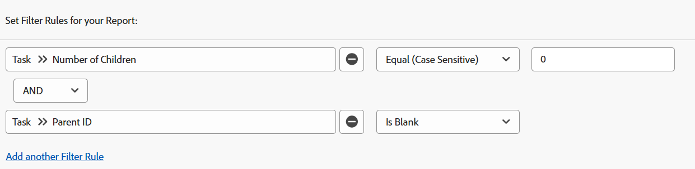

# Filter: visa överordnade uppgifter

Du kan använda uppgiftsfiltren nedan för att visa arbetsuppgifter. Arbetsuppgifter är uppgifter som kan bearbetas oberoende av varandra och inte är överordnade uppgifter till andra uppgifter. I ett exempel identifierar ett filter underordnade uppgifter som kan vara överordnade. I det här fallet fungerar de inte.

>[!TIP]
>
>* Om du funderar på att lägga till mer än ett filter i en rapport rekommenderar vi att du lägger till alla filter med rapportbyggargränssnittet och klickar på Växla till textläge när alla andra filterregler har lagts till. Sedan kan du lägga till koden för det överordnade aktivitetsfiltret enligt vad som anges ovan. 
>* Vi rekommenderar även att du lägger till en gruppering som projektnamn för att göra rapporten lättare att läsa. Mer information om hur du lägger till grupperingar i rapporter finns i artikeln [Översikt över grupperingar i Adobe Workfront](../../../reports-and-dashboards/reports/reporting-elements/groupings-overview.md).
>

## Åtkomstkrav

Du måste ha följande åtkomst för att kunna utföra stegen i den här artikeln:

<table style="table-layout:auto"> 
 <col> 
 <col> 
 <tbody> 
  <tr> 
   <td role="rowheader">Adobe Workfront-plan*</td> 
   <td> <p>Alla</p> </td> 
  </tr> 
  <tr> 
   <td role="rowheader">Adobe Workfront-licens*</td> 
   <td> <p>Begäran om att ändra ett filter </p>
   <p>Planera att ändra en rapport</p> </td> 
  </tr> 
  <tr> 
   <td role="rowheader">Konfigurationer på åtkomstnivå*</td> 
   <td> <p>Redigera åtkomst till rapporter, instrumentpaneler och kalendrar för att ändra en rapport</p> <p>Redigera åtkomst till filter, vyer och grupperingar för att ändra ett filter</p> <p><b>ANMÄRKNING</b>

Om du fortfarande inte har åtkomst frågar du Workfront-administratören om de anger ytterligare begränsningar för din åtkomstnivå. Mer information om hur en Workfront-administratör kan ändra åtkomstnivån finns i <a href="../../../administration-and-setup/add-users/configure-and-grant-access/create-modify-access-levels.md" class="MCXref xref">Skapa eller ändra anpassade åtkomstnivåer</a>.</p> </td>
</tr>
  <tr> 
   <td role="rowheader">Objektbehörigheter</td> 
   <td> <p>Hantera behörigheter i en rapport</p> <p>Mer information om hur du begär ytterligare åtkomst finns i <a href="../../../workfront-basics/grant-and-request-access-to-objects/request-access.md" class="MCXref xref">Begär åtkomst till objekt </a>.</p> </td> 
  </tr> 
 </tbody> 
</table>

&#42;Kontakta Workfront-administratören om du vill veta vilken plan, licenstyp eller åtkomst du har.

## Visa aktiviteter utan underordnade (de kan ha en överordnad)

Du kan använda följande filter på en uppgiftsrapport om du vill visa uppgifter utan underordnade. De kan ha egna föräldrar och barn till andra uppgifter.

1. Klicka på **Rapporter** på **huvudmenyn** .

1. Klicka på **Ny rapport**.
1. Välj en **aktivitetsrapport**.
1. Klicka på **Filter**.
1. Klicka på **Lägg till en filterregel**.
1. Börja skriva **Antal underordnade** på raden **Börja skriva fältnamn..**.

1. Välj **Lika (skiftlägeskänslig)** som modifierare och ange sedan **0** som antal underordnade.\
   

   eller

   Klicka på **Växla till textläge** och kopiera och klistra in följande text i textredigeringsfönstret: 

   ```
   numberOfChildren=0
   numberOfChildren_Mod=eq
   ```


1. Klicka på **Spara + Stäng**.

   Då hämtas en rapport för alla uppgifter som arbetar i systemet. Vissa av dessa uppgifter kan ha en överordnad, men de är inte i sig överordnade uppgifter.

## Visa aktiviteter med överordnade (de kan ha underordnade)

Du kan använda följande filter på en uppgiftsrapport för att visa uppgifter med överordnade, vilket innebär att de är underordnade uppgifter. Dessa åtgärder kan dock även ha egna underordnade eftersom filtret inte utesluter deras underordnade. Underordnade uppgifter som också är överordnade för andra uppgifter betraktas inte som arbetsuppgifter.

1. Klicka på **Rapporter på **huvudmenyn** .
1. Klicka på **Ny rapport**.
1. Välj en **aktivitetsrapport**.
1. Klicka på **Filter**.
1. Klicka på **Lägg till en filterregel**.
1. Börja skriva **Överordnat ID** på raden **Börja skriva fältnamn..**.
1. Välj **Är inte tom** som modifierare.

   

   eller

   Klicka på **Växla till textläge** och kopiera och klistra in följande text i textredigeringsfönstret: 

   `parentID_Mod=notblank`

1. Klicka på **Spara + Stäng**.

   Då hämtas en rapport för alla uppgifter i systemet som har överordnade och är underordnade uppgifter för dessa överordnade. En del av dessa uppgifter kan i sig vara överordnade.

## Visa aktiviteter utan underordnade och inga överordnade (fristående uppgifter)

Du kan använda följande filter på en uppgiftsrapport om du vill visa fristående arbetsuppgifter. De här uppgifterna har ingen överordnad och har inga egna underordnade.

1. Klicka på **Rapporter** på **huvudmenyn** .
1. Klicka på **Ny rapport**.
1. Välj en **aktivitetsrapport**.
1. Klicka på **Filter**.
1. Klicka på **Lägg till en filterregel** och välj **Lika (skiftlägeskänsligt)** för att börja skriva **Antal underordnade** i fältet **Börja skriva in..** för modifieraren. Ange sedan **0** som antal underordnade.
1. Klicka på **Lägg till en annan filterregel** och i **Börja skriva in fältnamn ...** radstarttypning **Överordnat ID**. Välj sedan **Är tomt**.

   

   eller

   I stället för steg 6-7 klickar du på **Växla till textläge** och kopierar och klistrar in följande text i textredigeringsfönstret: 

   <!--
   <p data-mc-conditions="QuicksilverOrClassic.Draft mode">(NOTE: ensure steps above stay accurate)</p>
   -->

   ```
   numberOfChildren=0
   numberOfChildren_Mod=eq
   parentID_Mod=isblank
   ```

1. Klicka på **Spara + Stäng**.

   Då hämtas en rapport för alla uppgifter i systemet som inte har några föräldrar eller barn. Det här är fristående arbetsuppgifter.
