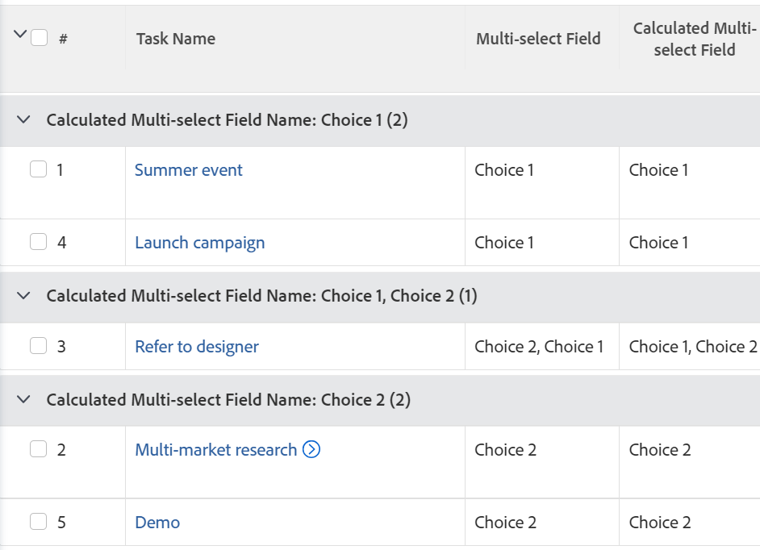

# Gruppera en rapport efter ett anpassat fält som har flera val

Du kan bara gruppera efter värdet i ett anpassat fält med flera val i en Adobe Workfront-rapport genom att använda textläge.

Exempel på anpassade fält med flera val är:

* Kryssrutor
* Flervalsmenyer

Mer information om hur du använder textläge finns i artikeln [Översikt över textläge](../../../reports-and-dashboards/reports/text-mode/understand-text-mode.md).

## Att tänka på när du grupperar efter ett anpassat fält med flera val

* Det går inte att diagram över en rapport som använder en gruppering i textläge. Du måste skapa ytterligare ett beräkningsfält som refererar till det anpassade fältet för flera val för att kunna diagram rapporten med värdet för det anpassade fältet för flera val.

  Mer information finns i [Skapa en rapport för ett anpassat fält som består av flera markeringar](../../../reports-and-dashboards/reports/custom-view-filter-grouping-samples/chart-report-by-multi-select-custom-field.md).
* Artiklar som har något av alternativen markerat räknas bara en gång.

  Om du till exempel har ett anpassat kryssrutefält med alternativen Val 1 och Val 2 som och bifogar formuläret till uppgifter, grupperas de uppgifter som har både Val 1 och Val 2 som markerade separat från de uppgifter som bara har Val 1 eller Val 2 markerade.

## Åtkomstkrav

Du måste ha följande åtkomst för att kunna utföra stegen i den här artikeln:

<table style="table-layout:auto"> 
 <col> 
 <col> 
 <tbody> 
  <tr> 
   <td role="rowheader">Adobe Workfront-plan*</td> 
   <td> 
Alla
 </td> 
  </tr> 
  <tr> 
   <td role="rowheader">Adobe Workfront-licens*</td> 
   <td> 
Begäran om att ändra en gruppering 

   
Planera att ändra en rapport
 </td> 
  </tr> 
  <tr> 
   <td role="rowheader">Konfigurationer på åtkomstnivå*</td> 
   <td> 
Redigera åtkomst till rapporter, instrumentpaneler och kalendrar för att ändra en rapport
 
Redigera åtkomst till filter, vyer och grupperingar för att ändra en gruppering
 
<b>ANMÄRKNING</b>

Om du fortfarande inte har åtkomst frågar du Workfront-administratören om de anger ytterligare begränsningar för din åtkomstnivå. Mer information om hur en Workfront-administratör kan ändra åtkomstnivån finns i <a href="../../../administration-and-setup/add-users/configure-and-grant-access/create-modify-access-levels.md" class="MCXref xref">Skapa eller ändra anpassade åtkomstnivåer</a>.
 </td>
</tr>  
  <tr> 
   <td role="rowheader">Objektbehörigheter</td> 
   <td> 
Hantera behörigheter i en rapport
 
Mer information om hur du begär ytterligare åtkomst finns i <a href="../../../workfront-basics/grant-and-request-access-to-objects/request-access.md" class="MCXref xref">Begär åtkomst till objekt </a>.
 </td> 
  </tr> 
 </tbody> 
</table>

*Kontakta Workfront-administratören om du vill veta vilken plan, licenstyp eller åtkomst du har.

## Gruppera en rapport efter anpassade fält som har flera val

Om du vill kunna gruppera efter ett anpassat fält med flera val måste du ha följande krav:

* Bygg det anpassade flervalsfältet i ett anpassat formulär.\
  Mer information om hur du skapar anpassade formulär och lägger till anpassade fält finns i artikeln [Designa ett formulär med formulärdesignern](/help/quicksilver/administration-and-setup/customize-workfront/create-manage-custom-forms/form-designer/design-a-form/design-a-form.md).

* Koppla det anpassade formuläret till objekt.
* Fyll det anpassade fältet för flera val med ett värde för varje objekt. 

Så här grupperar du ett anpassat fält i en rapport efter flera val:

1. Skapa en rapport eller redigera en befintlig rapport där du vill lägga till en gruppering för ett anpassat fält som består av flera val.\
   Mer information om hur du skapar rapporter finns i artikeln [Skapa en anpassad rapport](../../../reports-and-dashboards/reports/creating-and-managing-reports/create-custom-report.md).

1. Välj fliken **Grupperingar**.
1. Klicka på **Växla till textläge**.

1. Markera texten i rutan **Gruppera din rapport** och ersätt den med följande kod:

   <pre>
   group.0.displayName=Flera val, eget fältnamn
   group.0.valueexpression={DE:Multi-select Custom Field Name}
   group.0.valueFormat=HTML
   group.0.textmode=true
   </pre>

1. Ersätt&quot;Flerval anpassat fältnamn&quot; med det faktiska namnet på det anpassade fältet som det visas i Workfront.
1. Klicka på **Spara och stäng**.

   Objekten i rapporten grupperas efter värdena i det anpassade fältet med flera val.

   

   Namnet på rapportens grupperingar är namnen på det anpassade fältet med flera val följt av de värden som är markerade i fältet.

<!--

<h2>Chart a report by multi-select Custom Fields</h2>

(NOTE: this moved to its own article, linked in the Note above!)

You cannot build a chart in a report by referencing a multi-select custom field. Instead, you can create a calculated field that records the values of the multi-select custom field on a given object and group by the calculated field.&nbsp;

<ul>
<li><a href="#build-a-calculated-custom-field-that-references-a-multi-select-custom-field" class="MCXref xref">Build a calculated custom field that references a multi-select custom field</a> </li>
<li><a href="#build-a-chart-that-references-a-calculated-custom-field" class="MCXref xref">Build a chart that references a calculated custom field</a> </li>
</ul>

<strong>Build a calculated custom field that references a multi-select custom field</strong>

To be able to build a calculated field that references a multi-select custom field, you must have the following prerequisites:

<ul>
<li>Build the multi-select custom field in a custom form. .</li>
<li>Attach the custom form to objects.</li>
<li>Populate the multi-select custom field with a value on each object.</li>
</ul>

To build the calculated custom field that references the multi-select custom field:

<ol>
<li value="1">Create a custom form, or edit an existing one. .</li>
<li value="2">Click<strong>Add a Field</strong>, then <strong>Calculated</strong> to add the multi-select custom field to the form.</li>
<li value="3">In the <strong>Label</strong> box, name the new calculated field to indicate that it references the multi-select custom field. For example: "Calculated Multi-select Field."</li>
<li value="4"> 
In the <strong>Calculation</strong> box, enter the following code:
<pre>{DE:Multi-select Custom Field}</pre> 
    
 </li>
<li value="5">Replace "Multi-select Custom Field" with the actual name of your multi-select custom field, as it appears in Workfront.</li>
<li value="6"> 
(Optional) If the multi-select custom field is already on this form and if this form is already attached to objects, enable the <strong>Update previous calculations</strong>&nbsp;option.
 
This ensures that the new field is automatically populated with the value from the multi-select custom field as it is added to the forms attached to the objects already.
 </li>
<li value="7">Click <strong>Done</strong>.</li>
<li value="8">Click <strong>Save +Close</strong>.</li>
</ol>

<strong>Build a chart that references a calculated custom field</strong>

<ol>
<li value="1"> Go to the report where you want to add the chart for the calculated field that references the multi-select custom field. </li>
<li value="2"> (Optional) To ensure that all the calculated fields that you want to chart by are populated with values, select all the objects in your report, then click <strong>Edit</strong>. </li>
<li value="3"> 
 (Optional and conditional) Enable the <strong>Recalculate Custom Expressions</strong> field, then click <strong>Save Changes</strong>.
 
    
 </li>
<li value="4"> Click <strong>Report Actions</strong>, then <strong>Edit</strong>. </li>
<li value="5">Select the <strong>Groupings</strong> tab, then click <strong>Add Grouping</strong>. </li>
<li value="6">Add the<strong>Calculated Multi-select Field</strong> you created as your grouping. </li>
<li value="7"> 
Select the <strong>Chart</strong> tab, and add a chart to your report.
 
For information about adding a chart to a report, see the section <a href="../../../reports-and-dashboards/reports/creating-and-managing-reports/create-custom-report.md#add-a-chart" class="MCXref xref">Add a chart to a report</a> in the article <a href="../../../reports-and-dashboards/reports/creating-and-managing-reports/create-custom-report.md" class="MCXref xref">Create a custom report</a>. 
 </li>
<li value="8">Select the <strong>Calculated Multi-select Field</strong> as one of the fields to display in the chart. </li>
<li value="9"> 
Click <strong>Save + Close</strong>.
 
The report displays the results grouped by the Calculated Multi-select Field in a chart. 
 </li>
</ol>

-->
