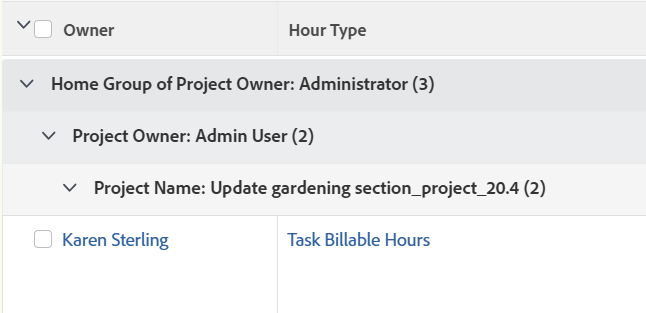

# Gruppering: Projektägarens hemgrupp i en lista över timmar

Du kan visa namnet på hemgruppen för projektägaren i en timlista eller rapport.

Grupperingen grupperar också resultaten efter namnet på projektägaren och projektnamnet.



## Åtkomstkrav

Du måste ha följande åtkomst för att kunna utföra stegen i den här artikeln:

<table style="table-layout:auto"> 
 <col> 
 <col> 
 <tbody> 
  <tr> 
   <td role="rowheader">Adobe Workfront-plan*</td> 
   <td> <p>Alla</p> </td> 
  </tr> 
  <tr> 
   <td role="rowheader">Adobe Workfront-licens*</td> 
   <td> <p>Plan </p> </td> 
  </tr> 
  <tr> 
   <td role="rowheader">Konfigurationer på åtkomstnivå*</td> 
   <td> <p>Redigera åtkomst till rapporter, instrumentpaneler och kalendrar</p> <p>Redigera åtkomst till filter, vyer, grupperingar</p> <p>Obs! Om du fortfarande inte har åtkomst frågar du Workfront-administratören om de anger ytterligare begränsningar för din åtkomstnivå. Information om hur en Workfront-administratör kan ändra åtkomstnivån finns i <a href="../../../administration-and-setup/add-users/configure-and-grant-access/create-modify-access-levels.md" class="MCXref xref">Skapa eller ändra anpassade åtkomstnivåer</a>.</p> </td> 
  </tr> 
  <tr> 
   <td role="rowheader">Objektbehörigheter</td> 
   <td> <p>Hantera behörigheter i en rapport</p> <p>Mer information om hur du begär ytterligare åtkomst finns i <a href="../../../workfront-basics/grant-and-request-access-to-objects/request-access.md" class="MCXref xref">Begär åtkomst till objekt </a>.</p> </td> 
  </tr> 
 </tbody> 
</table>

&#42;Kontakta Workfront-administratören om du vill veta vilken plan, licenstyp eller åtkomst du har.

## Gruppera efter hemgrupp för projektägare i en lista över timmar

Så här använder du den här grupperingen:

1. Gå till en lista med timmar.
1. Från **Gruppering** nedrullningsbar meny, välja **Ny gruppering**.

1. Klicka **Växla till textläge**.
1. Ta bort texten i **Gruppera din rapport** område.
1. Ersätt texten med följande kod:

   ```
   group.0.displayname=Home Group of Project Owner<br>group.0.valuefield=project:owner:homeGroup:name<br>group.0.valueformat=HTML<br>group.1.displayname=Project Owner<br>group.1.linkedname=projectOwnerMM<br>group.1.namekey=view.relatedcolumn<br>group.1.namekeyargkey.0=projectOwnerMM<br>group.1.namekeyargkey.1=name<br>group.1.valuefield=projectOwnerMM:name<br>group.1.valueformat=string<br>group.2.displayname=Project Name<br>group.2.linkedname=project<br>group.2.namekey=view.relatedcolumn<br>group.2.namekeyargkey.0=project<br>group.2.namekeyargkey.1=name<br>group.2.valuefield=project:name<br>group.2.valueformat=string<br>textmode=true
   ```

1. Klicka **Spara gruppering**.
