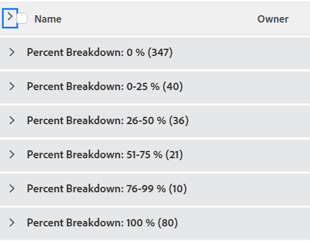

# Gruppering: uppdelad projektprocent 1

<!--Audited: 10/2024-->

I den här anpassade projektgrupperingen kan du visa projekt grupperade efter ett intervall av deras procentvärden för slutförande. Uppdelningarna visar ett procentvärde på 25 procentenheter i steg om: 0-25 %, 26-50 %, 51-75 % osv.

I följande gruppering ordnas projekt efter procentvärdet färdigt i en av dessa grupperingar:

* 0 %
* 1-25 %
* 26-50 %
* 51-75 %
* 76-99 %
* 100 %



## Åtkomstkrav

+++ Expandera om du vill visa åtkomstkrav för funktionerna i den här artikeln.

Du måste ha följande åtkomst för att kunna utföra stegen i den här artikeln:

<table style="table-layout:auto"> 
 <col> 
 <col> 
 <tbody> 
  <tr> 
   <td role="rowheader">Adobe Workfront</td> 
   <td> <p>Alla</p> </td> 
  </tr> 
  <tr> 
   <td role="rowheader">Adobe Workfront-licens*</td> 
   <td> 
    <p>Nytt:</p>
   <ul><li><p>Medarbetare som ändrar ett filter </p></li>
   <li><p>Standard för att ändra en rapport</p></li> </ul>

<p>Aktuell:</p>
   <ul><li><p>Begäran om att ändra ett filter </p></li>
   <li><p>Planera att ändra en rapport</p></li> </ul></td> 
  </tr> 
  <tr> 
   <td role="rowheader">Konfigurationer på åtkomstnivå</td> 
   <td> <p>Redigera åtkomst till rapporter, instrumentpaneler och kalendrar för att ändra en rapport</p> <p>Redigera åtkomst till filter, vyer och grupperingar för att ändra ett filter</p> </td> 
  </tr> 
  <tr> 
   <td role="rowheader">Objektbehörigheter</td> 
   <td> <p>Hantera behörigheter i en rapport</p>  </td> 
  </tr> 
 </tbody> 
</table>

*Mer information finns i [Åtkomstkrav i Workfront-dokumentation](/help/quicksilver/administration-and-setup/add-users/access-levels-and-object-permissions/access-level-requirements-in-documentation.md).

+++

## Gruppera efter procentuell indelning av projekt

Så här använder du den här grupperingen:

1. Gå till en lista med projekt.
1. Välj **Ny gruppering** i listrutan **Gruppering**.

1. Klicka på **Växla till textläge**.
1. Ta bort texten i rutan och klistra in följande kod i det tillgängliga utrymmet:

   ```
   group.0.linkedname=direct
   group.0.name=Percent Breakdown
   group.0.notime=false
   group.0.valueexpression=IF({percentComplete}=0,"0 %",IF({percentComplete}<=26,"0-25 %",IF({percentComplete}<=51,"26-50 %",IF({percentComplete}<=76,"51-75 %",IF({percentComplete}<100,"76-99 %","100 %")))))
   group.0.valueformat=string
   ```

1. Klicka på **Klar** > **Spara gruppering**.
1. (Valfritt) Uppdatera grupperingens namn och klicka sedan på **Spara gruppering**.