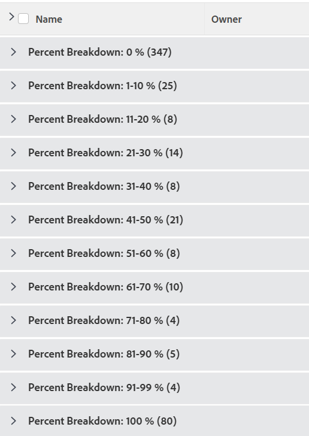

# Gruppering: uppdelad projektprocent 2

I den här anpassade projektgrupperingen kan du visa projekt grupperade efter ett intervall av deras procentvärden för slutförande. Uppdelningarna visar procentvärdet som är fullständigt i steg om 10 procent: 0-10 %, 11-20 %, 21-30 % osv.

I följande gruppering ordnas projekt efter procentvärdet färdigt i en av dessa grupperingar:

* 0 %
* 1-10 %
* 11-20 %
* 21-30 %
* 31-40 %
* 41-50 %
* 51-60 %
* 61-70 %
* 71-80 %
* 81-90 %
* 91-99 %
* 100 %

## Åtkomstkrav

Du måste ha följande åtkomst för att kunna utföra stegen i den här artikeln:

<table style="table-layout:auto"> 
 <col> 
 <col> 
 <tbody> 
  <tr> 
   <td role="rowheader">Adobe Workfront-plan*</td> 
   <td> 
Alla
 </td> 
  </tr> 
  <tr> 
   <td role="rowheader">Adobe Workfront-licens*</td> 
   <td> 
Begäran om att ändra en gruppering 

   
Planera att ändra en rapport
 </td> 
  </tr> 
  <tr> 
   <td role="rowheader">Konfigurationer på åtkomstnivå*</td> 
   <td> 
Redigera åtkomst till rapporter, instrumentpaneler och kalendrar för att ändra en rapport
 
Redigera åtkomst till filter, vyer och grupperingar för att ändra en gruppering
 
<b>ANMÄRKNING</b>

Om du fortfarande inte har åtkomst frågar du Workfront-administratören om de anger ytterligare begränsningar för din åtkomstnivå. Mer information om hur en Workfront-administratör kan ändra åtkomstnivån finns i <a href="../../../administration-and-setup/add-users/configure-and-grant-access/create-modify-access-levels.md" class="MCXref xref">Skapa eller ändra anpassade åtkomstnivåer</a>.
 </td>
</tr>  
  <tr> 
   <td role="rowheader">Objektbehörigheter</td> 
   <td> 
Hantera behörigheter i en rapport
 
Mer information om hur du begär ytterligare åtkomst finns i <a href="../../../workfront-basics/grant-and-request-access-to-objects/request-access.md" class="MCXref xref">Begär åtkomst till objekt </a>.
 </td> 
  </tr> 
 </tbody> 
</table>

&#42;Kontakta Workfront-administratören om du vill veta vilken plan, licenstyp eller åtkomst du har.

## Gruppera efter procentuell indelning av projekt

Så här använder du den här grupperingen:

1. Gå till en lista med projekt.
1. Välj **Ny gruppering** i listrutan **Gruppering**.

1. Klicka på **Växla till textläge**.
1. Ta bort texten i rutan och klistra in följande kod i det tillgängliga utrymmet:
   <pre>group.0.linkedname=direct group.0.name=Percent Breakdown group.0.notime=false group.0.valueexpression=IF({percentComplete}=0,"0 %",IF({percentComplete}&lt;=11,"1-10 %",IF({percentComplete}&lt;=21,"11-20 %" IF({percentComplete}&lt;=31,"21-30 %",IF({percentComplete}&lt;41,"31-40 %",IF({percentComplete}&lt;51,"41-50 %",IF({percentComplete}&lt;61,"51-60 %",IF({percentComplete}&lt;71,"6 1-70 %",IF({percentComplete}&lt;81,"71-80 %",IF({percentComplete}&lt;91,"81-90 %",IF({percentComplete}&lt;100,"91-99 %","100 %")))) ) textmode=true</pre>

1. Klicka på **Spara gruppering**.
