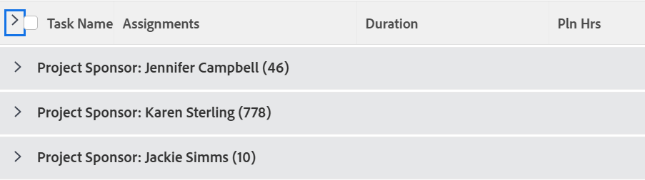

# Gruppering: Projektsponsor för en uppgiftslista

Med den här uppgiftsgrupperingen kan du gruppera uppgifter efter projektsponsorn.



## Åtkomstkrav

Du måste ha följande åtkomst för att kunna utföra stegen i den här artikeln:

<table style="table-layout:auto"> 
 <col> 
 <col> 
 <tbody> 
  <tr> 
   <td role="rowheader">Adobe Workfront-plan*</td> 
   <td> <p>Alla</p> </td> 
  </tr> 
  <tr> 
   <td role="rowheader">Adobe Workfront-licens*</td> 
   <td> <p>Begäran om att ändra en gruppering </p>
   <p>Planera att ändra en rapport</p> </td> 
  </tr> 
  <tr> 
   <td role="rowheader">Konfigurationer på åtkomstnivå*</td> 
   <td> <p>Redigera åtkomst till rapporter, instrumentpaneler och kalendrar för att ändra en rapport</p> <p>Redigera åtkomst till filter, vyer och grupperingar för att ändra en gruppering</p> <p><b>ANMÄRKNING</b>

Om du fortfarande inte har åtkomst frågar du Workfront-administratören om de anger ytterligare begränsningar för din åtkomstnivå. Information om hur en Workfront-administratör kan ändra åtkomstnivån finns i <a href="../../../administration-and-setup/add-users/configure-and-grant-access/create-modify-access-levels.md" class="MCXref xref">Skapa eller ändra anpassade åtkomstnivåer</a>.</p> </td>
</tr>  
  <tr> 
   <td role="rowheader">Objektbehörigheter</td> 
   <td> <p>Hantera behörigheter i en rapport</p> <p>Mer information om hur du begär ytterligare åtkomst finns i <a href="../../../workfront-basics/grant-and-request-access-to-objects/request-access.md" class="MCXref xref">Begär åtkomst till objekt </a>.</p> </td> 
  </tr> 
 </tbody> 
</table>

&#42;Kontakta Workfront-administratören om du vill veta vilken plan, licenstyp eller åtkomst du har.

## Gruppera efter projektsponsorer för en uppgiftslista

Så här använder du den här grupperingen:

1. Gå till listan med uppgifter.
1. I **Gruppering** nedrullningsbar meny, välja **Ny gruppering**.

1. Klicka **Växla till textläge**.
1. Ta bort texten som visas i textredigeringsfönstret.
1. Kopiera och klistra in följande kod i textredigeringsfönstret:

   ```
   group.0.name=Project Sponsor<br>group.0.valuefield=project:sponsor:name<br>group.0.valueformat=string
   ```

1. Klicka **Spara gruppering**.
