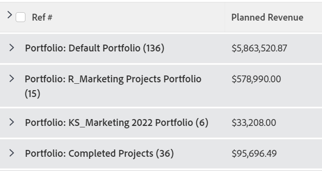
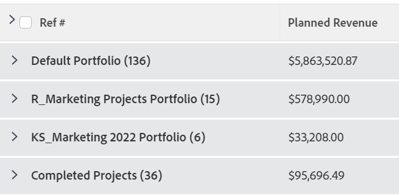

# Gruppering: redigera visningsnamnet i en gruppering

<!--Audited: 01/2024-->

Du kan byta namn på grupperingar till något som är mer välbekant för användarna.

Om du till exempel använder standardgrupperingen för Portfolio-namn på en lista med projekt, visas grupperingens namn som *Portfolio: Namn:`<name of portfolio>`*.

Du kan ändra den här grupperingen i textläge om du vill visa ett namn som är enklare att läsa.

## Åtkomstkrav

Du måste ha följande åtkomst för att kunna utföra stegen i den här artikeln:

<table style="table-layout:auto"> 
 <col> 
 <col> 
 <tbody> 
  <tr> 
   <td role="rowheader">Adobe Workfront-plan*</td> 
   <td> 
Alla
 </td> 
  </tr> 
  <tr> 
   <td role="rowheader">Adobe Workfront-licens*</td> 
   <td>

Nytt: 

   <ul>
   <li> 
Medarbetare som ändrar en gruppering 
</li>
   <li>
Standard för att ändra en rapport
</li></ul>

 Aktuell:

   <ul>  
   <li>
Begäran om att ändra en gruppering 
</li>
   <li>
Planera att ändra en rapport
</li> </td> 
  </tr> 
  <tr> 
   <td role="rowheader">Konfigurationer på åtkomstnivå*</td> 
   <td> 
Redigera åtkomst till rapporter, instrumentpaneler och kalendrar för att ändra en rapport
 
Redigera åtkomst till filter, vyer och grupperingar för att ändra en gruppering
 
<b>ANMÄRKNING</b>

Om du fortfarande inte har åtkomst frågar du Workfront-administratören om de anger ytterligare begränsningar för din åtkomstnivå. Mer information om hur en Workfront-administratör kan ändra åtkomstnivån finns i <a href="../../../administration-and-setup/add-users/configure-and-grant-access/create-modify-access-levels.md" class="MCXref xref">Skapa eller ändra anpassade åtkomstnivåer</a>.
 </td>
</tr>  
  <tr> 
   <td role="rowheader">Objektbehörigheter</td> 
   <td> 
Hantera behörigheter i en rapport
 
Mer information om hur du begär ytterligare åtkomst finns i <a href="../../../workfront-basics/grant-and-request-access-to-objects/request-access.md" class="MCXref xref">Begär åtkomst till objekt </a>.
 </td> 
  </tr> 
 </tbody> 
</table>

&#42;Kontakta Workfront-administratören om du vill veta vilken plan, licenstyp eller åtkomst du har.

## Redigera visningsnamnet i en gruppering

Så här ändrar du visningsnamnet i en projektgruppering:

1. Gå till en lista med projekt.
1. Välj **Ny gruppering** i listrutan **Gruppering**.

1. Klicka på **Lägg till gruppering** och börja skriva &quot;Portfolio-namn&quot; i fältet **Först av:**. Markera grupperingen när den visas i listan.

1. Klicka på **Växla till textläge**.
1. Gör något av följande:

   * Lägg till följande kod i den befintliga texten som är tillgänglig i rutan **Gruppera din rapport**:

     `group.0.displayname=Your Value`

     Eller i det här fallet:

     `group.0.displayname=Portfolio`

   * Ta bort alla rader i grupperingens textlägesgränssnitt som innehåller ordet &quot;name&quot; och lägg sedan till raden:

     `group.0.name=Your Value`

     Eller i det här fallet:

     `group.0.name=Portfolio`

     >[!TIP]
     >
     >Du kan också lämna `group.0.name=`- och `group.0.displayname=`-raderna tomma. I så fall visar grupperingen det värde som du grupperar efter.

     

1. Klicka på **Klar** och sedan på **Spara gruppering**.

   Grupperingens standardnamn ändras enligt textlägesinformationen.
