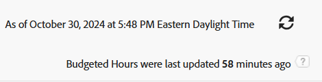

# Rapport: Budgeterad timme

<!--
<p data-mc-conditions="QuicksilverOrClassic.Draft mode">(NOTE: From&nbsp;Alina: This is my article, but since it's about building a report, it is in the Reporting section. Please don't remove it -it's linked to Resouce Management and it is super important.) </p>
-->

När du vill dela information om budgeterad timme med andra användare som inte har tillgång till resursplaneraren kan du göra det genom att skapa en rapport om budgeterad timme. Du kan sedan dela rapporten med dem.

<!--
<p data-mc-conditions="QuicksilverOrClassic.Draft mode">(NOTE: This info is also added and drafted in the article "View Budget Hours in a report" in the Resource Planning section. Consider deleting this article?!)</p>
-->

>[!IMPORTANT]
>
>Budgeterade timmar uppdateras varje timme i Adobe Workfront-databasen. Om du uppdaterar rapporten uppdateras inte timinformationen i den. Du kan visa den tid som gått sedan den senaste uppdateringen i det övre högra hörnet i varje rapport för budgeterad timme. När du uppdaterar rapporten uppdateras bara informationen i den när det har gått mer än en timme sedan den senaste uppdateringen.
>
>>

## Åtkomstkrav

Du måste ha följande åtkomst för att kunna utföra stegen i den här artikeln:

<table style="table-layout:auto"> 
 <col> 
 <col> 
 <tbody> 
  <tr> 
   <td role="rowheader">Adobe Workfront-plan*</td> 
   <td> <p>Alla</p> </td> 
  </tr> 
  <tr> 
   <td role="rowheader">Adobe Workfront-licens*</td> 
   <td> <p>Plan </p> </td> 
  </tr> 
  <tr> 
   <td role="rowheader">Konfigurationer på åtkomstnivå*</td> 
   <td> <p>Redigera åtkomst till rapporter, instrumentpaneler och kalendrar</p> <p>Redigera åtkomst till filter, vyer, grupperingar</p> <p><b>ANMÄRKNING</b>

Om du fortfarande inte har åtkomst frågar du Workfront-administratören om de anger ytterligare begränsningar för din åtkomstnivå. Information om hur en Workfront-administratör kan ändra åtkomstnivån finns i <a href="../../../administration-and-setup/add-users/configure-and-grant-access/create-modify-access-levels.md" class="MCXref xref">Skapa eller ändra anpassade åtkomstnivåer</a>.</p> </td>
</tr> 
  <tr> 
   <td role="rowheader">Objektbehörigheter</td> 
   <td> <p>Hantera behörigheter i en rapport</p> <p>Mer information om hur du begär ytterligare åtkomst finns i <a href="../../../workfront-basics/grant-and-request-access-to-objects/request-access.md" class="MCXref xref">Begär åtkomst till objekt </a>.</p> </td> 
  </tr> 
 </tbody> 
</table>

&#42;Kontakta Workfront-administratören om du vill veta vilken plan, licenstyp eller åtkomst du har.

## Bygg en budgeterad timrapport

1. Klicka på **Huvudmeny**  i det övre högra hörnet och klicka sedan på **Rapporter**.

1. Klicka **Ny rapport > Budgeterad timme**.

   Standardvyn används för rapporten.

1. (Valfritt) Om du vill göra rapporten lättare att läsa klickar du på **Budgeterade timmar** kolumn, sedan **Växla till textläge** och sedan ändra

   ```
   valuefield
   ```

   linje till

   ```
   valueexpreesion
   ```

   och ange avrundningsuttrycket.

   Detta avrundar antalet budgeterade timmar till ett antal decimaler som du anger.

   Mer information om hur du avrundar ett tal i Workfront finns i artikeln [Översikt över beräknade datauttryck](../../../reports-and-dashboards/reports/calc-cstm-data-reports/calculated-data-expressions.md).

1. (Valfritt) Klicka på **Lägg till kolumn** om du vill lägga till ytterligare kolumner.
1. (Valfritt) För att rapporten ska bli lättare att läsa rekommenderar vi att du lägger till en gruppering i den. Vi föreslår följande gruppering:

   Klicka på **Grupperingar** gör du något av följande:

   1. Klicka **Lägg till gruppering** och börja skriva &quot;Projektnamn&quot; och markera det sedan när det visas i listan.
   1. Klicka **Lägg till gruppering** och börja skriva&quot;Jobbrollnamn&quot; och markera det sedan när det visas i listan.
   1. Klicka **Lägg till gruppering** och börja skriva **Fördelningsdatum** markerar du den när den visas i listan och väljer sedan den tidsram som du vill gruppera efter på menyn **Gruppera datum efter** fält.

1. (Valfritt) Klicka på **Filter** för att lägga till filter i rapporten.
1. (Valfritt) Klicka på **Diagram** om du vill lägga till ett diagram i rapporten.
1. Klicka **Spara + Stäng**.

## Granska rapporten om budgeterad timme

Följande information finns som standard i rapporten Budgeterad timma:

<table style="table-layout:auto"> 
 <col> 
 <col> 
 <tbody> 
  <tr> 
   <td role="rowheader">Projekt </td> 
   <td>Det här är namnet på projektet som är associerat med budgeterad timme.</td> 
  </tr> 
  <tr> 
   <td role="rowheader"> <p>Jobbroll</p> </td> 
   <td>Det här är namnet på den jobbroll som är associerad med budgeterad timme. </td> 
  </tr> 
  <tr> 
   <td role="rowheader">Användare</td> 
   <td>Det här är namnet på användaren som är associerad med budgeterad timme.</td> 
  </tr> 
  <tr> 
   <td role="rowheader">Fördela. Datum</td> 
   <td> <p>Detta är fördelningsdatumet. Det är den första dagen (en söndag) i veckan som du budgeterade timmarna för.</p> <p>Tips:  <p>Om en vecka sträcker sig över två månader genereras två rader i rapporten: en som motsvarar den första dagen i veckan (söndagen i veckan som infaller under den första månaden) och en andra som motsvarar den första dagen i den andra månaden (och som kan vara vilken dag som helst i veckan).</p> <p>Om du till exempel budgeterar 8 timmar för en användare för veckan 30 juni (söndag) - 6 juli (lördag), visar de två raderna ett allokeringsdatum 30 juni och 1 juli.</p> </p> </td> 
  </tr> 
  <tr> 
   <td role="rowheader">Bud. Timmar</td> 
   <td>Detta är de budgeterade timmar som tilldelats användaren i resursplaneraren.</td> 
  </tr> 
  <tr> 
   <td role="rowheader">Plan. Bud. Timmar</td> 
   <td>Detta är de budgeterade timmar som tilldelats jobbrollen eller projektet i resursplaneraren.</td> 
  </tr> 
 </tbody> 
</table>
