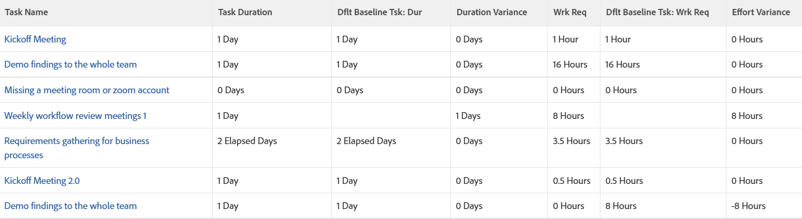

# Visa: baslinjeavvikelse för Varaktighet och Planerat arbete i en uppgiftsvy

I den här vyn visas följande i en uppgiftsvy:

* Uppgiftsinformation med baslinjeaktivitetsinformation.
* Skillnaden mellan Varaktighet och Standardvaraktighet för baslinje.
* Skillnaden mellan det planerade arbetet och standardoriginalarbetet.

>[!NOTE]
>
> De data som visas i följande vy jämför de faktiska aktivitetsvärdena med de värden som är associerade med standardschemauppgifterna.

 

## Åtkomstkrav

Du måste ha följande åtkomst för att kunna utföra stegen i den här artikeln:

<table style="table-layout:auto"> 
 <col> 
 <col> 
 <tbody> 
  <tr> 
   <td role="rowheader">Adobe Workfront-plan*</td> 
   <td> 
Alla
 </td> 
  </tr> 
  <tr> 
   <td role="rowheader">Adobe Workfront-licens*</td> 
   <td> 
Begäran om att ändra en vy 

   
Planera att ändra en rapport
 </td> 
  </tr> 
  <tr> 
   <td role="rowheader">Konfigurationer på åtkomstnivå*</td> 
   <td> 
Redigera åtkomst till rapporter, instrumentpaneler och kalendrar för att ändra en rapport
 
Redigera åtkomst till filter, vyer och grupperingar för att ändra en vy
 
<b>ANMÄRKNING</b>

Om du fortfarande inte har åtkomst frågar du Workfront-administratören om de anger ytterligare begränsningar för din åtkomstnivå. Mer information om hur en Workfront-administratör kan ändra åtkomstnivån finns i <a href="../../../administration-and-setup/add-users/configure-and-grant-access/create-modify-access-levels.md" class="MCXref xref">Skapa eller ändra anpassade åtkomstnivåer</a>.
 </td>
</tr> 
  <tr> 
   <td role="rowheader">Objektbehörigheter</td> 
   <td> 
Hantera behörigheter i en rapport
 
Mer information om hur du begär ytterligare åtkomst finns i <a href="../../../workfront-basics/grant-and-request-access-to-objects/request-access.md" class="MCXref xref">Begär åtkomst till objekt </a>.
 </td> 
  </tr> 
 </tbody> 
</table>

&#42;Kontakta Workfront-administratören om du vill veta vilken plan, licenstyp eller åtkomst du har.

## Visa baslinjeavvikelse för Varaktighet och Planerat arbete i en uppgiftsvy

1. Gå till en lista med uppgifter.
1. Välj **Ny vy** i listrutan **Visa**.

1. Ta bort alla kolumner i vyn, förutom den första.
1. När den första kolumnen är markerad klickar du på **Växla till textläge**.
1. Kopiera texten nedan och klistra in den i vyns första kolumn:
   <pre>column.0.descriptionkey=name column.0.link.linkproperty.0.name=ID column.0.link.link.property.0.valuefield=ID column.0.link.link.property.0.valueformat=int column.0.link.lookup=link.view column.0.link.valuefield=objCode 5}column.0.link.valueFormat=val column.0.linkedname=direct column.0.listsort=string(name) column.0.namekey=name.abbr column.0.querysort=name column.0.shortview=false column.0.stretch=100 column.0.valuefield=name column.0.valueformat=HTML column.0.width=150 column.0.displayname=Task Name column.1.descriptionkey=duration column.1.linkedname=direct column.1.listsort=intAs Int(durationMinutes) column.1.namekey=duration.abbr column.1.querysort=durationMinutes column.1.shortview=false column.1.stretch=0 column.1.valuefield=durationFieldLong column.1.valueformat=compound{compound 25}column.1.viewAlias=duration column.1.width=100 column.1.displayname=Task Duration column.2.descriptionkey=view.relatedcolumn column.2.descriptionkeykey.0=defaultbaselinetask column.2.descripdescrip tionkeykey.1=duration column.2.linkedname=defaultBaselineTask column.2.listsort=intAsInt(durationMinutes)  column.2.namekey=duration column.2.namekeyargkey.0=defaultbaselinetask.abbr column.2.namekeyargkey.1=duration.abbr column.2.querysort=defaultBaselineTask:durationMinutes column.2.shortview=false column.2.stretch=0 column.2.valuefield=defaultBaselineTask:durationFieldLong column.2.valueformat=compound  column.2.viewAlias=defaultBaselineTask:duration column.2.width=100 column.2.displayname=Dflt Baseline Tsk: Dur column.2.durationunitfield=durationUnit.value column.3.description=Duration Variance"column.3 .linkedname=direct column.3.listsort=intAsInt(durationMinutes) column.3.name=Duration Variance column.3.querysort=durationMinutes column.3.shortview=false column.3.stretch=0 column.3.valueexpression=true CONCAT(SUB({duration},{defaultBaselineTask}). {duration})/480," Days") column.3.valueformat=HTML column.3.viewalias=duration column.3.width=100 column.3.displayname=Duration Variance column.4.descriptionkey=workrequired column.4.linkedname=direct column.column 4.listsort=doubleAsDouble(workRequired) column.4.namekey=workrequired.abbr column.4.querysort=workRequired column.4.shortview=false column.4.stretch=0 column.4.valuefield=workFieldLong column.4 .valueformat=compound column.4.viewalias=workrequired column.4.width=100 column.4.displayname=Work Req column.5.descriptionkey=view.relatedcolumn column.5.descriptionkeykey.0=defaultbaselinetask  9}column.5.descriptionkeykey.1=workrequired column.5.linkedname=defaultBaselineTask column.5.listsort=doubleAsDouble(workRequired) column.5.namekey=view.relatedcolumn column.5.namekeykey.0=defaultbaselell inetask.abbr column.5.namekeyargkey.1=workrequired.abbr column.5.querysort=defaultBaselineTask:workRequired column.5.shortview=false column.5.stretch=0 column.5.valuefield=defaultBaselineTask:work FieldLong column.5.valueformat=compound column.5.viewalias=defaultBaselineTask:workrequired column.5.width=100 column.5.displayname=Dflt Baseline Task: Wrk Req column.6.descriptionkey=workrequired column.6.linkedname=direct column.6.listsort=doubleAsDouble(workRequired) column.6.name=Effort Variance column.6.querysort=workRequired column.6.shortview=false column.6.stretch=0 column.6 .valueexpression=CONCAT(SUB({workRequired},{defaultBaselineTask}).{workRequired})/60," Timmar") column.6.valueformat=HTML column.6.view=workrequired column.6.width=100 column.6.displayName=Effort Variance</pre>

1. Klicka på **Spara vy**.