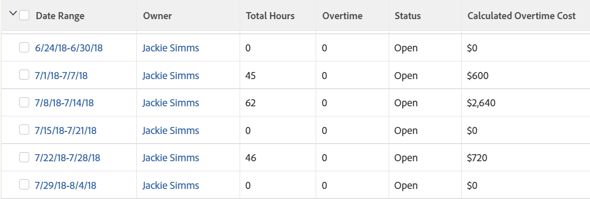

# Visa: beräkna övertidskostnad i en tidrapportvy

<!--Audited: 11/2024-->

Övertid beräknas inte som standard i Adobe Workfront, men du kan skapa en tidrapport som beräknar övertid.

Om användaren är kopplad till en kostnad per timme i sin profil kan du även beräkna kostnadsbeloppet för den användarens övertid.\
Mer information om hur du associerar användare med kostnad per timme finns i artikeln [Konfigurera mina inställningar](../../../workfront-basics/manage-your-account-and-profile/configuring-your-user-profile/configure-my-settings.md).

>[!NOTE]
>
>Fältet Övertid som du kan lägga till i en tidrapportvy i en lista eller rapport visar informationen som finns i fältet Övertid i tidrapporten. Den här informationen uppdateras manuellt av en användare som har behörighet att ändra tidrapporten. Mer information om fältet Övertid i en tidrapport finns i artikeln [Översikt över tidrapportslayouten](../../../timesheets/timesheets/timesheet-layout.md).



## Åtkomstkrav

+++ Expandera om du vill visa åtkomstkrav för funktionerna i den här artikeln. 

<table style="table-layout:auto"> 
 <col> 
 <col> 
 <tbody> 
  <tr> 
   <td role="rowheader">Adobe Workfront package</td> 
   <td> <p>Alla</p> </td> 
  </tr> 
  <tr> 
   <td role="rowheader">Adobe Workfront-licens</td> 
   <td> 
   <p>Medarbetare eller begäran om att ändra ett filter </p>
   <p>Standard eller Plan för att ändra en rapport</p>
  </tr> 
  <tr> 
   <td role="rowheader">Konfigurationer på åtkomstnivå</td> 
   <td> <p>Redigera åtkomst till rapporter, instrumentpaneler och kalendrar för att ändra en rapport</p> <p>Redigera åtkomst till filter, vyer och grupperingar för att ändra ett filter</p> </td> 
  </tr> 
  <tr> 
   <td role="rowheader">Objektbehörigheter</td> 
   <td> <p>Hantera behörigheter i en rapport</p>  </td> 
  </tr> 
 </tbody> 
</table>

Mer information om informationen i den här tabellen finns i [Åtkomstkrav i Workfront-dokumentationen](/help/quicksilver/administration-and-setup/add-users/access-levels-and-object-permissions/access-level-requirements-in-documentation.md).
+++

## Beräkna övertidskostnad i en tidrapportvy

Så här lägger du till en beräknad övertidskolumn i en tidrapportvy:

1. Gå till en lista med tidrapporter.

1. Klicka på listrutan **Visa** och sedan på **Ny vy**.

1. Klicka på **Lägg till kolumn**.
1. Klicka på **Växla till textläge** och sedan på **Redigera textläge**.
1. I rutan **Redigera textläge** tar du bort texten i rutan och kopierar och klistrar sedan in följande textlägeskod:

   ```
   displayname=Calculated Overtime Cost
   linkedname=direct
   namekey=totalHours
   querysort=totalHours 
   textmode=true
   valueexpression=IF({totalHours}>40,({totalHours}-40)*{user}.{costPerHour},{totalHours}*{user}.{costPerHour})
   valueformat=currencyStringCurrencyRounded
   ```

   >[!NOTE]
   >
   >I den här beräkningen antas att användaren vanligtvis arbetar en 40-timmarsvecka.

1. Klicka på **Klar**, ge den nya vyn ett namn och klicka sedan på **Spara vy** i en lista över tidrapporter.

   Kostnaden för övertid för varje användare visas i kolumnen **Beräknad övertidskostnad** .


