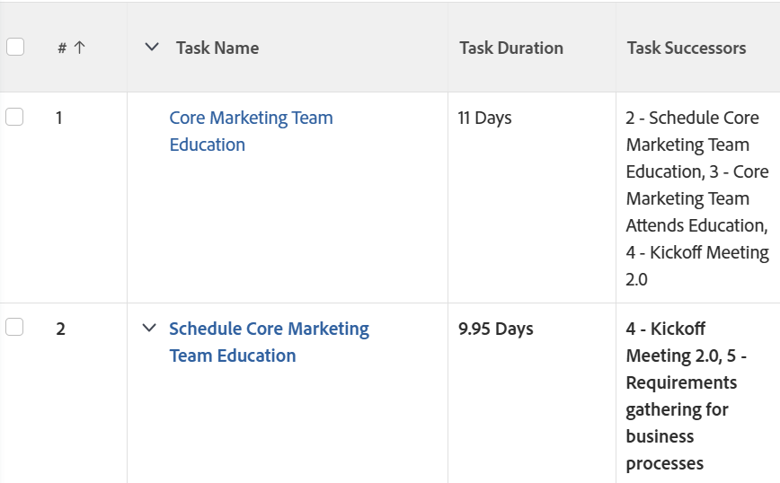

# Visa: lägg till en lista med efterföljande aktiviteter i en kolumn

<!--Audited: 11/2024-->

Du kan lägga till en kolumn i en uppgiftsvy för att visa en lista över de efterföljande uppgifterna. Kolumnen **Uppgiftens efterföljare** innehåller både antalet efterföljare och namnet.



## Åtkomstkrav

+++ Expandera om du vill visa åtkomstkrav för funktionerna i den här artikeln.

Du måste ha följande åtkomst för att kunna utföra stegen i den här artikeln:

<table style="table-layout:auto"> 
 <col> 
 <col> 
 <tbody> 
  <tr> 
   <td role="rowheader">Adobe Workfront</td> 
   <td> <p>Alla</p> </td> 
  </tr> 
  <tr> 
   <td role="rowheader">Adobe Workfront-licens*</td> 
   <td> 
    <p>Nytt:</p>
   <ul><li><p>Medarbetare som ändrar ett filter </p></li>
   <li><p>Standard för att ändra en rapport</p></li> </ul>

<p>Aktuell:</p>
   <ul><li><p>Begäran om att ändra ett filter </p></li>
   <li><p>Planera att ändra en rapport</p></li> </ul></td> 
  </tr> 
  <tr> 
   <td role="rowheader">Konfigurationer på åtkomstnivå</td> 
   <td> <p>Redigera åtkomst till rapporter, instrumentpaneler och kalendrar för att ändra en rapport</p> <p>Redigera åtkomst till filter, vyer och grupperingar för att ändra ett filter</p> </td> 
  </tr> 
  <tr> 
   <td role="rowheader">Objektbehörigheter</td> 
   <td> <p>Hantera behörigheter i en rapport</p>  </td> 
  </tr> 
 </tbody> 
</table>

*Mer information finns i [Åtkomstkrav i Workfront-dokumentation](/help/quicksilver/administration-and-setup/add-users/access-levels-and-object-permissions/access-level-requirements-in-documentation.md).

+++


## Lägga till en lista med efterföljande aktiviteter i en kolumn

Så här lägger du till den här kolumnen i en uppgiftsvy:

1. Gå till en uppgiftslista.
1. Expandera den nedrullningsbara menyn **Visa** och klicka på **Ny vy**.
1. Klicka på **Lägg till kolumn**.
1. Klicka på **Växla till textläge** och sedan på **Redigera textläge**.
1. Ta bort all text i rutan **Redigera textläge** och ersätt den med följande kod:

   ```
   displayname=Task Successors
   listdelimiter=
   listmethod=nested(successors).lists
   textmode=true
   type=iterate
   valueexpression=CONCAT({successor}.{taskNumber},' - ',{successor}.{name})
   valueformat=HTML
   ```

1. Klicka på **Klar** och sedan på **Spara vy**.
