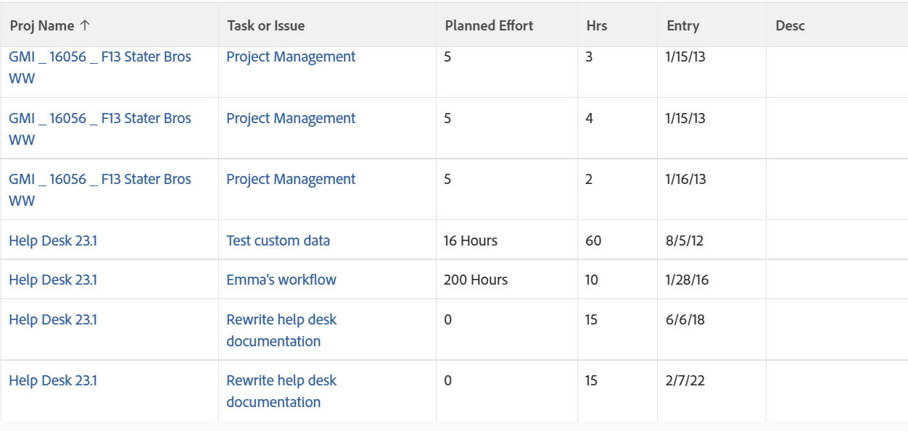

# Visa: information om kombinerade uppgifter och utgåvor i en timlista

I timvyn kombineras kolumnerna Aktivitets- och Ärendenamn samt Aktivitets- och Utfärdandetimmar med

```
sharecol
```

-tagg. Eftersom en timpost bara kan tillhöra en aktivitet eller ett problem, kan båda objekten inte finnas i samma kolumn samtidigt. Varje rad i vyn innehåller information från en aktivitet eller ett problem.

Läs mer om

```
sharecol
```

-tagg, se [Visa: sammanfoga information från flera kolumner i en delad kolumn](../../../reports-and-dashboards/reports/custom-view-filter-grouping-samples/view-merge-columns.md).\


## Åtkomstkrav

Du måste ha följande åtkomst för att kunna utföra stegen i den här artikeln:

<table style="table-layout:auto"> 
 <col> 
 <col> 
 <tbody> 
  <tr> 
   <td role="rowheader">Adobe Workfront-plan*</td> 
   <td> <p>Alla</p> </td> 
  </tr> 
  <tr> 
   <td role="rowheader">Adobe Workfront-licens*</td> 
   <td> <p>Begäran om att ändra en vy </p>
   <p>Planera att ändra en rapport</p> </td> 
  </tr> 
  <tr> 
   <td role="rowheader">Konfigurationer på åtkomstnivå*</td> 
   <td> <p>Redigera åtkomst till rapporter, instrumentpaneler och kalendrar för att ändra en rapport</p> <p>Redigera åtkomst till filter, vyer och grupperingar för att ändra en vy</p> <p><b>ANMÄRKNING</b>

Om du fortfarande inte har åtkomst frågar du Workfront-administratören om de anger ytterligare begränsningar för din åtkomstnivå. Mer information om hur en Workfront-administratör kan ändra åtkomstnivån finns i <a href="../../../administration-and-setup/add-users/configure-and-grant-access/create-modify-access-levels.md" class="MCXref xref">Skapa eller ändra anpassade åtkomstnivåer</a>.</p> </td>
</tr>  
  <tr> 
   <td role="rowheader">Objektbehörigheter</td> 
   <td> <p>Hantera behörigheter i en rapport</p> <p>Mer information om hur du begär ytterligare åtkomst finns i <a href="../../../workfront-basics/grant-and-request-access-to-objects/request-access.md" class="MCXref xref">Begär åtkomst till objekt </a>.</p> </td> 
  </tr> 
 </tbody> 
</table>

&#42;Kontakta Workfront-administratören om du vill veta vilken plan, licenstyp eller åtkomst du har.

## Visa information om kombinerade uppgifter och utgåvor i en timlista

Så här använder du den här vyn:

1. Gå till en lista med timmar.
1. Välj **Ny vy** i listrutan **Visa**.

1. Ta bort alla kolumner utom en i området **Förhandsvisa kolumn**.
1. Klicka på rubriken för den återstående kolumnen och klicka sedan på **Växla till textläge**.
1. För musen över textlägesområdet och klicka på **Klicka för att redigera text**.
1. Ta bort texten som du söker i rutan **Textläge** och ersätt den med följande kod:
   <pre>column.1.querysort=project:name<br>column.1.shortview=false<br>column.1.stretch=0<br>column.1.valuefield=project:name<br>column.1.valueformat=HTML<br>column.1.width=100<br>column.2.description=Task or Issue<br>column.2.link.linkproperty.property.property.property 0.name=ID<br>column.2.link.linkproperty.0.valuefield=task:ID<br>column.2.link.link.property.0.valueformat=int<br>column.2.link.lookup=link.view<br>column.2.link.valueField=task:objCode<br>column.2.link.valueFormat=val{1111 2}column.2.linkedname=task<br>column.2.listsort=nested(task).string(name)<br>column.2.name=Task or Issue<br>column.2.querysort=task:name<br>column.2.sharecol=true<br>column.2.shortview=false<br>column.2.stretch=0<br>column.2.valuefield=task:name<br>column.2.valueformat=HTML<br>column.2.width=100<br>column.3.descriptionkey=optask<br>column.3.link.linkproperty.0.name=ID<br>column.3.link.link.property.link .0.valueField=opTask:ID<br>column.3.link.property.0.valueformat=int<br>column.3.link.lookup=link.view<br>column.3.link.valuefield=opTask:objCode<br>column.3.link.valueFormat=val<br>column.3.linkedjech name=optask<br>column.3.listsort=nested(opTask).string(name)<br>column.3.namekey=opTask<br>column.3.querysort=opTask:name<br> column.3.shortview=false<br>column.3.stretch=0<br>column.3.valuefield=opTask:name<br>column.3.valueformat=HTML<br>column.3.width=1<br>column.4.valuefield=task:work<br>column.4.sharecol=true<br>column.4.linkedname=task<br>column.4.valueformat=doubleAsInt{44 2}column.4.namekey=view.relatedcolumn<br>column.4.querysort=task:work<br>column.4.textmode=true<br>column.4.namekeyargkey.0=task<br>column.4.namekeyargkey.1=work<br>column.4.displayname=Planned Effort{4 8}column.5.displayName=Planned Effort<br>column.5.viewalias=opTask:workrequired<br>column.5.linkedname=opTask<br>column.5.valuefield=opTask:workRequired<br>column.5.valueFormat=compound<br>column.5.querysort=op Aktivitet:workRequired<br>column.5.namekeyargkey.0=opTask<br> column.5.namekeyargkey.1=workrequired<br>column.5.namekey=view.relatedcolumn<br>column.5.textmode=true<br>column.6.descriptionkey=hours<br>column.6.6 linkedname=direct<br>column.6.listsort=doubleAsDouble(hours)<br>column.6.namekey=hours.abbr<br>column.6.querysort=hours<br>column.6.shortview=false<br>column.6.stretch=0<br>column.6.valuefield=hours{6 6}column.6.valueFormat=doubleAsString<br>column.6.width=75<br>column.7.descriptionkey=entrydate<br>column.7.linkedname=direct<br>column.7.listsort=atDateAsAtDate(entryDate)<br>column.7.namekey=main entrydate.abbr<br>column.7.querysort=entryDate<br>column.7.shortview=false<br>column.7.stretch=0<br>column.7.valuefield=entryDate<br>column.7.valueformat=atDate<br>column.7.width=75<br>8} column.8.descriptionkey=description<br>column.8.linkedname=direct<br>column.8.listsort=string(description)<br>column.8.namekey=description.abbr<br>column.8.querysort=description<br>column.8.shortview=false<br>column.8.stretch=0{8 5}column.8.valuefield=description<br>column.8.valueformat=HTML<br>column.8.width=150<br><br><br><br><br></pre>

1. Klicka på **Spara vy**.
