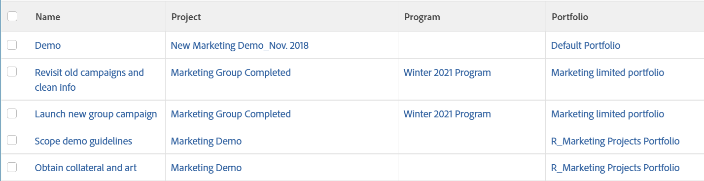

# Visa: visa information om program och Portfolio i en uppgiftsvy

I den här uppgiftsvyn visas programmet och Portfolio som är associerade med aktivitetens projekt. Den här informationen är inte tillgänglig i Report Builder när en uppgiftsvy skapas. Den här informationen är bara tillgänglig i textläge.

Vyn innehåller även länkar till projekt, program och Portfolio från en uppgiftslista.

## Åtkomstkrav

Du måste ha följande åtkomst för att kunna utföra stegen i den här artikeln:

<table style="table-layout:auto"> 
 <col> 
 <col> 
 <tbody> 
  <tr> 
   <td role="rowheader">Adobe Workfront-plan*</td> 
   <td> 
Alla
 </td> 
  </tr> 
  <tr> 
   <td role="rowheader">Adobe Workfront-licens*</td> 
   <td> 
Plan 
 </td> 
  </tr> 
  <tr> 
   <td role="rowheader">Konfigurationer på åtkomstnivå*</td> 
   <td> 
Redigera åtkomst till rapporter, instrumentpaneler och kalendrar
 
Redigera åtkomst till filter, vyer, grupperingar
 
Obs! Om du fortfarande inte har åtkomst frågar du Workfront-administratören om de anger ytterligare begränsningar för din åtkomstnivå. Information om hur en Workfront-administratör kan ändra åtkomstnivån finns i <a href="../../../administration-and-setup/add-users/configure-and-grant-access/create-modify-access-levels.md" class="MCXref xref">Skapa eller ändra anpassade åtkomstnivåer</a>.
 </td> 
  </tr> 
  <tr> 
   <td role="rowheader">Objektbehörigheter</td> 
   <td> 
Hantera behörigheter i en rapport
 
Mer information om hur du begär ytterligare åtkomst finns i <a href="../../../workfront-basics/grant-and-request-access-to-objects/request-access.md" class="MCXref xref">Begär åtkomst till objekt </a>.
 </td> 
  </tr> 
 </tbody> 
</table>

&#42;Kontakta Workfront-administratören om du vill veta vilken plan, licenstyp eller åtkomst du har.

## Visa program- och Portfolio-information i en uppgiftsvy

Så här använder du vyn på en uppgiftslista:

1. Gå till en lista med uppgifter.
1. Från **Visa** nedrullningsbar meny, välja **Ny vy**.

1. I **Förhandsgranska kolumn** -område, ta bort alla kolumner utom en.
1. Klicka på rubriken för den återstående kolumnen och klicka sedan på **Växla till textläge**.
1. För musen över textlägesområdet och klicka **Klicka för att redigera text**.
1. Ta bort den text du hittar i **Textläge** och ersätt den med följande kod:
   <pre>column.0.descriptionkey=name column.0.link.linkproperty.0.name=ID column.0.link.linkproperty.0.valuefield=ID column.0.link.linkproperty.0.valueformat=int column.0.link.lookup=link.view column.0.link.valuefield=objCode column.0.link.valueFormat=val column.0.linkedname=direct column.0.listsort=string(name) column.0.namekey=name.abbr column.0.querysort=name column.0.shortview=false column.0.stretch=100 column.0.valuefield=name column.0.valueformat=HTML column.0.width=150 column.1.descriptionkey=project column.1.link.linkproperty.0.name=ID column.1.link.linkproperty.0.valuefield=project:ID column.1.link.linkproperty.0.valueformat=int column.1.link.lookup=link.view column.1.link.valuefield=project:objCode column.1.link.valueFormat=val column.1.linkedname=project column.1.listsort=nested(project).string(name) column.1.namekey=project column.1.querysort=project:name column.1.shortview=false column.1.stretch=0 column.1.valuefield=project:name column.1.valueformat=HTML column.1.width=150 column.2.descriptionkey=program column.2.displayname=Program column.2.link.linkproperty.0.name=ID column.2.link.linkproperty.0.valuefield=project:program:ID column.2.link.linkproperty.0.valueformat=int column.2.link.lookup=link.view column.2.link.valuefield=project:program:objCode column.2.link.valueFormat=val column.2.linkedname=project column.2.listsort=nested(project:program).string(name) column.2.namekey=project column.2.querysort=project:program:name column.2.shortview=false column.2.stretch=0 column.2.valuefield=project:program:name column.2.valueformat=HTML column.2.width=150 column.3.descriptionkey=portfolio column.3.displayName=Portfolio column.3.link.linkproperty.0.name=ID column.3.link.linkproperty.0.valuefield=project:portfolio:ID column.3.link.linkproperty.0.valueformat=int column.3.link.lookup=link.view column.3.link.valuefield=project:portfolio:objCode column.3.link.valueFormat=val column.3.linkedname=project column.3.listsort=nested(project:portfolio).string(name) column.3.namekey=project column.3.querysort=project:portfolio:name column.3.shortview=false column.3.stretch=0 column.3.valuefield=project:portfolio:name column.3.valueformat=HTML column.3.width=150 </pre>

1. Klicka **Spara vy**.
