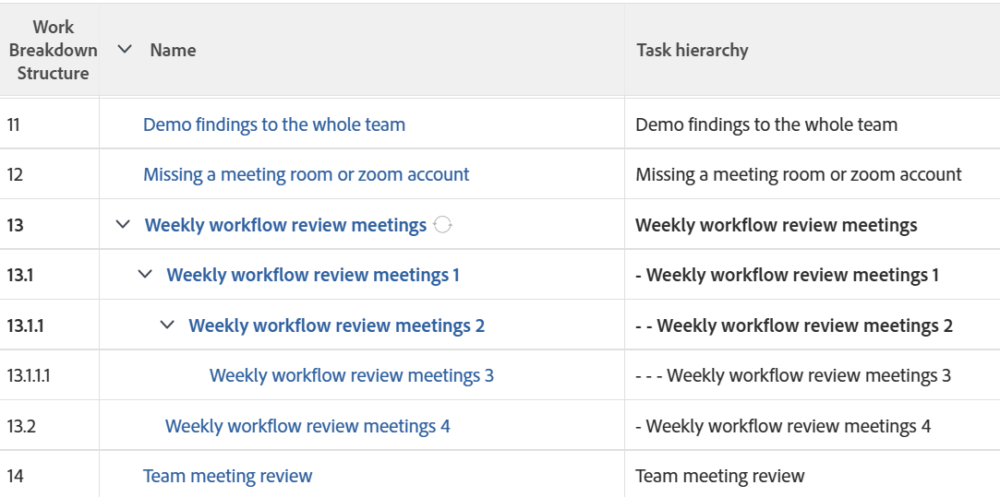

# Visa: visa indrag för uppgifter i en uppgiftslista

I den här uppgiftsvyn kan du lägga till kod i kolumnen Uppgiftsnamn om du vill visa uppgifter som är indragna enligt projektets arbetsgruppsstruktur.



## Åtkomstkrav

Du måste ha följande åtkomst för att kunna utföra stegen i den här artikeln:

<table style="table-layout:auto"> 
 <col> 
 <col> 
 <tbody> 
  <tr> 
   <td role="rowheader">Adobe Workfront-plan*</td> 
   <td> <p>Alla</p> </td> 
  </tr> 
  <tr> 
   <td role="rowheader">Adobe Workfront-licens*</td> 
   <td> <p>Begäran om att ändra en vy </p>
   <p>Planera att ändra en rapport</p> </td> 
  </tr> 
  <tr> 
   <td role="rowheader">Konfigurationer på åtkomstnivå*</td> 
   <td> <p>Redigera åtkomst till rapporter, instrumentpaneler och kalendrar för att ändra en rapport</p> <p>Redigera åtkomst till filter, vyer och grupperingar för att ändra en vy</p> <p><b>ANMÄRKNING</b>

Om du fortfarande inte har åtkomst frågar du Workfront-administratören om de anger ytterligare begränsningar för din åtkomstnivå. Mer information om hur en Workfront-administratör kan ändra åtkomstnivån finns i <a href="../../../administration-and-setup/add-users/configure-and-grant-access/create-modify-access-levels.md" class="MCXref xref">Skapa eller ändra anpassade åtkomstnivåer</a>.</p> </td>
</tr> 
  <tr> 
   <td role="rowheader">Objektbehörigheter</td> 
   <td> <p>Hantera behörigheter i en rapport</p> <p>Mer information om hur du begär ytterligare åtkomst finns i <a href="../../../workfront-basics/grant-and-request-access-to-objects/request-access.md" class="MCXref xref">Begär åtkomst till objekt </a>.</p> </td> 
  </tr> 
 </tbody> 
</table>

&#42;Kontakta Workfront-administratören om du vill veta vilken plan, licenstyp eller åtkomst du har.

## Visa indrag för aktiviteter i en kolumn i en uppgiftslista

1. Gå till en lista med uppgifter.
1. Klicka på **Ny vy** i listrutan **Visa**.

1. Klicka på **Lägg till kolumn** och börja skriva &quot;Aktivitetsnamn&quot; i fältet **Visa i den här kolumnen** och markera den när den visas i listan.

1. Klicka på **Växla till textläge** i den nya kolumnen.
1. Hovra över textlägesområdet och klicka på **Klicka för att redigera text**.
1. Ta bort texten som du hittar på raden `valuefield=` och ersätt den med följande kod:

   ```
   valueexpression=IF({indent}<1,{name},IF({indent}<2,CONCAT(' - ',{name}),IF({indent}<3,CONCAT(' - - ',{name}),IF({indent}<4,CONCAT(' - - - ',{name}),CONCAT(' - - - - ',{name})))))
   ```

1. Klicka på **Spara** och sedan på **Spara vy**.
