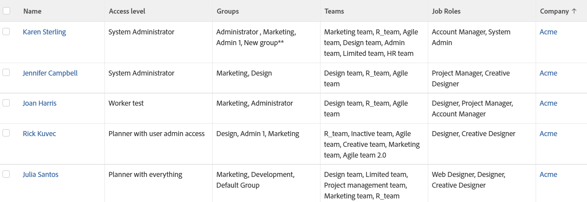

# Visa: utökad användarinformation

Den här användarvyn visar information om dina användare. Förutom namn, åtkomstnivåer och företag visas även listor över deras grupper, team och roller.

## Åtkomstkrav

Du måste ha följande åtkomst för att kunna utföra stegen i den här artikeln:

<table style="table-layout:auto"> 
 <col> 
 <col> 
 <tbody> 
  <tr> 
   <td role="rowheader">Adobe Workfront-plan*</td> 
   <td> 
Alla
 </td> 
  </tr> 
  <tr> 
   <td role="rowheader">Adobe Workfront-licens*</td> 
   <td> 
Begäran om att ändra en vy 

   
Planera att ändra en rapport
 </td> 
  </tr> 
  <tr> 
   <td role="rowheader">Konfigurationer på åtkomstnivå*</td> 
   <td> 
Redigera åtkomst till rapporter, instrumentpaneler och kalendrar för att ändra en rapport
 
Redigera åtkomst till filter, vyer och grupperingar för att ändra en vy
 
<b>ANMÄRKNING</b>

Om du fortfarande inte har åtkomst frågar du Workfront-administratören om de anger ytterligare begränsningar för din åtkomstnivå. Information om hur en Workfront-administratör kan ändra åtkomstnivån finns i <a href="../../../administration-and-setup/add-users/configure-and-grant-access/create-modify-access-levels.md" class="MCXref xref">Skapa eller ändra anpassade åtkomstnivåer</a>.
 </td>
</tr> 
  <tr> 
   <td role="rowheader">Objektbehörigheter</td> 
   <td> 
Hantera behörigheter i en rapport
 
Mer information om hur du begär ytterligare åtkomst finns i <a href="../../../workfront-basics/grant-and-request-access-to-objects/request-access.md" class="MCXref xref">Begär åtkomst till objekt </a>.
 </td> 
  </tr> 
 </tbody> 
</table>

&#42;Kontakta Workfront-administratören om du vill veta vilken plan, licenstyp eller åtkomst du har.

## Visa utökad användarinformation

Så här använder du den här vyn:

1. Gå till en lista med användare.
1. Från **Visa** nedrullningsbar meny, välja **Ny vy**.

1. I **Förhandsgranska kolumn** -område, ta bort alla kolumner utom en.
1. Klicka på rubriken för den återstående kolumnen och klicka sedan på **Växla till textläge**.
1. För musen över textlägesområdet och klicka **Klicka för att redigera text**.
1. Ta bort den text du hittar i **Textläge** och ersätt den med följande kod:

   <!--
   <MadCap:conditionalText data-mc-conditions="QuicksilverOrClassic.Draft mode">
   (NOTE: extra tag here that adds extra spaces in Preview)
   </MadCap:conditionalText>
   -->

   <pre>column.0.descriptionkey=name  column.0.link.linkproperty.0.name=ID column.0.link.linkproperty.0.valuefield=ID column.0.link.linkproperty.0.valueformat=int column.0.link.lookup=link.view column.0.link.valuefield=objCode column.0.link.valueFormat=val column.0.linkedname=direct column.0.listsort=string(name) column.0.namekey=name.abbr column.0.querysort=name column.0.shortview=false column.0.stretch=0 column.0.valuefield=name column.0.valueformat=HTML column.0.width=150 column.1.descriptionkey=access level column.1.link.linkproperty.0.name=ID column.1.link.linkproperty.0.valuefield=accessLevel:ID column.1.link.linkproperty.0.valueformat=int column.1.link.lookup=link.view column.1.link.valuefield=accessLevel:objCode column.1.link.valueFormat=val column.1.linkedname=accessLevel column.1.listsort=string(displayName) column.1.namekey=access level column.1.querysort=name column.1.shortview=false column.1.stretch=0 column.1.valuefield=accessLevel:displayName column.1.valueformat=HTML column.1.viewalias=accessLevel:displayName column.1.width=100 column.2.link.linkproperty.0.name=ID column.2.link.linkproperty.0.valuefield=ID column.2.link.linkproperty.0.valueformat=int column.2.link.lookup=link.view column.2.link.value=val(objCode) column.2.listdelimiter= column.2.listmethod=nested(userGroups).lists column.2.namekey=group.plural column.2.stretch=50 column.2.type=iterate column.2.valuefield=group:name column.2.valueformat=HTML column.2.width=150 column.3.displayName=Teams column.3.listdelimiter= column.3.listmethod=nested(teams).lists column.3.textmode=true column.3.type=iterate column.3.valueexpression={name} column.3.valueformat=HTML column.4.link.linkproperty.0.name=ID column.4.link.linkproperty.0.valuefield=ID column.4.link.linkproperty.0.valueformat=int column.4.link.lookup=link.view column.4.link.value=val(objCode) column.4.listdelimiter= column.4.listmethod=nested(userRoles).lists column.4.namekey=jobrole.plural column.4.stretch=50 column.4.type=iterate column.4.valuefield=role:name column.4.valueformat=HTML column.4.width=150 column.5.descriptionkey=company column.5.link.linkproperty.0.name=ID column.5.link.linkproperty.0.valuefield=company:ID column.5.link.linkproperty.0.valueformat=int column.5.link.lookup=link.view column.5.link.valuefield=company:objCode column.5.link.valueFormat=val column.5.linkedname=company column.5.listsort=nested(company).string(name) column.5.namekey=company column.5.querysort=company:name column.5.shortview=false column.5.stretch=0 column.5.valuefield=company:name column.5.valueformat=HTML column.5.width=150</pre>

1. Klicka **Spara vy**.
