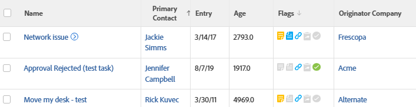

# Visa: problem med företagsnamnet för upphovspersonen

<!--Audit: 11/2024-->

I den här problemvyn visas det företagsnamn som är associerat med den användare som skickade problemet.



## Åtkomstkrav

+++ Expandera om du vill visa åtkomstkrav för funktionerna i den här artikeln.

Du måste ha följande åtkomst för att kunna utföra stegen i den här artikeln:

<table style="table-layout:auto"> 
 <col> 
 <col> 
 <tbody> 
  <tr> 
   <td role="rowheader">Adobe Workfront</td> 
   <td> <p>Alla</p> </td> 
  </tr> 
  <tr> 
   <td role="rowheader">Adobe Workfront-licens</td> 
   <td> <p>Nytt:<ul><li>Medarbetare som ändrar en vy</li><li>Standard för att ändra en rapport</li></ul></p><p>eller</p>Aktuell:<ul><li>Begäran om att ändra en vy</li><li>Planera att ändra en rapport</li></ul></p> </td> 
  </tr> 
  <tr> 
   <td role="rowheader">Konfigurationer på åtkomstnivå</td> 
   <td> <p>Redigera åtkomst till rapporter, instrumentpaneler och kalendrar för att ändra en rapport</p> <p>Redigera åtkomst till filter, vyer och grupperingar för att ändra en vy</p> </td> 
  </tr>  
  <tr> 
   <td role="rowheader">Objektbehörigheter</td> 
   <td> <p>Hantera behörigheter i en rapport</p> </td> 
  </tr> 
 </tbody> 
</table>

Mer information om informationen i den här tabellen finns i [Åtkomstkrav i Workfront-dokumentationen](/help/quicksilver/administration-and-setup/add-users/access-levels-and-object-permissions/access-level-requirements-in-documentation.md).

+++

## Visa problem med företagsnamnet för upphovspersonen

1. Gå till en lista med problem.
1. Välj **Ny vy** i listrutan **Visa**.
1. Ta bort alla kolumner utom en i området **Förhandsvisa kolumn**.
1. Klicka på rubriken för den återstående kolumnen och klicka på **Växla till textläge**. Klicka sedan på **Redigera textläge**.
1. Ta bort den text du söker i rutan **Redigera textläge** och ersätt den med följande kod:


   ```
   column.0.descriptionkey=name
   column.0.link.linkproperty.0.name=ID
   column.0.link.linkproperty.0.valuefield=ID
   column.0.link.linkproperty.0.valueformat=val
   column.0.link.lookup=link.view
   column.0.link.value=val(objCode)
   column.0.listsort=string(name)
   column.0.namekey=name
   column.0.querysort=name
   column.0.valuefield=name
   column.0.valueformat=HTML
   column.0.width=140
   column.1.descriptionkey=originator
   column.1.link.linkproperty.0.name=ID
   column.1.link.linkproperty.0.valuefield=ownerID
   column.1.link.linkproperty.0.valueformat=int
   column.1.link.lookup=link.view
   column.1.link.valuefield=owner:objCode
   column.1.link.valueformat=val
   column.1.listsort=nested(owner).string(name)
   column.1.namekey=originator.abbr
   column.1.querysort=owner:name
   column.1.valuefield=owner:name
   column.1.valueformat=HTML
   column.1.width=151
   column.2.descriptionkey=entrydate
   column.2.listsort=atDateAsAtDate(entryDate)
   column.2.namekey=entrydate.abbr
   column.2.querysort=entryDate
   column.2.valuefield=entryDate
   column.2.valueformat=atDate
   column.2.width=75
   column.3.descriptionkey=age
   column.3.listsort=doubleAsDouble(age)
   column.3.namekey=age
   column.3.querysort=age
   column.3.valuefield=howOld
   column.3.valueformat=val
   column.3.width=80
   column.4.viewalias=statusicons
   column.4.displayname=Flags
   column.4.linkedname=direct
   column.4.namekey=statusicons
   column.4.valuefield=
   column.4.valueformat=HTML
   column.4.querysort=
   column.4.tile.name=component.issuestatusicons
   column.4.tile.pdfcomponent=issueStatusIcons
   column.4.delimiter=
   column.4.tile.template=/WEB-INF/jsp/lists/components/issueStatusIcons.jsp
   column.5.description=Originator's Company Name
   column.5.link.linkproperty.0.name=ID
   column.5.link.linkproperty.0.valuefield=owner:companyID
   column.5.link.linkproperty.0.valueformat=int
   column.5.link.lookup=link.view
   column.5.link.valuefield=owner:company:objCode
   column.5.link.valueformat=val
   column.5.listsort=nested(owner:company).string(name)
   column.5.name=Originator Company
   column.5.querysort=owner:company:name
   column.5.valuefield=owner:company:name
   column.5.valueformat=HTML
   column.5.width=151
   ```

1. Klicka på **Klar** > **Spara vy**.
1. (Valfritt) Uppdatera vynamnet och klicka sedan på **Spara vy**.
